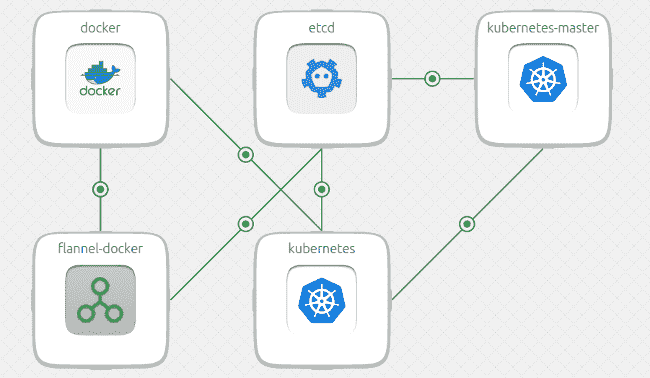

# Canonical 发布了一个商业支持的 Kubernetes 供多种云使用

> 原文：<https://thenewstack.io/canonical-releases-commercially-supported-kubernetes-multi-cloud-use/>

Linux 发行商 [Canonical](https://insights.ubuntu.com/2016/09/27/canonical-expands-enterprise-container-portfolio/?_ga=1.266816328.738448003.1474905902) 也加入了这场争夺战，急于简化对 [Kubernetes](/category/kubernetes/) 的管理。公司[已经发布了自己的开源容器编排软件的商业支持发行版](https://insights.ubuntu.com/2016/09/27/canonical-expands-enterprise-container-portfolio/?_ga=1.266816328.738448003.1474905902)。

这一消息是在 Kubernetes 1.4 发布的同时发布的，Kubernetes 1.4 拥有扩展的集群和持久的数据支持。

这个基于 Ubuntu 的 Kubernetes 版本为跨多个云的 Kubernetes APIs 提供了一致的行为。该发行版还将关注所有公共和私有基础设施的强大安全性、弹性和兼容性。这包括在谷歌计算引擎、微软 Azure、亚马逊网络服务上运行的基于 Ubuntu 的应用，以及由 Ubuntu 金属即服务项目 [MAAS](http://insights.ubuntu.com/2016/09/08/maas-2-0-released/?_ga=1.266405960.738448003.1474905902) 提供的 OpenStack、VMware 或裸机，该项目创建了物理服务器云。

Canonical 正在进入一个新生但竞争已经非常激烈的市场，为企业提供商业支持版本的 Kubernetes，该版本可用于编排复杂的基于容器的工作负载。Apprenda、 [CoreOS](https://thenewstack.io/how-coreos-is-streamlining-kubernetes/) 和 [Supergiant](https://thenewstack.io/supergiant-builds-kubernetes-manage-multi-tenancy-distributed-applications/) 都投入了相当大的资源来维护自己的商业版本。Red Hat 还使用 Kubernetes 作为其自己的 [OpenShift](https://www.openshift.com/) 服务平台的基础。

Canonical 通过将 Kubernetes 与其自己的 [Juju](http://www.ubuntu.com/cloud/juju) 应用和服务建模工具[配对，使其产品与众不同，该工具旨在快速启动云应用。](https://insights.ubuntu.com/2015/07/21/launch-the-newly-released-kubernetes-1-0-0-with-juju/)

据该公司称，juju“charms”编码了集群管理、弹性扩展和平台升级的最佳实践，独立于底层云。

新的 Kubernetes 捆绑包包括管理长期集群所需的所有操作脚本和工具，包括升级和弹性伸缩。功能包括:

*   访问最新稳定的上游 Kubernetes 版本
*   通过回滚访问上游 Kubernetes 开发分支(1.5.x)的日常“边缘”构建
*   独立于工作节点扩展主节点的能力
*   借助 on ramp to Google Container Engine(GKE ),在公共云和裸机之间轻松实现可移植性

Canonical 的 Kubernetes 集成了用于监控的 [Prometheus](https://prometheus.io/) ，用于存储的 Ceph 以及完全集成的[弹性](https://www.elastic.co/products)堆栈，包括用于分析和可视化的 Kibana。

该公司表示，将平等支持私有和公共基础设施。它提供企业支持作为其 Ubuntu Advantage 计划的一部分，但也将提供 Kubernetes 作为独立产品和完全托管的服务。

随着 Kuberentes 1.4 的发布，Kubernetes 开发团队在用户反馈的激励下，努力使 Kubernetes 更易于使用。新特性包括' [kubeadm](http://kubernetes.io/docs/getting-started-guides/kubeadm/) ，'它将集群创建减少到两个命令，不涉及复杂的脚本。 [DaemonSet](http://kubernetes.io/docs/admin/daemons/) 对于附加部署，例如覆盖网络，只需要一个命令。

还增加了对有状态容器的支持、用跨区域和跨云的集群构建应用程序的新功能，以及增加了容器安全性。

尽管 Docker 集装箱广受欢迎，Kubernetes 继续在集装箱市场获得自己的牵引力。

当 Docker，Inc .在今年早些时候推出自己的编排引擎 Docker Swarm 时，一些用户担心被锁定在这一配对中。

目前，Red Hat 和 Google 的开发者正在领导一个新项目，名为 [CRI-O](https://github.com/kubernetes-incubator/ocid) (OCI 守护进程)，这个项目将有利于[Kubernetes](https://thenewstack.io/oci-building-way-kubernetes-run-containers-without-docker/)，而不是[开放容器倡议](https://thenewstack.io/docker-donates-container-format-and-runtime-code-joins-coreos-to-form-standards-group/) (OCI)容器管理软件栈中的 Docker。

CoreOS 、 [Docker](https://www.mirantis.com/software/docker/kubernetes/) 和 [Red Hat](https://www.openshift.com/) 是新堆栈的赞助商。

特征图片:[Ubuntu](https://www.flickr.com/photos/k-naia/84680638/in/photolist-8u1B1-2i1Va-5Ssjo2-5SsjKt-6C2aUg-xBJYnr-8u1BZ-J8DFY-8MyNbo-gNYNP-A1W7p-iYaH4-75X3cL-bAFsAn-BETkV-tESmF-niZQVp-rR5Q8Z-iYaH7-7nn4sU-5JNZqT-bi79RB-Bcp9j6-hkGwJ-gTvswE-dU8a4P-zEvS1-6cwLJK-8q1RRx-6ArFn4-5Ty2vg-bnDrJM-nhgvLU-yxTNh-8iJ58U-4kHNEE-ggvUG-i6PMq-ngXaoT-ggvWd-bHoLDD-k7wEnh-dQEVfr-5FUEec-8BjG7w-aJ7n3-6iZDru-5jX2E7-8qiMPr-a42jmE)BY[mánel](https://www.flickr.com/photos/k-naia/)，授权于**CC BY-SA 2.0**。

<svg xmlns:xlink="http://www.w3.org/1999/xlink" viewBox="0 0 68 31" version="1.1"><title>Group</title> <desc>Created with Sketch.</desc></svg>