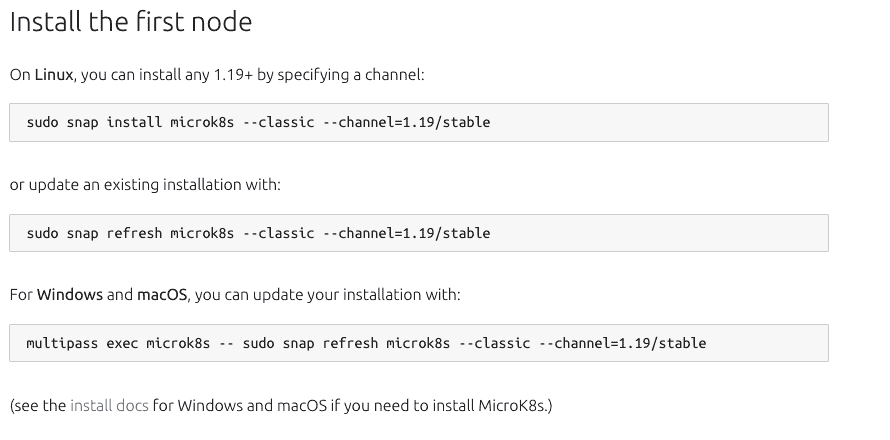

# Canonical 的 MicroK8s 轻量级 Kubernetes 发行版获得了高可用性

> 原文：<https://thenewstack.io/canonicals-microk8s-lightweight-kubernetes-distribution-gets-high-availability/>

Canonical 在其 [MicroK8s](https://microk8s.io/) Kubernetes 发行版中添加了所谓的自主高可用性(HA)集群，为 Canonical 所描述的软件的“轻量级 Kubernetes”功能增加了额外的稳定性。

类似于 Canonical 的 Ubuntu 足够紧凑，允许它从 USB 驱动器作为健壮的 Linux 发行版在 PC 上启动，MicroK8s 的大小为 200Mb。这种灵活性使得以很少的开销或计算资源启动 Kubernetes 集群进行测试或其他用例成为可能——事实上，启动所需要的只是一台 PC，甚至只是一个像 Ubuntu 这样的 USB 拇指驱动器。

Canonical 的现场工程总监 Michael Iatrou 告诉新的堆栈，用户因此可以“用一个命令在你的 Ubuntu USB 上安装和运行 MicroK8s ”,用于 Kubernetes 服务的服务网格如 [Istio](https://istio.io/) 与 [Prometheus](https://prometheus.io/) 进行监控和 [Grafana](https://grafana.com/) 进行观察。

一旦三个或更多的 MicroK8s 节点加入到 Kubernetes 集群中，HA 特性就会启用， [Canonical](https://canonical.com/) 称这可以通过“一个命令”来完成。来自集群的数据存储在分布式数据库中，因此控制平面可以在出现故障时立即恢复。

该功能旨在帮助提高 MicroK8s 的通用性，使其能够扩展到物联网和边缘应用，用于 CI/CD 生产管道或在单个工作站上进行开发人员测试。“我们收集了来自社区的反馈，现在为‘零操作’的自主高可用性 Kubernetes 提供了出色的用户体验，”Iatrou 说。

与领先的企业 Kubernetes 平台管理提供商相比，MicroK8s 具有独特的定位。例如，Red Hat 和 VMware 提供垂直整合的平台，K8 就在菜单上。然而，MicroK8s 更类似于 Rancher K3s，后者[是一个独立的 Kubernetes 管理平台](https://k3s.io/)，同样占用空间最小。

这样，MicroK8s 是一个独立的 Kubernetes 发行版，“而不是一个包含 K8s 风味的 PAAS，”伊特鲁说。“与大型 K8s 发行版不同，MicroK8s 是完整的 Kubernetes，以允许资源优化的方式打包。我们的重点是从开发到生产的工作站、边缘和物联网的零操作、自主 Kubernetes 体验，”Iatrou 说。" MicroK8s 最大限度地减少了对配置和人工干预的需求，这对于大规模的分布式系统来说是至关重要的."

据该公司称，对于特定的硬件规格，MicroK8s 可以运行在裸机配置上——基于英特尔或 Arm CPU——或虚拟机上。如上所述，该平台可以容纳许多 Kubernetes 工具——其中许多都包含在发行版中。除了服务网格、可观察性和监控工具之外，MicroK8s 还可以通过必要的[入口控制器](https://kubernetes.io/docs/concepts/services-networking/ingress-controllers/)来支持集群访问管理。

Iatrou 说，由于所有的依赖关系都捆绑在一个包中，MicroK8s 自然有助于“消除版本管理的复杂性”。“CI 可以在几秒钟内启动一个短暂的 MicroK8s 集群来测试这些工件，每次都提供一个原始的测试平台。在生产场景中，MicroK8s 通过原生集群提供了一个弹性的、高度可用的控制和数据平面。”

Canonical 表示 MicroK8s 兼容 42 个 Linux 发行版。考虑到 Canonical 是 Ubuntu 的创造者，MicroK8s 受益于 Ubuntu“一致且可预测的发布节奏及其最新的内核，”Iatrou 说。“内核安全[显然]对 Kubernetes 非常重要，在 MicroK8s 上运行的 Ubuntu 工作负载受益于 Livepatch 内核补丁，它可以自动解决关键漏洞。”

“Ubuntu 是许多来自公共云的托管 Kubernetes 服务的主机操作系统，因此很容易将工作负载移植到 MicroK8s 或从 MicroK8s 移植，”Iatrou 说。

<svg xmlns:xlink="http://www.w3.org/1999/xlink" viewBox="0 0 68 31" version="1.1"><title>Group</title> <desc>Created with Sketch.</desc></svg>