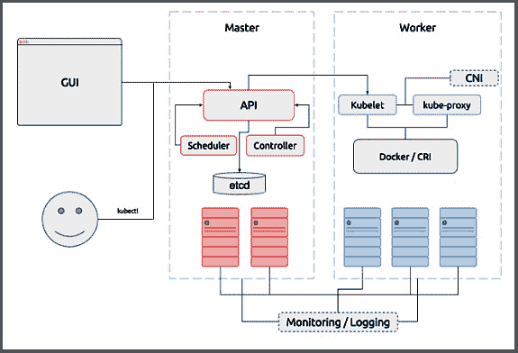
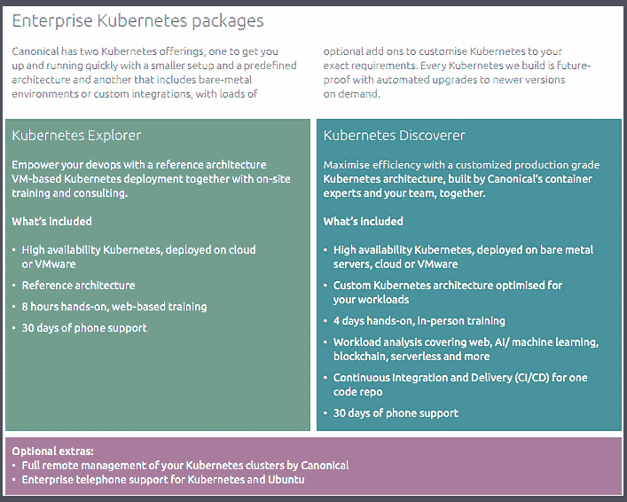

# Canonical 的新服务在企业 Kubernetes 上广泛深入

> 原文：<https://thenewstack.io/canonicals-new-offerings-go-wide-deep-enterprise-kubernetes/>

这是一个有趣的时代，以一种中国诅咒的方式，成为一个有兴趣加入虚拟化容器革命的中小型组织。容器化有望使软件部署变得简单、可重复和容错，对各种规模的企业都有着极大的吸引力。不幸的是，最近的调查报告显示，68%的企业发现开发人员缺乏容器经验阻碍了他们的采用。这个领域非常新，以至于很难为[Kubernetes](https://kubernetes.io/)——跨越私有云和公共云基础设施——找到最佳实践指南和外部专业知识。

然而现在，[Canonical](https://www.canonical.com/)——Ubuntu 开源操作系统背后的公司——已经宣布了两个咨询包，直接针对那些缺少内核技术博士的公司来缩小容器化的鸿沟。Canonical 的 Kubernetes Explorer 和 Kubernetes Discoverer 包在两个不同的级别上提供快速部署的交钥匙解决方案。该公司同时扩展了企业支持，包括来自 [Galactic Fog](http://www.galacticfog.com/) 的无服务器基础设施、来自 [Rancher](http://rancher.com/) 的容器管理工作流以及来自 [Weaveworks](https://www.weave.works/) 的 WeaveCloud 监控和管理应用。

Canonical 为“探索”和“发现”Kubernetes 提供了新的包

Canonical 公司 Kubernetes 产品经理 [Marco Ceppi](https://twitter.com/marcoceppi) 表示:“在我们的探索者和发现者计划中，我们为任何规模的受众提供一到四天的虚拟或现场培训，以帮助传授在生产环境中构建高质量容器的知识。 [Canonical Kubernetes](https://www.ubuntu.com/kubernetes) 正在改变我们的客户托管横向扩展、云原生工作负载的方式，重点是跨公共云和私有基础架构的可移植性。”

这两个软件包之间的区别在于您的组织需要多少 Kubernetes:

Kubernetes Explorer 涵盖公共云、私有云或 VMware 上的 Kubernetes。它以 15，000 美元的价格提供参考体系结构，包括培训和部署，以及可选的工作负载分析咨询或协助创建 CI/CD 管道，以支持容器的日常操作。

Kubernetes Discoverer 将产品范围扩大到裸机操作。价格为 35，000 美元，包括针对特定工作负载优化架构的专家咨询，以及现场提供的实践培训。Discoverer 产品包为存储和网络选项的深度集成和定制提供了机会。

“Canonical 从一开始就接受容器，所以我们可以提供广泛的专业知识，”Ceppi 说。“这两个包都带有多个深入的指南和丰富的文档，有助于在初次接触后继续提供答案。”

此外，Ceppi 表示，Canonical 与 AWS、Azure、谷歌和甲骨文合作，为这些云上的容器优化 Ubuntu 访客。该公司还与谷歌 GKE 合作，以实现 Kubernetes 和谷歌 SAAS 产品的企业部署之间的混合运营。

“谈到公共/私有/裸机部署的专业知识，Canonical 提供了将任何集群转变为远程、完全托管的 Kubernetes 集群的选项。这允许组织快速运行和操作集群。我们可以无限期地管理这些集群，或者在内部积累了经验和知识后转移业务，”他补充说。

集装箱行业正在突飞猛进地发展，其中一些飞跃是由一系列其他公司提供的，旨在降低其有据可查的进入壁垒。然而，根据 Ceppi 的说法，Canonical 的 [Kubernetes 产品](https://www.ubuntu.com/kubernetes)将初始化、支持和性能提升到了无与伦比的水平。

“我们提供未修改的上游 Kubernetes 二进制文件，”他解释道。“我们的突出之处是我们如何运营和维护这些集群，我们的重点是如何运营和管理这些基础架构层的生命周期。”因此，他继续说，Canonical 的产品远远不止是建立一个 K8s 集群:“我们执行常见的操作任务，如自动升级到新版本的 Kubernetes，扩展节点以及备份和灾难恢复，我们能够在所有主要的公共云、私有云及裸机上以自动化的方式完成所有这些任务。”

Ceppi 说，迄今为止，Canonical 的表现还没有人能与之匹敌。“我们是唯一一家能够以可靠和可支持的方式选择如此多基材的公司。我们在上游 5 天内提供 Kubernetes 版本之间的测试升级路径。”

## 有利益的朋友

Canonical 的 Kubernetes 实现附带了广泛的合作伙伴产品，包括来自 [Galactic Fog](http://www.galacticfog.com/) 的无服务器基础设施，来自 [Rancher Labs](http://rancher.com/) 的容器管理平台，以及来自 [Weaveworks](https://www.weave.works/) 的 Weave Cloud。

“创新正在提升堆栈，Canonical 很高兴与这些伟大的公司合作，在每个云上实现企业无服务器基础设施，”Ceppi 说。Galactic Fog 被用来为无服务器计算提供一个开源和多云解决方案，“可在任何规模上操作，非常容易集成”，同时作为“同类最佳”牧场主集装箱管理系统的稳定和高效的基础。此外，Weave Cloud 的全面管理和监控解决方案提供了一个“强大而高效的平台，让 DevOps 从业者可以在任何基础设施上部署和操作复杂的应用程序。”

Ceppi 说，Canonical 的新 Explorer 和 Discoverer 包被设计为交钥匙解决方案，因为开发人员希望专注于推出新的应用程序和改进现有的应用程序，而不是征服建立新基础设施的学习曲线。

我们的探索者和发现者计划如何解决这个问题的一个最近的例子是欧洲的一家媒体公司。它为西班牙的客户提供流媒体服务和应用程序，因此需要保持专注和敏捷，才能在他们的市场中竞争。Canonical 使用 Discoverer 计划在不到两周的时间内为该公司提供并构建了一个完整的生产 Kubernetes 集群。

Ceppi 指出，从容器的角度来看，Docker 诞生了一段时间，只在 Ubuntu 上可用，Canonical 和 Ubuntu 继续证明了它们在该领域的重要性。

“事实是，使 Ubuntu 成为流行的 Linux 和云操作系统的品质也是吸引容器人群的品质，”他总结道。“我们有一个简明的发布时间表，为最新的 Linux 内核和用户空间软件提供了一个稳定的平台。”

这就是 Canonical 的 Ubuntu 图片在公共 Docker Hub 中排名前五的原因。

由[克里斯·劳顿](https://unsplash.com/photos/4ozvhBh2LoY?utm_source=unsplash&utm_medium=referral&utm_content=creditCopyText)在 [Unsplash](https://unsplash.com/?utm_source=unsplash&utm_medium=referral&utm_content=creditCopyText) 上拍摄的特写图片。

<svg xmlns:xlink="http://www.w3.org/1999/xlink" viewBox="0 0 68 31" version="1.1"><title>Group</title> <desc>Created with Sketch.</desc></svg>