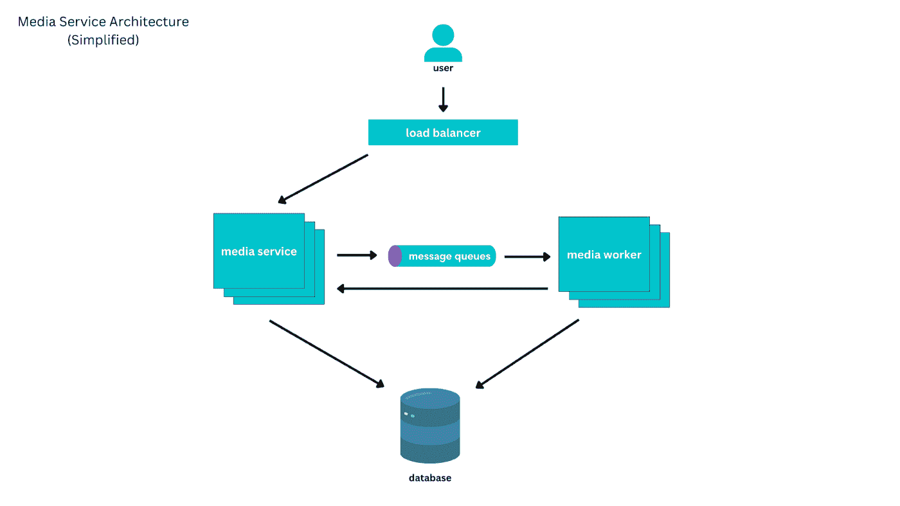
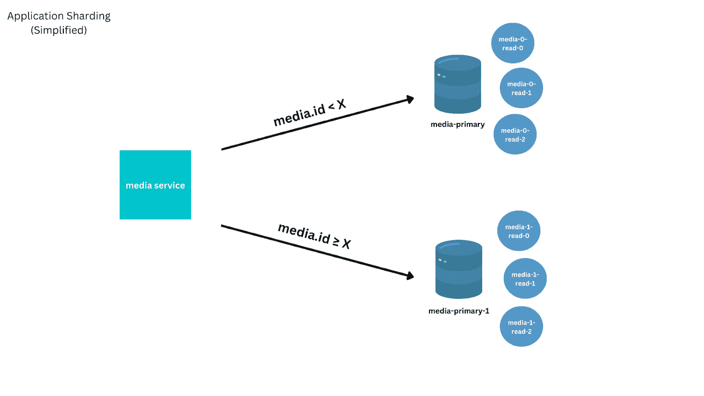
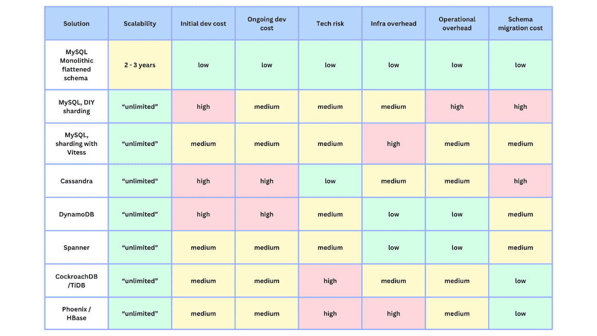
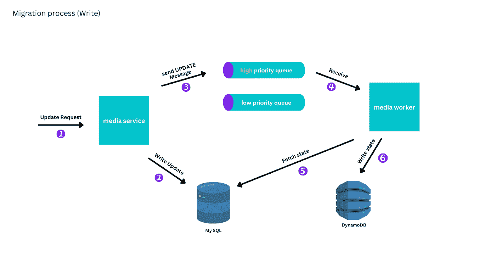
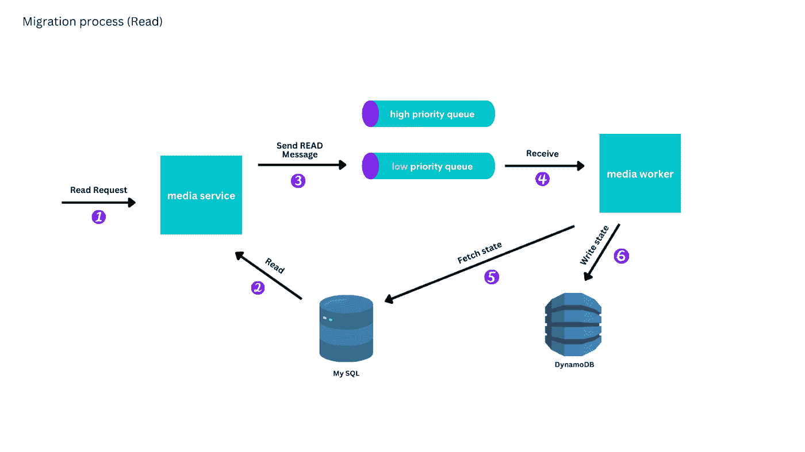
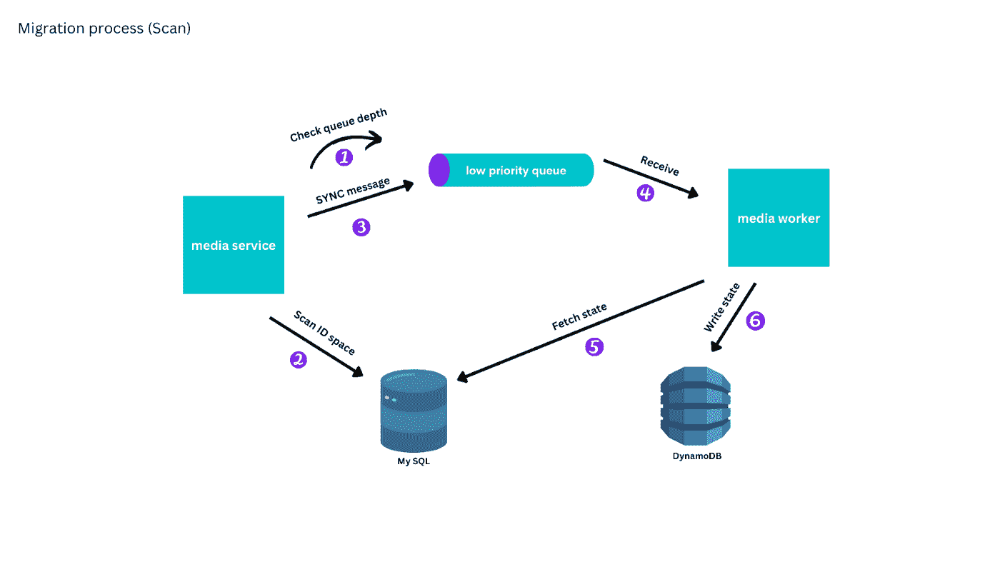
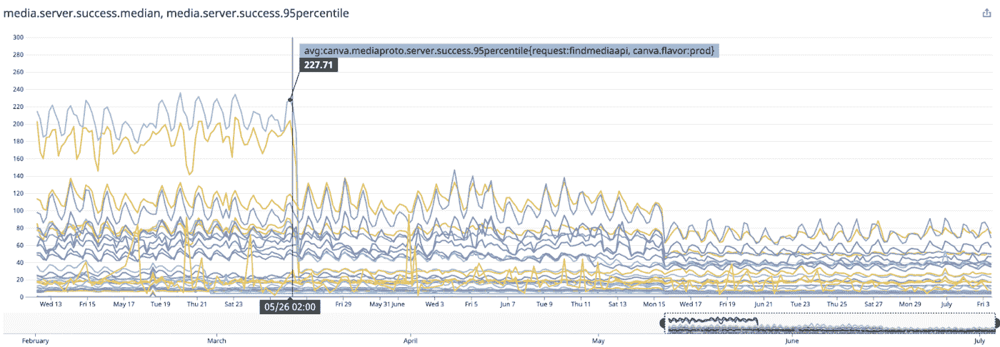

# Canva 的实时数据库迁移:从 MySQL 到 DynamoDB

> 原文：<https://thenewstack.io/canvas-live-database-migration-from-mysql-to-dynamodb/>

在线设计服务 [Canva](https://www.canva.com/) 有大量淫秽媒体。2017 年， [Canva 的媒体商店](https://thenewstack.io/how-canva-uses-data-to-prioritize-qa-testing/)引领了超过 250 亿的用户上传媒体，另有 1 亿月活跃用户每天上传 5000 万。这是一个关于 Canva 如何将数据集从 [MySQL](https://thenewstack.io/facebook-makes-a-big-leap-to-mysql-8/) 迁移到[亚马逊网络服务](https://aws.amazon.com/?utm_content=inline-mention)‘dynamo db’的故事，零宕机。

根据工程团队实施的一些创造性解决方案，MySQL 作为 Canva 的媒体商店一直做得很好，直到第 10 亿个媒体条目，这些解决方案将 OG 系统保持在一起，足以完成向 DynamoDB 的实时迁移。

在这个过程中进行了大量的准备和测试。五年后，该公司在由 Canva 工程主管罗伯特·夏普和 Canva 软件开发人员陈治忠撰写的博客文章中公布了迁移细节和基本系统架构图。

以下是他们学到的一些经验:

*   偷懒。理解访问模式，首先迁移常用的访问模式。
*   现场直播。通过实时迁移、识别错误以及学习使用和运行该技术来收集尽可能多的信息。
*   在生产中测试。引入检查以确保安全。

## **媒体服务**

Canva 的微服务架构主要由面向资源的服务组成，这意味着围绕不同的资源(即文档、文件夹、用户和媒体)管理运营。每个服务公开一个 API，具有独立的持久性，并由一个工程师团队拥有。例如，媒体服务管理 Canva 内的所有媒体事务。

Canva 媒体服务架构。

媒体服务管理对媒体资源的操作并封装媒体资源的状态。服务存储的一些属性是 ID、拥有用户、外部源信息和对媒体文件的引用，以及所有媒体文件的存储位置。详细的元数据也存储在媒体服务中。

读取比写入更常见，在用户生成内容的情况下，大多数读取是对最近创建的介质的读取。

## **起点**

媒体服务最初是一个围绕 MySQL 的薄层，托管在 Amazon Web Services 关系数据库服务(AWS RDS)上，许多其他 Canva 服务也是如此。这在一定程度上是可行的，但是对于更繁忙的服务来说，伸缩是必需的。首先执行垂直缩放，其中出现较大的实例。然后，通过引入由 MySQL 读取副本支持的最终一致读取，解决了水平扩展问题。

但是天下没有不散的宴席，Canva 的开发人员说，当一些模式更改操作需要几天时间时，裂缝就开始出现了。天！然后 MySQL 的在线 DDL 操作导致性能下降如此之多，以至于 Canva 无法在服务用户流量的同时执行这些操作。

GitHub 的 MySQL 在线模式迁移工具 [gh-ost](https://github.com/github/gh-ost) 暂时堵住了一个漏洞，允许他们在没有用户影响的情况下执行在线模式迁移，但问题越来越多。

MySQL 5.6 复制速率的硬限制对读取副本的写入速率施加了上限。

特性发布受阻，因为即使使用 gh-ost，模式迁移也要花六周以上的时间。

由于 EBS 卷大小的增加，延迟时间变长了。

由于要为正常的生产流量提供服务，现在需要停机时间来进行实例重启和版本升级。

## **让 MySQL 免于破产**

随着 Canva 接近其第 10 亿个媒体，一些事情必须改变，这个数字呈指数增长，没有减缓的迹象。但是有两个挑战——在发现和迁移新系统的同时使当前系统工作，以及找到一个能够满足 Canva 不断扩大的需求的新系统。

稍加努力，MySQL 继续前进。一些工程变更包括:

*   元数据是模式中最常被修改的部分，它被迁移到一个 JSON 列中，其模式由媒体服务本身管理。
*   媒体以不同的方式导入，以减少元数据更新的次数。
*   通过对表进行反规范化，减少了锁争用和连接。
*   重复的内容(即 s3 存储桶名称)被移除或编码成较短的表示。

数据被分成碎片。新的分片解决方案针对按 ID 查找(最常见的请求)进行了优化，但对于不太常见的请求(如列出用户拥有的所有媒体)需要低效的分散-收集查询。这样做的目的是为了避免 2TB ext3 表文件大小的限制，避免复制达到上限，并为用户提高性能。

寻找新的解决方案。

该团队还在研究和构建不同的长期解决方案。下图显示了竞争者以及它们的排列方式。新系统的跑道很短，团队强烈偏好托管解决方案。

选择 DynamoDB 是因为 Canva 在不太复杂的工作负载上使用该技术的经验。在完全集成之前，它需要测试媒体服务，这是一个更复杂的工作负载。

## **实时迁移**

Canva 决定进行实时迁移，选择零用户影响、零切换时间和零停机时间。该迁移包括将所有旧的、新创建的和更新的媒体的完整数据库迁移到 DynamoDB。该团队希望尽快摆脱 MySQL 集群的负载。

AWS SQS 消息队列用于协调迁移。写复制优先于读，因为最终目的是从 DynamoDB 获得一致的读。消息创建和更新放在高优先级队列中，而读取放在低优先级队列中。

标识特定介质是否被创建、更新或读取的消息被排队。然后，一个 worker 实例处理该消息，从 MySQL 主服务器读取当前状态，并在必要时更新 DynamoDB。这使得消息处理的尝试和退出可以暂停或减慢。工作实例从高优先级队列中读取消息，直到所有消息都被使用完，然后再移动到低优先级队列。

通过 Canva 实现的扫描过程，MySQL 集群负载得以减轻。扫描过程从最近创建的媒体开始扫描整个群集，将消息放入低优先级队列以复制媒体。背压用于确保同步过程仅在低优先级队列几乎为空时进行。

生产中的测试。

这不像只是添加到 DynamoDB 中那么简单。为了测试复制过程，通过双读比较过程将 MySQL 的结果与新的 DynamoDB 媒体服务实现进行了比较。发现了一些错误，并随后进行了修复。

该团队实现了最终从 DynamoDB 提供一致读取的总体目标，MySQL 只提供尚未复制的媒体。MySQL 处理的请求是读取请求，而不是通过 ID 标识媒体的请求，例如查找用户拥有的所有媒体的查询，因为媒体是单独复制的。

## **测试带来零停机时间**

迁移过程中最大的风险是将写入切换到 DynamoDB。处理创建和更新所需的新服务代码包括事务性和条件性 whites，以保证与以前的实现具有相同的契约。测试和有条不紊的准备使之成为可能。

该团队迁移了针对媒体更新请求的现有集成测试，以测试迁移的媒体和直接在 DynamoDB 上创建的中介。他们还将集成测试的剩余部分移植到 DynamoDB 服务实现上，与 MySQL 实现测试一起运行这些测试。

新的实现在他们的本地开发环境中进行了测试。新的实现也使用他们的端到端测试套件进行了测试。

开发人员使用他们的 flag 系统为转换编写了一本操作手册，允许他们在需要时在几秒钟内将读取切换回 MySQL。他们在开发和试运行环境中推出变更时排练了操作手册。

他们在生产中的切换是无缝的，没有停机时间，没有错误，并且显著改善了媒体服务延迟，如下图所示。

**结论**

这种迁移发生在 2017 年，当回顾那么多博客帖子时，可以利用更广泛的经验。那么 DynamoDB 是正确的选择吗？那么，这位作家的解释是:简短的回答是；长回答是(？).

自最初的迁移以来，Canva 的用户群增加了两倍多。优点:DynamoDB 在自动伸缩方面表现出色，成本低于 AWS RDS 集群。挑战:模式更改和回填执行起来“复杂得多”,并且无法在 MySQL 副本上运行即席 SQL 查询(Canva 正在通过一个替代解决方案来执行它们)。

此外，需要复合全局二级索引来支持现有的访问模式，以及那些需要手动将属性连接在一起的模式。这可能既不是优势也不是挑战，因为新的访问模式并不频繁，因为在 Canva 的发展阶段，核心媒体元数据的结构相对稳定。

如果今天面临同样的问题，Canva 会再次选择 DynamoDB 吗？该团队将考虑成熟的托管“NewSQL”产品，如 Spanner 或 CockroachDB。很有意思。

<svg xmlns:xlink="http://www.w3.org/1999/xlink" viewBox="0 0 68 31" version="1.1"><title>Group</title> <desc>Created with Sketch.</desc></svg>