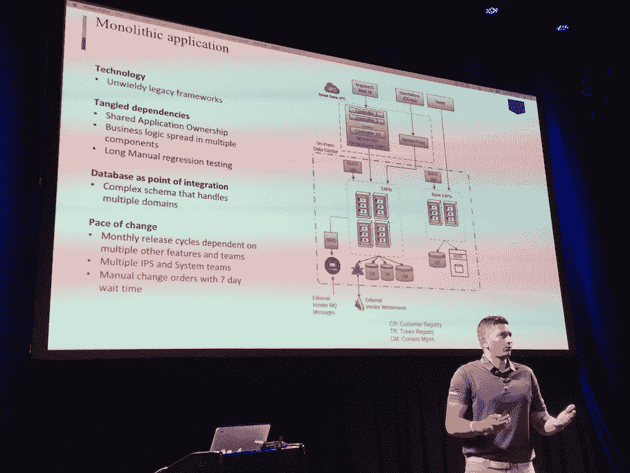
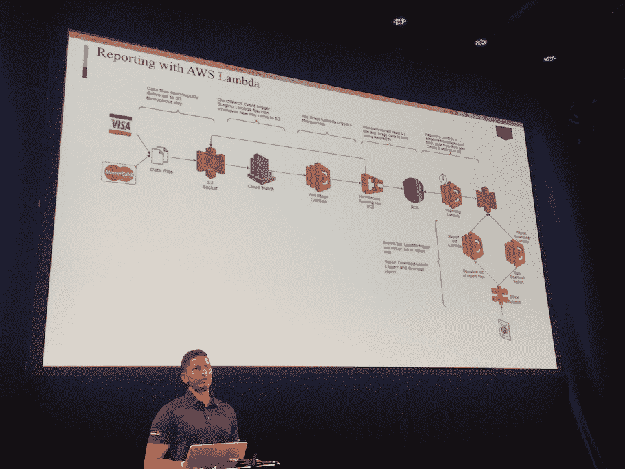

# 用于点对点支付的 Capital One 无服务器架构

> 原文：<https://thenewstack.io/capital-one-serverless-architecture-p2p-payments/>

美国银行 Capital One 引入了一种无服务器架构来帮助管理其点对点支付系统。在美国，银行和 Visa/MasterCard 网络合作提供点对点支付网络。基于 Clear xChange 网络， [Zelle](https://www.zellepay.com/) 是银行业对 [Venmo](https://venmo.com/) 的竞争性回答，自 2017 年年中以来一直处于更名状态。第一资本是这一努力的一部分。

虽然 Zelle 是一个独立的应用程序，但它也集成到了大多数美国银行的移动应用程序中，因此任何银行的客户都可以通过电话号码或电子邮件向朋友或亲戚汇款，就像他们在 Paypal 广受欢迎的 Venmo 中一样。据 [Tearsheet](http://www.tearsheet.co/payments/zelle-is-winning-the-peer-to-peer-payments-war-sort-of) 报道，点对点支付(P2P)是一个巨大且不断增长的交易市场，Paypal 的 Venmo 在 2017 年第三季度报告了 94 亿美元的交易，而 Zelle 则处理了超过 6000 万笔交易，总价值为 175 亿美元。

预计点对点支付将会增长，并成为各种科技巨头的核心产品:例如，脸书可以在其平台以及聊天应用 Messenger 和 WhatsApp 上提供自己的支付基础设施。

从本质上来说，P2P 是一种数字技术，这通常会使银行在构建和提供与其传统堆栈集成的可行解决方案方面处于明显的劣势。

Capital One 零售和直接技术副总裁 Srini Uppalapati 在最近于纽约举行的 Serverlessconf 活动上表示，与许多银行一样，Capital One 也在努力开发一个他们的 Zelle 系统本应基于其上的单一应用程序

“我们在 perm 上有许多遗留服务，它们是大型、笨重的 SOAP 服务，上面有一个新的 REST 层，”Uppalapati 描述道。但是除了老派的技术，他们的组织基础设施增加了复杂性:“数据模型的所有权属于银行内不同的团队和不同的业务线。”

Uppalapati 表示，这带来了许多传统企业都熟悉的挑战:由于共享数据所有权，发布新功能需要花费大量时间，协调是“管理的噩梦”，实现新功能的任何问题都需要大量回滚，团队必须进行手动集成测试才能发布新功能。

因此，Capital One 寻求无服务器架构设计模式来帮助克服这些挑战，并为客户创建更加即时的支付服务。

Uppalapati 指出，与亚马逊网络服务的[λ](https://aws.amazon.com/lambda/)结合使用的各种亚马逊服务使无服务器架构成为可能，包括:

*   RDS Aurora，使用超过 15 个 RDS Aurora 实例
*   网站内容的云前端
*   路由 53 和弹性负载平衡器
*   API 凭据加密和解密的预定义密钥的 KMS
*   Amazon ECS 在 Amazon EC2 实例中运行和管理 Docker 容器
*   用于度量和监控的 Amazon Cloud Watch 和 Amazon Cloud Trail。

Uppalapati 描述了新的无服务器支付架构中的典型工作流，其中需要报告信用卡和借记卡的使用情况，以处理 Zelle 支付。

这需要对交易数据进行一些检查，以确定这些支付是否与客户账户相符，并作为银行全球金融工作的一部分进行处理。Uppalapati 介绍了整个流程:

“CapitalOne 从万事达卡和维萨卡接收文件。当这些被接收到简单存储服务[S3]中时，CloudWatch 查看它们并触发 Lambda 为分析师过滤数据，然后调用微服务来匹配来自 Zelle 的交易，将它们分类为匹配或不匹配，或者是否应该发送到全球财务部门。”

然后，这些单独的列表被添加到数据库中，Lambda 会在每天的预定时间触发报告，即一天的所有处理预计都已完成的时间。“这将创建三个文件:所有匹配、所有不匹配和所有全球金融安置，Lambda 将这三个文件放入 S3 桶中，”Uppalapati 描述道。然后 Lambda 查询存储桶，并使其可供注册会员下载。代理映射输入参数，并有一个前端，以便员工能够下载或手动处理报告数据，例如资金转账。”

其他主要的无服务器用例包括报告和分析系统，以及 Capital One 的开源项目 [BeamlineJS](https://medium.com/@gaurang.bhatt04/beamlinejs-b07e2ecae4da) ，这是一个用于 Lambda 函数的开源 CI/CD 管道。

<svg xmlns:xlink="http://www.w3.org/1999/xlink" viewBox="0 0 68 31" version="1.1"><title>Group</title> <desc>Created with Sketch.</desc></svg>