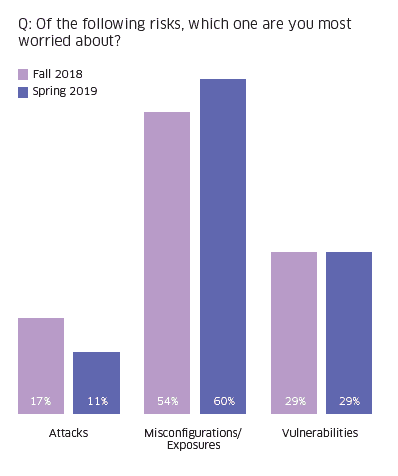
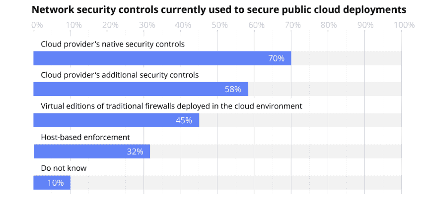
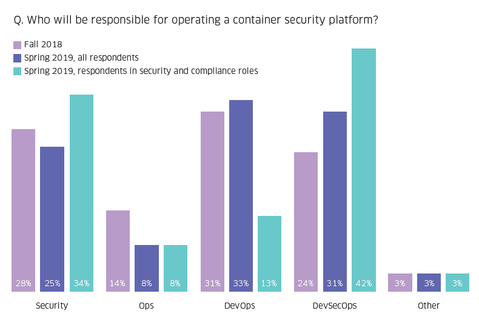

# Capital One 的云错误配置灾难已经成为全行业的担忧

> 原文：<https://thenewstack.io/capital-ones-cloud-misconfiguration-woes-have-been-an-industry-wide-fear/>

开发者和 IT 决策者不应该对最近的 [Capital One 数据泄露](https://www.nytimes.com/2019/07/29/business/capital-one-data-breach-hacked.html)感到惊讶:错误配置[长期以来一直是](https://thenewstack.io/monitoring-concerns-hamper-hybrid-multicloud-deployments/)首要的云安全问题。一项新的 StackRox [对 IT 决策者的调查](https://www.stackrox.com/kubernetes-adoption-and-security-trends-and-market-share-for-containers/)支持这一发现，因为 60%的受访者更担心错误配置或暴露，而不是攻击和一般漏洞。

来源:StackRox 的《集装箱和 Kubernetes 安全状况，2019 年春季》引用错误配置的人从 6 个月前同样问题的 54%上升到 60%。

尽管 Capital One 数据泄露的细节仍在曝光， [Security Boulevard](https://securityboulevard.com/2019/07/what-we-know-about-the-capital-one-data-breach/) 解释说，攻击者最有可能发现了一个配置错误的防火墙，并提取了与 WAF (web 应用防火墙)角色相关的 IAM(身份和访问管理)凭据。然后，这些凭证被用来访问被盗文件所在的亚马逊简单存储服务(S3)桶。

你可以打赌安全供应商将引用这一事件来支持对他们产品的需求。不要让他们的谎言欺骗了你。即使不是全部，也有一些文件是加密的，所以松懈的“数据安全”不是罪魁祸首。尽管嫌疑人/黑客以前为 AWS 工作，但这次违规并不是数据丢失保护(DLP)解决方案将解决的内部威胁的例子。此外，虽然特权访问管理的需求是真实的，但来自 [Centrify](https://www.centrify.com/) 、 [CyberArk](https://www.cyberark.com/) 和其他公司的产品可能没有直接关系。最后，尽管确实需要[来补充云提供商的本地安全性](https://thenewstack.io/organizations-running-on-more-clouds-less-likely-to-see-security-threats/)，但是还有哪些额外的安全工具可以识别错误配置呢？根据 Security Boulevard 的说法，“Capital One 不需要担心攻击者关闭本地日志，因为 [CloudTrail](https://aws.amazon.com/cloudtrail/) 会捕获所有涉及 AWS APIs 的内容。”

来源:CSA 的“云安全复杂性:混合和多云环境中管理安全性的挑战”该报告由 AlgoSec 赞助。

或许这个漏洞表明，防火墙只需要得到适当的管理。在一项由 AlgoSec 发起的调查中，45%的受访者使用部署在云中的传统防火墙的虚拟版本来保护公共云部署。AlgoSec 的产品有助于安全策略管理工具，但似乎 Capital One 已经在这样做了。Fortinet 是另一家提供防火墙相关解决方案的供应商。产品经理 [Lior Cohen](https://www.linkedin.com/in/lioros/) 认为，像该公司的 [WAF 即服务](https://www.fortiweb-cloud.com/)这样的产品通过消除开发运维团队配置和管理的需要，减少了错误配置。在为新堆栈贡献的一篇[帖子中，他写道 **DevSecOps** 工具和方法将降低应用安全风险。](/taking-advantage-of-the-public-cloud-without-compromising-security/)

前面提到的 StackRox 研究中有 31%的人说 **DevSecOps** 负责运营集装箱安全平台的人，高于 2018 年问这个问题时的 24%。这些平台是仅仅是具有内置安全性的容器编排平台(例如 Kubernetes ),还是一个独立的产品还有待讨论。

来源:StackRox 的《集装箱和 Kubernetes 安全状况，2019 年春季》从安全专业人员的角度来看，具有特定 DevSecOps 角色的人将负责管理容器安全平台。

根据 [Snyk 的](https://snyk.io/)创始人 [Guy Podjarny](https://www.linkedin.com/in/guypo/) 的说法，DevSecOps 描述了 1)DevOps 技术的安全性(例如，容器编排、CI/CD)以及应用适应的 devo PS 方法以更好地解决应用安全性。如果 DevOps 团队中的某个人专注于安全性，那么这个人的角色就是 DevSecOps，他或她可以被认为是 DevSecOps 工程师。如果安全专家的主要职责是与开发人员沟通，那么他或她也可以被认为是开发人员。Podjarny 认为，大多数 DevSecOps 团队实际上是应用程序安全团队，他们专注于产品及其开发生命周期的安全性。

安全第一的开发人员工具和 DevSecOps 将是未来文章的主题。敬请关注。

来自 Pixabay 的 Peter H 的特写图片。

<svg xmlns:xlink="http://www.w3.org/1999/xlink" viewBox="0 0 68 31" version="1.1"><title>Group</title> <desc>Created with Sketch.</desc></svg>