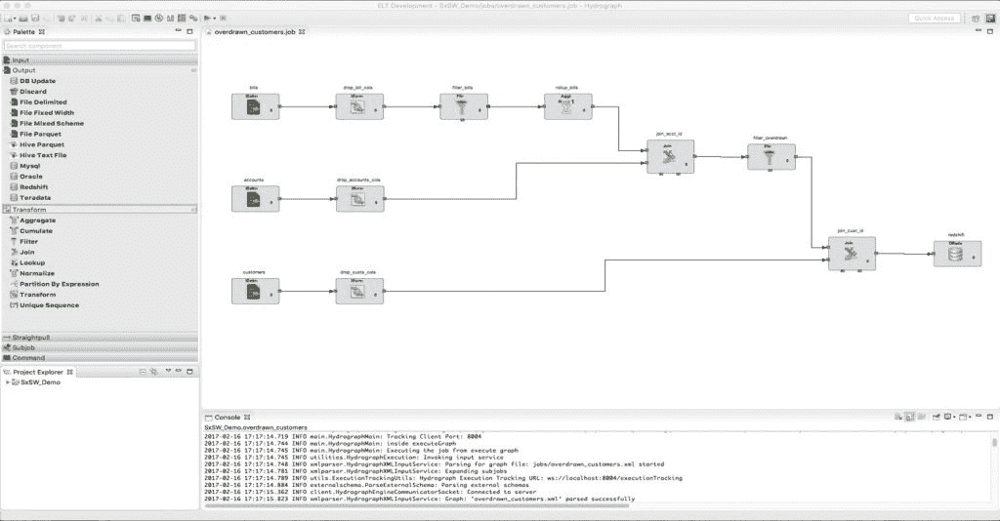
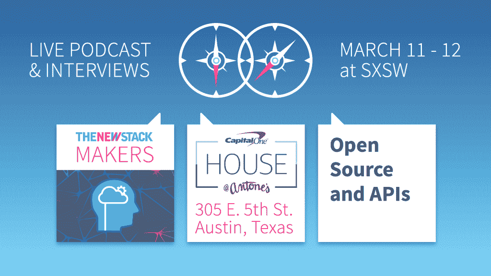

# Capital One 的开源 Hydrograph 为开发者带来了 ETL 数据集成

> 原文：<https://thenewstack.io/capital-ones-open-soruced-hydrograph-bring-etl-developers/>

银行业巨头 Capital One 希望将数据集成的力量直接带给开发人员，提供一种新的开源 ETL 工具，旨在加快组装数据驱动的应用程序的过程。

该软件名为 Hydrograph，可以整合来自多个来源的数据，这一过程称为提取、转换和加载(ETL)。ETL 从多个来源提取数据，将它们格式化并聚合成易于使用的形式。该公司周五在目前正在奥斯汀举行的 SXSW 互动会议上发布了 Hydrograph。

尽管商业 [ETL](http://www.webopedia.com/TERM/E/ETL.html) 软件包早就有了，但它们更倾向于面向数据库管理员，而不是开发人员。在添加新功能或改进核心组件方面，该公司需要比商业工具更大的灵活性。Capital One 希望开发人员控制数据准备工作，因为这将使他们能够更快地构建应用程序，即使在处理各种棘手的遗留后端数据源时也是如此。

Capital One 在总部位于芝加哥的数据管理公司[Bitwise](http://www.bitwiseglobal.com/)的帮助下，自行开发了水文图。通过开源 Hydrograph，在 Apache 2.0 许可下发布，Capital One 希望围绕该软件形成一个志同道合的用户社区，分享额外的功能和最佳实践。

过程线有多种不同的用途，包括:

*   代理呼叫日志解析和丰富。
*   记录数据迁移系统。
*   数据格式标准化。
*   仓库分析的数据准备。

## 运行中的过程线

在 Capital One，典型的过程线工作可能涉及从多个数据源收集信息，这些信息可用于构建一个全新的应用程序。例如，可以创建一个新的应用程序，它可以确定哪些客户将透支未结账单的账户，从而允许公司发送预先警报。

这种应用程序需要来自三个不同数据集的数据，一个是客户数据集，一个是账户数据集，第三个是账单数据集。

使用 Hydrograph，数据源通过内置的模式编辑器选取。Hydrograph 将输入修剪为所需的列。它还应用额外的过滤和转换来准备数据。开发人员可以使用插件功能过滤和转换数据以完成常见任务，例如将日期格式化为单一标准。然后，生成的数据集可以写回数据库，或者写回 [Spark](http://spark.apache.org/) 或 [Cascading](http://www.cascading.org/) ，这是一个在 [Hadoop](http://hadoop.apache.org/) 上构建应用的平台。

前端 GUI 使用 Eclipse 的[富客户端平台](https://wiki.eclipse.org/Rich_Client_Platform) (RCP)构建。GUI 调色板包含不同的组件(执行 ETL 功能，如输入、输出、转换、直接拉动、子作业、命令),可以将这些组件拖到画布上来创建 ETL 作业。用户可以使用项目浏览器浏览现有的过程线作业。

RCP 可以与许多 Eclipse 和 Java 插件一起工作，这应该可以最小化将软件集成到 [DevOps](/category/devops/) 风格的管道中的工作。

Hydrograph 提供了多种执行作业的方式。开发人员可以直接在笔记本电脑上运行作业，这对于在小型数据集上进行测试非常有用。它还允许远程执行，在集群上运行较大的作业。Hydrograph 包括执行跟踪，允许用户查看组件何时运行，何时成功完成。控制台提供详细的作业执行信息。

Hydrograph 是众多新兴 ETL 工具中的一个，与其说是针对数据库管理员，不如说是针对希望构建云原生软件即服务应用程序的开发人员。这个集成即服务领域的其他参与者包括 Alooma、Fivetran、Stitch 和 Xplenty。

*TNS 将于本周末在 SXSW 了解更多关于水文图和其他 Capital One 项目的信息。如果你在奥斯汀，可以在安东的 Capital One House 停留一下，或者留意下周活动的故事和播客。*

TNS 分析师 Lawrence Hecht 对本文有贡献。

这个故事是由第一资本赞助的。

<svg xmlns:xlink="http://www.w3.org/1999/xlink" viewBox="0 0 68 31" version="1.1"><title>Group</title> <desc>Created with Sketch.</desc></svg>