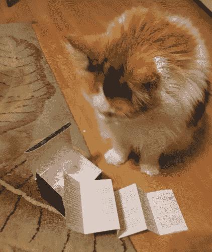

# “卡对容器”:Sysdig 的 DevOps 卡牌游戏

> 原文：<https://thenewstack.io/cards-against-containers-a-devops-card-game-from-sysdig/>

“这不是政治迫害，我们只是想知道是谁愚蠢到实施了 ________”

*“我从来没有真正理解过 DevSecOps，直到我遇到了 ________”*

*“Kubernetes 是一条通向 ________ 的滑坡。”*

*“安全团队在躲着我，因为我一直在使用 ________。”*

有一个新版本的游戏“反人类纸牌”——但是在这个版本中，它可以产生令人愉快的可怕组合，针对的是 [DevOps](https://thenewstack.io/category/devops/) 社区。所有古怪的问题和答案都是由 DevOps 安全公司 [Sysdig](https://sysdig.com/) 创造的。

“这是一部讽刺作品，”游戏说明手册解释道，“我们将它免费提供给社区，以传播一点乐趣。”

到目前为止，它已经在我们以容器为中心的原生云社区中大受欢迎。

这个游戏的想法是在 Sysdig 签约赞助 KubeCon + CloudNativeCon EU 的游戏休息室时产生的，最初是在 3 月份举行。最初的[反人类卡](https://cardsagainsthumanity.com/)是在知识共享许可下发布的，只要衍生作品不被出售，就允许再混合和共享。Sysdig 的企业沟通高级经理阿曼达·麦金妮·史密斯说，很快，该公司在英国的两名员工就想出了一个制作 DevOps 版纸牌游戏的好主意，并在 2 月份开始利用业余时间为纸牌集思广益。

这个游戏遵循了原版的规则:它有两套卡片，一套是问题，另一套是答案。然后，玩家们想出两者之间最离谱的配对

大约一个月后，“他们有了很多卡片，”麦金妮·史密斯回忆道，“他们把这些卡片交给了一个更大的 Sysdiggers 小组，这些小组增加了输入和他们自己的卡片想法。”

从一堆 400 张可能很搞笑的卡片中，他们制作了“测试卡片组”，放在 Sysdig 销售动员会的桌子上，以获得关于哪些卡片将进入最终卡片组的反馈。

说明书现在开玩笑地将这款游戏描述为“那些认为自己了解 Kubernetes、安全、容器、DevOps 或以上所有东西的组合的人的纸牌游戏(他们一定在撒谎)。”接下来是强烈的免责声明，用斜体强调。“别把这个游戏当回事。”

***“我们的容器漏洞百出，所以我们要实现 ________。”***

"在我的下一个魔术中，我将把 ________ 装入容器."

"直接从堆栈溢出复制代码导致了 ________ . "

"目前每秒钟给我发送 1000 个警报的是什么？"

“有人在制作这个游戏时获得了巨大的乐趣，”TC Currie 在我们开始玩游戏时说道。不过，在这个自我封闭的时代，很难找到更多的玩家。

“事实是我们真的笑出声来了，”她后来补充道。“这不是我们经常做的事情。”

这是一副设计精美的卡片，背面(和正面)有明亮的颜色和 Sysdig 标志。每张卡片要么提供一个令人惊讶的问题，要么提供一个同样令人惊讶的答案。

***“公司黑客马拉松被 ________ 彻底毁了。”***

"我们上一次崩溃环路回退是由 ________ 引起的."

“我们使用 ________ 完成所有文档。”

"我们不在周五发布的真正原因是."

可以通过 Sysdig 网站上的页面申请套牌。但如果你感兴趣，你可能想尽快报名。他们最初承诺寄出 500 副免费的套牌，“已经有几百副被认领了，我们的供应量有限。”

Sysdig 的首席营销官珍妮特·松田隼说，公司还没有决定是否印刷更多的贺卡。“这将基于需求，如果它对未来的节目有意义，”她说。

Sysdig 还在筹备一个在线版本，将于下个月推出。Sysdig 的史密斯说:“有了网上会议，人们真的对坐在家里感到厌烦了。”。“现实情况是，由于邮政延误，及时将贺卡送到每个人手中几乎是不可能的。”

> “内容是技术性的，”说明书警告说，“所以五岁以下的儿童、销售人员和经理可能不理解内容。

她指出，用在线版本更容易获得一大群玩家——设计师们已经在 Slack 上测试过了，甚至在视频通话中也测试过了。“我们认为网络版将是人们开始或结束会议的一种有趣方式。这是一个很好的破冰方式，尤其是现在除了室友和工作会议，我们没有太多的人际互动……我们也喜欢这个想法，它有助于在这段时间把人们聚集在一起。一个快速的五轮纸牌游戏使我们能够成为人类，一起欢笑。

“毕竟，有了 COVID，我们邀请了我们的同事、客户和合作伙伴来到我们的客厅。我们看到了彼此的宠物和孩子，这可能是以前从未发生过的事情。这个时候需要这些人性和团结的提醒，”她说。

虽然游戏的说明书上警告说“根据每个工作者可用的硬件资源和认知能力，可能会有不同程度的反应延迟。”

[https://www.youtube.com/embed/77EMvsDEEX4?feature=oembed](https://www.youtube.com/embed/77EMvsDEEX4?feature=oembed)

视频

该公司决定在 Kubecon 之前发布这款游戏，部分原因似乎是因为他们敏锐地意识到了即将到来的全球疫情。Sysdig 的创始人[洛里斯·德吉奥安尼](https://www.linkedin.com/in/degio/)来自意大利，该公司在遭受重创的米兰市设有办事处。“3 月下旬，在英国和美国进入国内秩序之前，我们从意大利人那里获得了第一手资料，他们已经被封锁了几个星期，”史密斯回忆道，并表达了他们的厌倦。

“听到他们的艰难，团队意识到游戏实际上可以在这段时间提供一些娱乐和笑声；同时也让那些在社交上疏远的人走到一起。”

游戏的设计者确保这些卡片适合所有年龄的人。“DevOps 社区成员中有许多孩子开始学习编程，我们希望成年人能够与他们的朋友、同事和家人一起玩。”

所有的东西都是不分性别和包容性的——尽管“内容是技术性的，”说明书警告说，“所以五岁以下的儿童、销售人员和经理可能不理解内容。

“招聘顾问反正不识字，大概就不该试着玩。”

说明书中提到了一些专门针对极客的规则。(“如果[凯尔西·海托华](https://twitter.com/kelseyhightower)上场，他先上场。”)它还包含了一些关于“家庭规则”的额外建议，比如“我从未通过 CKA”(“任何时候，玩家都可以丢弃自己不懂的牌，但他们必须以无知的初级水平向群体坦白，并承受由此带来的羞辱。”)

还有一种变体叫做“Scrum 仪式”——但这个名称是对其规则的字面描述。“在游戏之外，如果玩家在 Scrum 仪式(回顾、起立、计划或回顾)中使用任何一张白色卡片，就可以获得分数。

"如果你因此被送去人力资源部，会得到加分."

史密斯分享了她最喜欢的一张*没有*拿到的白牌:

*> /dev/null*

“大约有 100 张真正伟大的牌没有进入这副牌，”史密斯回忆道。"我们现在正在开发资料片."

更重要的是，“Sysdig 还建立了一个 GitHub repo，人们可以在那里建议自己的卡片或制作自己的包，”Smith 说。“我们将仔细检查这些卡片，并在网络版首次亮相时将它们上传到网上。”

GitHub 上的页面解释道:“如果你想为未来的资料片贡献一个卡片创意，请打开这个库的 pull 请求。”“卡片创意将由其中一个所有者审查，并由他们自行决定是否接受到下一个版本的存储库中。”

GitHub 库的一个有趣的特性？它给你一个机会看一看所有黑卡[问题](https://github.com/cardsagainstcontainers/deck/blob/master/questions.txt)——以及所有白卡[答案](https://github.com/cardsagainstcontainers/deck/blob/master/answers.txt)。

它甚至承诺文档很快就会建立自己的甲板。

Sysdig 的 Degioanni 说:“用容器做纸牌是一个非常聪明的游戏，但我很高兴看到 GitHub 回购中建议的纸牌。“Sysdig 是一家安全公司，建立在开源基础上，我们坚信，当社区协作和共享时，我们可以提高可见性并加强所有环境中的安全性。

“本着同样的协作精神，我们的开源团队建议我们开放 GitHub repo，让社区参与到卡片中来！”

* * *

## WebReduce

<svg xmlns:xlink="http://www.w3.org/1999/xlink" viewBox="0 0 68 31" version="1.1"><title>Group</title> <desc>Created with Sketch.</desc></svg>