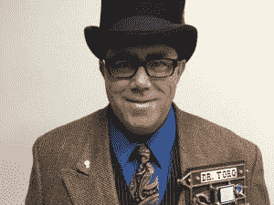

# 嘉年华·巴克，心理学家，现成的黑客

> 原文：<https://thenewstack.io/carnival-barker-psychologist-off-shelf-hacker/>

作为一名工程师、作家和演讲者，我的工作是介绍并帮助人们与新技术互动。

很长一段时间，我相信每个人都和我一样对令人惊叹的有趣的微控制器、收音机、机械装置、软件、系统和网络充满热情。

他们不是。

事实上，即使是技术人员也经常努力适应新型技术。所以真的，我的工作是说服。

这个旅程的第一步是抓住注意力并开始对话。这里有一些成功的技巧，对我介绍新技术很有用。在推销你的想法、产品和服务时，请随意尝试。

## 这叫钩子

几年前，我将 Arduino 微控制器与 Dallas DS18B20 数字温度计芯片和 60 mW Xbee 收发器相结合。这个设备被放在我的小区海滩停车场的一个小野餐桌上。然后，我开车绕着这个直径大约 1.5 英里的湖转了一圈，我的 Linux 笔记本上连接了一个匹配的 Xbee 收发器。在环湖航行期间，Linux 终端每秒显示一次来自达拉斯传感器的温度数据。有几个地方我失去了信号，没有看到任何新的数据。多疯狂啊。

当我的家人、朋友和同事对这项绝对令人震惊的技术赞叹不已时，他们渐渐明白，向他们展示一个试验板、一堆跳线和终端屏幕上滚动的文本行并不那么有趣。谁在乎呢，对吧？与日常事务没有联系，这使得人们甚至很难提出问题。很多“那很好”，没有更多。

当然，每个营销人员都知道解决方案。

你需要一个钩子。赋予技术背景的东西。与它的用途有关的东西，或者有目的的东西，或者至少对某人来说是有趣的东西。这个钩子激起了观察者的好奇心。

[蒸汽朋克](http://steampunkworkshop.com/)是我的一个钩子。

我们都听说过学生学习 [STEM](https://www.ed.gov/stem) (科学、技术、工程和数学)的价值。加上“艺术”，你就有蒸汽了。黄铜和铜部件、夸张的机械装置、古色古香的感觉都将“蒸汽朋克”与技术人员、教育工作者、工程师和“创意人员”经常遇到的想法联系在一起。

给一个项目蒸汽朋克待遇需要纹理，颜色，风格，安排，物理外观等知识。蒸汽朋克属于艺术家的领域，在潜意识层面提供了一个观众框架。

我喜欢蒸汽朋克的另一个原因是，它很容易被科技界以外的人认出来。甚至有社区、组织和活动来推广蒸汽朋克生活方式。很多人喜欢蒸汽朋克，因为它有趣、积极、有煽动性。它往往是古怪的，并不总是完全严肃的。人们看着它，只会说“Whhhaaat？”

我的蒸汽朋克主题原型设备，如[眼球](https://thenewstack.io/off-shelf-hacker-behold-steampunk-eyeball-complete-part-5/)、[会议徽章](https://thenewstack.io/steampunk-badge-version-2-0-yun-model/)和[MQTT/芯片数据中心](https://thenewstack.io/off-shelf-hacker-mosquitto-glass/)都受到了读者和会议参加者的欢迎。

## 发展特色

将基于微控制器的物理计算设备包装成蒸汽朋克主题并不总能引起人们的兴趣。很多人只是太害羞而不敢接近你，或者太“低着头，埋头苦干”，对你的一次性小玩意及其背后潜在的重要新技术趋势不感兴趣。

我的解决方案是创造一个虚构的角色，让我在四处走动和社交时轻松打破僵局。在我的【Torq 博士角色中，我主动积极地接近他人。 

Torq 博士是一位美国蒸汽朋克发明家，他“将科学、技术、工程、艺术和数学扭曲成黑客现实。”他戴着黑色礼帽，穿着传统的棕色西装外套，打着佩斯利领带，穿着马甲(在美国这叫马甲)，穿着没有褶皱的裤子，戴着第四代蒸汽朋克会议个性识别仪(“[蒸汽朋克徽章](https://thenewstack.io/steampunk-badge-version-2-0-yun-model/)”)。

好像这还不够，博士还戴着三个大骷髅戒指和定制的黑色匡威运动鞋，配有金色鞋带。当然，维多利亚时代的发明家没有运动鞋。柏林的一位会议组织者注意到了这一点，并说她很喜欢这双鞋。Doc 建议使用稍微古怪或折衷的细节来进一步微妙地扰乱人们的预期。

人们不指望你穿着 1880 年代的服装，演示蒸汽朋克物理计算系统。利用这种与现实的微妙背离来为自己谋利。

## 试一试

我认为说服的艺术是现成黑客的重要技能。我很感激找到了一种有趣的方式将它整合到我的技术活动中。

请记住，在你第一次尝试的时候，穿着不寻常的衣服出门，带着一次性的 DIY 设备可能会有点吓人。保持优雅得体，充满激情和尊重。我保证会得到积极的回应。

如果你给他们一场精彩的表演，他们会分享他们的注意力。

<svg xmlns:xlink="http://www.w3.org/1999/xlink" viewBox="0 0 68 31" version="1.1"><title>Group</title> <desc>Created with Sketch.</desc></svg>