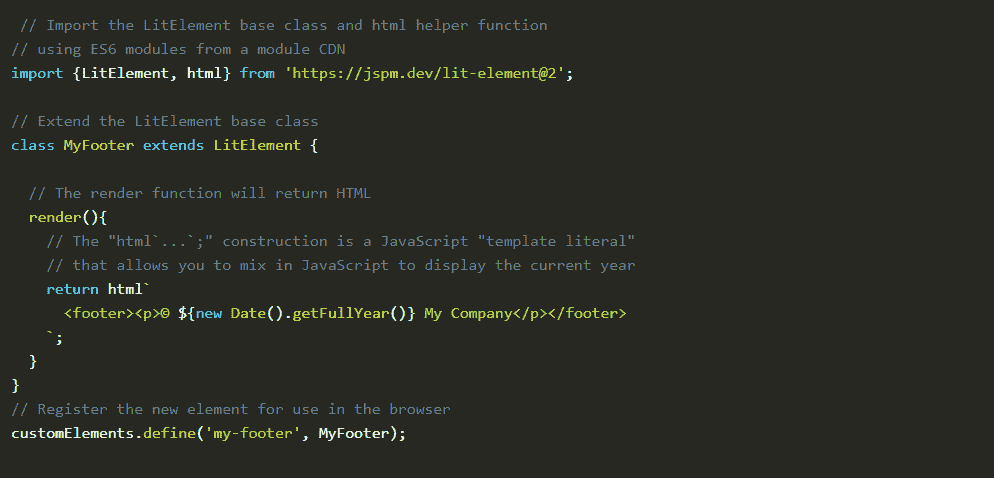

# Web 框架:为什么你不总是需要它们

> 原文：<https://thenewstack.io/case-against-web-frameworks/>

 [理查德·麦克马努斯

理查德是 New Stack 的高级编辑，每周撰写一篇关于网络和应用程序发展趋势的专栏文章。此前，他在 2003 年创立了读写网，并将其打造为全球最具影响力的科技新闻和分析网站之一。](https://twitter.com/ricmac) 

2021 年的 Web 开发由框架主导——像 Next.js 和 Angular 这样的 JavaScript 框架，像 Tailwind 和 Materialize 这样的 CSS 框架，像 Next.js 和 Gatsby 这样的 JAMstack 框架，以及许多其他框架。但是一家名为[Yax.com](https://yax.com/)的新公司正在倡导一种“无框架”的网络标准方法来进行网络开发。仔细观察，它提供了一种令人耳目一新的“返璞归真”的方法来构建网站或应用程序。问题是:它能大规模运作吗？

剧透预警:不，不能！然而，有越来越多的理由*不*使用 web 框架。

Yax.com 于去年由丹尼尔·凯霍创立，他在网络开发方面有很长的历史——甚至包括 1991 年与蒂姆·伯纳斯·李的电子邮件往来。大约十年前，他启动了[Rails app 开源项目](http://railsapps.github.io/)并撰写了《学习 Ruby on Rails 一书，在 Ruby on Rails 社区中，他是一个受人尊敬的声音。但是在这个过程中，Kehoe 厌倦了 web 开发的框架方法。

“我不再教任何人用 Rails 构建应用程序，”凯霍在一篇描述他所谓的“[无堆栈方式](https://tutorials.yax.com/articles/the-yax-way/index.html)”的长文中写道相反，他现在专注于帮助人们使用“内置于网络浏览器的最新功能”来构建网络应用和网站

自 20 世纪 90 年代 Adobe ColdFusion 和微软的 Active Server Pages (ASP)推出以来，Web 应用程序框架一直很受欢迎。这种情况一直持续到 2000 年代，出现了 Ruby on Rails(我在上周的专栏文章中讨论过)和 Django。然后在 2010 年，JavaScript 框架尤其激增。在最好的情况下，框架[让开发者创建复杂的网络应用变得容易](https://thenewstack.io/vercels-frontend-and-the-rise-of-the-hybrid-developer/)。那么凯霍和他们有什么过节呢？

Kehoe 认为，工程团队今天“背负着太多的复杂性”，“大型的、复杂的、层次化的和单一的组织产生了大型的、复杂的、层次化的和单一的软件系统。”他希望回归蒂姆·伯纳斯·李和 W3C 曾称之为[的最小权力规则](https://www.w3.org/2001/tag/doc/leastPower):“使用最不强大的语言来表达万维网上的信息、约束或程序。”

根据 Kehoe 的说法，现在是采用“无栈”方法进行 web 开发的时候了——这种方法基于 web 标准和(更恰当地说)领先浏览器公司如何实施这些标准的最新改进。

## 无堆栈技术

有三项关键的网络技术支撑着凯霍的方法:

*   **ES6 模块** : JavaScript ES6 可以支持导入模块，浏览器也支持。
*   **模块 cdn**:JavaScript 模块现在可以从第三方内容交付网络(cdn)下载。
*   **定制 HTML 元素**:开发者现在可以通过 [Web 组件](https://developer.mozilla.org/en-US/docs/Web/Web_Components)创建定制 HTML 标签。

模块化代码和标记的能力是 Kehoe 的转折点。

JavaScript 模块首先由 JavaScript 标准机构 ECMA 在 2015 年随 ECMAScript 6 (ES6)推出。但是直到 2017 年 9 月 19 日，它才在谷歌市场领先的浏览器 Chrome 中得到正确支持。

模块化 HTML 的采用需要更长的时间，但 Kehoe 认为 Web 组件——在 2018 年期间在 Chrome 和 Firefox [中得到完全支持——最终实现了这一点。他在自己的网站](https://caniuse.com/?search=web%20component)上写道[:](https://tutorials.yax.com/articles/the-yax-way/4.html)

*“我们曾经需要 web 应用程序开发框架，因为无法用老式的 HTML 和 JavaScript 编写模块化代码或访问数据库。现在自定义元素使得编写模块化 HTML 成为可能。”*

Mozilla [将 web 组件](https://developer.mozilla.org/en-US/docs/Web/Web_Components)定义为“一套不同的技术，允许您创建可重用的定制元素——将它们的功能封装在代码的其余部分之外——并在您的 Web 应用程序中使用它们。”

Web 组件通常被定位为流行的 JavaScript 库和框架(如 React、Angular 和 Vue)的 web 标准替代品。其思想是 web 组件可以跨所有平台和框架重用，因此是面向未来的，而(例如)React 组件只能在 React 环境中重用。

对于 Web 组件来说，现在还为时过早，但在微软的 Edge 浏览器于 2020 年 1 月添加对它的支持后，势头有所回升。谷歌的亚历克斯·罗素[最近](https://twitter.com/slightlylate/status/1359579082871119873)说“Chrome 加载的页面中有 12%使用了网络组件。”如果丹尼尔·凯霍如愿以偿，随着时间的推移，无堆栈开发人员将会增加这个数字。

## 无框架方法的缺点

凯霍是第一个承认他的方法不适用于所有情况的人。事实上，在他长达五页的“无堆积方式”概述中，有整整一页是关于“障碍”的

首先，他写道，大型网站和性能管理需要构建工具。像 Angular 和 Vue 这样的框架之所以流行，部分是因为它们使得构建大规模的应用程序和网站变得更加容易。Angular 甚至在它的主页上宣称它“让你控制可扩展性”Kehoe 只是指出“不幸的是，大规模软件交付仍然需要 JavaScript 专业知识和构建工具，主要是为了性能优化。”

状态管理是大规模 web 应用程序中的另一个关键部分，这是无堆栈方式无法做到的。“如果你需要一个 SPA(单页应用程序)，使用一个框架并接受复杂性，”凯霍写道。

还有其他问题，包括无框架方法仍然非常新，因此缺乏可供学习的示例应用程序和网站。

这里我应该指出，Yax.com 并没有将自己定位为 Vercel 和 Gatsby 这样的公司的竞争对手，这两家公司严重依赖框架，其用户往往是前端开发人员。相反，Yax.com 的目标是“设计师、自己动手的人和网络初学者”，向他们提供可以用无堆栈方法构建的小项目的例子。

## 框架已经存在了。然而……

正如我所指出的，依赖普通的 JavaScript 和 web 组件只能让你到此为止。但是，尽管框架显然仍然是大规模 web 开发的最佳解决方案，Daniel Kehoe 返璞归真的方法还是有很多值得钦佩的地方。

首先，它凸显了过去几年我们在浏览器技术和网络标准方面的进步。随着主流浏览器中模块化 JavaScript 和(最近)Web 组件的出现，您现在可以构建令人惊讶的复杂应用程序，而不一定需要框架。正如凯霍所说:

只有使用框架和构建工具才有可能实现的事情，现在可以通过浏览器内置的功能来实现。所以我建议，除非绝对必要，否则不要用框架作为你的开发平台。浏览器本身就是你的平台； ***利用平台*** *。”*

至少，无栈方法是让你重新熟悉现代网络平台的好方法。

<svg xmlns:xlink="http://www.w3.org/1999/xlink" viewBox="0 0 68 31" version="1.1"><title>Group</title> <desc>Created with Sketch.</desc></svg>