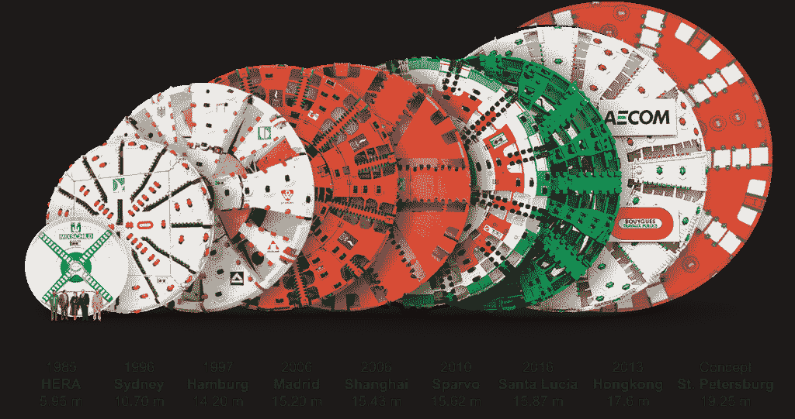
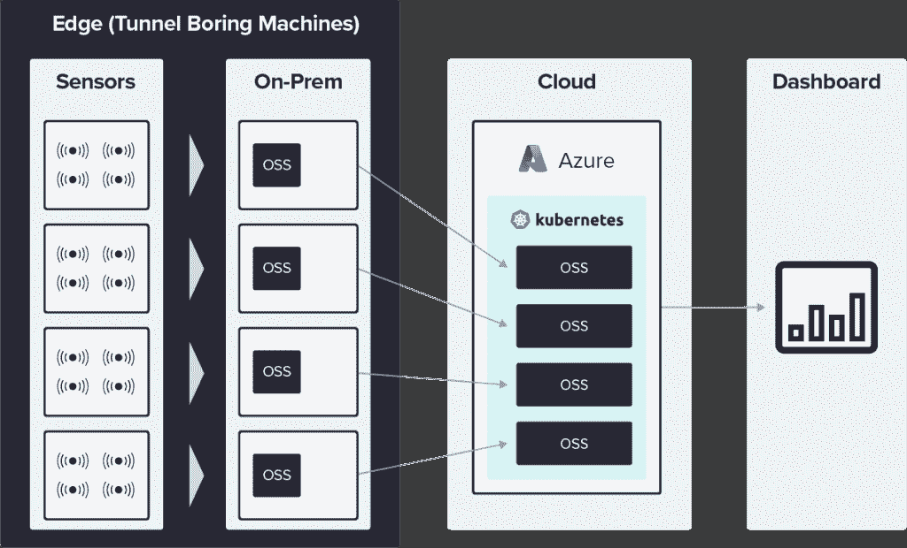
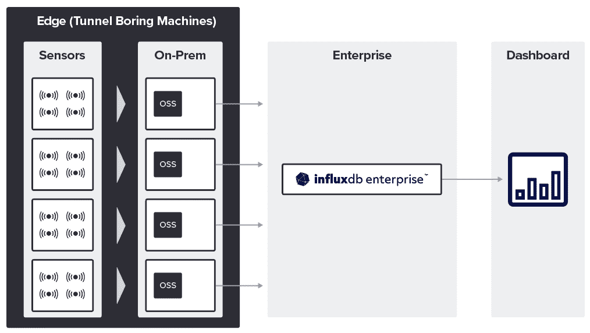

# 案例研究:构建混合边缘云 IIoT 平台

> 原文：<https://thenewstack.io/case-study-building-a-hybrid-edge-cloud-iiot-platform/>

让系统能够处理来自多个来源的数据，并为用户提供完成工作所需的工具，这是工业物联网(IIoT)用例的核心。

在边缘生成的数据通常在边缘和云中都有用。这就是 Herrenknecht AG 为现场互联设备构建混合边缘云平台的原因。

以下案例研究揭示了该公司面临的挑战以及他们为创建稳定、可靠的 IIoT 平台和生态系统而迭代的解决方案。

## 背景

Herrenknecht 是机械化隧道系统的技术领导者。该公司的足迹遍布全球，为所有地面条件和所有直径提供尖端的隧道掘进机(TBM)。TBM 是大型工业机器，其切割面从 0.10 米到 19 米不等。

Herrenknecht 为运输隧道(交通隧道)和供应和处理隧道(公用事业隧道)等应用量身定制机器。它还为有效地安装地下管道提供了创新的解决方案。

来源:Herrenknecht 股份公司

这些机器有数以千计的传感器生成高速数据，这些数据提供切割表面指标，如前进速度、前进进度、切割轮扭矩、每分钟最大允许穿透力和最大允许推力。

 [杰森·迈尔斯

Jason 是 InfluxData 的技术营销作家。他在芝加哥罗耀拉大学获得了爱尔兰现代史的博士学位。从那以后，他利用自己的写作技巧为一系列初创公司和科技公司创作内容。](https://www.linkedin.com/in/jrmyers) 

对于 TBM 操作员来说，掌握最新的准确信息至关重要，这样他们就知道该做什么、如何指挥机器以及如何对突发事件做出反应。

为了更好地利用这些机器产生的所有数据，Herrenknecht 的工程师着手建立一个 IIoT 平台，为他们所有的 TBM 提供实时和历史数据。

他们寻求开源解决方案来降低成本。

他们还需要一些易于小团队维护的东西，这样他们就可以花更多时间开发平台，而不是管理基础设施。

## 技术挑战

Herrenknecht 团队在构建 IIoT 平台时面临许多挑战。

他们需要考虑:

*   数据规模
*   远程设备的连接
*   纵向数据管理
*   架构兼容性

### 数据规模

Herrenknecht 的平台需要支持该领域的所有机器，总数超过 2000 台。在任何时候，数百人可以在全球不同的地方同时工作。一台 TBM 可以有 5000 个传感器。一些用例，比如交通隧道机器，甚至可以有更多。更复杂的是，每个传感器可以有不同的采样速率。一些传感器的速率低至 100 毫秒。

### 连通性

操作员在世界各地的工作现场部署 TBM，通常在偏远地区，这有时会导致连接和带宽问题。隧道挖掘的本质也意味着这些机器在地下 10 至 15 公里深处运行，并且 TBM 可以完全离线并与互联网断开连接达数天、数周或数月。

### 纵向数据管理

访问实时数据对 TBM 操作员至关重要，但 Herrenknecht 团队也希望他们的平台能够处理过去四十年从 TBM 收集的历史数据。这些数据以多种不同的格式存在，因此该平台需要能够从 SQL 数据库、DBX 和 CSV 文件以及其他各种格式和来源中获取数据。

### 体系结构

旧 TBM 上的技术栈在 Windows 上运行。较新的 TBM 主要在 Linux 上运行，但是如果必要的话也保留在 Windows 上运行的能力，所以该平台需要与两者兼容。

## 解决方案

Herrenknecht 的开发人员选择了 [InfluxDB](https://www.influxdata.com/products/?utm_source=vendor&utm_medium=referral&utm_campaign=2022-03-09_spnsr-ctn_herrenknecht-cs_tns) 作为 IIoT 平台的中央时序存储数据库。几个因素影响了这个决定。例如，InfluxDB 运行在多种架构上，这回答了 Windows/Linux 的问题。该公司在设计其平台时也考虑到了增长，InfluxDB 提供了开源版本和商业企业版。这有助于使平台经得起未来的考验，这样团队就不必在几年后重做一切。

选择了 InfluxDB 之后，Herrenknecht 的开发者实际上是如何使用的？

首先，让我们看看他们如何处理他们收集的传感器数据。该团队非常清楚系列[基数](https://youtu.be/kHIjROe0ZpA)并寻求保持低基数的方法。他们选定了一种独特的数据存储方法来降低基数并减少内存使用。

它们不是收集单个传感器或特定传感器组的测量值，而是收集一个具有数千个字段的测量值，其中每个字段都是浮点类型。并且它们仅在传感器读数与前一个相比发生显著变化时才写入值。

它们对这些数据值进行舍入以确定是否发生了显著变化，并且只写入符合显著变化条件的值。有时，团队需要考虑传感器的准确性，如果检测到的变化大于准确性阈值，则重新舍入该值。如果在舍入过程之后，值没有改变，他们可以简单地删除该值。

他们很少使用标记，主要是为了指示 TBM 的操作状态，这些标记值类型是简单的布尔值。使用这种方法，Herrenknecht 平均每月每台机器只能写入 1 到 5GB 的数据。

让我们转向平台的架构。它包含边缘和云解决方案的组合。边缘上的技术栈能够独立于云运行，并与云协同工作。这种设计为海瑞克客户提供了使用平台和控制数据的灵活性。

## 边缘设备

初始数据收集和存储发生在 TBMs 上，[在边缘](https://thenewstack.io/influxdb-as-an-iot-edge-historian-a-crawl-walk-run-approach/)，因为每台机器运行它自己的 InfluxDB 实例。对于数据接收，Herrenknecht 使用基于 C#的客户端库，并将其存储在直接在 TBMs 上运行的 InfluxDB 的开源实例中。因为一切都从边缘开始，所以该平台利用了 InfluxDB 的数据处理和存储能力。

目前，他们使用 [InfluxQL](https://docs.influxdata.com/influxdb/cloud/query-data/influxql/?utm_source=vendor&utm_medium=referral&utm_campaign=2022-03-09_spnsr-ctn_herrenknecht-cs_tns) 进行数据处理，尽管他们计划很快开始使用 Flux 和定制软件从他们的粒度数据中获得聚合。Herrenknecht 的其他服务运行在这些聚合之上。对于不想将数据复制到云中的客户，InfluxDB 的边缘实例可以在本地支持仪表盘。

## 将数据库操作系统引入云中

Herrenknecht 的云解决方案历经多年发展。最初，他们使用 InfluxDB OSS 构建了一个云解决方案。为此，Herrenknecht 团队使用 Microsoft Azure Cloud 进行存储，并在 Kubernetes 中为每个 TBM 运行一个 InfluxDB 容器。InfluxDB 在边缘的本地实例将写入云中 InfluxDB 操作系统的唯一实例。云解决方案的结构与 TBMs 上运行的几乎相同，因此部署它几乎不需要额外的开发。

使用这种设置，从边缘到云的数据传输是最少的。所有的数据处理和清理都发生在边缘，所以只有干净的数据被发送到云中。云中的可视化和机器上的可视化需要相同，因此 Herrenknecht 的开发人员基于自定义 REST API 构建了一个自定义同步，这样云中的数据就可以精确地镜像 TBM 上的数据。

## 系统问题

在 Herrenknecht 达到大约 100 个 InfluxDB 实例之前，云系统一直运行良好。此时，它变得不可靠，因为 InfluxDB 响应时间急剧增加。一个简单查询的典型响应时间 100 或 200 毫秒会突然增加到 1 或 2 分钟。这完全是一种随机现象，没有办法预测哪些查询会变慢，或者什么时候会变慢。

对该问题的进一步调查显示，该问题不是 InfluxDB 的问题，而是 Azure 在存储层的问题。他们遇到了一个错误，文件存储有时会忘记解锁文件，当 InfluxDB 想要访问文件时，会出现错误，访问失败。然后，团队必须手动解锁文件。

即使这是一个罕见的错误，因为他们处理数百个容器，错误经常发生。这些存储可靠性问题，加上维护容器和 Kubernetes 节点的成本不断上升，促使 Herrenknecht 探索更可靠的解决方案。

## 迁移到企业

为了提高系统可靠性，Herrenknecht 从在云中运行开源迁移到了 [InfluxDB Enterprise](https://www.influxdata.com/products/influxdb-enterprise/?utm_source=vendor&utm_medium=referral&utm_campaign=2022-03-09_spnsr-ctn_herrenknecht-cs_tns) 。因为他们已经存储了大量的历史数据，所以团队需要在最短的停机时间内(每台机器最多几分钟)将这些数据迁移到企业版。

2020 年 1 月，他们在大约两周的时间内完成了迁移过程。他们编写了一些简单的 shell 脚本，这些脚本将数据从 Kubernetes 中的 InfluxDB 容器可靠地迁移到一个新的 InfluxDB 企业集群中。在迁移过程中，没有发生“读取”停机时间，“写入”停机时间总计不到 60 分钟。

> “我们交付的每台隧道掘进机上都有开源版本的 InfluxDB，我们在云中有 InfluxDB Enterprise，它只是在后台工作。我们真的不需要太在意它。它就在那里，而且很可靠，所以我们没有太多的 DevOps 工作…我们的小团队可以专注于功能开发。”
> 
> — Tobias Braun，软件架构师，Herrenknecht AG

## 结果

他们没有为所有 InfluxDB OSS 容器使用多个 Kubernetes 节点，而是切换到一个更小、更具成本效益的 InfluxDB Enterprise 集群。在迁移过程之后，由于虚拟机数量的减少，Herrenknecht 的 InfluxDB 系统的总拥有成本下降了三分之一。

这种转变还提供了 Herrenknecht 为其 IIoT 平台提供动力所需的可靠性和稳定性。这一转变消除了该公司遇到的查询速度慢和响应时间增加的问题。

他们为直接从 InfluxDB 提取数据的平台构建了一个基于 Angular 的自定义前端 Javascript UI。他们还编写了自定义 API 来增强和扩充 InfluxDB 中的数据，为 TBM 操作员提供额外的可视化选项。

InfluxDB 允许 Herrenknecht 尽可能地让他们的 IIoT 平台面向未来。它使 Herrenknecht 的平台空间得以增长，并提供了一个强大而灵活的架构，使他们能够随时更换组件，而无需付出大量努力或停机。

<svg xmlns:xlink="http://www.w3.org/1999/xlink" viewBox="0 0 68 31" version="1.1"><title>Group</title> <desc>Created with Sketch.</desc></svg>