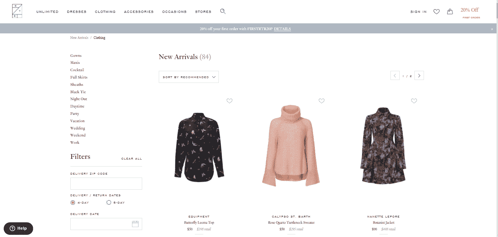

# Node.js 如何让《出租跑道》保持时尚和灵活

> 原文：<https://thenewstack.io/case-study-rent-runway-turned-node-js/>

电子商务时尚初创公司 [Rent the Runway](https://www.renttherunway.com/) 有一个简单但革命性的前提:浏览其精选的高级时尚奢侈品服装，挑选一套服装，然后公司将它运送给你。你戴上它，看起来美极了，然后把它寄回去，按件或通过无限月租的方式租你的[奥斯卡·德拉伦塔](https://www.oscardelarenta.com/)。这就像是女装设计师的网飞。

然而，实际上经营这家企业并不简单。为了保持客户体验的灵活性，Rent the Runway 必须与 web 开发最佳实践保持同步，就像它与不断变化的时尚趋势保持同步一样。

首先是创建和维护多个简单易用且有吸引力的平台(毕竟这是时尚)，作为出租 t 台上 10 万多件服装、珠宝和手袋的门户。那么这 10 万件商品中的每一件都需要实时定位和跟踪:芝加哥的夏琳不能拥有那个黄绿色的香奈儿手袋，因为乔利埃特的朱莉还没有把它寄回来。

随着公司的发展，Rent Runway 的软件工程师在保持网站和应用程序的可靠性和性能方面遇到了特别的困难。随着越来越多的人(和机器人)访问该网站，高峰时段的浏览往往会接近停顿，这让该公司 500 多万美元的潜在购物者订户群感到沮丧。

租跑道的人并不孤单。非常相似的挑战困扰着整个共享经济领域，尤其是许多共享经济公司正在经历高速增长，现在需要可扩展的解决方案。

《出租跑道》利用了 [Node.js](/tag/node.js/) 的非阻塞异步架构来加快前端性能，并让那些购物者回到他们的高级定制快乐之地，据 [Sarah Meyer](https://www.linkedin.com/in/sarah-saltrick-meyer-a3a4a131) 说，她是该公司的一名软件工程师，当时该公司想到了使用 Node.js 创建一个同构架构的解决方案，该架构允许在客户端和服务器端进行页面渲染。

## 所有这些都是为了制作一个非常慢的网页

迈耶说，2009 年推出的《出租跑道》(Rent the Runway)在早期使用了 [Backbone.js](http://backbonejs.org/) 和 [jQuery](https://jquery.com/) 。

她解释说，这个网站“很难浏览，而且有很多复杂的客户端逻辑，没有任何服务器端备份”。“只能通过访问页面并点击按钮来触发 JavaScript 事件以调用我们的服务器来访问的功能。从字面上看，一切都发生在前端。所有这些都是如何制作一个非常慢的网页——加载它，然后启动一系列服务器请求。”

一旦从移动设备上购物，这种情况就变得尤其难以维持，因为移动设备速度较慢，而且越来越受该公司用户的欢迎。

该公司开发了一个 web 应用程序堆栈，至少可以处理一些性能问题。用 Backbone.js 和 Ruby 编写的前端与基于 Java web 服务的后端通信，这些服务主要是在 DropWizard 上编写的。

该设置基本上是“一个标准的面向服务的架构，基本上我们必须整合来自一系列不同后端服务的大量响应，以向我们的客户显示他们想要的确切服装是否仍然可用的准确信息，”Meyer 解释道。与各种时装零售商合作，当然每一个都使用不同的实现。

然而，即使有了可靠的 SOA，仍然需要速度。

“起初，我们只想发送 HTML，启动绝对最小的请求，然后只响应用户请求，”Meyer 回忆道。“在我们的服务层中，我们是一个 Java 商店，而向客户提供主干应用的层是在 Ruby 中。没有办法改变那个决定。那时已经写了太多的代码。”

然而，[同构架构](https://nerds.airbnb.com/isomorphic-javascript-future-web-apps/)的一个主要吸引力是能够将传统客户端渲染的负载转移到您自己的服务器上——并租用绝对想要的跑道。JavaScript 本身似乎是解决方案的关键，但不是整个解决方案。“JavaScript 在不同浏览器上的实现是非常不同的，所以期望你的 JS 在所有浏览器上完美运行不仅不现实，而且对你的 QA 团队提出了不合理的期望。尤其是当团队只有一个人时，就像《出租跑道》那样，”迈耶笑着说。

最终，“我们决定采用 React 前端框架代码，它通常在客户端运行，并在我们这边完成渲染 HTML 页面的工作。在服务器上完成这项工作要快得多，而且有更多的控制权。也知道哪里出了问题，”Meyer 解释道。“React 是目前服务器端渲染的最佳框架之一，而你实际上做到这一点的方式，只是通过一个非常小的节点进程。”

## 不要回到 2001 年

但是服务器端渲染有什么大不了的呢？团队不能在不增加更多代码的情况下重新配置现有的堆栈来处理它吗？“如果只是让服务器端呈现 HTML，我们可以让 Ruby 做所有的事情，”Meyer 说。“但我们不想回到 2001 年——我们想保持现代 JS 驱动的 web 应用程序令人满意的用户体验和快速交互。所以我们实际上是这样设计的，在页面的 URL 和我们要传递以作出反应的状态对象之间有一个映射，我们编写了客户端代码来启动对服务器的 AJAX 请求。这样，您只需发送 JSON 来响应，而无需重新加载整个页面。这是一个更加灵活的过程。”

当被要求分解整个“敏捷过程”时，Meyer 解释说，React 应用程序的 HTML 输出“是一种状态对象的功能，它实际上只是一个标准的 Javascript 对象。将状态对象插入到用 React 编写的模板中，就可以得到完整的客户端 HTML。最棒的是现有的服务器端 Ruby 代码为我们的 React 生成了状态对象，再加上这个小小的服务器端 Node.js 进程做着 React 组件在客户端会做的事情…

“当你第一次点击其中一个页面时，我们会调出标准 HTML 请求的 URL。如果您在客户端有一些调用服务器的操作，新的信息如调用“只显示黑色鸡尾酒礼服”，URL 将会改变，并且会有一个 AJAX 调用发送完整 HTML 的相同端点，但是因为它是一个 Ajax 请求，我们已经加载了 React 环境运行。所以我们只需要得到一个新的初始状态对象，然后在客户端重新加载它，”Meyer 说。

“这就是我们两全其美的地方——我们不必在每次有人在应用程序中导航时重新加载整个页面，但也没有单页应用程序的问题，如果您的 JavaScript 不起作用，您就什么也没有。对于很多人来说，很容易忘记 JS 有多慢和不受支持。”

## 二十八天后

《出租跑道》方法的主要转变与其说是实施，不如说是策略。实际上，这一转变只用了不到一个月的时间。“编写节点流程和实现服务器端渲染，最多只花了两天时间，”Meyer 说。“剩下的时间都花在把红宝石拿到需要的地方了。这之所以成为可能，主要是因为使用了 React 作为框架——尽管 [Ember](http://emberjs.com/) 也可以工作，如果你自制一些东西，甚至 Backbone 也是可能的。”

据 Sarah Meyer 称，结果是:“有了 Node，我们可以将客户端的工作放回服务器，同时保留现有的 Ruby 代码，并开始编写 React 代码，这本身就是 JavaScript 代码，对我们的开发人员来说是最舒服的事情。”

“我们可以把 Ruby 换成 Python，把 Java 换成 Go，但我们不能把 Node 换成其他任何东西。她说:“这个小小的节点过程是如何将一切编织在一起的，这太酷了。”。

通过 Pixabay 的特征图像。

<svg xmlns:xlink="http://www.w3.org/1999/xlink" viewBox="0 0 68 31" version="1.1"><title>Group</title> <desc>Created with Sketch.</desc></svg>