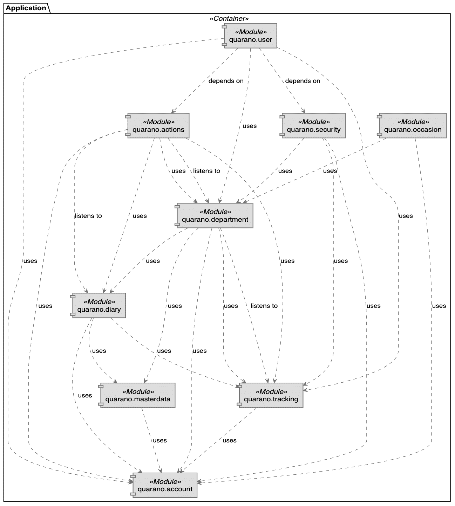

# 案例研究:跟踪病毒感染需要一个分布式数据库

> 原文：<https://thenewstack.io/case-study-tracking-a-viral-infection-requires-a-distributed-database/>

 [凯西·麦卡利斯特

Cassie McAllister 是蟑螂实验室的产品营销人员，该公司开发了 CockroachDB，这是地球上最先进的数据库。此前，Cassie 在另一个现代分布式数据库 Timescale 从事产品营销工作。](https://www.linkedin.com/in/cassie-mcallister/) 

去年，德国政府赞助了一场黑客马拉松来应对正在出现的新冠肺炎危机。一家德国初创公司推出了一款旨在追踪人们新冠肺炎症状的应用程序。该应用程序成功的核心是一组开源技术，以及强大的分布式数据库，以确保可伸缩性和安全性。

该项目名为 [Quarano](https://quarano.de/) ，在黑客马拉松后仅 10 周就上线了。该系统允许患者记录症状日记，然后由卫生当局进行监控。

对于黑客马拉松挑战，Quarano 团队希望将他们的项目集中在使新冠肺炎文档流程更有效上。德国政府在卫生当局的基础上运作，这意味着德国的每个地区都有自己的当局，制定自己的追踪病毒的规则。卫生当局使用(在某些情况下仍在使用)笔和纸来记录人们的症状以及他们接触过的人。

这种手动记录方法不仅效率低、不可靠，还会显著降低病毒跟踪过程的速度。

在黑客马拉松之后，该团队有了一个开源的“接触追踪”原型，可以让当局了解病毒在哪里以及如何传播。它也可以用来组织隔离，甚至为市民提供健康服务。

## **走红**

准备好工作原型后，该团队面临着一系列的挑战，以使其规模进入生产使用，以及使其安全。

如果其他机构想要使用它，应用程序本身需要容易地扩展到新的区域。首先，构成 Quarano 的所有技术都需要开源，包括基础设施和数据库。

这个需求导致了一个基于 Spring Boot 的设计，它公开了一个 REST API 来跟踪新冠肺炎感染病例。应用程序后端使用基于一系列开源技术的标准 Maven 项目。德国电信捐赠了硬件。目前，该项目在德国使用三个节点(每个区域一个)，每个节点有四个 vCPUs。

该团队还需要一个可以作为集群托管在该私有云上的数据库。根据要求，它需要是开源的，并且需要扩展。

Quarano 团队开始在另一个分布式数据库上构建他们的应用程序，但是发现性能有所欠缺。所以他们测试了 CockroachDB，对它的扩展能力感到满意，并对它的[地理分区](https://www.cockroachlabs.com/product/geo-partitioning/)能力感兴趣，如果他们的产品发展到德国以外的话。

[cocroach db](https://www.cockroachlabs.com/?utm_content=inline-mention)有一个基于节点的架构，其中每个节点都独立运行，但都是作为单个逻辑数据库呈现的节点集群的一部分。每个节点都是整个数据库的网关，如果一个节点出现故障，它会自动恢复在线。这确保了 Quarano 将在任何故障中幸存下来，并始终处于开启和可用状态。

应用程序组件概述。

当然，安全也是团队的一个考虑因素。该应用程序收集了大量关于用户的数据(年龄、性别、症状、位置等)。因为 CockroachDB 有内置的加密，所以 Quarano 不需要实现一个补充的加密解决方案。

如果 Quarano 在不同的地区增加一个额外的健康机构，他们可以简单地增加更多的节点。当一个节点指向群集时，它会立即在所有节点之间重新平衡数据，以纳入这一新资源。通过添加新节点，您还可以扩展单个逻辑数据库可以处理的事务量。这意味着当您添加节点时，您可以扩展读取和写入，这将确保 Quarano 的高性能。

如果该应用程序的范围扩展到德国以外，那么 Quarano 就可以利用 CockroachDB 的地理分区功能。地理分区将数据绑定到行级别的位置。这有助于 Quarano 通过将数据保存在用户附近来满足延迟要求，还有助于满足可能要求数据驻留在特定地理管辖区的法规遵从性。

该团队计划在未来签署更多的卫生授权。他们目前正致力于为应用程序本身添加更多功能，使其对公民更加友好，而不仅仅是医疗工作者。

*Quarano 是一个你可以用 CockroachDB 构建神奇事物的例子。要了解其他人正在构建的更多信息，请访问[我们的客户页面](https://www.cockroachlabs.com/customers/)。*

通过 Pixabay 的特征图像。

<svg xmlns:xlink="http://www.w3.org/1999/xlink" viewBox="0 0 68 31" version="1.1"><title>Group</title> <desc>Created with Sketch.</desc></svg>