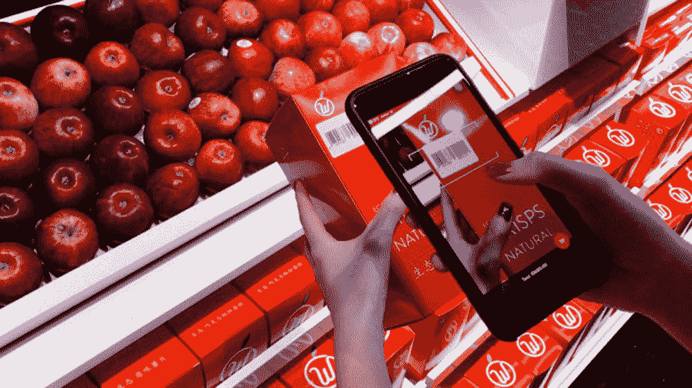
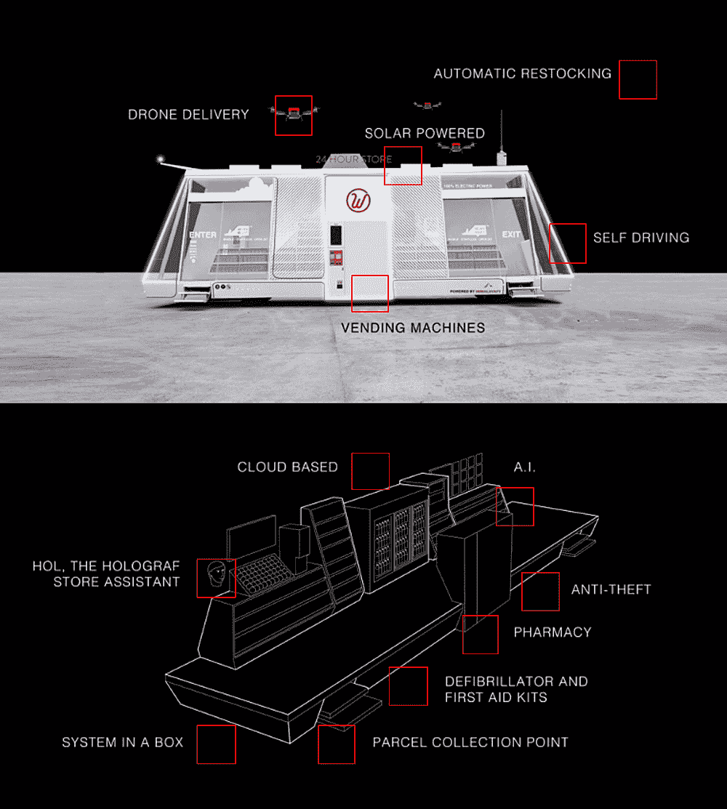
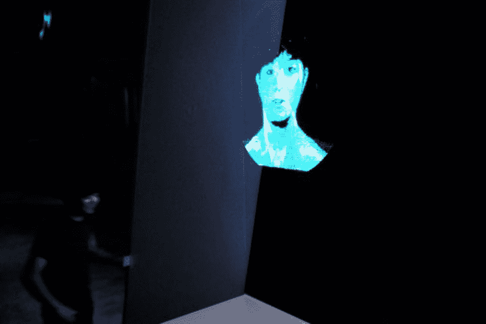
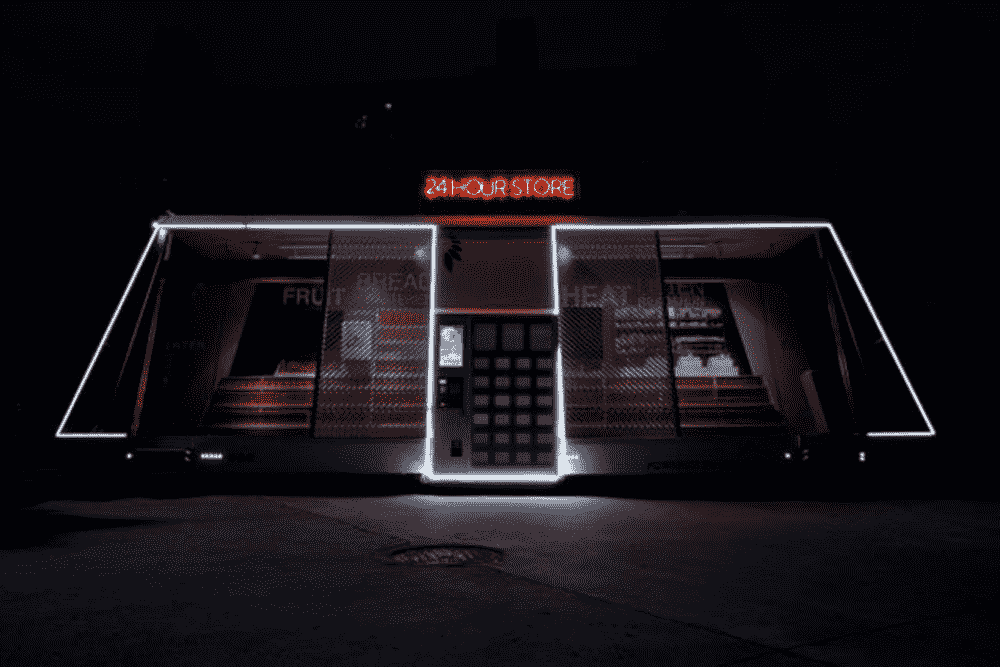

# 这个无收银员、无人驾驶、人工智能驱动的杂货店来到你面前

> 原文：<https://thenewstack.io/cashier-free-self-driving-ai-powered-grocery-store-comes/>

在任何大城市，深夜去街角的杂货店买一盒牛奶或一袋薯条都是一种惯例。但是，如果这种无人驾驶、自主的轮子上的杂货店的新想法启动，这些当地的实体地标可能会成为过去的遗迹。

这家名为[莫比商场](http://www.themobymart.com/)的商店被宣传为“来到你身边的商店”，顾客可以使用智能手机应用程序为其欢呼。在里面，你可以通过应用程序扫描商品来购买农产品、准备好的零食，甚至非处方药，这将自动从你的账户中扣除费用。所有这一切都是可能的，并且不需要排队或携带现金。

[https://www.youtube.com/embed/W9IqJOpfa5c?feature=oembed](https://www.youtube.com/embed/W9IqJOpfa5c?feature=oembed)

视频

## 敏捷零售

无收银员商店的想法并不是独一无二的，从亚马逊即将推出自己的[无员工零售店](https://www.amazon.com/b?node=16008589011)的计划就可以看出这一点。但莫比购物中心是对这一概念的一个特别有先见之明的诠释，它是由合肥工业大学、科技公司 [Himalafy](http://www.himalafy.com/) 和瑞典初创公司 Wheelys 合作开发的。Wheelys 是一家以其全球 500 多家移动咖啡馆连锁店而闻名的公司，该公司于 2015 年成立，其首席执行官 Maria De La Croix 被拒绝成为潜在的星巴克咖啡师，显然是因为头发太蓝。

就像 Wheelys 在自行车上的敏捷咖啡馆一样，这个概念是为了让零售成为更有效、更方便、更便宜的体验。它还颠覆了零售行业的现状，即支付昂贵的租金，雇佣员工，让顾客真正走到一个固定的位置。

相比之下，这些自主超市是太阳能供电的，同时也是巨大的空气净化器，因为它们配备了集成的空气净化系统，有助于过滤周围空气中的烟雾。莫比还将配备四个无人机发射台，用于远程送货。除了提供食品杂货，莫比还提供一家小药房，里面有急救产品、咖啡和茶冲泡服务以及自动取款机。

莫比目前正在中国上海进行测试，暂时使用人类司机，因为自动驾驶汽车目前在上海还不合法。但计划是将该项目发展成为一项完全自主的服务，利用人工智能系统引导商店沿着城市街道到达顾客的位置。同一个系统将允许莫比自动确定其货架何时需要补充，触发返回其仓库。

莫比还使用云技术来跟踪路上的其他莫比商场，使两个商场“相遇”并在必要时交换库存成为可能，从而消除了单独返回仓库补货的长途旅行。对于需要帮助的顾客，莫比还将加入一个名为 Hol 的全息助手，该助手还可以帮助游客订购没有库存的产品，这些产品将在你下次走进商店时提供。

## 农村地区的移动商店

但是也有可能 Mobys 可以在大都市以外的地方使用，在服务不足的小城镇和村庄，那里可能连一个普通商店都没有。这种移动商店可能有助于支持选择居住在这些零售业落后的农村地区的居民。

“我在瑞典北部的乡下长大，”Wheelys 的联合创始人之一[托马斯·马泽蒂](https://twitter.com/tomasmazetti)告诉 *[快公司](https://www.fastcompany.com/40429419/this-tiny-grocery-store-is-mobile-self-driving-and-run-by-ai)* 。“上一家商店是在 20 世纪 80 年代的某个时候关闭的，从那以后，所有人都乘车进城，但那需要一个小时。村庄的一小部分已经死亡。现在，突然之间，在那样一个地方，村子可以联合起来买一个这样的商店。如果村庄真的很小，商店可以搬到不同的村庄。”

莫比超市对低收入城市社区的所谓的“食物沙漠”也是一个福音。类似于 Wheelys 咖啡馆的完全本地化的性质，甚至有可能让住在同一社区的一群人开办他们自己的本地莫比超市。据该公司称，除了商店特许经营者支付少量“社区费”以获得该公司的技术支持外，在莫比开一家超市可能只需 3 万美元。

该公司仍在调整设计，并测试可能储备的确切产品，目的是明年大规模生产移动商店。虽然一方面，这种无人商店将消除人们在当地街角商店进行人与人互动的体验，但随着房地产价格的上涨，该公司认为这种无人驾驶、无人值守的模式是零售业的未来。最终目标是使莫比商场的建造成本比传统的实体建筑更低，并作为 Amazon Go 等大公司商店的一种便捷的本地自有选择。

“我希望这些能被家庭或团体购买，这样就不是一个人拥有世界上的每一家商店，”马泽蒂说。"你可以拥有自己的小店，而不是在亚马逊的仓库工作."

图片:莫比超市

<svg xmlns:xlink="http://www.w3.org/1999/xlink" viewBox="0 0 68 31" version="1.1"><title>Group</title> <desc>Created with Sketch.</desc></svg>