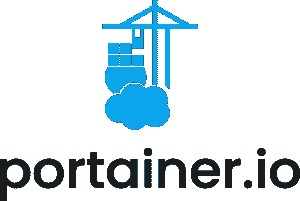
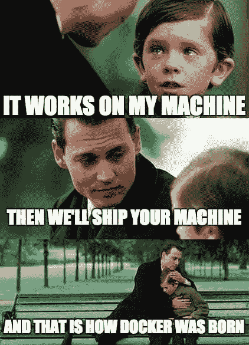

# 采访 Portainer 的创始人兼首席执行官

> 原文：<https://thenewstack.io/catching-up-with-the-founder-and-ceo-of-portainer/>

最近，我有幸见到了 [Portainer](https://www.portainer.io/) 、[尼尔·克雷斯韦尔](https://www.linkedin.com/in/ncresswell/)的首席执行官兼创始人。他对自己的产品充满热情(我已经非常清楚地表明，在我看来，它是市场上最好的 [GUI 容器管理器](https://thenewstack.io/kubernetes-needs-to-take-a-lesson-from-portainer-on-ease-of-use/)之一)，并且对开源软件充满热情。

对于那些从未体验过 Portainer 的人来说，Docker 和 Kubernetes 的轻量级 UI 使得这两种技术的部署和管理变得非常简单。我使用 Portainer 已经有一段时间了，我发现它不仅是管理容器的重要工具，也是学习 Docker 和 Kubernetes 技术的重要工具。它易于部署，易于使用，并使容器化应用程序的使用更加有效和高效。

克雷斯韦尔在系统工程、IT 咨询以及最近的 IT 管理岗位上工作了 25 年。他的职业生涯始于 IBM，在那里工作了 12 年，在服务器、存储和虚拟化系统工程领域担任领导职务。

离开 IBM 后，克雷斯韦尔开始与两位业务伙伴一起从事个体经营，他们共同创建了新西兰领先的 VMware 咨询公司之一 ViFX。在此期间，克雷斯韦尔常驻新加坡，负责该地区最大、最复杂的 VMware 部署的设计和部署。然后，他在一家初创的云服务提供商担任首席执行官，后来在一家电子商务提供商担任合同首席信息官。

我接触 Docker technologies 是在 2016 年，当时，作为云服务提供商的掌舵人，他希望将“容器即服务”产品推向市场(远在许多超大规模公司提供此类产品之前)。克雷斯韦尔试图找到可由服务提供商部署的自助服务门户，作为帮助其客户消费服务的一种方式，但是没有可用的门户，因此他构建了 Portainer。

克雷斯韦尔现在负责 Portainer.io 业务，并负责整体产品战略和交付该战略的团队。

那么，事不宜迟，让我们开始面试吧。

**TNS:是什么让你想创建 Portainer？**

**克雷斯韦尔**:我在 2016 年接触了 Docker 技术，当时我认为“这是下一件大事”我可以预见这项技术未来的变革性影响，但同时，它是多么“原始”。虽然 Docker 本身很容易让我理解(由于我的 Linux 背景)，但位于 [Docker](https://www.docker.com/?utm_content=inline-mention) (在那个阶段 [Swarm Mode](https://github.com/docker-archive/classicswarm) )之上的编排层相当复杂，确实需要一个大脑像行星一样大的人来理解它在做什么和如何工作。

然而，我确信具有集群/编排层的 Docker 将成为事实上的标准，并取代虚拟机成为跨企业部署和运行应用的主要方式。

当时，我从很早的时候就看到了虚拟化浪潮。我知道 VMware 最初很难获得广泛的采用，但一旦[VMware]攻克了这一难关，采用率就迅速上升。我可以看到 Docker 和 VMware 早期的相似之处。

我问自己，为什么 VMware 花了 10 多年才真正进入主流，并开始在数据中心产生真正的影响？是什么开启了 VMware 的主流？我对此的回答是:由于部署和操作复杂技术的合适技术人员有限，主流受到了阻碍，一旦有工具允许内部 IT 部署/管理/使用 VMware 平台，而无需首先成为 VMware 认证专家，主流的采用就真正开始了。

为了部署早期版本的 VMware，您需要高技能(高薪)的工程师。没有 VCP 的任何人都不可能安全地部署 VMware，甚至 VMware 也将 VCDX 提升为构建企业平台所需的技能水平。

主流 IT 对 VMware(和市场)施加压力，要求工具能够让他们安全地接触技术，而不需要借助专家。他们希望他们的内部 IT 团队能够安全地部署和管理这项技术。

一旦 VMware 发布了包含所需工具的扩展技术体系，即使是最复杂环境的部署也变成了“向导”驱动。此外，成功运行“第 2 天起”所需的工具也捆绑在一起，易于使用。这消除了资源限制，然后 bam..快速采用(这也是 VCP 和 VCDX 的“价值/薪水”急剧下降的时刻)。

所以，我心想，如果这是虚拟化的支点，那么容器技术很可能也会遵循同样的轨迹。那么，如果我能为容器提供同样简单的工具，会发生什么呢？我能提出技术的主流采用吗？Portainer 就是这样诞生的…试图使底层技术(最初是 Docker，后来是 Kubernetes)像当时的 VMware 虚拟机一样易于部署和管理。

Portainer 能为一家公司做些标准 Docker 和/或 Kubernetes 做不到的事情？

Portainer 是一个覆盖管理层。Portainer 不是为取代 Docker 或 Kubernetes 而设计的。Portainer 所做的是使这项技术更容易理解和使用。

不需要记忆 Docker/Kubernetes 需要操作的数百个 CLI 命令。说到底，如果你不知道一个命令或能力的存在，你怎么知道去寻找它呢？

我们让该平台的功能显而易见。想要查看主机或容器/容器的性能吗？没问题，点击“统计”按钮就能看到。

想要部署有状态的应用程序吗？没问题，按照我们的用户界面提示，你可以在一分钟内得到一些东西。想要查看你的应用程序的日志，简单，点击日志按钮…列表继续。

基本上，我们让您的内部 IT 团队可以使用这项技术，而不需要他们首先经过严格的培训和认证。无论他们现在的技能如何，我们都能让他们立即在技术上取得成功。

Docker(尤其是 Kubernetes)的学习曲线非常陡峭，一般 it 管理员/操作员需要几个月的时间才能掌握该技术，达到能够在关键生产场景中使用它的水平。

那太长了，我们把几个月变成了几天。听到公司投资 6 个多月来设计和构建 Kubernetes 平台的故事并不罕见，问题是，他们认为这需要一个月的时间，因此他们的项目落后于计划。更糟糕的是，他们通过六个月的时间认识到技术是多么复杂，以及需要多少持续的努力来维护它并交付给服务级别协议。

**目前集装箱部署的最大障碍是什么？**

两件事。

首先是对 Docker/Kubernetes 在生产中“上线”的实际要求的误解。所以许多组织有一种错误的理解，认为技术很容易，说实话，很容易让一些东西站起来并运行。问题是，您刚刚部署的东西不安全、不可扩展，而且很可能不受支持。

有很多工具可以帮助您构建集群，而且这些工具非常容易使用。这给人一种简单的错觉。

问题是，这些工具不能帮助您配置或支持技术部署后。Docker 和 Kubernetes 本身几乎毫无用处。他们不是一个平台，他们是一个平台的组成部分。要使用其中的任何一个，您最终将部署工具来帮助部署、可观察性、监控/警报、安全性和日志记录。

去看看[云原生计算基金会的前景](https://landscape.cncf.io/)，了解有超过 2000 个项目争夺你的注意力，并希望成为你的“平台”的一部分。你怎么知道选择哪一个？一旦您决定了您的堆栈，您确定它们都是可互操作的吗？当更新出来时，你选择的工具自我更新有多快呢？

这是真正的障碍，要知道真正交付一个生产级平台要比仅仅构建一个集群复杂得多。

第二件事是接触熟练的工程师。现在，在不使用 Portainer 的情况下，您确实需要经过 Kubernetes 培训/认证的工程师来安全地部署和管理这项技术。问题是，这些人的供应极其有限。优秀的人才正在被硅谷吸引(是的，他们在国际上招聘，因为他们对工程人才的需求超过了硅谷的供应)。

不知道你有没有看到，苹果去年显然雇佣了 8000 名 Kubernetes 工程师。这种技能短缺在新兴市场非常明显，那里可能只有少数熟练的工程师。

**你为什么选择开源 Portainer？**

我们开源该产品，因为我们坚信 Portainer 是主流的推动者，我们希望主流在最初采用时没有障碍。通过使产品开源，我们让公司开始，没有任何商业障碍/承诺。这为他们降低了整个项目的风险，也减少了所需的产品研究，因为他们可以“试一试”并直接看到产品带来的好处。

**创建云原生或以容器为中心的公司的最大挑战是什么？**

我认为这是我们所依赖的技术的采用速度。公平地说，容器在企业中被普遍接受，并变得足够普及，以至于像 Portainer 这样的产品有足够的市场需求，需要相当长的时间。直到现在，随着 ISV(独立应用程序供应商)默认将他们的应用程序作为容器发布，主流(我们为其构建 Portainer)才有了构建 Docker/Kubernetes 平台的真正动机。

你认为 Portainer 的什么特性对公司和开发者最有利？

这是一个困难的问题，因为没有一个真正的功能，我们选择提供的 UX 是最大的好处。我们特意决定不向我们的用户公开原始的技术术语，我们希望确保没有术语知识的人仍然可以使用 Portainer，因为毕竟我们正在努力使大众能够使用，而不需要他们对我们覆盖的技术有深刻的经验。如果我必须选择一个特性，那就是我们的无代码部署体验…对于那些希望让他们的应用程序运行起来，但不知道如何编写 YAML 部署定义文件的人来说，这是一个巨大的推动力。

**你会给新的容器开发者或者想加入容器化的公司什么建议？**

对于开发者来说，容器是将你的应用程序交付给用户的最好方式。它提供了如此多的部署一致性，并真正消除了“在我的机器上工作”的悖论。您需要习惯于开发容器和构建容器映像。这项投资是值得的。

图像

对于公司来说，当您从您的开发人员或 ISV 获得软件时，如果它是一个容器映像，您知道无论他们提供什么都可以工作，不管您的环境如何。

这种一致性是金。此外，容器实现了绝对的可移植性，因此它们开启了[混合/多云的可能性](https://thenewstack.io/multicloud-vs-hybrid-cloud-key-comparisons-and-differences/)，允许你将你的软件部署在对你最有意义的地方。

什么(如果有的话)阻止了团队和公司采用 GUI 进行容器部署？

业界有很大的压力要做“一切如代码”，无论是基础设施如代码、完整的 CI/CD 还是 GitOps…这些都是流行词，很明显，如果你不这样做，那么你就是在做错误的容器…这只是增加了采用的障碍，增加了更多的工具供你的团队在你可以投入使用之前学习，并进一步缩小了能够创建所有这些代码的可用工程师的范围。

虽然我们同意“作为代码”是令人向往的，但现在你可以通过 GUI 获得容器的好处，同时你的团队学习如何在后台将应用程序定义为代码，允许你随着时间的推移向它发展。

也有很多同行恐吓，任何使用 GUI 的人都被视为不如使用 CLI 的人…

实际上，没有什么能阻止公司采用 GUI 进行容器部署，所以开始吧！

迄今为止，Portainer 最大的胜利是什么？

我认为这是我们从用户那里得到的持续的爱。我们有一个持续增长的用户社区，即使市场上有数百种新工具，我们也继续(在六年后)吸引新用户，并保留现有用户。这是一个巨大的胜利。

<svg xmlns:xlink="http://www.w3.org/1999/xlink" viewBox="0 0 68 31" version="1.1"><title>Group</title> <desc>Created with Sketch.</desc></svg>