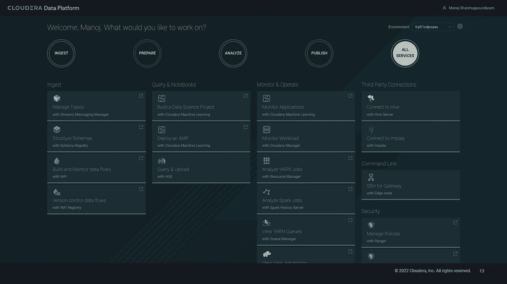

# CDP One 将 Cloudera 带入 SaaS 分析联盟

> 原文：<https://thenewstack.io/cdp-one-takes-cloudera-into-the-saas-analytics-league/>

Cloudera 上周宣布即将发布其[cloud era Data Platform One](https://www.cloudera.com/products/cloudera-data-platform/cdp-one.html)(CDP One)，这是其完整平台的软件即服务(SaaS)实现。CDP One 旨在为更广泛的组织增加分析的可访问性，以包括那些不具备云计算专业知识但仍希望成为数据驱动型组织并因此具有充分竞争力的组织。

CDP One 使 CDP 内的各种服务(包括数据接收、治理、准备、湖边小屋/流分析和机器学习)以自助方式提供给客户。这让这些客户不必担心规模、配置、供应或监控群集、节点或其他显式技术基础架构。Cloudera 表示，其提供了“零运营”的客户体验，将 DevOps、SecOps 和 CloudOps 嵌入作为服务的一部分，并允许客户专注于他们的工作负载、数据、治理和业务成果。

CDP One 的用户界面—点击放大(鸣谢:Cloudera，Inc .)

## 扩大的选区

虽然 CDP 已经在所有三个主要公共云上可用，并且可在私有云上部署，但这些场景涉及其在平台即服务(PaaS)能力中的使用，这需要客户提供更多知识和主动管理。Cloudera 认为 CDP 云适合大多数全球 2000 强企业，而 CDP One 则面向全球 5000 强企业。

Cloudera 于 2021 年收购了 SaaS 专业供应商 [Cazena](https://cazena.com/) 和 [Datacoral](https://www.datacoral.com/) ，这为该公司成为 SaaS 供应商的旅程注入了一剂强心针。例如，Cazena 之前提供了自己的自助式数据仓库和数据湖产品，方法是在云提供商提供的各种数据服务上提供一个类似 SaaS 的抽象层，以及产品可在云中运行的独立分析供应商的平台。

与此同时，Cloudera 已经有了一个专注于全方位数据管理、分析(湖、仓库甚至 BI)以及机器学习的内聚平台。与集成多个专业供应商平台的前景相比，这是一个不错的故事，但它仍然需要配置和管理 CDP 群集，以便使这些服务可用。将 Cazena 的自助服务界面和 Cloudera 的分析服务相结合，现在可以将后者带给 Cloudera 寻求的更广泛的受众。

## 获得的技术；有机整合

除了与 Cazena 的交易，Cloudera 过去几年的其他收购也帮助它建立了自己的平台。2014 年收购 Gazzang 给了该公司旧的大数据技术所缺乏的企业安全能力；2016 年的购买意识给了它一个强大的机器学习平台。2018 年 Cloudera 和 [Hortonworks](https://thenewstack.io/arun-c-murthy-building-successful-open-source-company/) 的合并给开源分析栈带来了某种统一和碎片整理。Hortonworks 已经有了 xa secure(T2)Apache Ranger(T3)数据治理平台背后的公司)和 Onyara(T4)Apache NiFi(T5)数据接收平台背后的公司)。2019 年挖掘阿卡迪亚数据为新的 Cloudera 提供了良好的 BI 和数据可视化功能，从而为事情画上了圆满的句号。

Hortonworks 合并的另一个标志是工程人才和战略决策的结合，将 CDP 构建为一个重构的、合理化的平台，而不是随意地将 Cloudera 的 Hadoop 版本( [CDH](https://www.cloudera.com/products/open-source/apache-hadoop/key-cdh-components.html) )与 Hortonworks 数据平台( [HDP](https://www.cloudera.com/products/hdp.html) )混为一谈。由此产生的“和平红利”意味着避免了大量的技术债务。相反，该公司有机会以技术上合理的方式整合其收购的资产，而不是仅仅在一个品牌下拼凑它们——不幸的是，这在企业技术领域经常发生。

2021 年 6 月，Cloudera 本身被私募股权公司[克莱顿、杜比利尔&赖斯](https://www.cdr-inc.com/)和 [KKR](https://www.kkr.com/) 收购，并于当年晚些时候将该公司私有化。虽然一些行业观察人士可能认为这一发展是一种挫折，但无论如何，它使该公司能够专注于 CDP 的严谨性和可用性，这两者为 CDP One 铺平了道路。

## 客户故事

Cloudera 将企业差旅管理公司 [CWT](https://www.mycwt.com/) 作为 CDP One 的灯塔客户。在上周作为 [Cloudera Now](https://www.cloudera.com/about/events/cloudera-now-cdp.html) 活动主题演讲的一部分播出的采访中，CWT 的首席企业数据架构师 [Gordon Coale](https://www.linkedin.com/in/gordon-coale-63010513/) 表示，该公司正在将其基于 CDP One 的数据湖用于外部服务，如其移动应用程序中的最终用户个性化以及内部企业数据集、临时数据集和小型用例数据集。

科尔说，该公司有一个“相对较小的数据分析团队”，制造其他分析解决方案——科尔说这些解决方案“要么过于劳动密集型，要么过于技能密集型”——更难适应。Cloudera 表示，CWT 能够在两天内为 CDP One 准备好数据，并在四周内投入生产使用。

CWT 是一个私人预览客户，但 Cloudera 表示，CDP One 现在可以向“注册”的客户提供，并将在今年晚些时候广泛提供。

*披露:Cloudera 是帖子作者 Andrew Brust 的公司 [Blue Badge Insights](https://www.bluebadgeinsights.com/) 的客户。*

<svg xmlns:xlink="http://www.w3.org/1999/xlink" viewBox="0 0 68 31" version="1.1"><title>Group</title> <desc>Created with Sketch.</desc></svg>