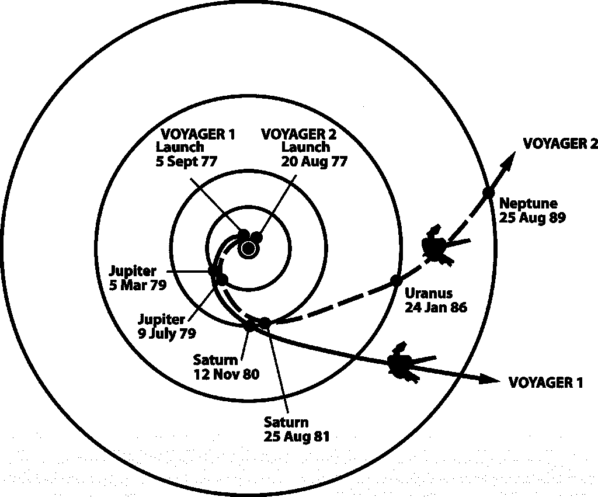
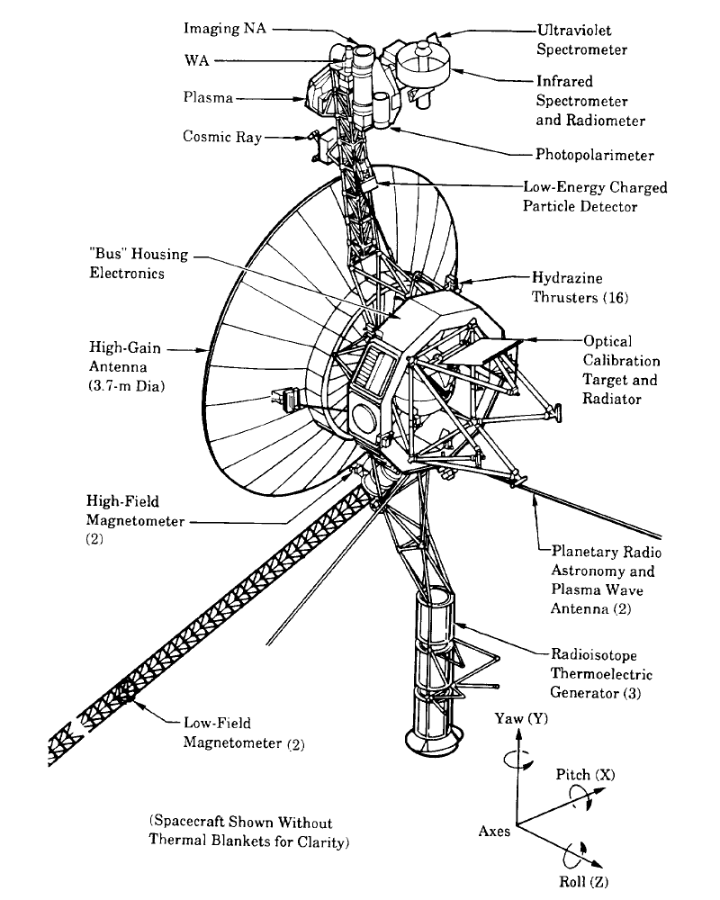

# 庆祝美国国家航空航天局的航海家号探测器-以及仍然支持他们的团队

> 原文：<https://thenewstack.io/celebrating-nasas-voyager-probes-team-thats-still-supporting/>

1977 年夏天，美国国家航空航天局发射了两个相同的太空探测器——相隔两周——希望它们能挺过四年的旅程，这样它们就能发回木星和土星的照片。

但是他们并没有停止探索木星的卫星——木卫一上意想不到的火山，欧罗巴怪异的冰壳——或者土星的编织环。现在，这些勇敢的探测器正在庆祝它们在太空中的 40 周年纪念日——仍然传回人类无法处理的更多数据，提供了一个鼓舞人心的故事，讲述了利用良好的技术和敬业的团队可以完成的事情。

对于曾经维护过遗留系统的人来说，这尤其鼓舞人心。

为了庆祝这个特殊的数据生成系统的长寿，美国宇航局现在要求人类想出一个简短的，令人振奋的消息，旅行者号将于 9 月 5 日发射光束进入太阳系外广阔的星际空间。在 8 月 15 日午夜(PDT)之前的任何时候，都可以通过 Twitter、Instagram、脸书、Google+或 Tumblr 上的#MessageToVoyager 标签提交消息。获胜者将由公众投票决定。

8 月 23 日，美国公共广播公司(PBS)首播了一部新的纪录片《最远的:太空旅行者》(The extremely:Voyager in Space)，以此来纪念这个周年纪念日。

[https://www.youtube.com/embed/znTdk_de_K8?feature=oembed](https://www.youtube.com/embed/znTdk_de_K8?feature=oembed)

视频

这部纪录片的制片人记得，当探测器第一次发射时，“他们认为它不会持续 40 年。”那时的航天器不是为长期任务设计的。“这是他们造两个的原因之一！你可能会在发布时失去一个，”他说。

每个探测器重 1704 磅——其中 231 磅是科学仪器——几十年来，他们的仪器测量了从卫星质量和大气温度到重力、辐射和磁场的一切。科学新闻记得，这项任务巧妙地选择了时间，以利用每 176 年发生一次的罕见行星排列，因此木星和土星的引力可以帮助探测器飞向天王星和海王星。

有一个故事是这样的，尼克松总统告诉一位美国国家航空航天局的官员，“上一次行星像这样排成一行时，杰斐逊总统正坐在你的办公桌前。他搞砸了。”

这一次被证明是一次科学上的大丰收。“当时，每张照片都是有史以来拍摄的最好的行星照片。据《科学新闻》报道，旅行者号首次发现了外太阳系的许多已知信息——木星的卫星木卫一上有火山，木卫二上有海洋，海王星上有永不停息的剧烈搅动的飓风。

探测器继续发出隆隆声，2004 年，旅行者号接近了太阳系的边缘，在那里太阳风与星际空间相遇。离子减速，磁场激增，2012 年 8 月 25 日，[《纽约时报》报道](https://www.nytimes.com/2017/08/03/magazine/the-loyal-engineers-steering-nasas-voyager-probes-across-the-universe.html)，旅行者号突然游进了一片新的空间粒子海洋。"它已经跨过了星际空间的门槛."

> 旅行者的机载计算机比 16GB 的智能手机少 235，000 倍的内存和 175，000 倍的速度。

维基百科指出[没有人类物体曾经旅行过这么远](https://en.wikipedia.org/wiki/Voyager_1)。

但是旅行者号探测器现在正接近结束与地球上的操作者的对话。据《纽约时报》报道，预计两个探测器的电源将在 2030 年耗尽，现在飞行团队面临一些艰难的决定。"为了节省航天器的能量，工程师们必须决定什么时候关闭什么，关闭多长时间。"但《纽约时报》也不禁看到了一个尖锐的人类对比。

“随着旅行者号任务接近尾声，那些扩大了我们在银河系中的家的感觉的年长探险家的职业生涯也是如此。”

## 结束了 53 年的使命

在《泰晤士报》的一篇引人入胜的简介中，记者金廷利指出，该项目最初花费了 1500 名工程师、5 年时间和 2 亿美元。但那是 40 年前的事了。本周廷利拜访了该团队的 9 名年长的飞行团队工程师——他们中的大多数人从 20 世纪 80 年代就在那里工作了。他们中只有一个人不到 50 岁——而且只有一个人已经有了替代者。2016 年，该项目的最有经验的程序员给出了 6 个月的通知，并利用这段时间培训他的继任者。

81 岁的科学小组组长埃德·斯通承认，“我当然不知道它会持续这么久。”

这个团队充满了忠诚的典范。两年前，65 岁的工程师恩里克·梅迪纳(Enrique Medina)告诉记者,“我不会离开航海家号，直到它不复存在。或者直到我不再存在。”由于他们不能专注于其他任务，廷利写道，他们的工作是有牺牲的。几十年来，留下来的宇航员放弃了晋升和附近硅谷的诱惑，最近还放弃了退休，留在了飞船上

当然，远不止如此。

“这次任务很可能标志着太空探索时代的结束，在这个时代，主要目标是观测而不是商业化。……美国宇航局的资助在 20 世纪 60 年代阿波罗计划期间达到顶峰，现在已经减少，这使得从谷歌和脸书这样的公司招聘年轻的计算机科学专业学生几乎是不可能的。”

在任务的整个过程中，团队经历了许多里程碑。他们见证了天王星在 1986 年和海王星在 1989 年的“首次亮相”。然后，他们解雇了 150 名工程师，搬进了更小的宿舍——位于加利福尼亚州马德雷山脉的一家大型计算机公司的前办公室。13 年后，更多的人员被裁减，又一次搬迁到加利福尼亚的阿尔塔迪纳，美国国家航空航天局审查该计划是否应该完全取消。

但廷利的文章暗示，剩下的 9 名飞行工程师代表着一个不可替代的梦之队。“随着时间的推移，他们对古老编程语言的流利程度将变得更加重要。…他们也可能是地球上最后一个能操作飞船机载计算机的人，这些计算机的内存比 16g 的智能手机少 235，000 倍，速度比 175，000 倍。”

《科学新闻》将这些探测器描述为“拥有和现代汽车钥匙链一样的计算能力”

但更令人印象深刻的是，他们正在极其简陋的条件下完成他们的历史性工作。廷利参观了洛杉矶郊外“Scott-Fox Puppy 幼儿园旁边的一座低矮的混凝土建筑”，项目经理苏珊娜·多德(Suzanne Dodd)“指着一台二手缩微胶片阅读器，这是硬件工程师、自称是传教图书馆员的汤姆·威克斯(Tom Weeks)在易贝购买的，用来阅读旧的诊断报告。”

他们缺乏设备肯定会影响他们从旅行者号探测器的无线电信号中接收到的数据量。“三个大到足以记录它们的天线碟形天线是共享的，所以旅行者号每天每艘飞船只能获得 4 到 6 个小时的接收时间；在这些通常很奇怪的窗口之外，他们的数据消散在太空中。”探测器必须昼夜不停地传输信号——因为旅行者号的计算机内存只有 4kB 的存储空间——无线电信号需要 19 个小时才能到达地球。

几十年来，该团队一直面临着独特的挑战，以维护他们自 1977 年以来的永久远程系统。“众所周知，比特会‘翻转’到相反的值，”《纽约时报》指出。1998 年有一次，旅行者 2 号读错了一个命令，关闭了自己产生无线电信号的激励器。令人惊讶的是，该团队能够准确猜测出命令是如何被篡改的，并恢复了通信。

还有其他一些侥幸脱险的情况。据科学新闻报道，当第一个航海家号探测器从卡纳维拉尔角发射时，所有的震动无意中使其机载计算机进入“安全模式”。第二个旅行者号探测器上的气体泄漏意味着它在到达木星轨道前的 3.5 秒内耗尽了气体。

《纽约时报》还记得摄像机平台是如何在任务开始仅 7 个月就被卡住的。“当工程师们争先恐后地想知道他们能从 1 亿多英里外做些什么时，有人忘记了发送每周命令来重置另一艘飞船上的计时器。当它在没有地球消息的情况下运行时，它触发了所谓的故障保护软件，这是 600 行代码，可以自动应对故障。”旅行者号切换到一个备用接收器，尽管最终——靠自己，经过一段痛苦的等待——旅行者号重新激活了原来的接收器。

然后短路了。

## **地球向你问好**

这项任务也使一些真正令人敬畏的事情成为可能。著名宇宙学家卡尔·萨根策划制作了附在探测器上的特殊镀金唱片——每张唱片都包含一组地球声音。这里有几首音乐——从贝多芬、巴赫到查克·贝里的“[约翰尼·b·古德](https://www.youtube.com/watch?v=6ROwVrF0Ceg)”，还有盲人威利·约翰逊的蓝调歌曲《黑暗是夜》，这首歌适合浩瀚的太空:

[https://www.youtube.com/embed/1FRbhFd_BhY?feature=oembed](https://www.youtube.com/embed/1FRbhFd_BhY?feature=oembed)

视频

你可以在 YouTube 播放列表中找到整张黄金唱片，Kickstarter 推出黑胶唱片[的活动从 10768 名支持者那里筹集了 1363037 美元](https://www.kickstarter.com/projects/ozmarecords/voyager-golden-record-40th-anniversary-edition/updates)。那张唱片的“第二版”现在正在印刷中，还有一套两张 CD。

它还包括卡尔·萨根的儿子说的声音，“来自地球儿童的问候。”

* * *

# WebReduce

图片由美国宇航局提供。

<svg xmlns:xlink="http://www.w3.org/1999/xlink" viewBox="0 0 68 31" version="1.1"><title>Group</title> <desc>Created with Sketch.</desc></svg>