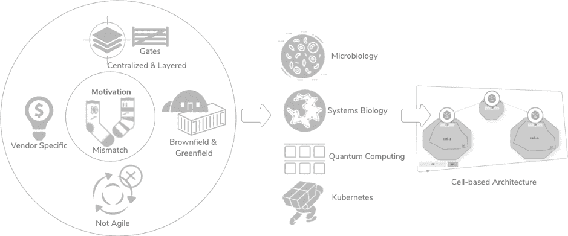

# 基于单元的架构:云原生模式的一种新的分散方法

> 原文：<https://thenewstack.io/cell-based-architecture-a-new-decentralized-approach-for-cloud-native-patterns/>

这是概述基于新细胞架构的三部分系列的第一篇文章，去年夏天作为开放规范在 [GitHub](https://github.com/wso2/reference-architecture) 上发表。我们的方法创建了一个实用的、技术中立的参考架构，满足了敏捷性的需求。它可以被实例化，为数字企业创建一种有效而敏捷的方法，部署在私有、公共或混合云环境中。

当我在技术活动上展示新架构时，一个常见的问题是为什么 WSO2 要在一个已经拥挤的市场中定义一个新的参考架构。这篇文章列出了激励因素。

作为一家技术提供商， [WSO2](https://wso2.com/) 参与集成领域已经超过十年，帮助 500 多家客户实施各种数字驱动的解决方案。WSO2 的 CTO 和联合创始人 Paul Fremantle(也是基于单元的架构的合著者)和我深入参与了大部分实现。Paul 和我在分布式计算领域也有 20 多年的经验。上述因素让我们发现了现有架构模式和企业真正需求之间的不匹配。

## 分层集中式架构

在过去的二十年中，我们使用了分层和集中式架构模式，这导致了许多卓越中心(CoE)小组和技术栈的产生。这些层产生了关卡，这些关卡反过来减缓了敏捷团队迭代开发和持续交付所需的快速移动和灵活性。因此，即使是实践敏捷方法的组织也只是部分敏捷的(敏捷或快速瀑布)。我们的方法旨在最小化集中的依赖性，并将集成转移到敏捷开发管道中，使组织更好地响应业务需求。[根据最近的“敏捷报告状态”的结果，研究](http://stateofagile.versionone.com)只有 4%的公司从敏捷的实际结果中受益，他们实际上花费时间和金钱在实践敏捷方法上。

## 棕色地带和绿色地带

随着微服务架构(MSA)和云原生基础设施的引入，架构师开始完全像绿地一样设计架构(我称之为 PowerPoint 架构)。然而，现实是许多企业需要棕色地带系统和数据，这是经营业务所必需的。由于现有参考体系结构解决的是绿地或棕地问题，我们意识到企业需要一种混合体系结构方法，既能重用现有系统和数据，又能在绿地中构建新系统。

## 参考实现

在定义新架构之前，我们进行了精确的研究，在此过程中，我们发现大多数现有的参考架构都是参考实施。将这些作为参考实现背后的基本原理是基于特定于供应商的技术来定义实现。我们希望新的参考体系结构最终基于技术，并且与供应商无关。这样，架构师可以参考已定义的参考体系结构，并基于企业中已经存在或计划在未来引入的所需技术来构建解决方案。

## 架构和技术灵活性

现有的参考架构在架构灵活性方面也受到限制，因为它们阻碍了项目采用新的或类似的技术。由于 Coe 在整个组织中使用了标准化的技术，所以每个项目团队都必须坚持使用那些特定的技术，即使它们不是项目的理想选择。这种技术利用不足是集中式分层架构的副作用，它促使我们考虑对分散式模块化架构的需求。

## 架构、实施和部署之间的差距

在一定程度上，敏捷方法有助于缩小架构、开发和部署之间的差距。然而，在应用程序生命周期的这三个步骤之间存在着脱节；这会导致业务系统崩溃。在生命周期的每一个阶段，用一个通用的架构构造建立无缝连接对于提高敏捷性是至关重要的(通过迭代的架构和连续的交付)。我们的方法使用相同的架构构造将应用程序和系统架构结合起来，这自然地将架构师、开发人员和 DevOps 工程师联系在一起。

## 治理和依赖性管理

[

阿桑卡·阿贝辛格

作为 WSO2 首席技术官办公室的副首席技术官和架构副总裁，Asanka 的目标是通过帮助组织实施数字化转型计划，实现消费者驱动的数字化应用，从而连接人类和技术。在目前的职位上，Asanka 致力于创建、完善和增强 WSO2 的企业参考架构，并负责引领一种思想领导观点，该观点定义了 WSO2 的企业参考方法，用于开发、客户成功和实施。Asanka 拥有超过 20 年的行业经验，包括设计和实施高度可扩展的分布式系统、金融领域的 SOA 和微服务架构、移动平台和各种业务集成解决方案。他还是 Apache 软件基金会的委员。他与客户、合作伙伴和分析师密切合作，宣传 WSO2 的技术愿景。他还是 Apache 软件基金会的委员。Asanka 经常在许多活动和技术会议上发言。](https://wso2.com/) 

虽然微服务和容器增加了应用程序开发和部署的灵活性，但这两种模式都通过引入许多移动部件增加了复杂性。考虑到这一点，我们希望实现一个具有可观察性的轻量级治理框架，这将支持依赖性管理、影响分析和对架构的监控。

我们通过对市场进行彻底的研究开始了这个项目。各种研究机构发表的学术论文、其他供应商提供的书籍和在线内容是这些内容的部分来源。这项研究证实了我们的激励因素是真实的。

我们将研究范围缩小到四个领域——量子计算、Kubernetes、微生物学和系统生物学——以找到项目的切入点。量子计算和 Kubernetes 让我们更多地思考去中心化的架构和市场走向。微生物学和系统生物学让我们深入了解了独立和自我运作的单元(细胞)是如何连接和构建众多广泛的系统的。此外，还有其他令人兴奋的生物细胞特征映射到我们正在研究的建筑结构，例如细胞膜如何提供清晰的细胞边界并保护细胞内部，以及创建单一的通信通道。

在初步的研究工作之后，我们着眼于企业的现实:主要是业务期望和技术定义的脱节。我们得出的结论是，无论服务开发风格如何(SOA 或 MSA)，组织都从服务中寻求业务问题的解决方案，这本质上要求连接多个技术服务并公开一个懂业务的 API。因此，(微服务需要使用复合服务或 API 网关进行连接。

## 结论

总之，我们引入这种架构模式背后的动机因素是基于架构师在迁移到微服务和云原生方法时面临的初期问题，这需要连接企业中已经存在的大量单片应用程序。在本系列的下一篇文章中，我将概述基于单元的体系结构。

<svg xmlns:xlink="http://www.w3.org/1999/xlink" viewBox="0 0 68 31" version="1.1"><title>Group</title> <desc>Created with Sketch.</desc></svg>