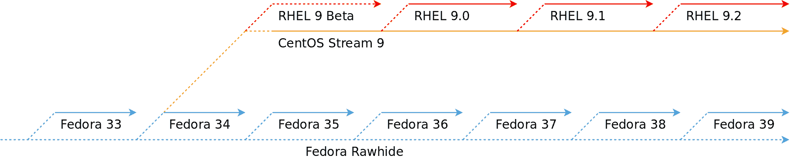
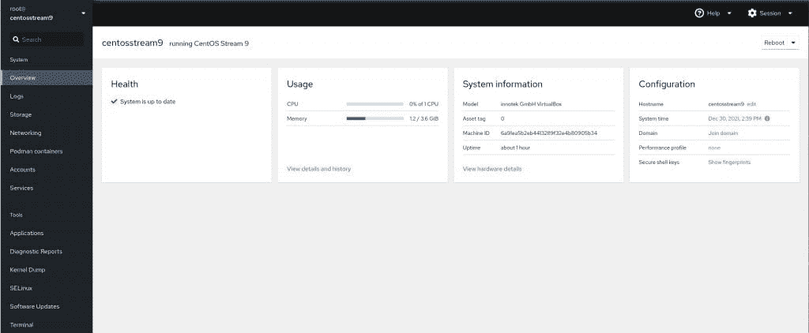
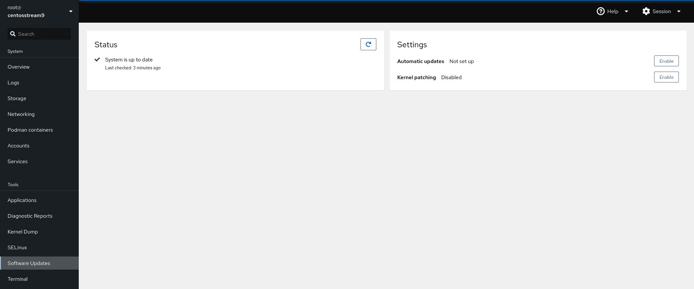

# CentOS 9 Stream 现已推出，但您应该使用它吗？

> 原文：<https://thenewstack.io/centos-9-stream-is-now-available-but-should-you-use-it/>

开源企业软件提供商 [Red Hat](https://www.openshift.com/try?utm_content=inline-mention) 去年受到了大量的嘲笑，当时[将](https://thenewstack.io/red-hat-deprecates-linux-centos-in-favor-of-a-streaming-edition/)CentOS Linx 发行版转变为滚动发行版。在那之后，到处都有用户抱怨，公司(比如 cPanel)停止了支持，[一批新的 1:1 二进制兼容的替代品](https://thenewstack.io/where-to-turn-for-a-centos-replacement-heres-5-solid-linux-distros-to-check-out/)(比如 AlmaLinux 和 Rocky Linux)诞生了。

然而， [CentOS 流](https://www.centos.org/)继续向前移动。本月早些时候，红帽发布了 CentOS Stream 的第 9 版，这恰好与 CentOS 8 的生命终结(因此，我们所知道和喜爱的 CentOS 的终结)相吻合。

但不要害怕，红帽在这里与 CentOS 9 流。

发布周期的有效工作方式是这样的:新功能将在 Fedora 上测试，然后在 CentOS Stream 和 Red Hat Enterprise Linux (RHEL)上并行发布，这是该公司的旗舰企业级 Linux 发行版。

用红帽的话说:

*CentOS Stream 是一个持续交付的发行版，是 RHEL 的下一个发布点。在包裹被正式引入 CentOS Stream 之前，它会经过一系列自动和手动测试和检查，以确保其符合 RHEL 包裹的严格标准。发布到 CentOS Stream 的更新与发布到未发布的 RHEL 次要版本的更新相同。目标？CentOS 流像 RHEL 一样稳定。*

让我们通过使用当前版本来更好地解释这一点。

Fedora 34 是与 RHEL 9 相同的代码库，是 CentOS 9 流的起点。随着软件包的更新，通过严格的测试，并满足红帽的稳定性标准，它们就会被推送到 CentOS Stream 和 RHEL 的夜间版本中。换句话说，CentOS stream 中可用的内容是基于 Fedora 的稳定版本，最终将进入 RHEL 的未来版本。

这是令人困惑的，所以让我们只说 CentOS 流和 RHEL 每夜是(除了一些品牌)一样的东西。

对于那些喜欢视觉帮助的人，Red Hat 提供了如图**图 1** 所示的帮助。

**图 1:** 红帽关于 Fedora/RHEL/CentOS 流发布的视觉路线图。

## CentOS 9 流里有什么？

CentOS 9 Stream 的重要之处在于，它与 CentOS 曾经的样子截然相反。在过去，CentOS 的核心是稳定性。因此，软件包升级到新版本非常慢。事实上，您经常会发现一些旧版本的包。这是经过精心设计的，目的是让操作系统尽可能地坚如磐石。而且成功了。CentOS 总是惊人的稳定。

相反，CentOS Stream 是最前沿的。你将拥有你所依赖的大多数软件的最新版本。例如，CentOS 9 Stream 与 GNOME 40 桌面一起发布。尽管这落后了一个版本，但仍然比 CentOS 要领先得多。

其他新增内容包括:

*   PHP 8.0
*   Python 3.9
*   MariaDB 10.5
*   Nginx 1.20
*   GCC 11.2

至于内核？快速运行`uname -r`发现我新安装的 CentOS 9 Stream 实例运行的是内核 5.14.0-34.el9.x86_64。

CentOS Stream 还安装了 Podman 版本 3.4.3，因此开箱即可开始容器工作。对于那些想要通过 Cockpit web UI 管理其安装的人，您仍然需要使用以下命令来启用它:

`sudo systemctl enable --now cockpit.socket`

启用后，将浏览器指向 https://SERVER:9090(其中 SERVER 是 CentOS 9 流服务器的 IP 地址),并使用 root 用户凭据登录。登录驾驶舱后，你会发现 Podman 支持已经推出(**图 2** )，所以你可以立即开始使用这个出色的 GUI 管理你的集装箱。

**图二**:驾驶舱内置吊舱员支持与 CentOS 9 流。

通过 Cockpit，您应该注意到(在安装时)一切都是最新的(**图 3** )。

**图 3:** 今天所有包装都开箱即用。

这是使用滚动发行版的一个令人愉快的副作用，因为您不必在安装完成后立即进行系统升级。

## 应该用 CentOS 9 流吗？

这是许多 Linux 管理员和企业思考的一个重要问题。下面是答案。

看情况。

如果您正在寻找一个用于开发的测试平台，并打算部署到即将发布的 RHEL，那么 CentOS 9 Stream 正是您想要的。另一方面，如果您希望生产环境的操作系统必须非常稳定，那么 CentOS 9 Stream 可能不是您的最佳选择。对于那些环境，你应该直接跳到 [Red Hat Enterprise Linux](https://www.redhat.com/en/technologies/linux-platforms/enterprise-linux) 或者选择其中一个，比如 [AlmaLinux](https://almalinux.org/) 或者 [Rocky Linux](https://rockylinux.org/) 。

无论哪种方式，我发现 CentOS 9 流是愉快的固体，就像 CentOS 曾经是熟悉的。不同之处在于，软件包更新了，支持也没那么长。我会将 CentOS 9 Stream 部署到生产环境中吗？不。我会选择在基于 RHEL 的开发环境中使用它吗？毫不犹豫。

如果你想一头扎进溪流，现在就下载一份 [CentOS 9 Stream](https://www.centos.org/centos-stream/) 并开始旋转。

<svg xmlns:xlink="http://www.w3.org/1999/xlink" viewBox="0 0 68 31" version="1.1"><title>Group</title> <desc>Created with Sketch.</desc></svg>