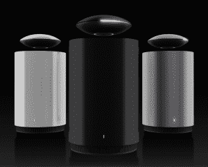
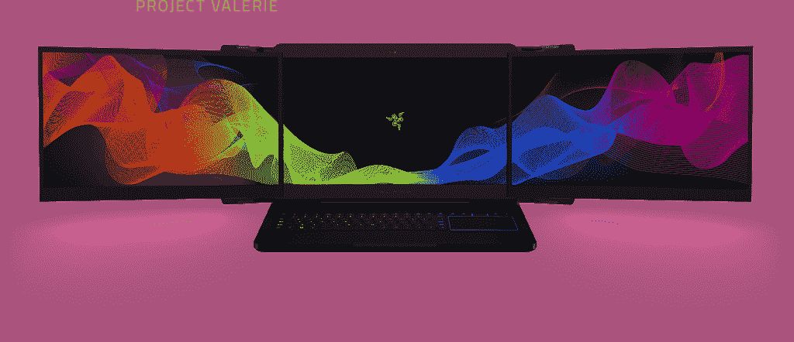
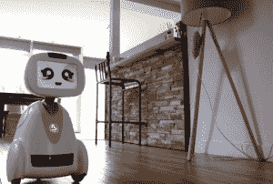

# CES 2017:机器人巴迪和其他来自展厅的酷电子产品

> 原文：<https://thenewstack.io/ces-2017-next-generation/>

2017 年拉斯维加斯消费电子展(CES)的热门词是“下一代”。这意味着有很多先进的现有技术和设备，也许在疯狂的新发明的道路上更少。

不是说没有很多很酷的东西。在今年的 35 个 T2 消费电子展创新奖得主中，有一些非常有用的设备:

*   **在[科塔天花板](http://www.ossia.com/cota/)30 英尺半径范围内为你的电子设备无线充电**。
*   **用** [EyeQue 个人视觉跟踪器](https://www.eyeque.com/pvt/)测试你的眼睛。大约 30 美元，你就可以得到一个迷你镜，连接到你的智能手机(iOS，Android)上，自行进行最先进的屈光测量测试，然后在网上订购眼镜。
*   **Watch your speaker hover** over the subwoofer base while listing to sharp tones and deep bass with the Mars Levitating Speakers by Crazybaby Inc.

    火星悬浮扬声器

*   **你父母的听力广告游戏:**随着婴儿潮一代的老龄化，智能助听器 ENZO 问世。除了最新的声音技术，它还配有互联网连接，可以作为无线立体声耳机，直接从 iPhone 上传输电话、音乐和其他音频。

## 下一代

虽然这三款产品也属于下一代产品，但它们太酷了，不容错过:[金士顿推出了 2T USB](http://www.kingston.com/us/company/press/article/48472?ArticleTitle=Kingston%20Digital%20Doubles%20Capacity%20for%20World%E2%80%99s%20Largest%20USB%20Flash%20Drive%20%20-%20(January%2003)) 在这里。两万亿字节。令人难以置信。

[高通的 835 芯片组](http://www.techradar.com/news/snapdragon-835-specs-this-is-the-tiny-new-chip-that-will-control-your-life)，骁龙，是有史以来第一个 10 纳米芯片组，它将用于安全摄像头，移动电脑，甚至 Windows 10 设备，此外还有 Android 手机，这要归功于一种全新的传感器。除了拥有一部不会随着时间推移而变慢的手机，你还将获得一部支持 VR 的手机，它准备好投入更多的 3D 图形甚至增强现实。

你现在可以有一个无人机视角，这要归功于演示 Disco 的 [Parrot，这是一架固定翼自动驾驶无人机，配有 Parrot Cockpitglasses，这款新的第一人称视角(FPV)耳机可以让你看到无人机正在看到的东西，让你感觉就像在飞机上一样。](https://www.parrot.com/us/drones/parrot-disco-fpv#-parrot-disco-fpv)

许多新技术建立在已有的产品线之上。当然，你以前从未见过像壁纸一样薄的[三星 65 英寸 Q9 电视](https://news.samsung.com/global/photo-samsung-gives-world-first-look-at-its-new-qled-tvs)，但这款电视和其他更大、更薄、分辨率更高的电视只是已经铺好的道路上的一步。很酷的步骤，但没有太多创意。

还有 TL:DR:笔记本电脑更薄、更轻、功率更大、内存更大。就像去年和前年一样。相机更轻，分辨率更高，连接更容易。

Razer 推出了[项目 Valerie](http://www.razerzone.com/project-valerie) ，这是一款游戏笔记本电脑，配有三个折叠式 4K 屏幕[，褒贬不一](http://www.theverge.com/ces/2017/1/5/14112686/razer-project-valerie-multi-monitor-gaming-laptop-concept)。

鞋子、手表和戒指形式的可穿戴技术不那么显眼，而且可以更好地追踪和记录你的一举一动。

## 虚拟现实和游戏已经大量出现

Taclim 虚拟现实游戏鞋让你感受刺激。

可穿戴技术与虚拟游戏相结合的领域是 Taclim 虚拟现实游戏鞋。穿上这个，当你用真实世界的腿踢怪物时，你可以感觉到你的脚是连在一起的。你可以感觉到它在反弹。

爱普生和 ODG 的增强现实眼镜看起来很像谷歌眼镜。

## 那么真正的新内容是什么？

家用智能设备是今年的新趋势。现在，发刷、镜子，甚至牙刷都在利用机器学习技术来帮助你度过一天。

CES 创新奖得主 [Sleep Number 360 智能床](https://www.sleepnumber.com/360)包括机器学习，因此床垫会在夜间自动调整床，以停止打鼾或温暖你的双脚。

同样在今年的 CES 上，一台 [LG 智能 InstaView 对开门冰箱](http://www.lg.com/us/discover/instaview-door-in-door)，配有内置触摸屏，你可以通过智能手机访问冰箱内的摄像头，并运行定制的 webOS 软件。门也可以变成透明的，让饥饿的零食爱好者可以窥视里面，而不会让冷空气出去。

## 机器人！！

有形状像鸡蛋和椭圆形的[桌面机器人](http://www.mirror.co.uk/tech/best-smart-home-robots-ces-9567893)和面向儿童的机器人，如 Mattel Aristotle，它通过人工智能进行调整，以管理孩子说话的“挑战性”发音。

但是家务助理/管家机器人给机器人游戏带来了个性。

梅菲尔德机器人公司拥有 Kuri ，向现实生活中的杰森一家的 Rosie 迈进了一步。它的移动管家机器人有着“开朗的个性”、“富于表情的眼睛”和“友好的性格”。

LG 也有一个名为 Hub 的机器人[，但它看起来像一个可以跟随你左右的回声，可能是因为 LG 已经与亚马逊合作](https://www.cnet.com/products/lg-hub-robot/preview/)[使用人工智能技术将你的房子更多地连接到互联网](http://www.techradar.com/news/lg-is-bringing-advanced-ai-technology-to-its-home-appliances)。

蓝蛙机器人公司的巴迪

也许最有趣的机器人是蓝蛙机器人公司的巴迪。Buddy 会叫醒你，让你跟踪约会，与你所有的物联网设备进行交互(开灯关灯，调节恒温器，播放你最喜欢的音乐播放列表，等等。).当你不在的时候，它会在你的房子里走来走去，检查一切是否正常。它会拍摄和发送照片。你可以通过智能手机连接到 Buddy，告诉它确保你关掉了炉子。

视频显示了一个短机器人，显示屏上显示着大眼睛和表情丰富的嘴巴。当孩子用毛巾盖住它时，它会眨眼睛，看起来很困惑。该视频还将巴迪描绘成这个家庭的一员，妈妈和她的两个女儿一起亲吻它。一步之遥，营销人。一步之遥。

我最不想看到的技术？来自 HiMirror 的[说话的镜子。它扫描你的脸，寻找皱纹，红斑，毛孔，细纹和亮度水平，并会提醒你新的皱纹，对你的化妆做出评论，并带你去 YouTube 视频。我会在一周内扔一只鞋进去。](http://www.theverge.com/2017/1/4/14166064/himirror-plus-scan-smart-mirror-ces-2017)

来自消费者技术协会的特征图像。

<svg xmlns:xlink="http://www.w3.org/1999/xlink" viewBox="0 0 68 31" version="1.1"><title>Group</title> <desc>Created with Sketch.</desc></svg>