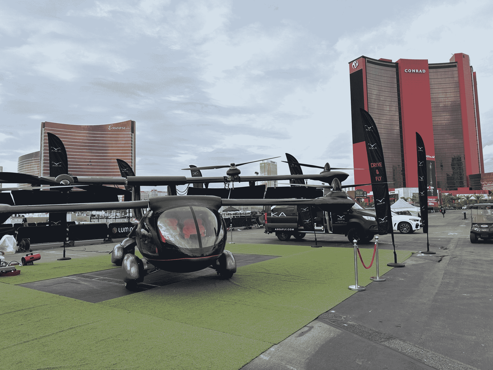

# CES 2023:机器人、宇航员、施瓦辛格和飞行汽车

> 原文：<https://thenewstack.io/ces-2023-robots-astronauts-schwarzenegger-and-flying-cars/>

上周，超过 3200 家参展商在拉斯维加斯会展中心参加了 2023 年的传奇消费电子展。根据大会的网站显示，报道这些参展商的记者*甚至更多——超过 4700 人——因为技术媒体热情地争夺他们一瞥未来事物形状的机会。*

在我们 2023 年的未来社会中，更多的人实际上参加了活动*——甚至是来自外太空的电话会议。(周五，国际空间站的宇航员在接受美国有线电视新闻网商业频道的杰基·沃特斯的特别采访时，与拉斯维加斯会议中心进行了下行连接，令与会者惊叹不已。)*

 *宇航员们展示了他们自己的新技术——更高分辨率的通信带宽。他们的任务？“教育 CES 社区如何在低地球轨道上利用这个独一无二的孵化器，”根据新闻稿[的说法](https://www.issnationallab.org/iss360/astronaut-downlink-ces2023/)。

这都是乐趣和闪光的一部分，这是惊喜和技术的混杂组合，再加上一点表演技巧，让每年的 CES 展有自己独特的眼花缭乱。

以下是一些亮点…

## 飞翔的自由

今年，我们看到了一个所有人都在等待的公告:一辆会飞的汽车。(具体来说，是 ASKA A5。)它的制造商[将](https://www.prnewswire.com/news-releases/aska-unveils-worlds-first-drive--fly-evtol---aska-a5-at-ces-2023-las-vegas-301713240.html)描述为“世界上第一辆可以在公路上行驶，一次充电可以在空中行驶 250 英里的四座电动汽车”的全功能原型(正如其网站[所说，提供“驾驶和飞行的自由”。)](https://www.askafly.com/)

虽然这辆车仍然适合传统的停车位，但它也配备了可以折叠的机翼，之后它可以垂直起飞和降落。

YouTube 频道*飞行汽车新闻* [有该设备](https://www.youtube.com/watch?v=CYFjSnsIudw)运行的镜头，同时该公司还宣布了一项“在主要城市”的按需乘车服务，目标是 2026 年(“须经标准监管批准和认证”)。除此之外，他们还雄心勃勃地预测，他们的产品“在应急响应应用、军事应用以及按需共乘移动服务方面具有巨大的商业潜力。”

但这远不是今年 CES 上唯一令人惊叹的时刻。瑞典坎德拉公司推出了一款价值 39 万美元的电动水翼船，据 CNET 称，“它可以在水面上盘旋，具有完全重新设计的推进系统，可以在水下运行，使安静的航行几乎无声。”或者，正如 CNET 的布里奇特·凯里在一份视频报告中所说，“它真的破解了电力驱动的海上长距离高速旅行的密码。”

[https://www.youtube.com/embed/O3idp_ZvHo4?feature=oembed](https://www.youtube.com/embed/O3idp_ZvHo4?feature=oembed)

视频

## 更好的机器人

亚马逊首次展示了它的滚动“家用机器人”[亚马逊 Astro](https://www.amazon.com/Introducing-Amazon-Astro/dp/B078NSDFSB)——一年多前推出的 999 美元的设备，但仍然只能“受邀才能购买”

[https://www.youtube.com/embed/sj1t3msy8dc?feature=oembed](https://www.youtube.com/embed/sj1t3msy8dc?feature=oembed)

视频

CES 一直是机器人驱动的消费者互动梦想的培育基地——今年的参展商展示了他们的最新尝试。8 月，Ottonomy.io 推出了他们的“Ottobot 2.0”机器人，用于“超本地送货”。(当它滚动时，它前面的显示屏会发出类似“你好，我是奥托波特”的信息。扫二维码，网上购物，门口领取”。)购物者只需举起他们的手机，就可以打开装有他们订购商品的机载“小木屋”——而且还有针对*供应商*的应用程序。

根据周三发布的宣传视频，Ottobot 2.0 在 8 月份发布后，已经在全球 14 个不同的地方提供服务，美联社[报道](https://www.msn.com/en-us/lifestyle/shopping/best-of-ces-2023-wireless-tv-delivery-robots-and-in-car-vr/ar-AA15YVKR)Otto bot 已经在辛辛那提、匹兹堡和罗马的机场提供旅客订购的美味小吃。

[https://www.youtube.com/embed/DDBui8VGvs0?feature=oembed](https://www.youtube.com/embed/DDBui8VGvs0?feature=oembed)

视频

现在，2023 年，他们宣布 Ottobot Yeti，承诺它将“用一种新的自动化分发机制重新发明最后一英里的递送”，以防没有人在周围接收包裹。该公司的网站自豪地宣传其“机器人即服务”模式，宣传材料详细介绍了“Ottonomy 云”，这是其 Otto nomy 车辆软件堆栈的一部分，提供“车队管理”等功能。虽然该公司的宣传视频似乎以展示一个被投递的包裹[错过货架并反弹到地上](https://youtu.be/DDBui8VGvs0?t=75)的戏剧性时刻而达到高潮。

## 机器的崛起

那么阿诺德·施瓦辛格到底为什么会出现呢？宝马公司的首席执行官解释说，因为他已经出现在几部未来科幻电影中，所以“如果你想了解未来，他就是那个人！”施瓦辛格用一种模糊的哲学语调告诉观众，“在我的大多数电影中，机器是敌人，但今天我们已经找到了利用技术作为盟友的方法。”

然后他展示了人类最新的胜利:一辆变色电动*汽车*。

[https://www.youtube.com/embed/00Kw6Q7Nl8Q?feature=oembed](https://www.youtube.com/embed/00Kw6Q7Nl8Q?feature=oembed)

视频

但这只是开始。“电子墨水面板可以让你在汽车的格栅上编程情感化的、类似人类的面孔，”[报道 CNET](https://www.cnet.com/tech/the-most-exciting-futuristic-tech-at-ces-2023/) ，“复杂的人工智能技术能够与你交谈，不像仆人，更像朋友。”他们指出，虽然这只是一辆概念车——也就是说，一辆展示未来技术的一次性原型车——“它的一些功能将渗透到宝马的实际汽车中。”

变色似乎是一个主题。LG 推出了它的变色冰箱 MoodUp。

[https://www.youtube.com/embed/yTix8V58l8s?feature=oembed](https://www.youtube.com/embed/yTix8V58l8s?feature=oembed)

视频

当大众汽车(Volkswagen)展示其即将推出的电动轿车 ID.7 时，它还展示了自己的特殊概念车，这款车的独特喷漆可以发光(这要归功于其 22 种不同油漆部分下方的电子灯)。

虽然这可能不会在客户推出汽车时提供(“到 2026 年”)，但该公司的新闻稿称，灯光秀“象征着大众电动汽车家族未来旗舰车型数字化的下一步。”

演示的其他高科技功能包括语音激活的“智能通风口”，可以更好地冷却或加热汽车内部(甚至可以加热方向盘，这样你的手就不会变冷)。此外，大众[表示](https://media.vw.com/en-us/releases/1721)id . 7“可以检测到司机何时拿着钥匙靠近，并可以在司机进入车内之前，在炎热的夏天开始冷却车内或在寒冷的日子加热车内。”

[https://www.youtube.com/embed/62SG0w0Mhww?start=52&feature=oembed](https://www.youtube.com/embed/62SG0w0Mhww?start=52&feature=oembed)

视频

## 技术符合气候

也许大众只是在展望我们在日益变暖的地球上需要的消费产品。今年的消费电子展采用了这一主题，展示了几种具有环保意识的产品，但《今日美国》的记者[发现了](https://www.usatoday.com/story/tech/2023/01/05/ces-2023-tech-show/10988571002/)一个特别的 21 世纪奇迹:“一种手掌大小的婴儿室内植物，经过生物工程改造，可以捕捉并抑制我们家中最危险的室内空气污染物。”

“植物的未来就在这里，”新植物网站承诺道，认为世界上最强大的技术是——自然。“现在是我们放大它的力量来治愈我们的环境的时候了……”他们网站上的一段视频解释道，调侃他们的第一代转基因植物，“由我们的 20 名科学家团队进行生物工程，以捕获和回收一些最危险的室内污染物。对世界有益，对你的家庭有益。这是一种拥有超能力的超级植物。”(这些植物的起价为 179 美元。)

当然，技术也会对环境造成伤害。iFixit 甚至发布了一个讽刺性的视频，颁发了他们的“ [2023 CES 最差表演奖](https://www.youtube.com/watch?v=iMYqdSSjfjo)”，认为今年的唯一主题似乎是“把一切都扔在墙上，看看有什么棍子。”

有时字面上看，在 Displace Window TV 的情况下，一个 55 英寸的屏幕，根据 [Engadget](https://www.engadget.com/displace-wireless-tv-hands-on-002620453.html) “使用主动循环真空技术将自己吸到位。”《消费者报告》产品可持续发展小组的副主任沙妮卡·怀特赫斯特宣称它是 CES 上最不环保的产品。在 iFixit 的视频中，她解释说，这个电视屏幕的庞然大物仅由四块锂离子电池供电——虽然可以充电，但只能持续一天。

"我想到的真正问题是为什么？"怀特赫斯特问道。"你可以像大多数电视一样，做一个插头！"

[https://www.youtube.com/embed/iMYqdSSjfjo?feature=oembed](https://www.youtube.com/embed/iMYqdSSjfjo?feature=oembed)

视频

但本着真正的 CES 精神，有一个人仍然看好绿色科技的潜力，那就是主持人阿诺德·施瓦辛格。“我经常告诉人们，当涉及到我们的环境时，‘技术将拯救我们所有人’”，施瓦辛格告诉他的听众。

“我们从太阳能和风能的繁荣中看到了这一点，我们从新的电池项目中看到了这一点——我们从漂亮的清洁汽车中看到了这一点！”然后，他祝贺宝马的电动概念车“引领未来”，并“拥抱新技术，而不是与之斗争。”

科技真的能“拯救我们所有人”吗？正如尼奥普兰公司在自己的视频中所说，“当我们允许我们的想象力创造神奇的，非凡的任务变得可以实现。”

但也许阿诺德·施瓦辛格更完整地总结了 CES 的精神，当他[告诉观众](https://www.youtube.com/watch?v=66kiuSU4vUw)“底线是技术可以解决所有最大的问题。它可以改变世界。

“就像你刚刚看到的，这真的非常非常有趣。”

<svg xmlns:xlink="http://www.w3.org/1999/xlink" viewBox="0 0 68 31" version="1.1"><title>Group</title> <desc>Created with Sketch.</desc></svg>*