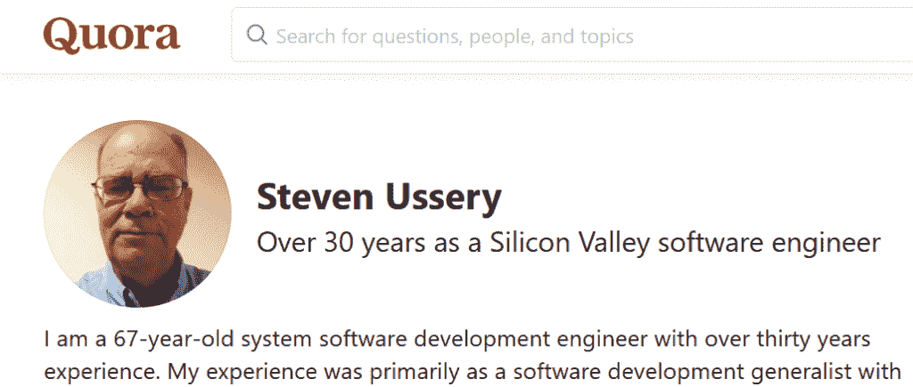

# 挑战编程生涯在 40 岁结束的神话

> 原文：<https://thenewstack.io/challenging-the-myth-that-programming-careers-end-at-40/>

问答网站 Quora 可能已经陷入了一个刻板印象，当一个用户问了一个加载的问题，“[软件开发真的是 35-40 岁后没有出路的工作吗？](https://www.quora.com/Is-software-development-really-a-dead-end-job-after-age-35-40)

但是一些最有说服力的反驳来自 60 多岁的人。

其中一个是[史蒂文·乌瑟里](https://www.linkedin.com/in/steveussery/)，他早在 1989 年就在德克萨斯 A M 大学获得了计算机科学硕士学位——几十年后他仍然在编程，并且热爱他的工作。

“我是一名 65 岁的软件工程师，曾为[苹果](http://apple.com)、 [Adobe](https://www.adobe.com/) 、[易贝](http://ebay.com)、[微软](http://microsoft.com)、 [VMware](https://tanzu.vmware.com?utm_content=inline-mention) 、[思科](http://cisco.com)、 [FileMaker](https://www.claris.com/filemaker/) 、 [XO 通信](https://www.verizon.com/business/xo/)、2Wire、 [Egnyte](https://www.egnyte.com/) 、 [Nexsan](https://www.nexsan.com/) 以及另外两家“在我的职业生涯中，我被解雇过五次。我总能在三到四周内找到另一份工作——即使是在经济衰退时期。”

他多年的经验让他有信心在任何平台上学习任何计算机语言，尽管他现在需要更多的面试来获得一个职位，但工作外包从未阻止过他。“如果你像我一样爱它，除了死亡或健康不佳可以阻止你。所需要的只是一个决心。”

Ussery 的鼓舞人心的答案-发布于 2018 年，当时他在思科担任高级软件开发工程师的顾问-最终传播开来，现在已经获得了近 1500 万次观看和超过 24，000 次投票。

Ussery 不是唯一一个留在游戏中的程序员。他的故事收到了近 500 条评论，包括其他高级程序员的回复。

在这个问题的 400 个答案中，另一个 Quora 用户[分享了他们 66 岁父亲](https://www.quora.com/Is-software-development-really-a-dead-end-job-after-age-35-40)的故事。他刚刚接了谷歌招聘人员的电话，要求他回到公司——在几十年前开始的漫长而充满亮点的职业生涯之后，他在大学里没有上过一门编程课程。

“在谷歌时，他用 Java 编写软件，这种语言直到他 45 岁才被发明出来，”Quora 用户写道。“软件开发的一大好处是，它关乎你的学习热情和执行能力，这一点从我父亲的职业生涯和成千上万其他人的职业生涯中得到了证明。”

最重要的信息可能是，没有什么可以阻止程序员对他们的工作真正的热情。

我们赛里的故事有一个有趣的结尾。2020 年发布的一条更新称，他最终转向了兼职咨询和全职退休(尽管“我仍会编程，可能会在附近的德克萨斯州立大学圣马科斯分校教书。我不会放弃的。我只是进入了一个新的阶段。”)然而，根据[在 LinkedIn 上的简介](https://www.linkedin.com/in/steveussery)，Ussery 的半退休状态只持续了大约 15 个月，直到他接受了另一个职位，成为罗技消费电子产品的 MacOS 开发人员。

## 挑战传统智慧

中年在某种程度上标志着程序员职业生涯的结束，这种错误观念的来源是什么？也许问这个问题是为了表达对衰老更普遍的恐惧。

但这也是偏见和制造神话的沃土。抱怨缺乏优秀人才，[脸书](https://facebook.com)首席执行官[马克·扎克伯格](https://www.facebook.com/zuck)曾有一个著名的推断:“年轻人就是更聪明。年轻人过着简单的生活……简单的生活让你专注于重要的事情。”1996 年，[英特尔](https://www.intel.com/)总裁兼联合创始人 [Craig Barrett](https://www.linkedin.com/in/craig-h-barratt/) [打趣道](https://spectrum.ieee.org/riskfactor/computing/it/an-engineering-career-only-a-young-persons-game)“一个工程师，软件或硬件的半衰期只有几年。”

这是否变成了可怕的“传统智慧”？2012 年[彭博](https://www.bloomberg.com/)发表了[加州大学戴维斯分校](https://www.bloomberg.com/opinion/articles/2012-04-22/software-engineers-will-work-one-day-for-english-majors)[计算机科学教授 Norman Matloff](https://www.ucdavis.edu/) 的一篇观点文章，认为 Barrett 的格言变得太正确了。

Matloff 写道:“近年来，这个行业已经退化为一个缺乏寿命的行业。”。“许多程序员发现他们的就业能力在 35 岁左右开始下降……统计数据显示，大多数软件开发人员在 40 岁时就退出了这个领域。”

但是同一周，信息世界的尼尔·麦卡利斯特对整个前提提出异议，首先挑战马特罗夫使用的“大多数”一词(“如果那是真的，他们去哪里了？是否有一些不合群的程序员，在那里我们把烧坏了的、坏掉的模型优雅地终止，远离他们年轻的兄弟们的视线？还是他们拿到房产证了？”)

相反，麦卡利斯特认为，除了开拓专业领域的中年程序员，还有许多人会继续成为创始人。即使是那些转行做编程承包商的人，在官方统计中也可能被低估。

还有一些人最终跨越了程序员和经理之间的界限。(程序员成为项目经理，或者团队领导身兼两职怎么办？)“毕业到软件开发团队的管理岗位，并不意味着你放弃了做软件工程师。

"然而，根据统计数据的编制方式，它可能看起来是这样的."

虽然年长的程序员可能确实需要更长的时间才能找到工作，但也许这个统计数据并没有告诉我们我们所想的是什么，麦卡利斯特写道:“也许成熟的工人需要更长的时间才能找到新工作，因为他们的标准更高？”

最后，他指出还有广泛的经验证据:他所有的程序员朋友都超过了 40 岁。

他最大的担忧是，错误地描述编程生涯的寿命可能会让这个行业将来需要的年轻程序员望而却步。

## 每天都有新挑战

然而，这个问题一次又一次地出现，以各种形式反复出现。一位 Quora 用户最近问道，40 美元怎么样？“软件开发真的是 40 岁以后就没前途的工作吗？”上个月，格雷戈利·史密斯给出了一个强有力的回答，他写道，1976 年，14 岁的他开始了自己的职业生涯，现在，接近 60 岁的他仍在敏捷前沿公司担任软件工程师/计算机科学家。“不，你 40 岁还没完，”他写道。

[Smith](https://www.linkedin.com/in/devcybiko/) 承认了一个重要的警告。虽然管理课程的排名不断上升，但在编程世界中却没有那么多层级。“一旦你成为技术领导者，你向上流动的选择就会迅速减少。通常，要么是管理，要么什么都没有。”

但这和死胡同不是一回事。一月份，自称软件工程师和科学呆子的罗布·内夫[给出了他自己的简洁答案](https://zeroes-and-ones.quora.com/Is-software-development-really-a-dead-end-job-after-the-age-of-40-Is-40-too-old-to-learn-programming-7?ch=10&share=3ed82015)。40 岁以后软件开发是一个没有前途的工作吗？“当然，如果你认为拥有六位数的薪水和每天的挑战是一份没有前途的工作的话。”"

事实上，问这个问题就是错过了统计数字背后的真正含义，软件开发者[戴尔·古勒奇](https://www.linkedin.com/in/dalegulledge/) [在 1 月](https://www.quora.com/Is-software-development-really-a-dead-end-job-after-the-age-of-40-Is-40-too-old-to-learn-programming/answer/Dale-Gulledge?ch=10&share=10f80618)争辩道:“年纪大的软件开发者没那么多的原因只是因为那时进入这个领域的人少。”

终生编程的唯一缺点可能是，当你的公司不断推出一个又一个新的解决方案时，你无法识别。 [Eric Litovsky](https://www.linkedin.com/in/eric-litovsky-10299130/) ，StreamPC ，[的首席技术官，在二月份](https://www.quora.com/Is-software-development-really-a-dead-end-job-after-the-age-of-40-Is-40-too-old-to-learn-programming/answer/Eric-Litovsky?ch=10&share=b1579f3e)发表了这样一篇文章:“像我这样的老工程师遇到的最大的挫折是新的模式、框架和范例的永无止境的涌入……当每年我们看到解决同样的老问题的新方法时，我们会问自己这有什么意义……？”

但即使是他也看到了持续不断的学习意愿的价值。“然而，有些人从未真正超越他们的热情，我很羡慕他们……这些人在软件开发中茁壮成长，因为对于正确的心态来说，这是一种永无止境的惊奇和敬畏。

“他们不介意投入额外的时间来学习新技术，因为他们真的很喜欢。”

<svg xmlns:xlink="http://www.w3.org/1999/xlink" viewBox="0 0 68 31" version="1.1"><title>Group</title> <desc>Created with Sketch.</desc></svg>