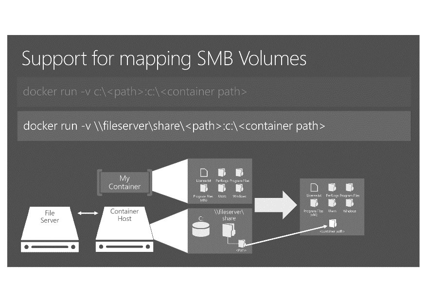
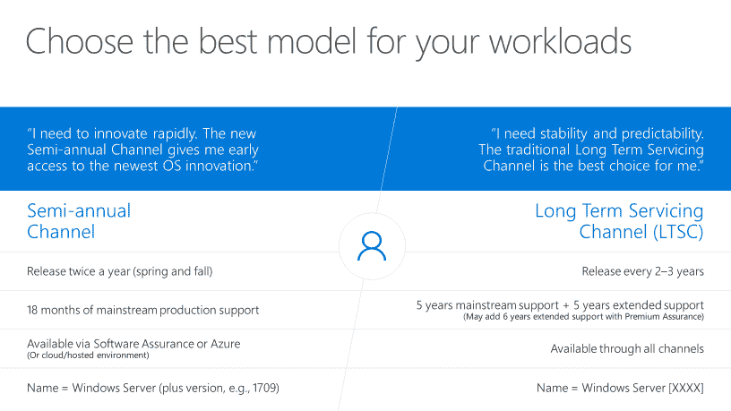

# 微软为容器工作调整纳米服务器

> 原文：<https://thenewstack.io/changes-coming-nano-server-fall-devops-containers/>

当微软[在 Windows Server 2016 中推出](https://blogs.technet.microsoft.com/windowsserver/2015/04/08/microsoft-announces-nano-server-for-modern-apps-and-cloud/) Nano Server 时，作为一款无需本地登录的小型服务器操作系统，它针对的是几种不同的工作负载。该公司发现，该软件越来越多地被用于一种类型的工作负载:管理集装箱。

结果，该公司削减了 Nano Server 的核心，只剩下运行容器所需的组件。它还增加了网络支持，以满足容器编排者的需求，特别是 Kubernetes 和 Swarm。

对于微软来说，[纳米服务器](https://docs.microsoft.com/en-us/windows-server/get-started/getting-started-with-nano-server)是 [Windows 服务器](https://www.microsoft.com/en-us/cloud-platform/windows-server)的心脏；一个最小的重构，Windows Server 的未来版本将在此基础上构建，操作系统“刚好够”运行应用程序，而不会引入不必要的风险。对于客户来说，它被设计为既运行容器又运行一些关键的基础设施角色。

微软企业云产品营销总监 Chris Van Wesep 告诉 The New Stack:“去年秋天我们推出 Nano Server 时，它在计算集群、存储集群和其他基础设施角色中占据的空间非常小，但人们并没有将它用于这些用途，而是将其用于容器。Windows Server 2016 中的匿名遥测显示，“绝大多数的 Nano 服务器部署是针对容器场景，而不是基础设施场景。”

> Nano Server 将包括对 Kubernetes 和 Swarm 等容器编排器的更多平台支持。

这就是为什么将于今年下半年推出的下一版本 Windows Server 从 Nano Server 中删除了那些未使用的基础架构角色，以制作更小的映像。更小的映像意味着更高的密度、更快的启动时间，以及在笔记本电脑上部署足够多容器的能力，以与服务器上的生产环境保持一致，用于开发和测试。

这些角色将在服务器核心中，这是运行 [Azure](https://azure.microsoft.com) 和 [Azure Stack](https://azure.microsoft.com/en-us/overview/azure-stack/) 的地方，也是你用来托管你的 Nano 服务器镜像的地方。Hyper-V 容器也需要服务器核心，而不是纳米服务器

## 更小、更快、更集装箱化

“我们在 Nano Server 上得到的反馈是‘这很好，但还可以更好’”，Van Wesep 解释道。“客户说‘你的容量降到了 500MB 以下，但我想看到 200MB 或 100MB 以下的。”这里需要做一个权衡，我们正在做这个权衡；Nano Server 是一个针对容器优化的运行时映像。"

来自 Windows Server 团队的泰勒·布朗告诉我们，Nano 服务器映像曾经有 1GB，未经压缩。“我们有许多组件实际上与容器无关，但它们与物理机和虚拟机相关，如恢复外壳。它们不是可选组件；它们只是操作系统的一部分，我们无法以容器原生的方式提取出来。”

对于下一个版本，微软已经承诺将未压缩的图像压缩到 500MB，布朗称这是保守的；“我认为我们实际上将在第一版中超过这个数字，我们真的致力于继续沿着这条路走下去。拉入大小、压缩大小和磁盘上的大小都会变得非常非常小。”从长远来看，我们的目标是用[制作一个 Nano 服务器映像。NET Core](https://www.microsoft.com/net/core#windowsvs2017) 在大小上与 Linux 镜像相同。网芯。

这意味着要移除很多组件。“我们正在摧毁纳米服务器，”泰勒说。“我们正在撤出 WMI，我们正在撤出非法移民，我们正在撤出。NET，我们推出了 PowerShell，我们推出了每个驱动程序，我们推出了事件记录器，我们推出了计划任务。”

这可能会破坏工作负载，所以布朗鼓励开发人员加入新的 [Windows Server Insider](https://redmondmag.com/articles/2017/05/11/windows-server-insider-testing-program.aspx) 项目，尽快尝试这种容器优化版本的 Nano Server，这样团队就可以添加任何必要的组件。“我们必须积极进取；愿景是让我们不断删减，尽可能优化。让我们不要害怕，让我们快速前进，把这件事变小。”

曾经是图像一部分的组件现在将是可选的。“如果你愿意，你可以拆掉纳米服务器。网，你拉倒。最重要的是，如果你想要 PowerShell，你可以把 PowerShell 拉下来。如果你不想。网，不一定要有。NET，如果你不想要 PowerShell，你可以不要 PowerShell。这些现在都是可选层，非常适合容器体验。”

Windows Server 1709 将增加对将 SMB 卷映射到容器的支持(归功于微软)

Nano Server 将包括对容器编排器的更多平台支持，如 Kubernetes 和 Swarm。它已经支持网络覆盖，因此您可以跨群集群创建本机桥接网络，但计划于 9 月发布的下一个版本 1709 将添加将命名管道映射到容器中，这意味着您将能够将容器编排器作为容器映像运行，适用于 Docker 和 Hyper-V 隔离容器。

Nano Server 还允许您热添加网络接口；这对 Kubernetes 来说是个问题，它启动一个没有网络适配器的容器，然后将它们添加到容器中。对 Kubernetes 有用的还有 Brown 所说的容器间共享网络接口的“初始支持”；这将与 Nano Server 1709 中的共享内核容器一起工作，但服务器核心中的 Hyper-V 隔离容器直到以后的版本才会得到它。从文件服务器和命名管道映射 SMB 卷将更容易将存储连接到容器，并在容器移动时保持其可访问性。

将 Linux 的 Windows 子系统添加到服务器核心主机(虽然不是 Nano Server)对于处理容器的脚本也很有用。您甚至可以使用 Linux 容器来构建 Windows 容器映像，反之亦然，这为您使用所需的工具提供了很大的灵活性。

## 正在运行 GUI

Nano Server 一直都有一个类似 GUI 的界面。 [Azure 服务器管理工具](https://blogs.technet.microsoft.com/servermanagement/2016/02/09/introducing-server-management-tools/)给了你传统的任务管理器、注册表编辑器、控制面板、性能监视器、磁盘管理、用户和组管理、设备管理器、文件浏览器，甚至通过 web 界面的 Hyper-V 管理。它可以与 Nano Server、服务器核心和具有完整桌面体验的服务器一起工作，一直追溯到 Windows Server 2012，但你需要一个内部网关和一个 Azure 帐户才能使用它。该服务从未退出预览版(因此它从未被生产工作负载支持——预览版是“使用风险自担”)，微软将于 2017 年 6 月 30 日停止提供该服务。

这并不意味着微软认为你不需要一个 GUI 来进行故障诊断。“我们收到了很多反馈，说‘我们认为功能真的很棒，但如果你不强迫我们通过 Azure 返回我们的内部资源，那就太好了，”Van Wesep 告诉我们。他承诺在 9 月份的 Ignite 大会上提供更多关于什么将取代 SMT 的信息，但肯定会有选项。”我们拨通了客户的电话，他们说‘如果你打算继续推出无 GUI 的东西，那么你应该给我们一个好的与他们交互的方式’。"

Nano 服务器和服务器核心都将成为新的半年期渠道的一部分，每年更新两次。你需要软件保障来获得这些更新，或者使用 Azure 或提供这些更新的托管提供商。服务器核心也可作为长期服务渠道(这是您获得 Windows Server 桌面体验的唯一途径)。这是因为 Nano Server 现在瞄准的容器模型仍在发展，新特性将定期出现。

如果你想在自己的基础设施上运行容器和容器编排器，而不是把更新工作交给像 Azure Container Service 这样的云提供商，你需要为定期更新做好准备。

Nano 服务器和(如果你愿意的话)服务器核心将通过半年一次的渠道每六个月更新一次(感谢微软)

Brown 建议，对于开发团队来说，六个月一次的更新比三年一次的大更新工作量要少。“当我们的发布周期很长时，很多东西会发生变化，需要很长时间来验证、认证并投入生产。较短的发布周期应该会容易得多。”他指出，总的来说，开发人员比运行 Active Directory 等基础设施角色的管理员更愿意频繁更新 Windows Server，“只要你给我提供新功能。”

他告诉我们，事实证明，Nano Server 在容器领域非常受欢迎。“我们对容器疯狂地采用了纳米服务器；这些数字高得惊人。”

<svg xmlns:xlink="http://www.w3.org/1999/xlink" viewBox="0 0 68 31" version="1.1"><title>Group</title> <desc>Created with Sketch.</desc></svg>