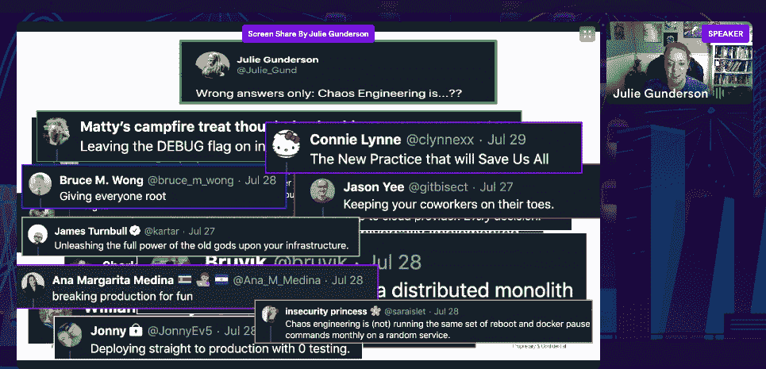

# 混沌嘉年华:为混沌工程培养企业文化

> 原文：<https://thenewstack.io/chaos-carnival-cultivate-a-corporate-culture-for-chaos-engineering/>

“混沌工程是在一个系统上进行实验的学科，目的是建立对系统承受生产中动荡条件的能力的信心，”混沌工程的“[原则”网站解释道。](https://principlesofchaos.org/)

对于我们这些在重复的话语中长大的人来说，这是一个非常令人不安的概念:如果它没有坏，就不要修理它。没有什么比“在系统上做实验”更让安全性、法规遵从性和首席管理人员感到恐惧的了

混沌工程是关于在越来越不可靠、不可预测的分布式系统中增加可靠性。我们知道这不是关于事情是否会发生，而是关于什么时候发生。那么，我们可以提前从我们的系统中学到什么呢？

尽管如此，你还是需要尽早令人信服地向你的工程师传达混沌实验的价值，因为它几乎总是占用他们正常工作的时间。

由云原生数据平台提供商 [MayaData](https://mayadata.io/?utm_content=inline-mention) 组织的本月 [混沌嘉年华](https://chaoscarnival.io/) 活动中的许多演讲触及了混沌工程的文化层面，这一切都是有道理的。

## **混沌心理学工程**

事故分析软件提供商 [Jeli](https://www.jeli.io/) 的首席执行官和创始人诺拉·琼斯写道:“混沌工程是关于在出现意外的系统结果时建立一种弹性文化，”她也是关于这个主题的 [O'Reilly 书](https://www.oreilly.com/library/view/chaos-engineering/9781492043850/) 的合著者。

对她来说，工具只是达到目的的手段，以支持这个目标。混沌工程实际上是关于形成一种实验文化。

[Julie Gunderson](https://twitter.com/julie_gund)，DevOps 在 [PagerDuty](https://www.pagerduty.com/?utm_content=inline-mention) 的倡导者，通过警告混沌工程不是混沌，而是更多地试图为混沌时代做准备来开始她的演讲。

“混沌工程不是要打破东西。这不是试图找出我们如何让事情失败。或者工程混乱。或者过程不可预测，”她说。

她说，它总是遵循相同的过程，即围绕稳态行为中可测量的输出创建一个假设，然后通过实验证明它们是如此。

“混沌工程是了解更多信息的有效工具。有弹性的组织总是在学习，”她说。

围绕混沌工程的一个神话是混沌实验必须在生产中进行，但是，正如冈德森所说，并不是所有的系统都是为此而建立的。试运行永远不会和生产一样，所以，是的，在生产中测试总是更好，但它有风险。

而且就像冈德森说的，提到 [五个九或者 99.999%的正常运行时间](https://en.wikipedia.org/wiki/Five_nines) 的目标，那 0.001%的用户上还是有人类的。对于许多高层来说，一开始就在生产中进行测试是一件困难的事情。

“你需要设计你的实验，有一个假设，你还必须考虑组织文化，但在某些时候，你必须跳进去——无论是在筹备阶段还是在生产阶段，”她说。

Gunderson 提供了微软如何发布软件的例子，创建了一个同心环形爆炸半径:

1.  从事产品工作的人
2.  微软的其他团队
3.  然后整个微软
4.  只有那时消费者

“随着他们了解得越来越多，软件正在发布，他们能够扩大爆炸半径，”她解释道。

当你开始控制生产中的混乱时，也许只对百分之一的用户进行测试。

“我们必须记住，我们有使用我们产品的用户。”她说，“有人今天过得很糟，而且可能会过得更糟。”

冈德森说，即使在运行混沌测试七年后，PagerDuty 仍然致力于激励人们参与和拥抱混沌工程。

为了充分利用时间，测试团队有一个一小时的会议来提前计划将引入哪些故障，并且为了降低风险，他们确保提前通知团队中的每个人。重要的是要认识到，在你注入变革的同时，你的同事也在努力做他们的工作。

冈德森说:“这不是让人们习惯有压力的情况——要透明——你的发病反应小组需要知道实验正在进行。”

## **混乱和白天的工作**

混沌平台提供商 [Gremlin](https://www.gremlin.com/?utm_content=inline-mention) 的开发者倡导者 [杰森·易](https://twitter.com/gitbisect)在另一次谈话中说，在许多组织中，仍然存在如何平衡混沌工程与特性开发的问题。

“有人抱怨说，每周有两个小时，他的团队不是在工作，而是停下来计划、安排一个比赛日并分析结果。另一个人抱怨说，他们从第一个比赛日就有太多的吉拉门票，可以填满整个冲刺阶段，”Yee 说。

他将混沌实验的障碍分为三个方面:

1.  没有时间 —你希望组织中的每个人都关心可靠性，但是每个人每周花两个小时是很长的时间
2.  **缺少流程** — Yee 意识到他们需要定义良好的自动化流程，如 [消防栓](https://firehydrant.io/blog/announcing-runbooks/) 、 [无可指责的](https://www.blameless.com/resources/runbook-for-among-us) 、[run deck](https://www.rundeck.com/new-to-rundeck)——以及加快一切的文档。
3.  **缺乏优先权**–比赛日通常会导致高优先权门票。您如何将这个新的计划外的工作包含到您现有的 sprint 周期中，而不偏离计划的工作，并且不影响交付日期？

Yee 的团队决定了一个尽可能使游戏时间最有效的过程。

他们决定轮换工程师，使用“水冷器” [甜甜圈松弛 app](https://www.donut.com/) 。Gremlin 对此进行了调整，每次自动创建三名工程师的小组，确保每个工程师都有机会参加迷你游戏日。Donut 会记录所有空闲的时间段，并自动为它们设置缩放调用。

他们还创建了一个谷歌表单，里面有混沌实验的所有步骤——边走边填。最后，有一个建议实验的部分，下一个团队可以使用。

最后，他们必须做出选择，在不影响产品时间表的同时，给工程师留下有影响力的感觉。他们会问:你能做的对可靠性影响最大的一件事是什么？小型混沌团队通常可以在当前的 sprint 中完成。

Yee 说，当你推出混沌工程时，它永远不会是完美的，你会遇到一些阻力。为了获得更广泛的工程支持，并使其不太昂贵，保持混乱简洁是很重要的。然后你可以开始自动化它。清晰的流程和自动化使执行和报告变得更加容易。

## **混乱伴随信念而来——插图**

[卡尔·切瑟](https://twitter.com/che55er) 是一家大型医疗 IT 公司 [Cerner Corporation](https://www.cerner.com/) 的首席工程师，这家公司确实需要保证正常运行时间。

他的“小心混沌”演讲集中在如何启动和发展混沌实践，将其与其他工程实践和系统安全结合起来。

Chesser 说，大多数工程师都有这样的习惯，想通过炫耀闪亮的新工具来开始任何事情。相反，他说你应该从“为什么”和“你希望实现什么”开始。你试图在你的系统中建立信心和理解。您致力于了解您的系统和团队。

他说，你必须尽早意识到你需要购买你的混沌实验的大量人群。非常重要的一点是解释为什么，然后提出一个计划，表明你真的考虑清楚了。如果你有变化，你不希望它看起来是随机的。

Chesser 继续说，如果你不确定他们会如何反应，准备一个计划好的实验，只让某些可能受到影响的团队参与——并邀请其他任何想尝试的人。

切瑟说，首先要问工程师们他们真正关心的是什么。如今，大多数软件都处于不断进化的模式中，向新技术迁移或者向系统中引入新的东西。这成为你已知的未知。您的团队可能已经想到了这些:

*   你想了解那个系统的什么？
*   你担心已经存在的我们的明确关注和依赖是什么？
*   我们对系统的哪些部分了解最少？

通过计划你的实验并传播这些计划，它可以帮助确定必要的先决条件。这些人可以是能够帮助你获得非常有效和快速的反馈的人，也可以是知道如何从数据库中获得遥测数据的人。

如果你不知道如何简单地测量一个系统，你就无法知道它是如何工作的。这就是可观察性工具的重要性。你要填补任何遥测空白，这样你就不会浪费任何时间，而不是从你的实验中学习。

通过扩大关于您的系统的经验教训，您还可以帮助每个人——甚至是那些没有扔便便的人——以一种新的方式了解您的系统，以便更快地发现问题。你也学会了更好地解释你的遥测数据——如果你看这里，你也应该把这看作一个信号。

Chesser 提醒观众，复杂的法规遵从性在生产环境中发挥着重要作用。法规遵从性方面的主题专家是你想拉进来设计和运行这些实验的人——否则，他们会成为永远不在产品中运行测试的借口。

此外，要接受实验可能变得太大的想法。倒回去。写下你学到的东西，然后重新组织，分解成其他实验。Chesser 提醒我们，当你介绍一个实践时，不要认为你不会有后续行动。准备好惊喜吧。

然后，当事情实时出错时，你总是可以指出混沌实验是你能够如此快速恢复的原因。然后，领导层也开始接受。

<svg xmlns:xlink="http://www.w3.org/1999/xlink" viewBox="0 0 68 31" version="1.1"><title>Group</title> <desc>Created with Sketch.</desc></svg>