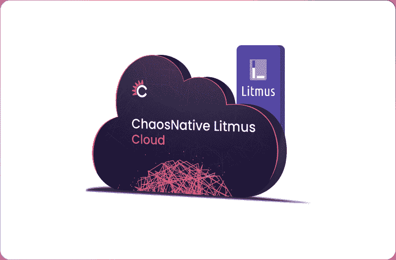

# 云原生的混沌工程

> 原文：<https://thenewstack.io/chaos-engineering-for-cloud-native/>

 [乌玛·穆卡拉

乌玛是 ChaosNative 的 CEO，也是 LitmusChaos 项目的维护者。](https://www.linkedin.com/in/uma-mukkara/) 

在当今的电子商务世界中，无论是运营、业务还是产品工程团队，保持客户、获得客户和满足客户都是管理的重中之重。服务可靠性是您业务成功的关键。虽然这是显而易见的，但服务可靠性近来变得更加重要。原因很简单:越来越多的人正在使用数字服务，企业已经变得以数字为中心。这种数字化转型是我们看到服务器管理员、数据库管理员和网络管理员成为站点可靠性工程师(SREs)的原因之一。向微服务和应用容器化的转变也推动了这一转变。

数字化转型使服务可靠性成为一项关键的业务需求

## 什么是服务可靠性？

最常见的答案是:没有中断或很长的正常运行时间。然而，我们都知道在某些时候停机是不可避免的。因此，服务可靠性实际上就是减少停机。此外，服务会不断升级，因此升级期间服务可用性的连续性也是一项关键要求。如果您认为服务中断最终是不可避免的，那么考虑服务可靠性的最佳方式是创建一个当服务中断发生时业务影响最小的情况。服务中断不应该经常发生，但是一旦发生，快速恢复有助于最大限度地减少对用户体验的损害。

服务可靠性

服务可靠性取决于多种因素，例如应用程序稳定性、规模性能、负载性能、底层基础架构以及应用程序承受提供服务所涉及的多个组件中任何一个组件出现故障的能力。

## 原生云面临的挑战

它正在向云原生迁移。在一个[云原生](https://github.com/cncf/toc/blob/main/DEFINITION.md)环境中，有很多移动的部分。当您在 cloud native 中构建服务时，您将拥有许多方便使用的基础设施和中间件软件组件。云原生服务与传统服务之间的主要区别在于，使用云原生服务，您将处理更多组件，有时是数倍于此的组件，其中每个组件都经过独立的良好测试并被缝合在一起。那么，这对服务可靠性有什么影响呢？您可能会认为这些服务自然更可靠，因为有经过良好测试的微服务，但您会惊讶地发现，事实往往并非如此。原因是，当相关组件出现故障时，运行服务的主应用程序可能无法正常工作。

云原生和可靠性

如上图所示，在 cloud native 中，定义服务的应用程序只占整个堆栈中代码的 10%。该应用的可靠性要求堆栈的其余部分保持稳定，并在出现故障时协同工作。堆栈中发生的任何故障或多个故障都不应损害服务可用性。这定义了你的服务可靠性有多好。

对云原生环境中的服务可靠性有贡献的另一个因素是云原生开发运维中的变化速度。持续集成/持续部署(CI/CD)系统的容器化和进步，以及组织对更快发布的推动，是微服务发布时间频繁的部分原因。他们已经从每季度一次转变为每月一次，每周一次，有时一周多次。这意味着您正在更快地发布代码，并且您的服务中的依赖代码也在经历持续的升级。在 cloud native 中，某些东西总是在升级。这使得很难确保服务可靠性保持在期望的水平。

以上两个方面说明了云原生对服务可靠性的需求。幸运的是，如果你投资一种被称为混沌工程的结构化方法，服务可靠性肯定可以实现。混沌工程现在比以往任何时候都更加重要。虽然混沌工程的根源可以追溯到 2011 年，但只是在过去几年里，它才变得突出，主要是受云原生服务部署变得越来越普遍的推动。

## 混沌工程 101

简而言之，混沌工程是关于收集、设计、实现、编排和扩展各种应用程序和服务基础设施中的错误。它是关于以可控的方式设计服务的错误，以验证服务的弹性并发现任何弱点。混沌工程已经以许多其他形式被考虑和提倡——在生产中测试，在生产中中断，等等。但对我来说，它是围绕混沌的工程；这是一个连续的过程，所有工程原理也需要应用于混沌。

在 Ops 或 DevOps 中采用混沌工程有些犹豫，这是意料之中的。毕竟需要破事。然而，一个新的思想流派是从一开始就开始混乱:将它视为您的服务构建的一部分，因此它嵌入到您的交付流程或 DevOps 中。云原生开发运维的一些新实现将混沌工程视为其测试或 CI/CD 的结构性和不可分割的一部分。随着更多成功故事的出现，这种情况将变得越来越普遍。

所以，让我们再一次定义混沌工程，但是是技术上的。混沌工程是设计一个断层和一个稳态假设，策划这个断层并验证这个稳态假设的科学。稳态定义及其验证有时比引入故障更重要。稳定状态的定义可能会因团队不同而略有不同，并且会根据负载条件和服务的其他状态变量而不时发生变化。最简单的方法是将稳定状态与当时的服务级别目标(SLO)相关联，并对它们进行验证。换句话说，混沌工程也可以被认为是在随机故障注入相关应用程序或服务基础设施的情况下对 SLO 的连续验证。

混沌工程

## 云原生混沌工程 101

我们已经讨论了在 cloud native 中对混沌工程的需求，并从一开始就考虑它，而不是事后才考虑。现在让我们来讨论如何在云原生中更有效地实践混沌工程，我称之为“云原生混沌工程”或 CNCE。云原生定义包括一些强制性原则，如要求声明性配置、灵活、可扩展、跨多个云、使用声明性 API 等。当你实践云原生混沌工程时，所有这些原则被广泛应用。在过去的三年里，我们一直倡导将以下内容作为云原生混沌工程的原则。

### 云原生混沌工程原理

云原生混沌工程原理

### 开放源码

云原生社区和技术一直围绕着开源。混沌工程框架本质上是开源的，有利于围绕它们建立强大的社区，并帮助它们变得更加全面、坚固和功能丰富。

### 作为积木的混沌实验

混沌实验需要简单易用、高度灵活和可调。混沌实验必须坚固耐用，很少或没有机会导致假阴性或假阳性。混沌实验就像乐高积木:你可以用它们来构建有意义的混沌工作流。

### 可管理的混沌实验和 API

混沌工程必须采用众所周知的软件工程实践。随着越来越多的团队成员参与进来，越来越多的变化频繁发生，以及需求的改变，管理混乱的场景会很快变得复杂。升级混沌实验变得普遍。混沌工程框架应该能够以一种容易和简单的方式管理混沌实验，并且应该以 Kubernetes 的方式完成。开发者和运营者应该把混沌实验当成 Kubernetes 的客户资源。

### 通过 GitOps 扩展

就显而易见和简单的问题而言，先从唾手可得的果实开始。当你开始修复它们时，混乱的场景会变得更加广泛和庞大；混乱场景的数量也在增加。混乱场景需要自动化，或者需要在服务的应用程序发生变化时触发。当应用程序或混沌实验发生配置更改时，可以使用 GitOps 周围的工具来触发混沌。

### 开放可观测性

在解决与可靠性相关的问题时，可观察性和混沌工程是相辅相成的。有许多可观测性栈和系统得到了很好的开发并付诸实践。混沌工程的引入不需要新的可观测系统。相反，混沌工程的背景应该很好地适应现有的系统。为此，来自引入混沌的系统的混沌度量被导出到现有的可观测性数据库中，并且混沌的上下文被绘制到现有的仪表板上。

## Litmus 是为云原生构建的

LitmusChaos 以上面提到的云原生混沌工程原则作为其基础架构目标。Litmus 是一个完整的混沌工程框架，作为云原生应用程序构建。你可以用它来无缝地构建、协调和扩展混沌实验。Litmus 附带了一系列现成的混沌实验，托管在一个名为 [ChaosHub](https://hub.litmuschaos.io) 的开放中心。这些实验构成了 Litmus 工作流的基础，可以与您的实际混乱场景进行密切对比。sre、QA 和开发人员合作构建所需的 chaos 工作流，并使用 GitOps 协调它们以进行扩展，以及在部署的配置更改时触发 chaos。

石蕊概述

## 混沌工程变得简单

LitmusChaos 很容易在 Kubernetes 集群或名称空间上部署。Litmus 作为 SaaS 托管在混沌石蕊云中，并附带一个永远免费的计划。在 [litmuschaos.cloud](https://litmuschaos.cloud) 注册，快速开始混沌工程，或者按照 Litmus 文档在您自己的 Kubernetes 集群上安装 Litmus。

云上的石蕊

## 混沌工程社区会议

ChaosNative 主办了一个名为 ChaosCarnival 的年度混沌工程会议。全球混沌工程专家、爱好者和从业者在此会议上发言，分享他们的经验、最佳实践和成功故事。[免费注册](https://chaoscarnival.io)获取会议最新消息。

<svg xmlns:xlink="http://www.w3.org/1999/xlink" viewBox="0 0 68 31" version="1.1"><title>Group</title> <desc>Created with Sketch.</desc></svg>