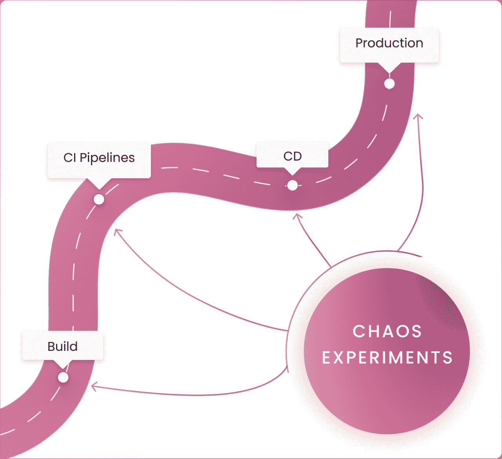
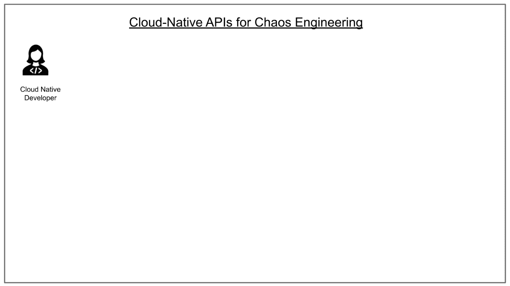
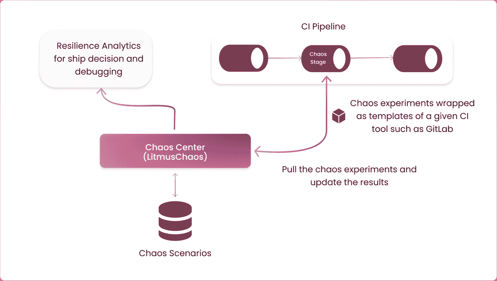
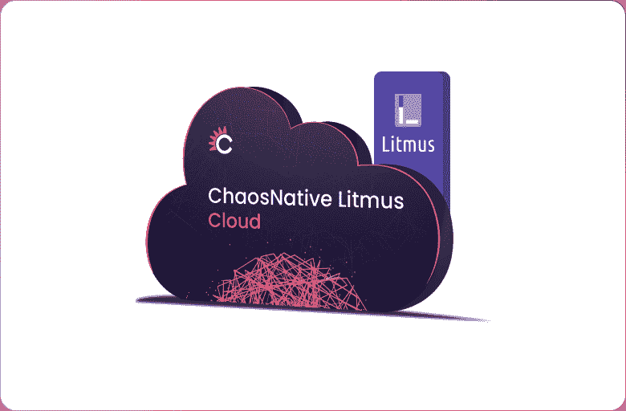

# 混沌工程不仅仅是为了行动

> 原文：<https://thenewstack.io/chaos-engineering-is-not-just-for-ops/>

 [乌玛·穆卡拉

乌玛是 ChaosNative 的 CEO，也是 LitmusChaos 项目的维护者。](https://www.linkedin.com/in/uma-mukkara/) 

当我们想到混沌工程时，我们首先想到的是 ops 和站点可靠性工程师(SREs)。许多人还说，这是为了一些像谷歌和网飞这样管理高度规模化业务的 sre。尽管混沌工程最初是作为大规模解决未知问题的解决方案，但近年来它已经发展成为一个完全不同的实践领域。除了 ops 之外，它现在开始在持续集成/持续交付(CI/CD)中发挥主要作用，并作为改善[开发人员体验的辅助手段](https://youtu.be/KGbw2c40q9Q?list=PLj6h78yzYM2Nd1U4RMhv7v88fdiFqeYAP&t=823)。混沌框架开始出现在必备开发工具的列表中。

在本文中，我们讨论了混沌工程在提升云原生开发者体验中的作用。

在[云原生计算](https://en.wikipedia.org/wiki/Cloud_native_computing)中，应用程序应该是弹性的、松散耦合的、可伸缩的、可管理的和可观察的。因为容器化，微服务激增，出货很快。微服务环境更加动态。在这样的环境中，使应用程序具有弹性意味着以容错方式部署应用程序，但也意味着构建应用程序来承受依赖(上游/下游)服务上发生的故障，并继续采取适当的措施来防止这种故障的发生。同样，质量保证团队应该涵盖 CI 和 CD 流程中要涵盖的所有故障场景。最终，ops 团队必须通过实践混沌工程来继续测试服务在生产中的弹性。持续验证可以而且应该在产品生命周期的所有阶段进行。

## **开发者的混沌工程**

云原生开发者在开发[微服务](https://blog.codinghorror.com/curlys-law-do-one-thing/)时遵循 Curly 定律。这实现了模块化和更快的应用交付，但也需要在代码中创建一组定义良好的条件来处理各种微服务故障、API 响应和 Kubernetes 等底层平台。虽然 Kubernetes 在实现微服务架构方面发挥了重要作用，但它也带来了开发人员应该了解的某些假设。例如，pod 被逐出或在节点间移动的频率是 ESX 集群中虚拟机移动频率的数倍。在一个可扩展的环境中，pod 驱逐可能随时发生，这取决于负载条件和其他环境因素，但是服务应该继续正常工作。

在开发过程中可以执行大量的混沌测试，以针对 Kubernetes 故障和常见的云原生基础架构应用程序故障建立弹性。LitmusChaos 是一个云原生应用程序，它提供了实践端到端混沌工程的所有能力。它的混沌实验本质上是声明性的，云原生开发者可以以云原生的方式添加或执行混沌实验。Litmus 的核心在 chaos CRDs(自定义资源定义)的基础上运行，这使得云原生开发者对 chaos 的实践变得非常自然。

## **CI 中的混沌工程**

云原生 CI 渠道对 QA 团队提出了额外的要求。他们需要根据云原生平台功能(如 Kubernetes)的各种特性来测试应用程序。Kubernetes 环境可能会出现各种故障，例如在 pod、节点和服务级别。在一个集成了混沌的 CI 管道中，除了特定的应用程序故障之外，混沌实验还被设计为覆盖 Kubernetes 和其他云原生堆栈组件的所有故障场景

除了能够针对各种不同的场景轻松地执行混沌实验之外，质量保证团队还可以从一个构建到另一个构建测量应用程序的弹性度量的性能。Litmus 就是这样一个工具，它可以很容易地将弹性度量与不同版本的被测系统的混沌运行进行比较。

此处提供了几个如何从 CI 平台(如 GitLab)轻松调用 Litmus chaos 实验的示例[。类似地，Litmus 用户在其他 CI 平台上调用混沌实验，如 GitHub Actions 和 Jenkins。](https://github.com/litmuschaos/gitlab-remote-templates)

## **CD 中的混沌工程**

现代 CD 平台基于服务级别目标或 SLO 验证运行。SLO 旨在验证服务的功能性、稳定性和弹性是否如预期那样工作。混沌实验被选择来执行 CD 流水线上的简单和多级故障。它们通常被用作在后续环境(如生产前环境和生产环境)中部署的控制机制。执行混沌实验，并在此期间测量 SLO。在目标环境上升级应用程序之后，立即执行混沌实验以验证服务的持续弹性也是一种常见的做法。Litmus 项目集成了一些 CD 平台，如 [Keptn](https://github.com/keptn-sandbox/litmus-service) 、 [Spinnaker](https://www.armory.io/blog/litmuschaos-in-your-spinnaker-pipeline/) 和 [Gitlab](https://dev.to/uditgaurav/litmuschaos-gitlab-remote-templates-6l2) 。Litmus 还通过 GitOps 为 ArgoCD 和 FluxCD 提供 CD 集成。

总之，混沌工程和 Litmus 等工具可用于开发环境、CI 管道和 CD 管道，以持续验证一个应用程序、一组应用程序或一项服务的弹性。这建立了对 DevOps 的信心，并防止复杂和昂贵的错误泄漏到生产中。

## 混沌工程变得简单

LitmusChaos 很容易在 Kubernetes 集群或名称空间上部署。Litmus 作为 SaaS 托管在混沌石蕊云中，并附带一个永远免费的计划。在 [litmuschaos.cloud](https://litmuschaos.cloud/) 注册，快速开始混沌工程，或者按照 Litmus 文档在你自己的 Kubernetes 集群上安装 Litmus。

 

## 混沌工程社区会议

ChaosNative 每年都会举办一次名为[chaos cannival](https://chaoscarnival.io/)的混沌工程大会，全球的专家、爱好者和从业者在这里分享他们的经验、最佳实践和成功案例。[免费注册](https://chaoscarnival.io/)获取会议最新消息。

<svg xmlns:xlink="http://www.w3.org/1999/xlink" viewBox="0 0 68 31" version="1.1"><title>Group</title> <desc>Created with Sketch.</desc></svg>