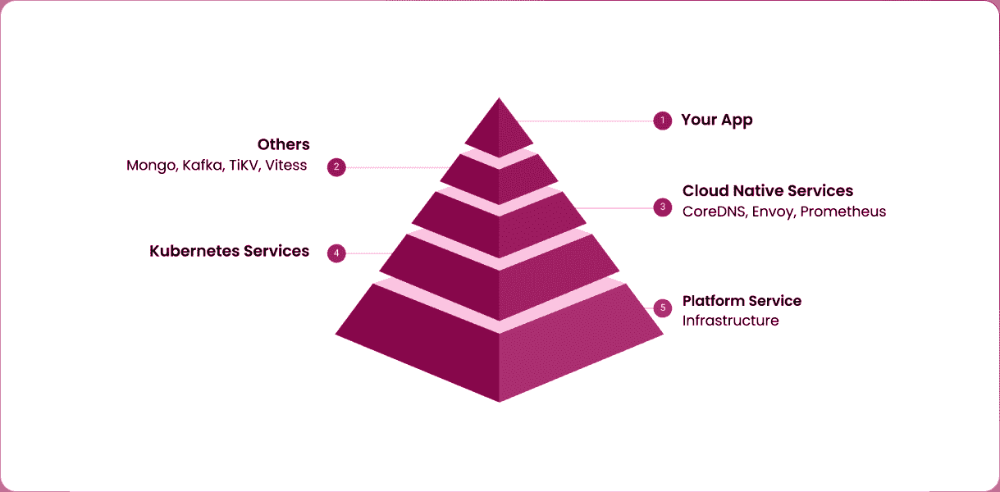
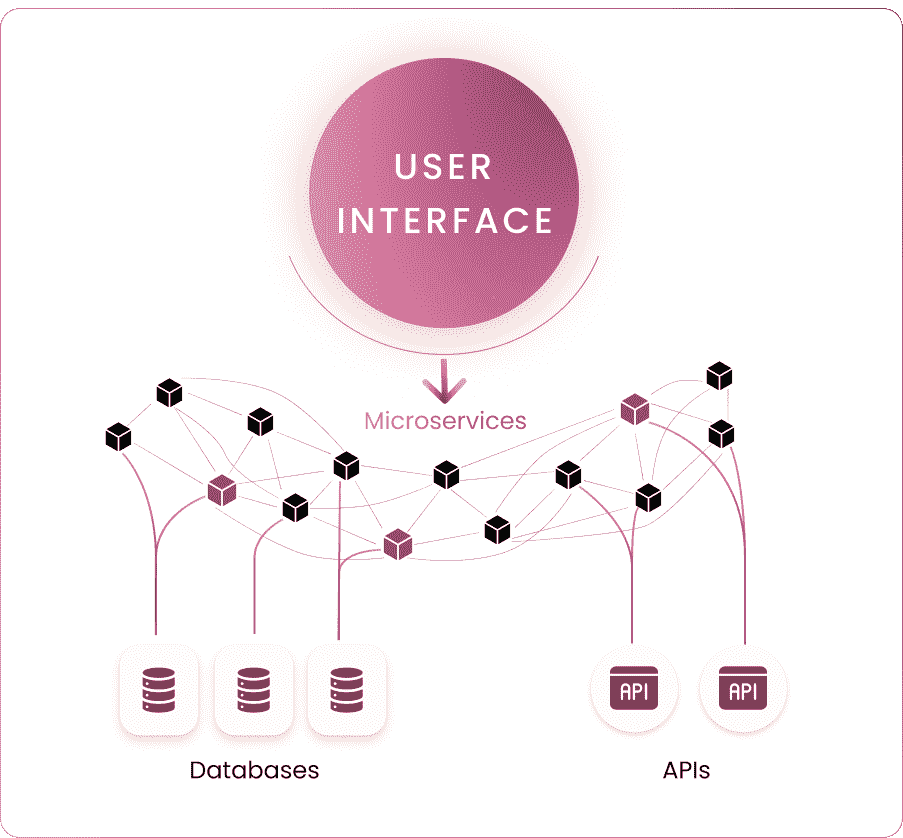
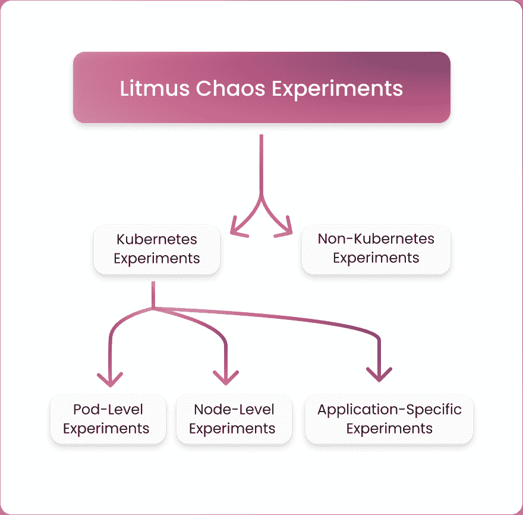
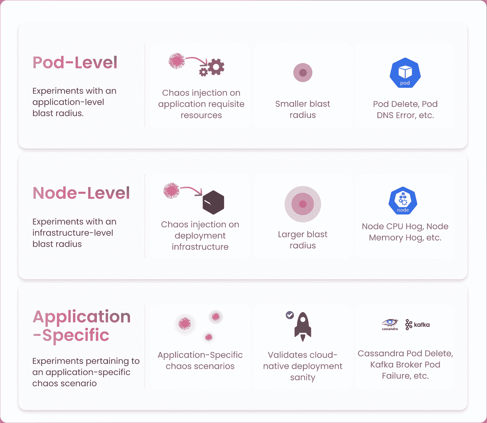
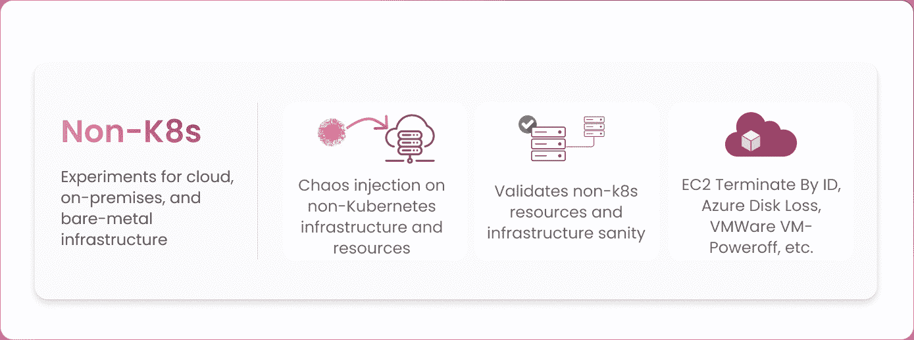
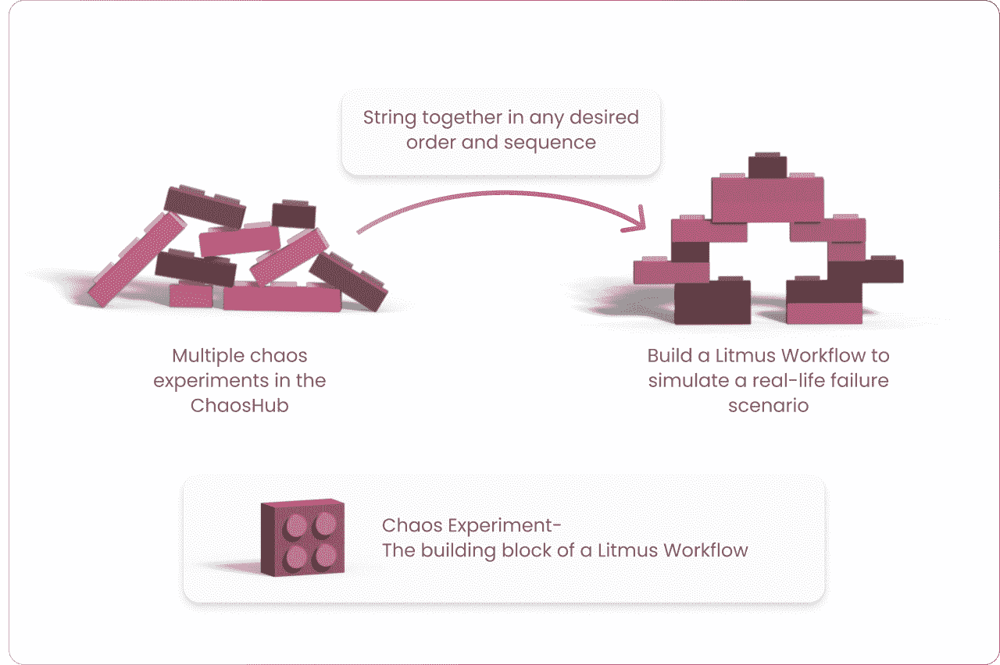
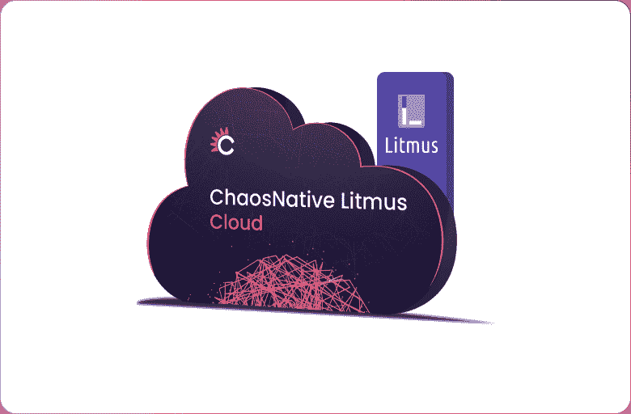

# 混沌工程变得简单

> 原文：<https://thenewstack.io/chaos-engineering-made-simple/>

作为一门学科，混沌工程已经使许多组织将优先考虑弹性的文化灌输到他们服务的每一个方面。在 DevOps 生命周期中尽可能早地测试和解决问题是每个工程团队坚持的一项关键实践，因为即使是一个单一的故障也可能导致整个服务不可用，并造成不可挽回的损失。混沌工程有助于在这些危险问题导致生产失败之前发现它们。

每个混沌工程实践的基石都是由混沌实验构成的，这些实验有助于假设某种可能对任何服务产生不利影响的故障。强调正确的实验总是至关重要的，以模拟可能影响目标服务的真实故障场景。在这个过程中，一个非常重要的考虑是，您的分布式系统是几个依赖服务的组合，所有这些都有助于您的服务的弹性。

> 成功的混沌工程实践者逐渐掌握了在个案基础上构建每个混沌实验的技能，以利用每个实验的最大结果。

## 云原生弹性

向云原生技术的转变使得开发更易管理、可扩展和可靠的应用成为可能，但同时也给关键服务带来了前所未有的活力。这是因为必须单独管理大量共存的云原生组件。即使是单个微服务的故障也会导致其他服务的级联故障，从而导致整个应用部署崩溃。

因此，对于您的混沌工程实践来说，在目标环境中遵循云设计、编排和分析混沌的原生方式是至关重要的。更确切地说，[cloud native chaos engineering](https://thenewstack.io/chaos-engineering-for-cloud-native/)确保负责整个应用程序正常运行的每个组件都具有弹性，能够承受现实生活中的动荡条件。这需要在整个应用程序的规模上编排混乱，而不是特定的微服务。因此，获得一组不同的混沌实验是至关重要的，这些实验可以针对应用程序的各个方面。这包括将分配的资源、软件堆栈和底层基础设施作为所有可能的业务用例的目标。

## 混沌实验的试金石套件

 [尼兰詹·曼娜

Neelanjan 是 ChaosNative 的一名软件工程师。他是 CNCF LitmusChaos 项目的贡献者，这是一个用于在云本地环境中实践混沌工程的混沌编排框架。](https://www.linkedin.com/in/neelanjan00/) 

[LitmusChaos](https://litmuschaos.io/) 创建的主要目标是以云原生方式执行混沌工程，根据云原生规范对其进行扩展，管理混沌工作流的生命周期，并从云原生角度定义可观测性。

[混沌实验](https://litmuschaos.github.io/litmus/)使用简单的声明性清单，通过将混沌注入目标资源来帮助实现这个目标。这些 Kubernetes 自定义资源(CR)清单允许对实验进行灵活的微调，以产生所需的混沌效果，并控制实验爆炸半径，以免伤害环境中的其他资源。每个混沌实验都确保安全的混沌回滚，以便在混沌间隔之后将目标资源恢复到它们的原始状态。

有超过 50 个石蕊混沌实验，可以大致分为两类:

1.  库伯内特实验
2.  非 Kubernetes 实验

Kubernetes 实验可以进一步分为:

1.  豆荚级实验
2.  节点级实验
3.  特定应用实验

Pod 级实验通常会剥夺应用程序的一些相关资源，如 CPU、内存、网络、IO 等，从而给应用程序级带来混乱。一些例子包括 pod 删除、pod DNS 错误等。

节点级混沌实验的目标是底层的 Kubernetes 部署基础设施。它们往往具有更大的爆炸半径，并影响部署在 Kubernetes 集群上的多个应用程序。一些例子包括节点 CPU 占用率、节点内存占用率等。

特定于应用的实验呈现了与部署在云本地环境中的给定应用相关的故障场景，例如 Cassandra pod 删除实验、Kafka broker pod 故障等。

非 Kubernetes 实验通常针对公共云基础架构资源，如 AWS、Azure 和 GCP、内部 VMWare 基础架构甚至裸机服务器。非 Kubernetes 混沌实验尤其有助于验证整个应用程序的弹性，即使您的云原生服务与作为传统技术堆栈一部分的现有关键服务共存。示例包括 EC2 按 ID 终止、Azure 磁盘丢失、VMWare 虚拟机断电等。

Litmus chaos experiments 还支持 BYOC(自带混沌)，它允许您集成任何第三方工具来执行故障注入。它们还可以与[石蕊探针](https://docs.litmuschaos.io/docs/concepts/probes/)配对，在混乱间隔之前、期间和之后自动验证资源状态。

混沌实验作为[混沌工作流](https://docs.litmuschaos.io/docs/concepts/chaos-workflow/)的构建单元，它以任何期望的顺序和序列将多个混沌实验串在一起，以将失败注入多个资源。这允许简单地使用 [ChaosCenter](https://docs.litmuschaos.io/docs/getting-started/resources#chaoscenter) web UI 来创建复杂的、真实的故障场景，这些场景涉及作为单个工作流一部分的整个应用程序的几个不同方面。可以把混沌实验想象成封装了特定目标资源的失败条件的乐高积木。这些乐高积木可以灵活地以任何所需的顺序排列，以形成混沌工作流，这是一个为验证您的特定服务级别目标(SLO)需求而定制的故障场景聚合。

你也可以使用 [Litmus SDK](https://dev.to/ispeakc0de/getting-started-with-litmus-sdk-358l) 轻松定义你自己的混沌实验。这提供了一种简单的方法，通过基于给定的实验信息创建不同的必需工件来引导您的混沌实验。因此，它简化了混沌实验的开发过程，开发人员只负责添加实验的业务逻辑。Litmus SDK 可用于 Golang、Python 和 Ansible，这允许开发人员以他们喜欢的任何语言开发他们的混沌实验。

Litmus 还拥有 [ChaosHub](https://hub.litmuschaos.io/) ，这是一个开源市场，托管 Litmus 提供的所有不同的混沌实验，以简化发现、微调和执行混沌实验的过程。你也可以拥有自己的私人 ChaosHub，这有助于为一个不属于开源 ChaosHub 的组织维护定制的混沌实验。

## 摘要

LitmusChaos 项目的基本目标之一是大规模开创云原生混沌工程，Litmus 的混沌实验也是基于同样的愿景。在一个整个应用堆栈和架构都在以小时和分钟的速度升级以获得急需的竞争优势的世界中，云原生混沌工程承诺为每个组织提供弹性服务。Litmus 继续发展，试图进一步丰富其 Kubernetes、云基础设施和应用程序定向混沌实验的混沌实验列表，同时开拓其混沌工程的云原生原则。

LitmusChaos 很容易在 Kubernetes 集群或名称空间上部署。Litmus 在 ChaosNative Litmus Cloud 上以 SaaS 的形式提供，并附带一个永远免费的计划。在 [litmuschaos.cloud](https://litmuschaos.cloud) 上注册，快速启动混沌工程，或者按照 Litmus 文档在您自己的 Kubernetes 集群上安装 Litmus。

### 混沌工程社区会议

最后，ChaosNative 主办了一个名为[chaos cannival](https://chaoscarnival.io)的年度混沌工程会议。全球混沌工程专家、爱好者和从业者在此会议上发言，分享他们的经验、最佳实践和成功故事。[免费注册](https://chaoscarnival.io)获取会议最新消息。

<svg xmlns:xlink="http://www.w3.org/1999/xlink" viewBox="0 0 68 31" version="1.1"><title>Group</title> <desc>Created with Sketch.</desc></svg>