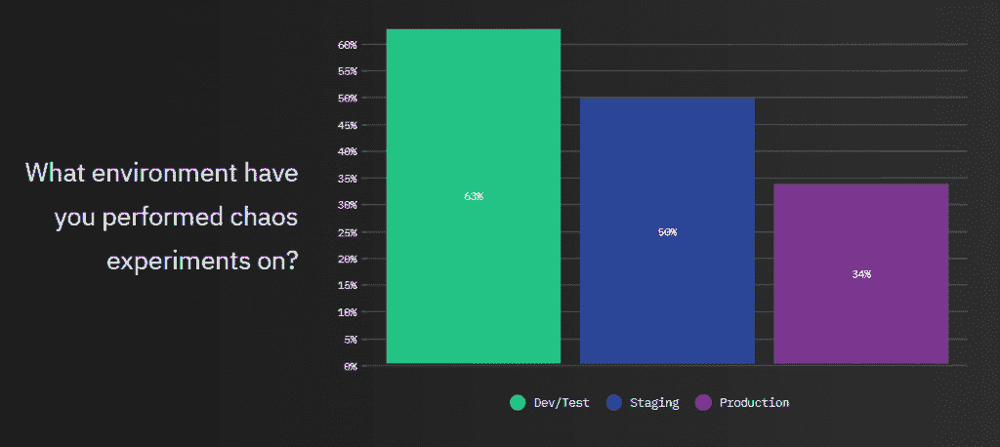
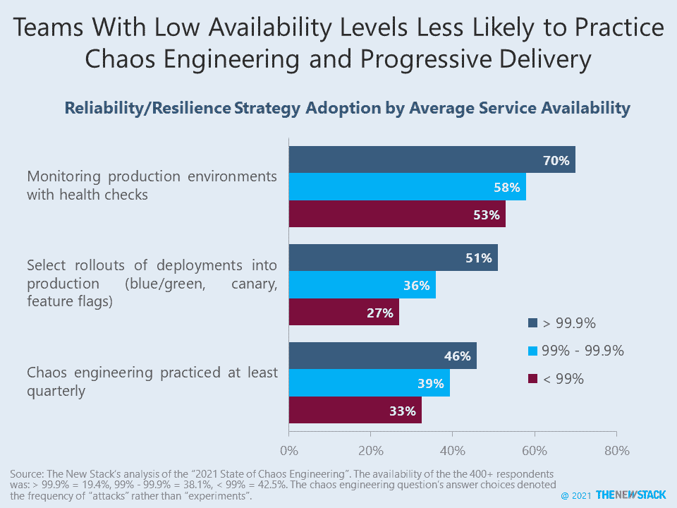

# 混沌工程逐步走向生产

> 原文：<https://thenewstack.io/chaos-engineering-progressively-moves-to-production/>

混沌工程已经成熟，超越了网飞最初的混沌猴子项目，但是这种实践到底意味着什么仍然是旁观者的看法。Gremlin 调查了 400 多名 IT 专业人员，其中 63%的人在开发或测试环境中进行过混沌实验，但“只有”34%的人在生产环境中进行过。根据定义，混沌工程不是在测试生产系统吗？市场采用的整体状态肯定低于这个自选样本，但 40%的研究之前从未进行过混沌攻击。举例来说， [2020 年的一项研究](https://thenewstack.io/where-the-site-reliability-engineer-role-overlaps-with-devops/)发现，26%的现场可靠性工程师使用混沌工程工具。

当被问及时，从业者声称可用性和平均恢复时间(MTTR)是混沌工程的最大好处，而页面数量的减少(严重事件的代表)则不太重要。虽然这项研究收集了基准数据，但没有办法确定混沌工程是否真的改善了这些数据。

我们相信采用[渐进交付](https://thenewstack.io/the-rise-of-progressive-delivery-for-systems-resilience/)实践的组织有能力在生产环境中进行实验性的改变。无论这些被称为金丝雀部署、特征标记还是混乱测试，都不重要。与正常运行时间达到 99.9%或更高的组织相比，服务可用性水平差的组织不太可能具备这些能力。下一步是创建一个可扩展的模型，让我们测试混沌工程值得投资的假设。

来源:新堆栈对“2021 混沌工程状态”的分析。

Gremlin 是新堆栈的赞助商。

<svg xmlns:xlink="http://www.w3.org/1999/xlink" viewBox="0 0 68 31" version="1.1"><title>Group</title> <desc>Created with Sketch.</desc></svg>