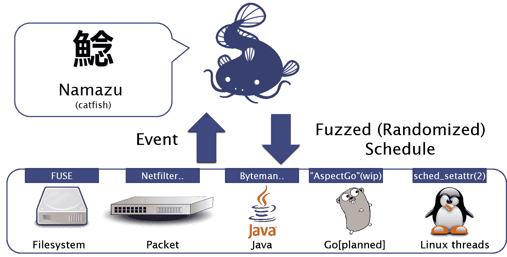
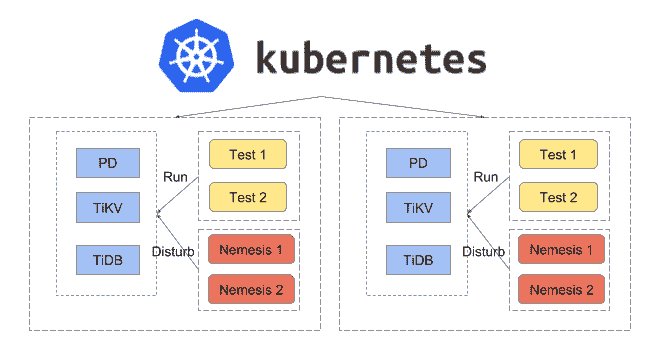
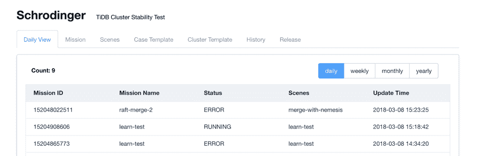
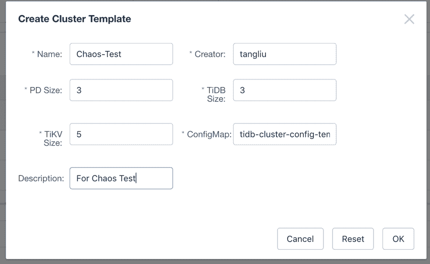
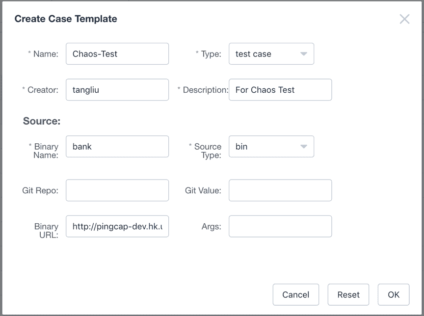
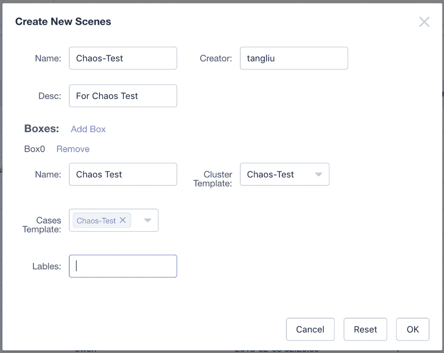
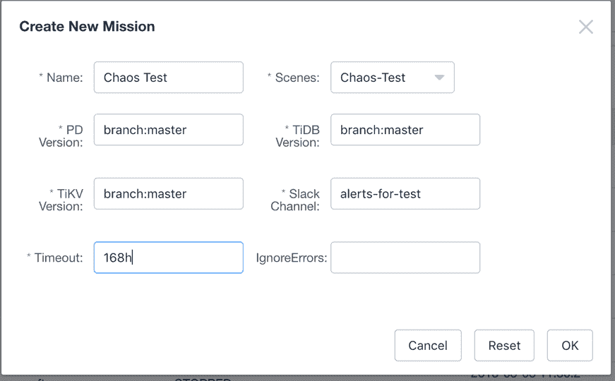
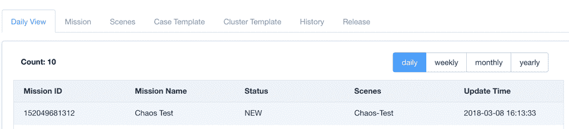

# 测试 TiDB 分布式 NewSQL 数据库的混沌工具和技术

> 原文：<https://thenewstack.io/chaos-tools-and-techniques-for-testing-the-tidb-distributed-newsql-database/>

[](https://pingcap.com/en/)

 [西顿唐

西顿唐(@西顿唐)是平凯普杰出的工程师。他一直致力于下一代 HTAP 数据库 TiDB，并领导分布式键值存储 TiKV 的开发。他是一个开源狂热者，开发了许多 Rust 库，如 rust-prometheus、rust-grpc 和 rust-rocksdb。](https://pingcap.com/en/) [](https://pingcap.com/en/)

在分布式计算的世界中，您永远无法预测您的集群会发生什么。一切皆有可能。一只在里约热内卢飞舞的蝴蝶可能会改变芝加哥的天气，或者摧毁开罗的整个数据中心。网络时间协议(NTP)可能不同步，CPU 可能神秘地达到极限，或者更糟糕的是，您勤奋的数据库管理员可能在半夜意外删除数据。

作为一个开源分布式 [NewSQL](https://en.wikipedia.org/wiki/NewSQL) 混合事务/分析处理( [HTAP](https://en.wikipedia.org/wiki/Hybrid_transactional/analytical_processing_(HTAP)) )数据库， [Pingcap](https://pingcap.com/en/) 的[TiDB](https://github.com/pingcap/tidb)(Titanium Database 的简称)包含了我们客户最重要的资产——他们的数据。我们系统的一个最基本也是最重要的要求是容错。但是，如何在分布式数据库中确保容错呢？在本文中，我将介绍混沌工程中的顶级故障注入工具和技术，以及我们如何在 TiDB 中执行混沌实践。

## 什么是混沌，我们为什么需要混沌？

自从 2011 年网飞发明了[混沌猴](https://en.wikipedia.org/wiki/Chaos_Monkey)以来，这种猴子变得越来越受欢迎。如果您想构建一个分布式系统，让混乱猴子在您的集群上变得有点疯狂可以帮助构建一个更容错、更有弹性和更可靠的系统。

通常，我们编写尽可能多的单元测试，以确保覆盖所有的逻辑，构建足够的集成测试，以保证我们的系统可以与其他组件很好地工作，并进行性能测试，以改善数百万个请求的处理。

不幸的是，这对分布式系统来说是不够的。无论我们做多少单元、集成或性能测试，我们仍然不能保证我们的系统能够承受生产环境的不可预测性。我们可能会遇到磁盘故障、机器断电、网络隔离，而这只是冰山一角。为了使像 TiDB 这样的分布式系统更加健壮，我们需要一种方法来模拟不可预测的故障，并测试我们对这些故障的响应。所以我们需要混沌猴。

## 如何变得“混乱”

网飞不仅发明了混沌，还引入了“混沌工程”的概念，这是一种揭示系统级弱点的系统方法。里面有一些混沌工程的核心[原理](http://principlesofchaos.org/)，还有一整本关于[混沌工程](http://www.oreilly.com/webops-perf/free/chaos-engineering.csp)的书。

在 TiDB 中，我们应用混沌工程来观察我们系统的状态，做出假设，进行实验，并用真实的结果来验证这些假设。我们坚持原则，但也加入我们自己的口味。这是我们的五步混沌方法论:

1.  使用[普罗米修斯](https://prometheus.io/)作为监控工具，观察 TiDB 集群的状态和行为，并收集稳定集群的指标，以建立稳定系统的代理；
2.  列出某些故障场景的假设以及我们预期会发生的情况。TiDB 的一个例子是:如果我们从集群中隔离一个[TiKV](https://github.com/tikv/tikv)(TiDB 的分布式键值存储层)节点，QPS(每秒查询数)应该会下降，但会很快恢复到另一个稳定状态。
3.  从我们的列表中选择一个假设；
4.  通过注入故障并分析结果，对所选假设进行实验。如果结果和我们的假设不一样，可能(或者一定)有错或者漏了什么；
5.  冲洗并重复我们列表中的另一个假设，并自动完成这个过程。

混沌工程中的一个高级原则是在生产环境中运行实验。在为我们的用户部署 TiDB 之前，我们必须确保它是经过实战考验的。但是，我们不能在客户的生产环境中执行这些实验，因为他们将最关键的数据委托给 TiDB。我们能做的就是创造自己的“战场”——内部生产环境。

目前，我们正在使用 TiDB 为我们的内部问题跟踪和项目管理工作[吉拉](https://www.atlassian.com/software/jira)供电，可以说是“吃我们自己的狗粮”。有了这个装置，我们可以在吉拉上进行混沌实验。在没有任何警告的情况下，当我们自己的员工在日常工作中使用吉拉系统时，我们会注入故障来危及该系统的各个方面，以便模拟一系列级联“事故”来识别可能的系统漏洞。我们称这种做法为“军事演习”，它经常发生在我们的日常行动中。在接下来的部分中，我将介绍我们如何进行故障注入并自动化这个过程。

## TiDB 如何进行故障注入

[故障注入](https://en.wikipedia.org/wiki/Fault_injection)是一种通过将故障引入测试代码路径，特别是错误处理代码路径来提高测试覆盖率的技术。它被广泛认为是开发健壮软件的重要组成部分。有许多方法可以进行故障注入来评估系统。在 TiDB 中，故障以下列方式注入:

1.  使用`kill -9`强制终止进程，或者使用`kill`正常终止进程，然后重新启动。
2.  发送 SIGSTOP 挂起或 SIGCONT 恢复进程。
3.  使用`renice`调整进程优先级或使用`setpriority`处理进程的线程。
4.  最大限度地利用 CPU。
5.  使用`iptables`或`tc`丢弃或拒绝网络包或延迟网络包。
6.  使用`tc`对网络包重新排序，并使用代理对 gRPC 请求重新排序。
7.  使用`iperf`获取所有网络吞吐量。
8.  使用`libfuse`挂载文件系统并进行 I/O 故障注入。
9.  链接`libfiu`进行 I/O 故障注入。
10.  使用`rm -rf`强制删除所有数据。
11.  使用`echo 0 > file`损坏文件。
12.  复制一个巨大的文件来制造`NoSpace`问题。

## 顶级故障注入工具

### 内核故障注入

一个流行的故障注入工具是包含在 Linux 内核中的故障注入框架，开发人员可以用它来实现简单的故障注入以测试设备驱动程序。对于更准确的故障注入，例如当用户读取文件时返回错误，或者在`malloc`中分配故障，我们使用以下故障注入过程:

1.  在启用框架的情况下重建内核
2.  使用内核故障注入，如下所示:

```
echo  1  &gt;  /sys/block/vdb/vdb1/make-it-fail

mount debugfs  /debug  -t  debugfs

cd  /debug/fail_make_request

echo  10  &gt;  interval  # interval

echo  100  &gt;  probability  # 100% probability

echo  -1  &gt;  times  # how many times: -1 means no limit

```

1.  当我们访问该文件时，可能会出现以下错误:

```
&gt;  Buffer  I/O  error on device vdb1,  logical block  32538624

&gt;  lost page write due to  I/O  error on vdb1

```

1.  我们可以将故障注入分配，如下所示:

```
echo  1  &gt;  cache-filter

echo  1  &gt;  /sys/kernel/slab/ext4_inode_cache/failslab

echo  N  &gt;  ignore-gfp-wait

echo  -1  &gt;  times

echo  100  &gt;  probability

```

```
&gt;  cp linux-3.10.1.tar.xz  linux-3.10.1.tar.xz.6

&gt;  cp:  cannot create regular file  'linux-3.10.1.tar.xz.6':  Cannot allocate memory

```

虽然 Linux 内核的故障注入框架很强大，但是我们不得不重新构建内核，因为一些用户不会在他们的生产环境中启用它。

### SystemTap

注入故障的另一种方法是`[SystemTap](https://sourceware.org/systemtap/)`，这是一种脚本语言和工具，可以帮助诊断性能或功能问题。我们使用`SystemTap`来探测内核函数并进行精确的故障注入。例如，我们可以通过执行以下操作来延迟读/写返回中的 I/O 操作:

```
probe vfs.read.return  {

     if  (target()  !=  pid())  next

     udelay(300)

}

```

```
probe vfs.write.return  {

     if  (target()  !=  pid())  next

     udelay(300)

}

```

我们也可以改变 I/O 返回值。下面我们为读注入一个`EINTR`，为写注入`ENOSPC`:

```
probe vfs.read.return  {

     if  (target()  !=  pid())  next

     // Interrupted by a signal

     $return  =  -4

}

```

```
probe vfs.write.return  {

     if  (target()  !=  pid())  next

     // No space

     $return  =  -28

}

```

### 失败

有时候，我们想在特定的地方进行故障注入，比如:

```
fn save_snapshot()  {

     save_data();
     save_meta();
}

```

我们这样做是因为，例如，我们希望在保存快照数据后看到系统死机，但 meta 还没有。我们如何做到这一点？我们可以使用一种叫做`[fail](https://www.freebsd.org/cgi/man.cgi?query=fail&sektion=9&apropos=0&manpath=FreeBSD%2B10.0-RELEASE)`的机制。使用`fail`我们可以准确地将故障注入到我们想要的地方。在 Go 中我们可以用`[gofail](https://github.com/coreos/gofail)`，在 Rust 中我们可以用`[fail-rs](https://github.com/pingcap/fail-rs)`。

对于上面的例子，现在我们可以做:

```
fn save_snapshot()  {

     save_data();

     fail_point!(“snapshot”);
     save_meta();
}

```

在这个例子中，我们注入一个名为“snapshot”的故障点，然后我们可以触发它抛出类似`FAILPOINTS=snapshot=panic(msg) cargo run`的紧急消息。

## 故障注入平台

我们已经介绍了一些单独的故障注入方法。也有集成了这些方法的平台，使我们能够单独或同时注入故障。这些平台中最受欢迎的是 [Namazu](https://github.com/osrg/namazu) ，一个用于测试分布式系统的可编程模糊调度程序。



您可以在 Namazu 容器中运行您的系统。在容器中，Namazu 会通过`sched_setattr`，带 fuse 的文件系统和带 netfilter 的网络来调度进程。不幸的是，我们发现启用 Namazu 的文件系统调度器会导致 CentOS 7 操作系统崩溃，所以对于 TiDB，我们只在 Ubuntu 上运行 Namazu。

另一个平台是 [Jepsen](https://github.com/jepsen-io/jepsen) ，它被设计用来验证分布式数据库的线性化。Jepsen 使用 Nemeses 来扰乱系统，记录客户端操作，并通过操作历史来验证可线性化性。

我们已经建立了一个 Clojure 库来测试 TiDB，你可以在这里阅读详细内容: [TiDB Jepsen Test](https://github.com/pingcap/jepsen/tree/master/tidb) 。Jepsen 已经集成到持续集成(CI)工具中，因此 TiDB 代码库中的每次更新都会自动触发 CI 执行 Jepsen 测试。你可以在更早的博客文章中查看细节:[当 TiDB 遇到 Jepsen](https://pingcap.com/blog/2017-09-01-tidbmeetsjepsen/) 。

## 自动混沌:薛定谔

到目前为止，我们提到的工具或平台都是公开可用的工具，可以帮助您将混乱放入系统中。但是为了测试 TiDB，我们需要自动化所有这些测试，以提高效率和覆盖率。这就是促使我们创造薛定谔的原因。

2015 年，当我们第一次开始开发 TiDB 时，每次我们提交一个功能，我们都会做以下事情:

1.  构建 TiDB 二进制文件；
2.  请管理员分配一些机器进行测试；
3.  部署 TiDB 二进制文件并运行它们；
4.  运行测试用例；
5.  运行注入故障；
6.  所有测试完成后，清理一切并释放机器。

如您所见，所有这些任务都需要手动和繁琐的操作。当 TiDB 代码库增长时，许多测试需要并发运行。手动方式根本无法扩展。

为了解决这个问题，我们建立了薛定谔，一个自动执行混沌工程的测试平台。我们所需要做的就是配置薛定谔来执行特定的测试任务，然后它就会开始执行。

薛定谔基于 Kubernetes (K8s)，所以我们不再依赖物理机器。K8s 将隐藏机器级别的细节，并帮助我们将正确的作业调度到正确的机器上。



K8s 上的 Shrodinger 架构

下面是薛定谔的主页截图，显示了正在运行的测试的概述。我们可以看到两个测试失败，一个测试仍在运行。如果测试失败，一个警报将被发送到我们的 Slack 频道，并通知开发人员修复问题。



Shrodinger 主页

### 如何使用薛定谔？

薛定谔可以通过 5 个步骤实现:

1.  使用创建集群模板创建 TiDB 集群。在下面的快照中，我们部署了一个 TiDB 集群，它包含 3 个布局驱动程序(PD)服务器、5 个 TiKV 服务器和 3 个 TiDB 服务器。(PD 是 TiDB 集群的管理组件，负责元数据存储、调度和负载平衡，以及分配事务 id。)



2.  使用创建案例模板为集群创建一个测试案例。我们可以使用预构建的二进制测试，比如下面的`bank`测试，或者让 Schrodinger 从 Git 源代码中构建一个新的测试。



3.  创建一个场景来链接我们在上一步中配置的集群，并将测试用例添加到这个集群中。



4.  创建一个任务，告诉薛定谔 TiDB 星团的详细版本，并附加一个 Slack 通道进行警戒。例如，在下面的快照中，我们让薛定谔从最新的主数据源构建整个集群。



5.  在我们创建任务之后，Schrodinger 开始工作并自动运行所有的测试用例。



薛定谔现在可以同时在 7 个不同的集群中运行测试，24/7 不间断。这将我们的团队从手工测试中解放出来；我们只需要配置测试环境和任务。

对于未来的发展，我们将继续优化过程，使我们的混沌猴更聪明。我们不再总是手动设置测试环境和任务，而是致力于让 Schrodinger“研究”集群，并找出如何自动注入故障的方法。网飞已经在做这方面的研究，并发表了相关论文:[互联网规模的自动化故障测试研究](https://people.ucsc.edu/~palvaro/socc16.pdf)。我们正在这项研究的基础上推进我们自己的研发工作，并将很快分享我们的进展！

## TLA+在 TiDB

除了故障注入和混沌工程实践之外，我们还使用了 [TLA+](https://github.com/tlaplus) ，一种为设计、建模、记录和验证并发系统而开发的正式规范语言，来验证我们的分布式事务实现和相关算法。TLA+是由 [Leslie Lampor](https://en.wikipedia.org/wiki/Leslie_Lamport) 开发的，我们已经用它来证明我们的两阶段交易算法，在这里记录为。我们计划在未来使用 TLA+来证明更多的算法。

## 最后的想法

从我们开始构建 TiDB 的那一刻起，我们就决定用混沌来测试它。正如我所展示的，混沌是检测分布式系统中的系统不确定性并建立对系统弹性的信心的好方法。我们坚信，混沌工程的适当和周到的应用将决定一个分布式系统的成功。

如果你对混沌工程感兴趣，请不要犹豫，通过[tl@pingcap.com](mailto:tl@pingcap.com)联系我。

<svg xmlns:xlink="http://www.w3.org/1999/xlink" viewBox="0 0 68 31" version="1.1"><title>Group</title> <desc>Created with Sketch.</desc></svg>