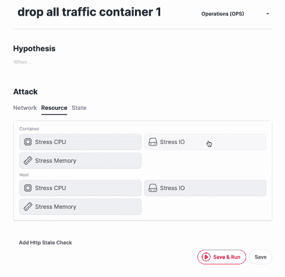
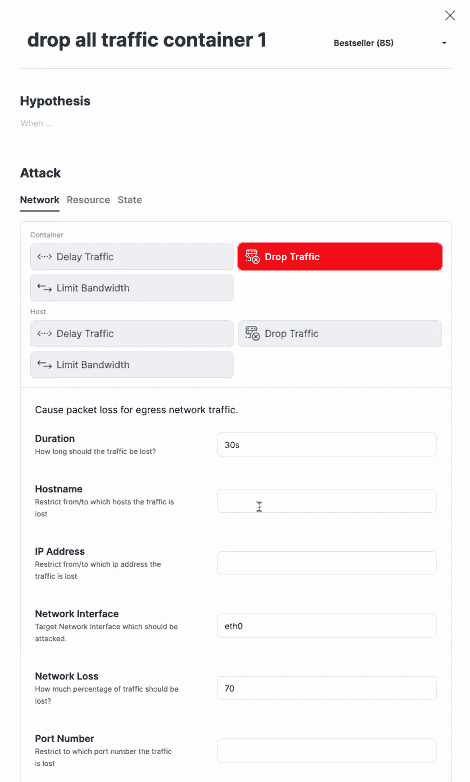
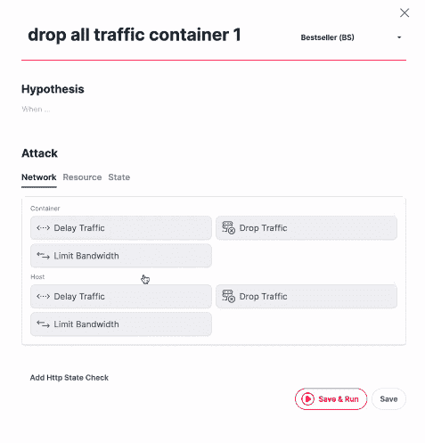

# 混沌工程:每一层的混沌工程

> 原文：<https://thenewstack.io/chaosmesh-chaos-engineering-for-every-layer/>

随着[混沌工程](/chaos-engineering-can-give-distributed-systems-stability/)越来越受欢迎，德国 IT 咨询公司 [Codecentric](https://github.com/codecentric) 剥离了混沌工程初创公司 [Chaosmesh](https://www.chaosmesh.com/) 。

Benjamin Wilms 与 Dennis Schulte 和 Johannes Edmeier 一起，在他们的前雇主 Codecentric 及其创始人和前首席执行官 Mirko Novakovic 的支持下，于去年 10 月推出了 Chaosmesh。

Wilms 之前在 2018 年 4 月为 Spring Boot 发布了[混沌猴，Edmeier 是该项目的管理员。](https://github.com/codecentric/chaos-monkey-spring-boot)

网飞最初在 2011 年开发了它的混沌猴子工具，它描述为“一种随机禁用我们生产实例的工具，以确保我们能够在这种常见类型的故障中生存下来，而不会对客户产生任何影响。”

最初的猴子已经产生了一整支以猴子命名的工具大军，自那以后，一大批竞争者也跳进了这个市场。

新的堆栈已经向早期采用者讲述了混沌工程的好处和测量其对业务方面的好处的方法，以及它在 Kubernetes 中的具体应用，以提高可靠性。

[https://www.youtube.com/embed/ln1eANzbiCw?feature=oembed](https://www.youtube.com/embed/ln1eANzbiCw?feature=oembed)

视频

APM 初创公司 [Instana](https://www.instana.com/) 也是在 2015 年 4 月从 Codecentric 发展出来的。

不要把 Chaosmesh 与 chaos engineering platform 混淆，后者的名字[与 TiDB 数据库的创建者中国的](https://devclass.com/2020/01/20/pingcap-wraps-chaos-mesh-around-kubernetes/) [PingCAP](https://thenewstack.io/chaos-tools-and-techniques-for-testing-the-tidb-distributed-newsql-database/) 同名，拼写为“Chaos Mesh”。

像云原生的 [Litmus](https://www.cncf.io/blog/2019/11/06/cloud-native-chaos-engineering-enhancing-kubernetes-application-resiliency/) 框架一样，Chaosmesh 专注于 Kubernetes。PingCAP 吹捧“Kubernetes 上复杂系统的全面故障注入方法，涵盖 Pod、网络、文件系统甚至内核中的故障。”

德国的混沌有更广泛的焦点。

“我们正在基础设施层、平台层(如 AWS、Azure Kubernetes、Docker)以及应用程序堆栈上注入混乱，”Wilms 解释道。

“通常，为此，你需要安装一些特殊的工具，或者你必须在机器上获得一些根访问权限等等。当然，你还需要运营部的人……借助我们的核心平台，你能够在应用堆栈中注入各种延迟网络中断或异常，”Wilms 说。

一家公司的博客文章[指出了潜在的问题，例如:](https://www.chaosmesh.com/chaos-engineering/)

*   Kafka 集群中的节点故障
*   丢弃的网络数据包
*   硬件错误
*   JVM 的最大堆大小不足
*   网络延迟增加
*   畸形反应

它补充说，混乱不应该是一个惊喜，你的目标是用有帮助的控制测试来证明一个假设。您会更好地理解您的分布式系统。

“我们的代理运行在虚拟机上或 Docker 或 Kubernetes 内部，所有代理都能够进行自动更新。因此，例如，如果我们正在开发针对新发现功能的新攻击，我们的代理将自动安装它，因此您不需要再次修补它，”Wilms 说。“我们在里面的特工能够探测到它们被安装在什么地方。

例如，代理能够进行一些自动发现处理。如果我在 Docker Swarm 中运行，或者这个代理在 Kubernetes 中运行，所有这些数据都将被收集到我们的中央平台，该平台也可以安装在本地。”

它还在目标级别提供基于角色的访问控制。例如，如果你有一个容器，你可以限制访问，这样不是每个人都可以杀死这个特定的主机。

在该平台上，您可以对网络组件进行攻击，延迟容器中的流量，延迟特定主机上的流量。你可以丢弃流量，限制带宽。你也可以设置一个特定的爆炸半径。

“你可以设置你的爆炸半径，这样你就可以说，‘我知道它都在美国东部第一，所以请在 AWS 上丢弃美国第一内的所有流量。’或者你可以通过选择一个特定的码头名称来限制爆炸半径。…我们可以在 Kubernetes 或 vanilla Docker 中暂停容器。你也可以杀死一个豆荚。"

Gremlin 领导了用于混沌测试的商业软件即服务(SaaS)产品的[包](https://www.gremlin.com/chaos-engineering/chaos-engineering-tools-comparison/)，但还有越来越多的工具，包括 [ChaosIQ](https://chaosiq.io/) 、New Relic 的 [Chaos Panda](https://blog.newrelic.com/engineering/graphql-chaos-engineering/) 和 Shopify 的 [ToxiProxy](https://github.com/Shopify/toxiproxy) 以及网飞开源的猿命名工具的[阵列。](https://netflixtechblog.com/the-netflix-simian-army-16e57fbab116)

“我们能够以软件即服务的方式运行我们的平台。您可以在您的应用程序和堆栈中运行我们的代理。您可以在自己的数据中心内部运行它，因为在欧洲，有许多法规和限制。在 SaaS 的环境中，你不允许做一些混乱的事情。…这将使我们的市场比我们仅仅提供 SaaS 大得多，尤其是在欧洲，”Wilms 说。

[https://www.youtube.com/embed/CUvxTQgFTEc?feature=oembed](https://www.youtube.com/embed/CUvxTQgFTEc?feature=oembed)

视频

图片来自 Pixabay 的 Steven Liao。

<svg xmlns:xlink="http://www.w3.org/1999/xlink" viewBox="0 0 68 31" version="1.1"><title>Group</title> <desc>Created with Sketch.</desc></svg>