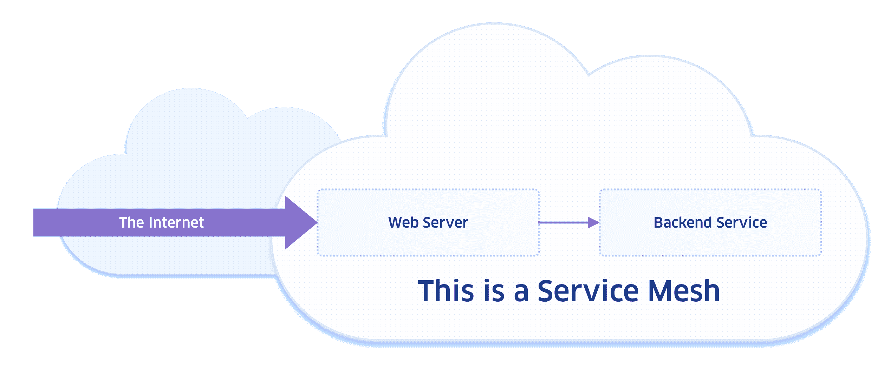
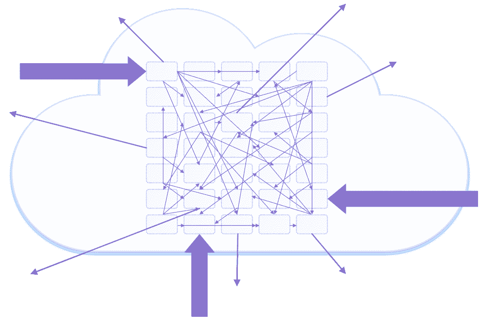
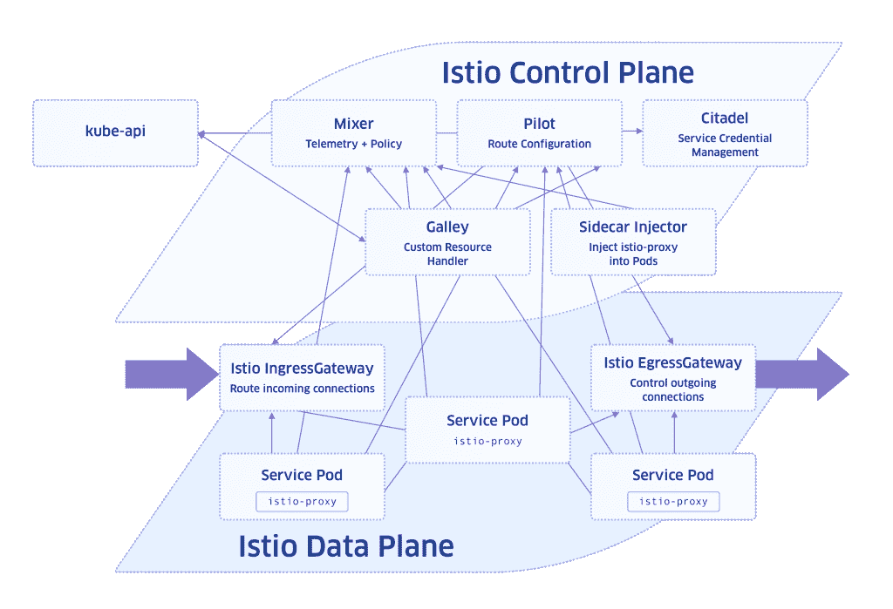

# 为服务网格的未来绘制路线图:用 Istio 起飞

> 原文：<https://thenewstack.io/chart-a-course-for-a-service-mesh-future-lifting-off-with-istio/>

 [凯伦·布鲁纳

凯伦·布鲁纳是 StackRox 的首席开发工程师，她在那里推动自动化并倡导产品的可操作化。此前，Karen 曾在 Clari、Ooyala、LinkedIn 和 Yahoo 担任开发运维及站点可靠性工程职位。她在好莱坞的数字特效行业开始了她的职业生涯，并在《网络大盗》中出演了电影《宝贝》。她用业余时间渲染纱线中的双关语，学习晦涩的纤维工艺，以及被猫绊倒。](https://www.stackrox.com/) 

云原生架构和技术(如容器和 Kubernetes)的成熟正在推动服务网格架构的出现和采用。虽然云原生环境为部署它们的组织带来了大量好处，但复杂性已经成为负责设计、开发、操作和保护此类系统的人员面临的重大挑战，这些人员包括开发运维人员、基础设施工程师、软件开发人员、网络运营商以及首席信息官、首席技术官和其他组织技术负责人。

跨云原生环境为应用整合一致的服务和网络管理体验的能力，以及这种能力如何与开发运维实践保持一致并加速开发运维实践，共同推动了服务网格框架的发展。随着云原生应用的不断加速，拥有云原生应用的工程团队现在必须熟悉服务网格功能，以确定该技术是否会在未来为他们的组织提供价值。

## 什么是服务网格？

服务网格允许您在 orchestrator 平台中连接、保护、控制和观察服务。术语“服务网格”本身适用于分布式应用程序中服务之间的一组重叠网络连接，或者适用于用于管理该组连接服务的一组工具。如果你有两个通过网络连接交互的微服务，你就有了一个服务网格。下面是一个最简单的例子，一个包含两种服务的网格:

更有可能的情况是，随着您环境中微服务数量的增长，您的服务网格将开始呈现如下所示:

随着云环境扩展到混合和多云部署，开发人员使用微服务来加快开发速度，并确保组织使用的许多容器和分布式云资源(庞大而复杂的数据和应用程序网络)之间的可移植性。随着微服务生态系统的复杂性增加，对其进行有效和智能管理的需求也在增加，以深入了解[微服务](https://www.thenewstack.io/tag/microservices)如何交互，并确保微服务之间的通信安全。

## Istio 是什么？

如果你听说过服务网格，你几乎肯定听说过 Istio。Istio 是一个开源服务网格，可以与现有的云原生应用程序一起部署。它还具有类似平台的特性，可以集成到测井平台、遥测或政策系统中。策略集成允许 Istio[作为安全工具](https://www.stackrox.com/post/2019/08/istio-security-basics-running-microservices-on-zero-trust-networks/)创建统一的方法来保护、连接和监控给定环境中的微服务。当被引用时，“Istio 服务网格”通常是指 Istio 工具集，而“Istio 服务网格”通常表示由 Istio 安装管理的特定应用集群。Istio 的许多自定义资源定义(CRD)支持应用网络层行为的编程配置(使用 Kubernetes API)，其中应用是一组相互依赖的微服务。Istio 或多或少是当今云原生堆栈中服务网格的面巾纸，它是功能最丰富、最标准化的。

## 我需要服务网格吗？

虽然服务网格的采用可能会继续快速传播，特别是随着 Istio 等工具的功能集和可管理性的改善，但并不是每个云原生环境都需要它。那么，您如何知道某项服务是否适合您的组织和环境呢？如果您需要解决下面列出的一个或多个需求或问题，您应该考虑部署服务网格:

*   您在基于分布式微服务的应用程序中遇到了性能问题
*   您需要为所有微服务收集并交付一致的请求和连接指标
*   您希望将在线加密作为默认设置，而不必直接管理 TLS 证书
*   您需要比普通 Kubernetes 能够提供的网络策略更细粒度的服务到服务控制
*   您希望通过 canary 部署和应用程序 API 多版本支持来实现发布自动化
*   您希望在不修改应用程序的情况下添加用户身份验证和授权

另一方面，如果您的堆栈中不需要服务网格，那么使用服务网格会带来一些代价。考虑到这些环境的复杂性，部署服务网格(包括 Istio)将需要大量的迁移工作和运营开销。如果您预计部署的微服务数量不会增长，如果其他解决方案满足您的内部 HTTP 请求路由需求，或者如果您已经有了可管理的有效解决方案来满足上面列出的任何关键需求，那么服务网格此时可能不是您环境的最佳解决方案。

但是，随着服务网格的采用继续激增，为支持它而开发的功能生态系统将不可避免地继续扩展。这种增长将提高可管理性和功能性，以便在未来，随着组织成熟度的要求，开发运维团队可以更轻松地访问一组更强大的服务网格工具，而无需担心在云原生堆栈中部署新的基础架构层。

## Istio 如何工作

Istio 组件可以分为两组——控制平面和数据平面。控制平面是指管理配置和监控数据平面的服务。数据层由智能代理组成，部署为应用程序单元中的侧柜，这是 Kubernetes 对象模型中最小的可部署对象。这些 Istio 代理有助于控制和监控微服务之间的网络连接。从控制平面接收路由和策略规则。然后，数据平面报告连接处理遥测数据。

Istio 服务网格通过创建 Kubernetes 资源来配置。Kubernetes 有许多自定义资源定义，它们映射到 Istio 功能的各种元素，这些元素是由幕后人员创建的。我们将在下面讨论更多关于控制和数据平面的内容，但首先我们想提出几点关于 Istio 的潜力(以及潜在的陷阱)。

## 潜力和陷阱

Istio 通过其可动态配置的代理网格提供了一系列处理和控制网络连接的功能。但是这种功能伴随着陡峭的学习曲线和沉重的配置负担。在将现有应用迁移到 Istio 架构时，有时还会出现许多常见问题，即使它们已经是 Kubernetes-native 微服务。

具有讽刺意味的是，Istio 缺乏将用户提供的配置转换为特使路线的可见性。Envoy 是一种高性能代理，作为服务网格中服务的入站和出站流量的中介，由拼车服务 Lyft 的开发人员创建，用于从单一架构过渡到服务网格架构。其他采用问题可能包括了解部署和服务资源配置要求所需的学习曲线，解决当 mTLS 打开时中断的 Kubernetes 就绪性和活性探测，以及使用无头服务(没有 ClusterIP 的 Kubernetes 服务)或绕过正常 Kubernetes 服务发现流程的服务。

好处是，Istio 随着频繁的发布和积极征求用户反馈的工作组的参与而快速发展。许多限制来自于 Envoy 代理，随着 Istio 继续推动其实用性，它也在积极地开发和改进。

## 配置控制平面

Kubernetes 集群中的典型 Istio 部署应该具有以下服务:

*   Pilot 服务聚合 Istio 网络定制资源中配置的流量管理规范，并将其交付给 **istio-proxy** sidecars。
*   Mixer 服务，它处理由代理 sidecars 生成的请求度量的遥测，以将它们发送到已配置的后端，并充当授权策略实施者。如果策略检查是打开的(Istio 1.1 默认关闭)，代理 sidecars 将连接到混音器，以确认连接是允许的。不幸的是，这种方法以额外的网络延迟为代价。
*   Citadel 服务是 Istio 的公钥基础设施(PKI)服务，它生成、轮换和撤销为网格中的每个服务生成的客户端 TLS 证书，并用于对等身份验证。
*   Galley 服务，它是大多数 Istio 自定义资源定义的 Kubernetes 控制器，使用户能够对自定义资源进行更改，并将内容分发到其他 Istio 服务。

## 数据平面

数据层由特使服务代理提供支持，使用 Istio 扩展构建。代理会截获到 pod 服务端口的传入流量，默认情况下，还会截获来自 pod 其他容器的所有传出 TCP 流量。在大多数情况下，代理 sidecar 可以在 pod 中运行，不需要对应用程序代码进行任何修改，只需要对应用程序的 Kubernetes 部署和服务资源规范进行很小的修改。代理边车的配置由 Istio 控制平面中的服务动态管理。

最终，可能会有一天，您需要部署一个服务网格来确保您的云原生环境完全正常运行并得到充分保护。今天让自己熟悉一下基础知识，将有助于你认识到什么时候该进行部署并做好准备。通过了解 Istio 的设计和功能，以及它如何降低容器化微服务和云原生环境的固有复杂性，试图在 Kubernetes 和其他容器平台上规划扩展的工程师可以放心，因为他们知道一个功能强大且快速改进的解决方案已经存在，并且正在积极发展，以增强可扩展性、安全性和易管理性。

随着组织继续采用云原生和分布式架构，Istio 的服务网格功能以及底层基础设施网络控制和[通用 Kubernetes 安全最佳实践](https://www.stackrox.com/post/2019/07/kubernetes-security-101/)将减轻 DevOps 组织在扩展和管理应用基础设施方面的压力。

通过 Pixabay 的特征图像。

<svg xmlns:xlink="http://www.w3.org/1999/xlink" viewBox="0 0 68 31" version="1.1"><title>Group</title> <desc>Created with Sketch.</desc></svg>