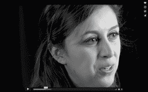

# 追逐优雅:一部关于科技女性的新系列纪录片

> 原文：<https://thenewstack.io/chasing-grace-new-documentary-series-women-tech/>

在听了几位科技行业的女性——拥有光明未来的聪明女性——谈论离职后，[詹妮弗·克洛，](https://www.linkedin.com/in/jennifercloer/)创始人/首席顾问， [reTHINKit](http://www.npr.org/sections/money/2014/10/21/357629765/when-women-stopped-coding) 公关，决定推出“[追思计划](http://www.chasinggracefilm.com)”，这是一部关于科技行业女性的六集系列纪录片。该预告片在最近洛杉矶举行的 [Linux 基金会](https://www.linuxfoundation.org/)多样性授权峰会上首次亮相。

“一位年轻、非常有才华的女性程序员最近告诉我:‘我不想离开科技行业，但在我的第一份工作一年后，我正在考虑，’”Cloer 说。所以她问自己，“我能帮上什么忙？”

她说，利害攸关的事情太多了。“这需要我们所有人共同建设未来，”她说。“这不仅仅是女性的问题。”

根据国家科技女性委员会的最新数据，女性离开科技行业的比率是男性的两倍。根据《哈佛商业评论》的一项研究，随着时间的推移，恶劣的工作环境将赶走 50%在 STEM 工作的女性。

当结合到 2020 年计算机工作将增加一倍以上的预测以及合格工程师的短缺，逃离的女性成为一个严重的问题。

进入追思工程。这部六集系列纪录片聚焦于科技女性(WIT)叙事中的一系列主题。以美国海军少将格蕾丝·赫柏的名字命名，他是计算机领域的先驱，这几集将涵盖一系列话题，包括女性创业，如何获得最好的工作，网上骚扰。男性盟友将被包括在内，比如这位男性创始人和一位女性联合创始人，她沮丧地发现科技对女性的敌意有多深，因为她看到了自己被对待的方式。

Cloer 说，这个系列将展示我们如何铺平前进的道路。“我们采访过的女性都喜欢科技，”她解释道。“他们热爱建筑；他们喜欢管理项目；他们喜欢把社区聚集在一起；他们喜欢发明和创新。他们想留在这里。至少目前是这样。”

该系列讲述了科技领域日常女性的商店，不是那些成为头条新闻的女性，而是那些从事日常工作的女性。Cloer 希望，通过实际听到他们逆境中的故事，我们也可以看到他们如何克服这些困难，并为他们自己走向成功铺平道路。因此，也许我们可以学习如何做得更好，阻止人才流失。

Nithya Ruff 是硅谷的资深高管

长期从事硅谷技术和开源管理的 Nithya Ruff 加入了该项目，并为其提供支持。

她在开源技术领域成就了自己的事业。“多年来，我在硅谷大大小小的公司里积累了无数的经验，这对于我的长寿是有价值的，”拉夫在一次采访中说，“在这个领域坚持、推动和成功是有价值的。”

她说，要成为一名领导者，你需要看到其他像你一样的人，观察他们如何处理成为一名领导者的问题。你需要原型和滚动模型，你需要让你感到舒服的人去询问商业文化问题。

她希望进入科技行业的年轻女性能有蓝图、成功故事和模特，以及她们能看到的其他女性。“这让他们知道这是一个行业，这是我可以成功的地方，”拉夫说。

卡西迪·威廉姆斯，软件开发人员

[卡西迪·威廉姆斯](https://www.linkedin.com/in/cassidoo/)，这部电影的软件开发人员，说她喜欢在科技行业工作。“尽管这个社区可能很疯狂，”她说，“但我一直喜欢建造东西。我想站在第一线，帮助这个社区发展。”与此同时，她谈到在一家董事会全是男性的初创公司工作，掌握权力的男性都是男性。很多掌权的男人没有向他们汇报的女人有经验。本可以得到提升的女性。但事实并非如此。

威廉姆斯在视频剪辑中说，在技术领域做一名女性感觉就像在走钢丝。她说，你不能太女性化，因为太女性化会让你无法与同事相处融洽。“有时你会觉得自己是这个有趣而乏味的团体中的一员，而在其他地方，你会说，我太孤独了。”

凯瑟琳·布朗，企业家

企业家凯瑟琳·布朗从一开始就谈到了不平等。“如果你是一个年轻人，穿着连帽衫从斯坦福大学出来，你可能会有很高的抱负，也可能会非常叛逆，人们会认为你是一个超级天才。如果你是一个女人，你做同样的事情，他们会认为你是一个婊子。这是个大问题。”

她说，有工资差距，但也有额外津贴和尊重差距，这与金钱同等重要。

在预告片中，拉夫说，“改变兄弟文化的唯一方法就是融入其中。”如果妇女不在那里，如果她们不在领导岗位上，什么都不会改变。

“对我来说，追求优雅意味着拥抱我们作为女性的全部力量和优雅，”她说。“要知道你的时间就在这里，你的时间就是现在，现在就去做你能做的一切。”

预告片是现场直播，第一集预计在一月出来。Linux 基金会和 [Cloud Foundry 基金会](https://www.cloudfoundry.org/)是早期赞助商，但 Cloer 正在寻找更多的赞助商来完成全部六集。

感兴趣吗？你可以在 [Cloer 的博客](https://medium.com/@jennifercloer/are-women-in-tech-facing-extinction-b58e256e6bfe)上阅读更多内容，在[网站](http://www.chasinggracefilm.com)上注册定期更新，并在脸书、 [Twitter](https://twitter.com/cgFilmProject) 和 [Instagram](https://www.instagram.com/chasinggraceproject/) 上关注他们。

[Cloud Foundry](https://www.cloudfoundry.org/) 和 [Linux Foundation](https://www.linuxfoundation.org/) 是新堆栈的赞助商。

特写:詹妮弗·克洛尔。

<svg xmlns:xlink="http://www.w3.org/1999/xlink" viewBox="0 0 68 31" version="1.1"><title>Group</title> <desc>Created with Sketch.</desc></svg>