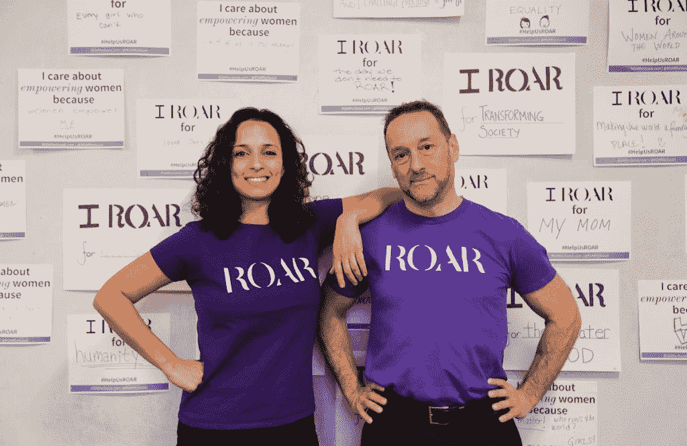

# 《追格雷斯》通过讲述故事，展现了科技行业女性的艰难处境

> 原文：<https://thenewstack.io/chasing-grace-takes-on-the-difficult-odds-for-women-in-tech-through-story-telling/>

“你永远不会扼杀讲故事，因为它是人类计划的一部分。作家玛格丽特·阿特伍德曾经写道。她没有错。事实上，这可能是接触更多科技界女性的一种方式。

毫无疑问，IT 行业存在性别差距。根据美国国家妇女和信息技术中心 2019 年的记分卡，虽然女性占专业劳动力的一半以上，但自 2007 年以来，她们一直只占计算和数学职业的 25%。尽管 IT 工作行业同期增长了 38%。

此外，根据 NCWIT 的调查，女性离开科技行业的比例明显高于男性，因为她们感到停滞和孤立。

但是就像阿特伍德的《一个女仆的故事》中的琼恩一样，[詹妮弗·克洛](https://twitter.com/jennifercloer)相信故事的力量可以改变我们——科技行业的女性——讲述故事的方式。

“故事是定义人类的东西，”Cloer 告诉新书库。

Cloer 说她创作了六集系列纪录片“[追着 Grace](http://chasinggracefilm.com) ”的想法是“故事真的是唯一可以改变文化的东西。”

她指出，公司文化被认为是女性离开科技行业的首要原因。她想确保她的医生允许女性讲述故事的方方面面。

> “这是一个重要的故事。这个行业正在发生倒霉事，我们不需要粉饰或忽视它，但我们需要通过分享他们超越逆境的故事来激励他人。”—詹妮弗·克洛尔

所以 Cloer 创立了“追逐恩典”，以海军上将、计算机科学家和全能先锋[格蕾丝·赫柏](/lets-say-happy-birthday-amazing-grace/)的名字命名。

“我们在追求格蕾丝很久以前为我们设定的理想。这是对科技界女性比 30 年前更少这一事实的认可。追回到未来，”Cloer 说。

## 这些故事改变了女性对科技的看法

你可以说这个项目是在 2017 年 1 月 Cloer 离开破纪录的女子三月时引发的。但这可能真正开始于 20 年前，当时她作为 Linux 基金会创始团队的一员，开始了她的科技职业生涯。也是开源界唯一的女性之一。只是 2017 年对女性来说感觉是更绝望的时刻。

Cloer 呼吁女性参与科技报道，并在每个周五安排了一系列的对话。并不是所有的负面报道都是错的，比如《新闻周刊》的[“硅谷对女性的看法”](https://newsweek.com/2015/02/06/what-silicon-valley-thinks-women-302821.html)。它只是没有讲述整个故事。

Cloer 说，她正在和其他想说“我在这里，我热爱这里，我想继续建设”的女性交谈。有时这很糟糕，我也想过离开，但我热爱我的工作，我想继续做下去。”

所以 Cloer 开始做一些不同于《新闻周刊》报道的事情，那里都是负面的。不同于企业公关的是，它让女性在科技领域的体验偏向积极的一面。

Cloer 将这个系列的第一集 21 分钟献给了薪酬差距。衡量和发布这些信息以了解是否取得了进展是很重要的。但第一集也提供了通常令人沮丧的统计数据背后的故事。

Cloer 的目标是“对挑战、逆境和冲突的真实描述”这些是被解雇或被忽视升职的女性，她们很愤怒。但是这些“女人克服了这些困难。仿佛这种逆境是他们的火箭燃料。”

## 不止一个进入壁垒

很多人认为，如果你不能加入他们，那就自己动手。但是对于亚斯敏·穆斯塔法来说，作为一名女性科技创始人，最大的挑战不是打造一个成功的产品，而是为其增长提供资金。被人关注。

她是工作场所安全初创公司 [Roar for Good](https://www.roarforgood.com/) 的创始人，该公司提供智能紧急按钮，最初是为大学生提供，现在是为“没有地位、没有权力、没有发言权”的清洁酒店的女性提供。

> “为一个面向女性的解决方案筹集资金，并置身于一群很少是女性的投资者当中，对我来说是一个经常性的挑战。”——亚斯敏·穆斯塔法，为善而吼

她继续说，“当然，他们与这个问题无关，他们也不理解这个问题，我必须用研究来教育他们。”

这并不是因为需求不足，因为越来越多的政府要求酒店员工使用紧急按钮。

穆斯塔法甚至向《新堆栈》讲述了最近对一个社会影响基金的投资推介——一个十男两女的房间。一名男性与会者问道，性骚扰是否真的是一个大问题。“当我开始回答他时，他开始发短信。”

作为一名技术领域的女性，特别是因为她正在为女性打造一个解决方案，穆斯塔法说，她必须不断证明自己的产品——“当你拥有 X 家酒店或 X 笔收入时，再回来。”

自 2019 年 3 月以来，她一直在为第二轮种子融资，直到 8 月份才收到第一笔投资。

当被问及如何克服这一巨大的准入障碍并找到资助者时，穆斯塔法说，她只能更加努力地工作，尽可能多地拜访投资者。她的前一轮种子期投资者决定领导这一轮也有所帮助。

坦诚面对她的挑战很有帮助，“去我的社区说‘嘿，我正在筹款，这是我面临的挑战。谁能帮我？"

自 2006 年以来，穆斯塔法一直在费城技术社区工作和组织社区，包括成立一个非营利组织来教女性如何编程，因为“我没有找到可以学习编程的安全空间。”

这些社区——包括[费城初创企业领导人](https://www.phillystartupleaders.org/)、 [IC@3401](https://www.ic3401.org/) 、[Ben Franklin Technology Partners CEO group](https://benfranklin.org/)和[女性创始人&出资人](https://technical.ly/philly/2019/03/18/meetup-group-female-founders-and-funders-philadelphia-comcast-lift-labs/)——不仅帮助穆斯塔法找到了资金，也是寻找设计师和帮助她理解从 B2C 到 B2B 的关键。

她说:“如果你不认识有影响力让你上一个台阶的人，拥有一个好的网络社区绝对是一个驱动力。”“在转向 B2B 和酒店业的过程中，我没有任何经验，社区可以告诉我这些市场，让我达到今天的水平。”

## WIT 社区的力量

穆斯塔法在《追逐恩典》第二集中分享了她的部分旅程，探索了社区在改变女性在科技领域的体验方面的作用。这些社区包括像 Women of Code、Black Girls Code 和 Girls of Code 这样的集体和聚会，以及像 ComcastNBC 环球的 TECHWomen 和 Linux 的 Women-in-Technology (WIT)在 OSSummit 期间举办的午餐会这样的人力资源驱动的项目。

这些社区是否提升了女性的职业生涯？更多的年轻女性追求科技职业是因为早期接触过这些社区吗？

Cloer 说，最近的女性计算机科学毕业生在参加面试时，越来越多地询问女性在技术领域的团体。毕竟，这些受欢迎的女性中的许多人已经在男性主导的课堂上受到了性别隔离。他们一直受到媒体对技术多样性、技术离职者和兄弟文化的负面看法的影响，这可能比其他任何一代人都要多。

> “当你向其他女性寻求支持时，她们就会出现。然后他们要求你支持，你就出现了。女性帮助女性——这太不可思议了。”——詹妮弗·克洛，《追逐格蕾丝》

Cloer 说，这些标题帮助人们畅所欲言，但这一代人并没有了解事情的另一面。

“在我采访的女性中，有很多愤怒和沮丧，但也有乐观主义和留下来建设的愿望，”Cloer 说。

这就是社区的用武之地。在过去的五到七年里，这些内部和外部社区都有了显著的发展。他们是否阻止了妇女和其他性别少数群体感到如此受排斥和孤独？

## 是什么让一个 WIT 社区成功？

Cloer 说现在平衡虚拟和 IRL 是非常重要的。她提到了大型的[女士有偿社区](https://www.ladiesgetpaid.com/join)，该社区有一个充满活力的 Slack 社区，并且每月在美国各地举行聚会。许多企业在不断促进内部网社区并举行年度面对面聚会时取得了成功。

Cloer 说，任何大中型公司都应该已经开始规划自己的 WIT 团队。

Cloer 继续说，导师制度必须融入到每一个包容项目中。《追格雷斯》第二集的主角是一名从东海岸搬到洛杉矶的女性。搬家后，她参加了许多科技聚会，但往往是那里唯一的女性。显然，在这些活动中，她甚至经历了更艰难的时刻。她正考虑打包回家，直到她发现有一大群女性支持她，比如要求加薪或谈判一个困难的局面。

以女性为中心的社区也支持 Cloer 的事业。

“我来自开源社区，这个社区很大程度上是男性主导的，比其他技术领域更是如此。我变得如此习惯，以至于我不认为这是个问题，但我认为潜意识里它激励了我。”

虽然女性只占科技工作的四分之一，但她们只占开源社区的百分之三。

在开源社区中，她也开始与她在活动中见到的少数女性建立联系。

Cloer 说:“有一些了不起的女性确实希望在不同的公司间合作和建设。它出现在 OS 事件中。这是一个小团队，我们很强大。当我离开 Linux 基金会开始(这一)职业生涯时，我交往过的女性突然出现了。”

目前,《追格雷斯》的放映仅限于影院和特别放映——比如在这些大型的 WIT 活动上，以促进讨论并为该系列的结束筹集资金。下一集将于 11 月 14 日在洛杉矶的“王朝打字机”首映，包括与特邀嘉宾《荒野》作者谢丽尔·斯塔特的问答现在售票。

图片来自《追逐格蕾丝》

<svg xmlns:xlink="http://www.w3.org/1999/xlink" viewBox="0 0 68 31" version="1.1"><title>Group</title> <desc>Created with Sketch.</desc></svg>