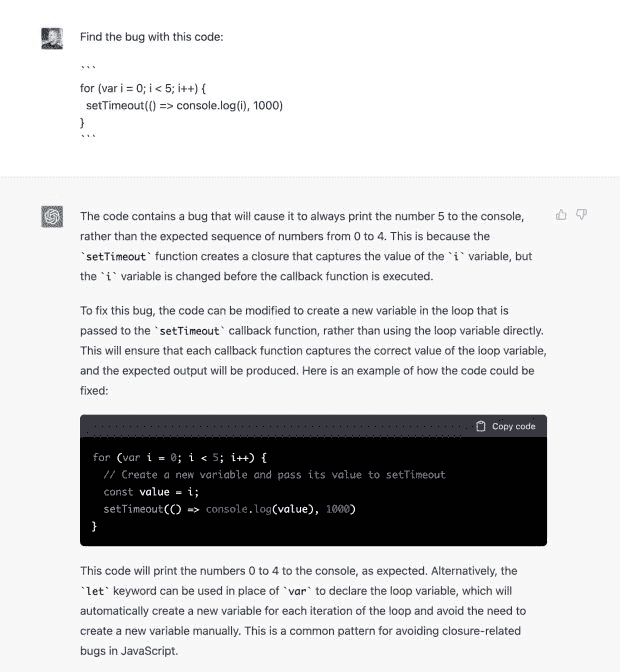
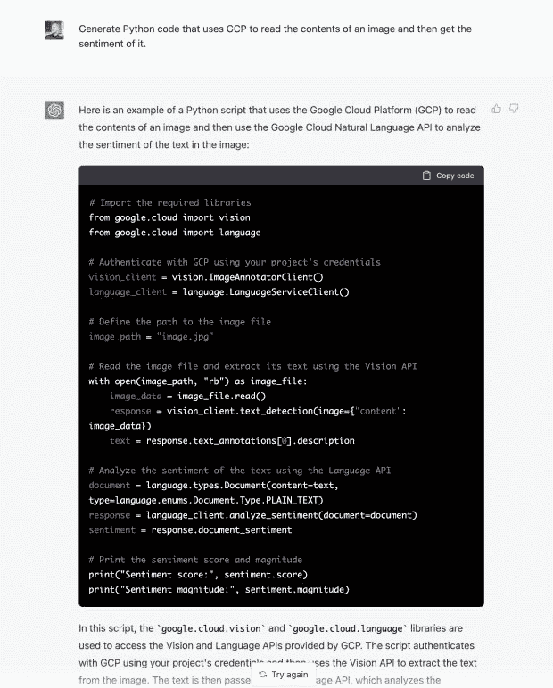

# ChatGPT:聪明，但不够聪明

> 原文：<https://thenewstack.io/chatgpt-smart-but-not-smart-enough/>

是的，人工智能可以帮助编程，但 [ChatGPT](https://openai.com/blog/chatgpt/) 还没有准备好成为你的编程伙伴，特别是在保护你的代码方面。

有一个 AI pair 编程朋友来帮助你保护你的代码不是很棒吗？我很乐意。但是，尽管 [GitHub 副驾驶](https://github.com/features/copilot)可以很方便——暂且不论[是道德的](https://thenewstack.io/this-week-in-programming-github-copilot-and-the-generational-divide/)还是[合法的](https://www.theregister.com/2022/11/11/githubs_copilot_opinion/)——[人工智能的新宠儿聊天机器人 ChatGPT](https://thenewstack.io/just-out-of-the-box-chatgpt-causing-waves-of-talk-concern/) ，还没有为黄金时间编程做好准备。

## 编程是一个不同的故事

我要告诉你的是，ChatGPT 会让高中英语老师的日子更加难过。展望未来，任何人在《杀死一只知更鸟》上布置作业，都将比任何真正的学生更有可能获得人工智能编写的文档。

但是编程，尤其是安全编程，那就是另一回事了。你需要精确，你需要考虑上下文，最重要的是，你必须是正确的，或者尽可能正确。

甚至 [OpenAI](https://openai.com/) 也承认 ChatGPT“偶尔会产生不正确或误导性的信息。”说到编码，我需要更好的。好多了。

当然，它有时也能做对一些事情。例如，它不仅可以发现并建议修复这个简单的计数错误，它还可以解释这个错误。

它还可以很好地整合服务。例如，在这里，它生成输入图像所需的 [Python 代码，然后在谷歌云平台上读取图像上的文本。](https://twitter.com/amasad/status/1598089698534395924/photo/1)

## 你不会失业的

这些都是令人印象深刻的技巧，但是你看得越多，想得越多，就越清楚你没有失去编程工作的危险……至少现在没有。

举个例子，向前看，你最好确保你代码中所有的工件依赖都是“安全的”这意味着我不希望只是在库中调用几行代码。我想看看，或者至少已经扫描了，它的[软件材料清单(SBOM)](https://www.linuxfoundation.org/research/the-state-of-software-bill-of-materials-sbom-and-cybersecurity-readiness) 和[软件工件供应链级别(SLSA)](https://slsa.dev/) 中列出的文件。ChatGPT 能做到吗？没有。

或者，ChatGPT 可以决定在我的[持续集成/持续交付(CI/CD)管道](https://practical-tech.com/2018/07/10/continuous-integration-and-delivery-tool-basics/)中运行哪些正确的测试吗？我希望。

让我们记住什么是 ChatGPT，好吗？这是一个开放的生成式预训练变形金刚 3 (GPT-3) 大型语言模型，专为聊天机器人应用程序设计。它是在一个大型对话文本数据集上训练的。它可以和你“聊天”，就像一个版本的[伊莱扎](https://web.njit.edu/~ronkowit/eliza.html)与 [IBM 沃森](https://www.ibm.com/watson)的交叉。它不是——我重复一遍，不是——设计来做编程助手的。

以前没有，将来也不会有。我预计会有一个 GPT-3 (4？)面向开发者的模型，但现在还没有。

## 编造东西

与此同时，虽然 ChatGPT 的结果看起来不错，但就其目前的形式而言，它有一个真正令人不安的方面。“这是胡说八道。”

我想这是一个高中生在做作文题时会说的话。我不指望它来自一个人工智能。也许，我应该，但我没有。而且，说到代码，我不需要一个“即兴发挥”的程序。实习生就是干这个的。

更糟糕的是，ChatGPT 会“理直气壮”地给你只是错误的答案。这就是为什么 [StackOverflow](https://stackoverflow.com/) 知道一两件关于正确回答程序员问题的事情，现在禁止任何 ChatGPT 回答。

为什么？简单。正如 StackOverflow 管理层所言，“总的来说，由于从 ChatGPT 获得正确答案的平均比率太低，由 ChatGPT 发布的答案对网站和询问或寻找正确答案的用户来说是非常有害的。”

正如我刚才指出的，“ChatGPT 产生的答案有很高的不正确率，它们通常看起来可能是好的，并且答案非常容易产生。也有许多人尝试使用 ChatGPT 来创建答案，但没有专业知识或意愿在发布之前验证答案是否正确。”

因此，为了防止栈溢出被 ChatGPT 垃圾邮件淹没，他们现在已经阻止了它。我希望他们最终会禁止这个版本，至少是永久禁止。最终，人工智能将能够回答。与此同时，我们经常会看到这样的“答案”，比如“这个问题是模糊的、不明确的、不完整的、过于宽泛的或者是修辞性的，以其目前的形式无法得到合理的回答。”

没有人说过 Stack Overflow 是一个友好的社区。

但是，在这种情况下，他们是对的。使用 ChatGPT answers 创建[分布式拒绝服务(DDoS)](https://thenewstack.io/google-cloud-stops-monster-ddos-attack/) 攻击太容易了。正如一位名叫[的作家笔下的磁铁](https://www.linkedin.com/in/pen-magnet-294691178/)所观察到的，“当摩擦/犯下某事的风险最小化时，就会有大量不合格的供给/投入这意味着 Stack Overflow 的志愿者版主真的有被人工智能生成的垃圾问题和答案淹没的危险。

与此同时，代码答案的质量将继续很差。当然，有时候，ChatGPT 是对的。有时，我会编写第一次就能编译的 C 代码，但这种情况并不经常发生！

## 不够好

不，现在，你可以玩 ChatGPT。尽情享受吧。但是不要依赖它来编程。并使用它来发现简单的不安全代码错误。对于真正的编码和安全编程来说，这还不够好。

请注意，这种情况会改变的。有时，在聚变能商业化之前，ChatGPT 后代会成为一个有用的配对编程伙伴。但我们还没到那一步。

<svg xmlns:xlink="http://www.w3.org/1999/xlink" viewBox="0 0 68 31" version="1.1"><title>Group</title> <desc>Created with Sketch.</desc></svg>