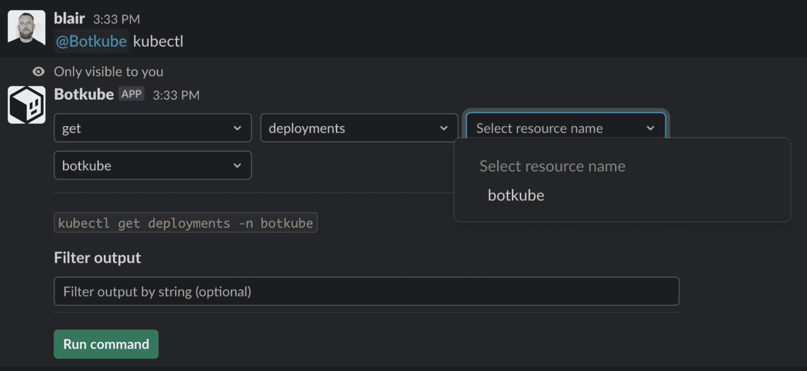
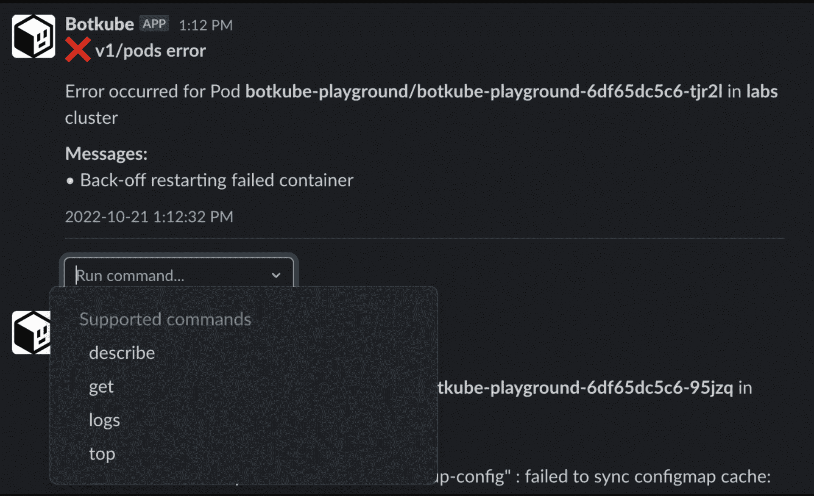

# Chatops:自动化、协作和 DevOps 文化的交汇点

> 原文：<https://thenewstack.io/chatops-where-automation-collaboration-and-devops-culture-meet/>

如果 DevOps 是为了鼓励透明度和协作，那么 Kubernetes 经常成为那些还没有完全接受这种文化的组织的一个方便的借口。如果 Kubernetes 集群能够很好地管理所有的操作——通过声明式配置和自我修复——组织会开始问，“为什么开发人员还需要了解操作呢？”

Kubernetes 和大多数云原生技术一样，将复杂性隐藏在几个抽象层之后。由于他们为技术堆栈的操作方面带来了简单性和最佳实践，因此很容易将他们作为从 DevOps 文化中后退一步并重建一些墙的借口。

前端开发人员担心实现设计系统和处理 API。运营团队担心保持集群在线和调度 pod。

但从我的角度来看，采用和迁移云原生技术是抵制这种诱惑并确保应用程序开发人员能够正确访问您的基础架构的最佳时机。借助最合适和用户友好的工具，他们应该能够监控、调试和运行开发、试运行和生产集群中的应用程序。

使用*正确的访问方式*。我们并不是说要给每个开发者打开你的 Kubernetes 王国的钥匙。我们说的是只读，为他们提供协作平台和知识，让他们通过自动化尽可能地做好自己的工作。

## 自动化和协作的交汇点

当我谈到自动化时，我不仅仅是指在没有人类干预的情况下执行动作。在开发和操作 Kubernetes 集群的某些时候，这当然会很方便，但同样重要的是通过路标或“保险杠”来简化复杂的过程，引导开发人员完成工作。

您希望开发人员解决业务问题，而不是钻进兔子洞去研究 kubectl 是如何工作的。或者，更糟糕的是，对您的云原生部署的运行状况或性能产生负面影响。

与此同时，培育一个协作的云原生环境是为了在更精细的层面上为您的技术堆栈的工作方式提供透明度，从而让开发人员从容应对复杂的技术挑战。

为什么您的组织应该通过自动化创建协作？

*   您为(还)不熟悉云原生技术的开发人员提供了安全的只读访问。如果不先给你的开发人员一些指导，你不能指望成功地改变软件开发的每一个方面。
*   您可以帮助应用程序开发人员识别潜在的问题，而无需编辑集群的状态。当需要提交错误报告或吉拉票证来升级问题时，他们可以提供知情的描述或潜在的解决方案，从而缩短反馈周期。
*   您的组织开始使用单一工具、语言和消息传递平台来分享关于基础架构运行状况的见解。
*   您拓宽了监控和调试工具的使用范围，使其多样化。因为它们在范围上也是只读的和信息性的，所以您在改进 DevOps 文化的同时也在不断地教育您的开发人员。

## 为 Kubectl 带来自动化和协作

[Botkube](https://botkube.io/) 旨在让您的 DevOps、站点可靠性工程(SRE)和开发团队简单安全地(提示:只读)直接从他们整天使用的平台(聊天应用)访问您的集群。

无论您的组织使用 Slack、Mattermost、Discord、微软团队或其他工具，应用程序开发人员现在都可以使用相同的工具与他们的同事聊天，就正在进行的项目或问题进行协作*和*以交互方式(只读)运行 kubectl，以帮助剥离这些抽象层。

随着 v0.15.0 的发布，Botkube 现在提供了一个在 Slack 中构建 kubectl 命令的交互式工具，这意味着开发人员甚至不需要花时间学习复杂的语法就可以开始探索为什么部署可能无法正确运行。

从您的组织的 Slack 中，运行`@botkube kubectl`**来选择动词、名称空间和对象，然后应用过滤器来只查找与您的搜索相关的资源。你将直接在应用程序中获得一组日志输出，而不必依赖控制台或从操作中的朋友那里获得帮助。**

 **您也可以直接从 Slack 开始响应事件。假设一个开发人员最近合并了一个拉请求，新代码正在通过您组织的 CI/CD 管道。当集群开始用更新的代码旋转新的 pod 时——崩溃。在这种情况下，您可以单击`Run command`**并从下拉菜单中选择相关选项。**

 **

最重要的是，Botkube 的自动化完全是上下文相关的，只提供在给定环境下有意义的选项，并根据开发人员有权对您的集群运行的内容进行过滤。

有了 Botkube 在协作和自动化的交叉点上的作用，开发人员可以获得舒适的缓冲器，帮助他们安全地寻找答案，而不用浪费时间查找 kubectl 参考文档或在 Slack 上提问。

## 使用 ChatOps 实现 Kubernetes 集群自动化的下一步是什么？

我们刚刚开始自动化，并通过贵组织已经使用的聊天应用程序构建协作环境。在 10 月发布的 v0.15.0 中，我们添加了我们已经提到过的交互性、事件和基于过滤的功能。

我们还刚刚发布了 v0.16.0，它引入了动作，这是透明和优化的另一个关键元素。您可以配置 Botkube，在集群中每次发生匹配事件时，使用 kubectl 自动对特定事件采取行动。

监控事件的自动化使我们离 Botkube 成为您的集群的控制中心更近了一步，Botkube 是一个单一的应用程序，它根据特定的错误或警报采取预定义的操作，为每个人简化云原生基础架构。我们计划在不久的将来为额外的警报和执行器添加更多的可扩展性，让您根据您的安全策略自动验证新的清单。

开始使用 [Botkube](https://docs.botkube.io/) 只需几分钟就可以开始直接从 Slack、Mattermost、Discord、微软团队或者你选择的其他服务接收警报和运行命令。而且，一旦您启用了 ChatOps，我们很乐意在我们活跃的 [Slack 频道](https://join.botkube.io/)中听到您的意见，在那里我们不仅讨论了云原生基础设施的更好协作，还设计了 Kubernetes 自动化的未来。

<svg xmlns:xlink="http://www.w3.org/1999/xlink" viewBox="0 0 68 31" version="1.1"><title>Group</title> <desc>Created with Sketch.</desc></svg>****