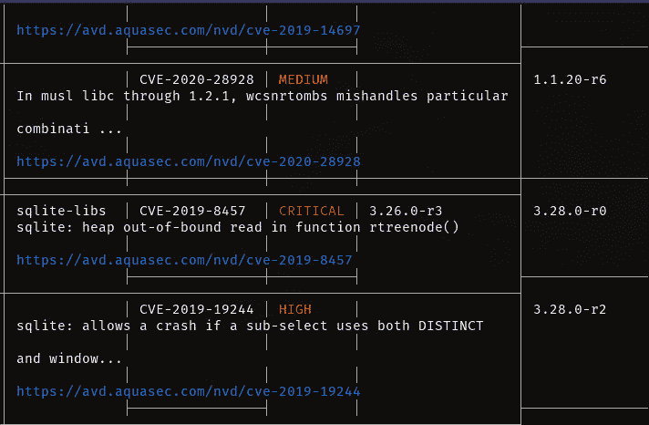

# 用 Trivy 检查容器映像漏洞

> 原文：<https://thenewstack.io/check-for-container-image-vulnerabilities-with-trivy/>

安全性应该是容器部署最重要的方面之一，尤其是对于依赖于高度扩展的应用程序和服务的企业生产环境，这些应用程序和服务不仅会有大量需求，还会与其他服务、服务器、API 等交互。

如果你在安全方面有所松懈，你可能会让你的公司[向黑客](https://thenewstack.io/lets-talk-about-cloud-threat-hunting/)敞开大门。只需要一个黑客进入一个集装箱，他们就能得到通往你王国的[钥匙](https://thenewstack.io/5-steps-to-effective-cloud-detection-and-response/)。

你不想那样。

问题是安全必须从底层开始，否则，一切都是易受影响的。请这样想:你不能在有裂缝、洞和其他漏洞的地基上建房子，还指望它是安全的。最终，房子会倒塌。容器也是一样。如果你把它们建立在有漏洞的基础上，它们就不可能安全。

换句话说，用于部署容器化应用程序的映像必须没有漏洞。

如何知道映像是否包含漏洞？你扫描它。如何扫描容器映像中的漏洞？用类似 [Trivy](https://github.com/aquasecurity/trivy) 的工具，最早由 [Aqua Security](https://www.aquasec.com/?utm_content=inline-mention) 开发。

Trivy 是一个命令行工具，用于扫描容器图像中的漏洞。Trivy 可以扫描图像、文件系统，甚至 Git 库，输出其中包含的任何和所有漏洞。像这样的工具应该被认为是任何依赖于容器化应用程序和服务的容器开发者或企业的必备工具。

我将向大家展示 Trivy 是如何在 Ubuntu Server 22.04 上安装和使用的。但是，要知道 Trivy 可以安装在以下平台上:

*   人的本质
*   RHEL
*   一种自由操作系统
*   Arch Linux
*   macOS(通过自制软件)
*   通过码头工人或舵手

我们开始吧。

## 要求

对于本教程，您需要一个 Docker Server 22.04 的运行实例和一个拥有 sudo 权限的用户。就是这样。该去工作了。

## 如何安装 Docker

如果您还没有安装 Docker，现在就安装吧。

首先，用命令安装必要的依赖项:

```
sudo apt-get install apt-transport-https ca-certificates curl gnupg lsb-release  -y

```

接下来，使用命令添加官方 Docker GPG 键:

```
curl  -fsSL https://download.docker.com/linux/ubuntu/gpg | sudo gpg --dearmor -o /usr/share/keyrings/docker-archive-keyring.gpg

```

使用以下命令添加 Docker 存储库:

```
echo  "deb [arch=amd64 signed-by=/usr/share/keyrings/docker-archive-keyring.gpg] \n
https://download.docker.com/linux/ubuntu $(lsb_release -cs) stable"  |  sudo tee  /etc/apt/sources.list.d/docker.list  &gt;  /dev/null

```

用:
更新 apt

使用命令安装 Docker:

```
sudo apt-get install docker-ce docker-ce-cli containerd.io  -y

```

接下来，您必须使用命令将您的用户添加到 docker 组:

```
sudo usermod  -aG docker  $USER

```

注销并重新登录以使更改生效。

## 如何安装 Trivy

我们现在可以安装 Trivy 了。首先下载并添加 Aqua 安全 GPG 密钥:

```
wget  -qO  -  https://aquasecurity.github.io/trivy-repo/deb/public.key | sudo apt-key add -

```

使用以下命令添加 Aqua Security 存储库:

```
echo deb https://aquasecurity.github.io/trivy-repo/deb $(lsb_release -sc) main | sudo tee -a /etc/apt/sources.list.d/trivy.list

```

用
更新 apt

使用命令安装 Trivy:

```
sudo apt-get install trivy  -y

```

## 如何使用 Trivy

使用 Trivy 非常简单。首先，我们要拉下一张图片进行测试。对于我们的第一个测试，我们将下拉 python:3.4-alpine 的图像。使用命令
完成此操作

```
docker pull python:3.4-alpine

```

一旦图像被提取完毕，使用命令对其运行 Trivy】

```
trivy image python:3.4-alpine

```

Trivy 将立即开始工作，并开始输出它发现的任何漏洞。如您所见(图 1)，Trivy 发现了许多漏洞，包括一些标记为中、高和严重的漏洞。



图 1:对 Python 图像运行 Trivy 的输出。

输出将包括一个漏洞 CVE 编号和一些相关信息，以及更多信息和(在某些情况下)缓解问题的步骤的链接。

让我们运行另一个测试，这次是在最新的 Ubuntu 映像上。用
拉动图像

```
docker pull ubuntu:latest

```

使用
运行扫描

```
trivy image ubuntu:latest

```

这次 Trivy 只发现了极少数的漏洞，最高等级为中。

## 在客户机/服务器模式下运行 Trivy

您可以随时设置 Trivy 为客户机/服务器模式。这样做的目的是使用服务器来存放漏洞数据库(这样客户端就不必这么做了)。然后，您可以从远程客户端运行 Trivy，使用服务器地址来访问缓存的数据库。这是怎么做的。

在服务器上，使用命令:
在服务器模式下启动 Trivy

```
trivy server  --listen  0.0.0.0:8080

```

接下来，确保 Trivy 也安装在客户机上，使用 docker 下载一个图像进行扫描，然后使用命令:
根据服务器上的漏洞数据库进行测试

```
trivy client  --remote http://SERVER:8080 IMAGE

```

其中 SERVER 是服务器的 IP 地址，IMAGE 是您要扫描的图像。例如，服务器可能位于 IP 地址 192.168.1.151，映像是 ubuntu:latest。命令应该是:

```
trivy client  --remote http://192.168.1.151:8080 ubuntu:latest

```

客户端将联系服务器，并根据服务器上缓存的漏洞数据库扫描图像。

这就是用 Trivy 命令扫描 Docker 图像的全部内容。每次你拉一个新的形象，你应该立即扫描它的漏洞，并根据输出。通过确保您使用的映像没有漏洞(尤其是那些标记为高或关键的)，您可以确保您的容器部署建立在坚实的基础上。

<svg xmlns:xlink="http://www.w3.org/1999/xlink" viewBox="0 0 68 31" version="1.1"><title>Group</title> <desc>Created with Sketch.</desc></svg>