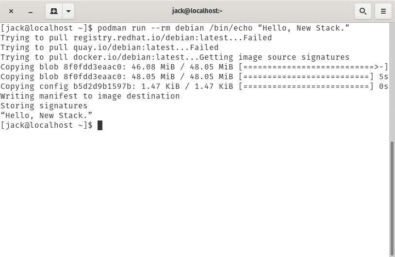

# 看看 Podman，Red Hat 的无后台程序 Docker 替代产品

> 原文：<https://thenewstack.io/check-out-podman-red-hats-daemon-less-docker-alternative/>

你知道吗，Red Hat Enterprise Linux 8 和 CentOS 8 都停止了对 Docker 容器运行时引擎的官方支持。是的，是真的。因此，你有两个选择:

*   为了保持最新版本的 **docker-ce** 的安装，不断地经历磨难。
*   选择一个替代品。

虽然你可以安装 Docker 引擎的社区版，但是 **containerd.io** 有一个问题会让你保持警惕。这可能对您来说没问题，但是其他管理员更喜欢使用官方支持的工具，这样就不需要伴随这种安装的麻烦。

这就是波德曼(以前的 kpod)的用武之地。

Podman 是一个新的、开源的容器引擎，可以与容器以及 pod(部署在同一台主机上的多组容器)无缝协作。Podman 是容器引擎的一个独特之处，因为它实际上并不依赖于守护进程，而是将容器和 pod 作为子进程来启动。Podman 是用于与 libpod 交互的 CLI 工具，libpod 是一个允许其他工具管理 pod 和容器的库。任何使用过 Docker CLI 的人都会立即感到与 Podman 无拘无束，因此从 Docker 到 Podman 的迁移应该是无缝的。

我想带你看一下安装和使用 Podman 的过程。我将在 CentOS 8 上演示。

## 你需要什么

除了具备 Docker CLI 和容器的一般工作知识外，您还需要具备:

*   CentOS 8 的运行实例。
*   拥有 **sudo** 权限的用户。

### 一句警告

波德曼正在大力发展。您必须知道的一个问题是，目前，某些 Podman 命令必须以 root 用户身份运行。一个例子是使用端口绑定。假设您想要将外部端口 80 绑定到内部端口 8080(使用-p 80:8080)。为此，必须使用 **sudo** 运行容器部署命令。

因为 Podman 不使用守护进程，所以很难说这是否会带来安全风险。然而，我的猜测是开发者将会在未来的版本中增加使用没有 sudo 的端口绑定的能力。

现在，开始安装。

### 安装 Podman

安装波德曼有两条路可走。您可以使用以下命令只安装 Podman:

`sudo dnf install podman -y`

或者，您可以使用以下命令安装整个容器工具套件(包括 Podman ):

`sudo dnf install @container-tools -y`

这就是波德曼装置的全部内容。

## 使用

让我们开始使用波德曼。如果您使用过 Docker CLI，那么 Podman 提供的大部分功能将会非常熟悉。

例如，为了获取官方的 NGINX 映像，您可以发出以下命令:

`podman pull nginx`

首先，波德曼将在 registry.redhat.io 中查找 NGINX 映像的最新版本。它在那里找不到它，所以它将移动到 docker.io(在那里它将定位有问题的图像)。提取映像后，您可以使用以下命令查看所有下载的映像，以确保它在那里:

`podman images`

您应该看到新提取的图像及其标签、图像 ID、创建日期和大小(**图 1** )。

**图 1:**NGINX 图像已经成功提取。

要删除映像，请发出以下命令:

`podman rmi ID`

其中 ID 是图像 ID 的前四或五个字符。

现在让我们部署一个简单的容器。我们将提取官方的 Debian 映像，然后让它使用它的内部 echo 命令打印出消息，“你好，新堆栈！”为此，部署命令将是:

`podman run --rm debian /bin/echo “Hello, New Stack.”`

Debian 的官方图像将被提取出来，我们的消息将被打印出来(图 2 )。

**图 2:** 我们的简单容器已经运行。

现在，您可以使用命令
来查看哪些容器正在运行

当然，我们部署的容器不是以分离模式运行的，所以它几乎一启动就结束了。让我们运行一个更复杂的容器。这一次，我们将使用以下命令部署一个基本的 web 服务器:

`sudo podman run -dt -p 8081:80/tcp -e HTTPD_VAR_RUN=/var/run/httpd -e HTTPD_MAIN_CONF_D_PATH=/etc/httpd/conf.d \`

`-e HTTPD_MAIN_CONF_PATH=/etc/httpd/conf \`

`-e HTTPD_CONTAINER_SCRIPTS_PATH=/usr/share/container-scripts/httpd/ \`

`registry.fedoraproject.org/f27/httpd /usr/bin/run-httpd`

注意，我们不得不雇用 sudo。这是因为我们将外部端口 8081 映射到内部端口 80。容器将展开。您可以看到它在运行(**图 3** )，命令如下:

`sudo podman ps -a`

**图 3:** 我们的容器被列为正在运行。

要停止该容器，我们可以发出以下命令:

`sudo podman stop ID`

其中 ID 是容器 ID 的前四或五个字符。

最后，为了删除容器，我们发出命令:

`sudo podman rm ID`

其中 ID 是容器 ID 的前四或五个字符。

让我们部署一个包含我们可以访问的 web 服务器的容器。我们将使用官方的 NGINX 映像，并使用以下命令进行部署:

`sudo podman run -dt --name nginx nginx`

部署容器后，使用以下命令定位其 IP 地址:

*sudo pod man inspect-f " { { . network settings . IP address } } " nginx*

上面的命令应该会打印出一个 10.88.0.x 的 IP 地址(**图 4** )。

**图 4:** 我们的 IP 地址。

让我们用以下命令访问容器 bash shell:

`sudo podman run -it --rm nginx /bin/sh`

您现在应该会看到一个提示(通过#字符)。使用命令安装 w3m 基于文本的浏览器:

`apt-get update
apt-get install w3m`

一旦安装了 w3m，使用以下命令确保 NGINX 服务器提供内容:

`w3m http://IP`

其中 IP 是正在运行的容器的 IP 地址。您应该会看到 NGINX 问候语(**图 5** )。

**图 5:** NGINX 正在提供内容。

这是安装和使用波德曼的基础。当然，还有更多的内容，所以我们稍后将深入更多的用例。祝你愉快！

<svg xmlns:xlink="http://www.w3.org/1999/xlink" viewBox="0 0 68 31" version="1.1"><title>Group</title> <desc>Created with Sketch.</desc></svg>