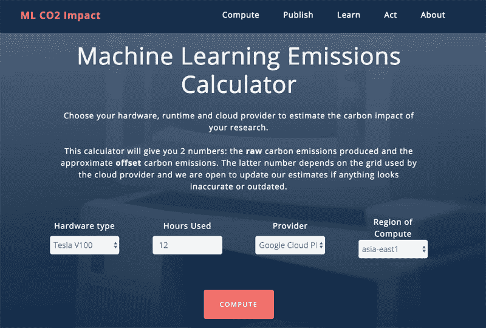

# 使用机器学习排放计算器检查您的 ML 碳足迹

> 原文：<https://thenewstack.io/check-your-ml-carbon-footprint-with-the-machine-learning-emissions-calculator/>

面对因持续的气候紧急事件而迫在眉睫的全球灾难的可怕报道，我们中的许多人都在长时间、认真地审视我们日常生活中的碳足迹——无论是来自我们吃的食物、我们开车的次数还是我们飞行的频率。但有时最无形的东西实际上可能比我们想象的排放更多的碳——也就是说，与创建机器学习模型相关的惊人的碳足迹——同样的技术支撑着我们智能手机、数字个人助理和电脑上的应用程序。

虽然*使用*这样的技术不一定会排放那么多的碳，但令人担忧的原因在于*训练*人工智能的计算过程的碳影响背后——以及研究人员和公司是否能够获得足够的信息来选择碳密集度较低的选项。

直到现在，人工智能研究人员还没有一种简单可行的方法来量化碳的影响。但这种情况正在改变，这要归功于来自加拿大蒙特利尔学习算法研究所( [MILA](https://mila.quebec/en/) )、 [Element AI](https://www.elementai.com/) 和 [Polytechnique Montreal](https://www.polymtl.ca/expertises/en/international-reference-centre-life-cycle-products-processes-and-services-ciraig) 的一个团队，他们最近发布了一个工具，旨在帮助那些在人工智能领域工作的人估计在训练他们的机器学习模型时产生了多少碳。该项目旨在提高人们的意识，同时也促进对开发这种算法的环境影响的进一步讨论。

训练人工智能模型的碳足迹“经常被忽视，因为准确性确实是人们考虑的主要因素，”MILA 的人工智能研究员、该研究的合著者之一 Alexandra Luccioni 说。“但随着模型和数据集变得越来越大，能源成本(和环境影响)也会越来越大。”

事实上，随着人工智能研究领域的扩展，越来越强大和耗电的硬件，如 GPU(图形处理单元)，正被用来为各种应用程序训练机器学习模型，从[自然语言处理](https://thenewstack.io/recent-advances-deep-learning-natural-language-processing/)到[计算机视觉](/google-develops-adversarial-example-images-that-fool-both-humans-and-computers/)。然而，随着人工神经网络变得更加复杂，需要更多的计算能力(因此需要更多的能量)。这一切都是以环境成本为代价的——尽管对绝大多数人工智能专家来说，环境成本的数量几乎是未知的。

## 量化机器学习的碳影响

为了解决这个问题，该团队的[机器学习排放计算器](https://mlco2.github.io/impact/)被设计成考虑几个主要因素:系统硬件消耗的能量；培训时间的长短；云计算服务提供商正在使用的服务器的地理位置；该特定地区生产的每单位电力的二氧化碳排放量；以及云提供商购买的任何潜在的碳补偿。一旦这些变量被输入，计算器就可以估计出在训练任务中产生了多少碳。

正如论文所指出的，很难准确估计云服务器排放的二氧化碳量，因为这些数据通常不会公开。为了解决这个问题，该研究假设服务器连接到当地的电网，并将这些电网中公开可用的数据与谷歌云平台、微软 Azure 和亚马逊网络服务等主要云提供商的已知服务器位置进行交叉引用，从而允许计算器做出评估。毫不奇怪，云服务器的物理位置以及其本地电网是否使用可再生能源会对最终的碳排放量产生巨大影响。

Luccioni 告诉我们:“仅仅根据你的模型在哪里训练，就可以在排放方面产生如此大的差异，这真的令人印象深刻。”“人们通常根据可用性、距离或个人偏好来选择服务器，但在魁北克或加利福尼亚这样的地方选择低碳服务器可以减少 100%的碳排放量。”

除了根据服务器的位置以及他们是否使用可再生能源或购买碳补偿来谨慎选择云提供商，另一个可以显著降低碳排放的措施是尽可能避免从头训练人工智能模型，这[以前的研究](https://www.spglobal.com/marketintelligence/en/news-insights/trending/HyvwuXMO9YgqHfj7J6tGlA2)已经表明，与使用预先训练的模型相比，这可能会将排放量推高很多。为此，像谷歌这样的大型科技巨头可以考虑分享他们的模型，以便计算资源较少的人可以在这些模型的基础上进行构建，而不是从零开始在训练中产生更多的碳。随着团队项目的继续发展，它最终提出了重要的问题，即减少人工智能碳足迹的最佳实践可能是什么。

“注意一个模型产生的二氧化碳量，并试图进行权衡(例如获得的精确度与产生的碳量)，这对个人来说是一个很好的第一步，”Luccioni 说。“在公司层面，抵消或安装更高效的硬件肯定会大有帮助。”
尽管如此，在更准确地预测人工智能的碳排放之前，还有很长的路要走，Luccioni 说:“在不同地点的电网产生的二氧化碳方面，透明度非常缺乏。因此，虽然我们目前使用了我们能找到的最好的公开数据，但它肯定不是 100%准确，因为我们没有这些信息。为了改进我们的工作，我们呼吁各公司披露其排放量和能源消耗，以便我们能够改进我们的估计。我们希望我们的工作，以及其他工作，将为这些对话和辩论打开大门，以量化我们领域的环境影响，并为减少环境影响做出积极的改变。”

阅读团队的[论文](https://arxiv.org/pdf/1910.09700.pdf)，查看他们的[机器学习排放计算器](https://mlco2.github.io/impact/)。

来自 Pixabay 的 marian anbu juwan 的专题图片。

<svg xmlns:xlink="http://www.w3.org/1999/xlink" viewBox="0 0 68 31" version="1.1"><title>Group</title> <desc>Created with Sketch.</desc></svg>