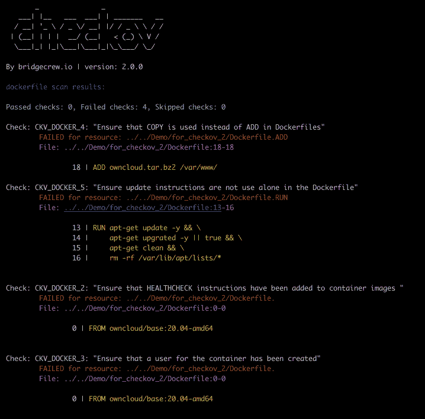
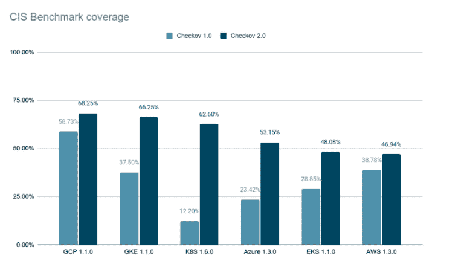
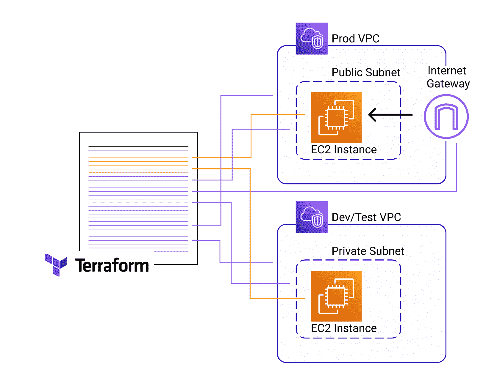

# Checkov 2.0:以代码形式对基础设施进行上下文感知的安全扫描

> 原文：<https://thenewstack.io/checkov-2-0-context-aware-security-scanning-for-infrastructure-as-code/>

[](https://www.linkedin.com/in/taylorbsmith/)

 [泰勒史密斯

泰勒是 Prisma Cloud bridge crew 的高级产品营销经理，负责从构建时到运行时的全生命周期云原生基础设施和应用安全。此前，他曾在 Gremlin、Cisco 和 NetApp 担任产品营销和战略职位。](https://www.linkedin.com/in/taylorbsmith/) [](https://www.linkedin.com/in/taylorbsmith/)

2019 年， [Checkov](https://github.com/bridgecrewio/checkov) (我很幸运地称之为我的同事)的创造者们开始着手一项任务，即创造一种开发者友好的方式来保护基础设施即代码(IaC)模板。当超过 20%的地形模板和超过 40%的云层模板被错误配置时，这是一项艰巨的任务。模板中的错误配置会导致生产中的实际风险，例如 SSH 端口对外界开放和未加密的数据库。这就是为什么 Bridgecrew 团队(现在是 Palo Alto Networks Prisma Cloud 的一部分)开始思考在 IaC 模板被提供之前(无论是在开发期间还是在构建阶段)发现问题将会如何改变游戏规则。

将近 3，400 次提交和 140 万次下载之后，Checkov 继续以真正开源的方式发展和迭代。最近，该项目庆祝了其最大的更新，当时它达到了 2.0 版本。



让我们看看我们是如何走到这一步的，并了解为什么 Checkov 2.0 比以往任何时候都更好，因为它的覆盖范围更广，包含 250 个新策略和一个全新的基于图形的后端框架，以支持更复杂的用例。

## 切科夫简史

Checkov 最初是一个用于 Terraform 模板的开源静态代码分析器。它只包含 50 份 100%由内部创建的保单。当时，还有其他针对 Terraform 模板的静态分析器，但它们有着陡峭的学习曲线和复杂的定制策略语法。Checkov 是一个开发人员友好的选择，可扩展且由社区驱动。从那以后，我们看到了很多创新:

*   增加了对 [AWS CloudFormation](https://bridgecrew.io/blog/announcing-cloudformation-support-in-checkov/) 和[Azure Resource Manager(ARM)](https://bridgecrew.io/blog/scanning-azure-resource-manager-arm-templates-with-bridgecrew/)的支持，包括 AWS CDK 生成的模板。
*   扩大覆盖范围，以确定和修复 [Kubernetes](https://bridgecrew.io/blog/kubernetes-static-code-analysis-with-checkov/) 清单和[头盔](https://bridgecrew.io/blog/scan-helm-charts-for-kubernetes-misconfigurations-with-checkov/)图表的错误配置。
*   上移堆栈以支持[无服务器框架](https://www.checkov.io/5.Policy%20Index/serverless.html)配置。
*   最近，添加了 [Dockerfile](https://www.checkov.io/5.Policy%20Index/dockerfile.html) 扫描来识别创建容器映像的命令中的错误配置。
*   根据框架和社区建议定期添加现成的策略。我们现在有 800 份保单了！



即使是多语言存储库，比如带有用于编排的 Kubernetes 清单和用于创建容器图像的 Dockerfiles 的存储库，也会被自动识别并单独扫描。

## 传统静态分析的局限性

传统的文件静态分析对于逐行查找代码中的问题非常有效。问题是，在声明性 IaC 模板中，资源依赖关系不是线性排列的。虚拟机可以首先在文件中列出，但需要在文件中第二个出现的防火墙规则之后进行配置。



为了简化开发人员的工作，声明性 IaC 工具可以解释和部署基础设施，而不管它在模板中的顺序如何。这对开发人员来说很好，但对扫描仪来说很难。

标准的静态分析无法发现复杂的资源相互依赖关系，例如 VPC 包含了一个特定的安全组。这增加了更多的噪音和假阴性，因为除非您知道错误配置的资源所关联的资源，否则很难知道该资源的实际风险。例如，如果一个未加密的数据库位于一个不能通过互联网访问的开发或测试 VPC 中，那么它就不是一个问题。

这种复杂的关系是我们推出 Checkov 2.0 的原因，Checkov 2.0 是第一款开源的基于图形的 IaC 安全工具。与传统的后端相比，图可以更好地解释代码中的关系。像变量和附加资源这样的东西创建了一个关系树，可以方便快捷地查询信息。(事实上，在测试中，我们发现基于图形的后端快了 3 倍！)

## 两个只有图形才能解决的真实用例

让我们探索几个例子，展示基于图形的扫描如何更好。

对 Terraform 模板的静态分析可以确定所有 AWS 弹性块存储(EBS)资源都打开了加密。但是，如果未加密的 EBS 卷没有连接到 EC2 实例，那么它的优先级要比连接到生产 EC2 实例的未加密 EBS 卷低得多。需要一个[图来解释这个连接](https://github.com/bridgecrewio/checkov/blob/master/checkov/terraform/checks/graph_checks/aws/EncryptedEBSVolumeOnlyConnectedToEC2s.yaml)。

开发者也可以使用 [Python](https://bridgecrew.io/blog/creating-and-sharing-custom-policies-as-code-with-checkov/) 或者使用[YAML](https://docs.bridgecrew.io/docs/yaml-format-for-custom-policies)Checkov 2.0 添加他们自己的定制策略。让我们分解一个基于图的策略的例子，它可以检查上面的第一个用例。

如果你想确保你的 Azure PostgreSQL 不能被直接访问并被标记，没有一个检查。您需要确保没有防火墙规则附加到数据库，默认情况下阻止所有外部访问，或者任何附加的防火墙规则没有 0.0.0.0 的 IP 地址。

```
metadata:
  name:  "Ensure that only encrypted EBS volumes are attached to EC2 instances"
  category:  "ENCRYPTION"
  id:  "CKV2_AWS_2"
definition:
  and:
    -  or:
      -  cond_type:  "connection"
        resource_types:
          -  "aws_volume_attachment"
        connected_resource_types:
          -  "aws_ebs_volume"
        operator:  "not_exists"
      -  and:
          -  cond_type:  "attribute"
            resource_types:
              -  "aws_ebs_volume"
            attribute:  "encrypted"
            operator:  "equals"
            value:  true
          -  cond_type:  "connection"
            resource_types:
              -  "aws_volume_attachment"
            connected_resource_types:
              -  "aws_ebs_volume"
            operator:  "exists"
    -  cond_type:  "filter"
      attribute:  "resource_type"
      value:
        -  "aws_ebs_volume"
      operator:  "within"

```

该策略检查没有配置的卷连接到其他资源，或者连接到其他资源的所有 EBS 卷都已加密。

我们可以自定义此策略，通过在 YAML 文件的 and 块中添加以下内容，确保所有 EBS 卷都已加密和标记。

```
cond_type:  "attribute"
 resource_types:  "all"
 attribute:  "tags.env"
 operator:  "exists"

```

通过将此自定义策略或您构建的任何其他策略添加到/checkov/{provider}/checks/中的适当文件夹，可以将其添加到每次扫描的 Checkov 中。您还可以将它们添加到本地文件夹或存储库中，并使用–external-checks-dir 或–external-checks-git 标志将它们添加到扫描中。

## 期待大事情的到来

随着 Checkov 从最初推出到 2.0，我们已经看到了很多变化。我们扩展了模板的类型，迁移到新的后端体系结构，并大幅增加了策略的数量。

作为 Palo Alto Networks 收购 Bridgecrew 的一部分，我们承诺继续扩展 Checkov 的策略库，并投资于基于其威胁研究人员团队的 Checkov 进一步开发。随着 Palo Alto Networks 在 Checkov 和其他开源项目上的大量投资，预计会看到更多的改进。

<svg xmlns:xlink="http://www.w3.org/1999/xlink" viewBox="0 0 68 31" version="1.1"><title>Group</title> <desc>Created with Sketch.</desc></svg>