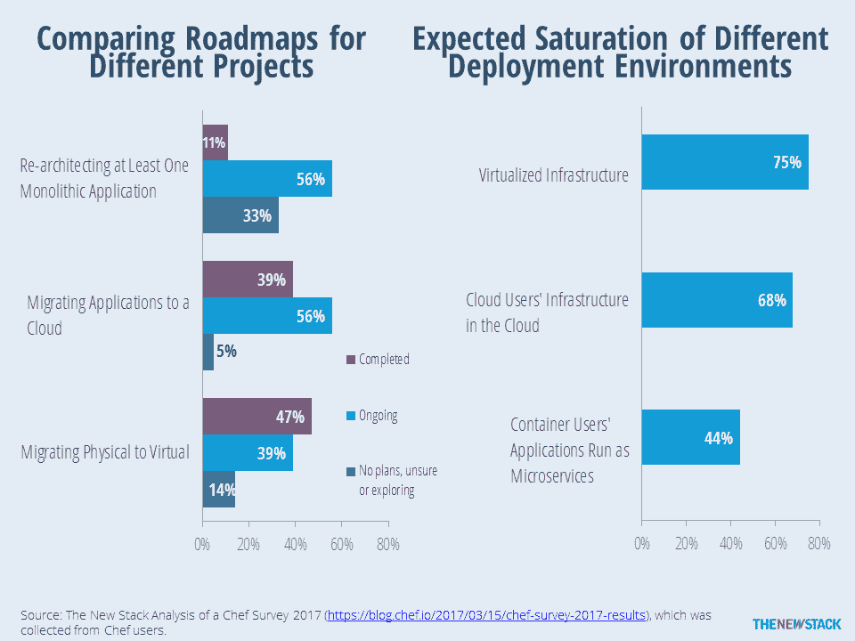
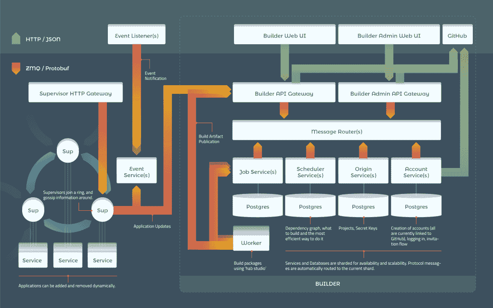

# Chef 将其 IT 自动化产品组合引入云

> 原文：<https://thenewstack.io/chef-brings-automation-portfolio-cloud/>

IT 管理软件提供商 Chef 认为，将 IT 运营转移到云将需要大量的自动化。为此，该公司已将其更多技术整合到其软件部署平台 [Chef Automate](https://thenewstack.io/chef-rolls-management-ingredients-one-package-chef-automate/) 中，以进一步简化应用程序容器化和迁移到云的过程。

首席营销官[肯·切尼](https://www.linkedin.com/in/kencheney/)、[主厨](https://www.chef.io/)说:“很多公司都在关注下一代技术，比如云和集装箱化。Chef 可以帮助这些组织“创建一个一致的和可重复的模式”，将软件部署到这些新环境中，Cheney 说。

“持续自动化，当你做得对的时候，是你当前环境和你未来需要去的地方之间的桥梁，”切尼说。

这些更新将于本周在德克萨斯州奥斯汀举行的公司年度用户大会上展示。

Chef Automate[软件包建立在该公司广泛使用的开源软件 T12 上，该软件以 IT 自动化软件 T13 命名，现在包括安全和合规检查功能，以及进一步自动化组装和更新基于容器的应用程序的能力。该公司还发布了许多插件，以将合规性检查操作扩展到基于 AWS、Azure 和 VMware vSphere 的云服务中。](https://www.chef.io/products/automate/)

Automate 的合规检查功能来自 Chef 的开源 [InSpec](https://thenewstack.io/chef-bulks-compliance-workflow-tools/) ，于 2015 年作为独立软件推出。InSpec 将应用程序的当前配置与一组安全检查进行比较，以确保该软件包中包含的第三方软件库中不存在漏洞。

切尼解释说:“作为每一个软件构建的一部分，每次你推动一个变化，你都可以对你的基础设施和应用程序栈进行代码测试，找出漏洞。”。该软件可以检查已知的漏洞，如最近的 WannaCry 随机攻击，以及确保软件包中使用的第三方软件(如 ssh)是最新版本。InSpec 还根据组织的外部或内部合规性政策指南进行检查。

InSpec 软件也已更新，可用于云部署。三个新的孵化项目——InSpec AWS、InSpec Azure 和 InSpec VSP here——[为扫描云部署提供了一组 API](https://blog.chef.io/2017/05/23/inspec-launches-support-cloud-platform-assessments/)，以检查漏洞和合规性。

## 栖息地开始流行

[去年推出](https://thenewstack.io/chef-offers-habitat-application-automation-alternative-bimodal/)， [Habitat](https://www.habitat.sh/) 是该公司的开源软件，用于打包、构建和管理容器内的便携应用。Chef 将 Habitat 开发成了 Automate，并继续开发这项技术。今年推出了一组名为 Habitat Scaffolding 的助手功能，加速了用 Ruby on Rails、Go 和 Node.js(以及其他语言和框架)构建的应用程序的容器化。

为了进一步加快部署过程，该公司还推出了[栖息地计划](https://blog.chef.io/2017/05/23/enterprise-ready-habitat-plans-now-available/)，这是一套为各种常用场景快速推出系统软件的计划。这些建筑平面图涵盖了一系列常见用途:

*   **大数据**:针对卡珊德拉、火花、风暴、卡夫卡、动物园管理员、CrateDB 的部署。
*   **数据库** : PostgreSQL，MySQL，Redis，Shield 备份。
*   **开发者和内容工具** : Jenkins，Drupal，WordPress。
*   **监控**:普罗米修斯，格拉法纳。
*   **中间件** : WebSphere，Mulesoft，Varnish，RabbitMQ，Consul。

Habitat 现在还具有在应用程序所依赖的软件库更新时自动重建核心应用程序的能力。Chef 还为 Habitat 推出了[公共构建服务，这将简化在托管环境中构建和存储基于 Habitat 的应用程序的过程。](https://blog.chef.io/2017/05/23/habitat-build-service-builder/)

【T2

切尼说，自从推出 Habitat 以来，Chef 已经看到了人们对这项技术的极大兴趣，特别是“那些正在将容器投入生产的组织”。他说，它解决了如何将复杂的应用程序打包到一个容器中并“让它正确工作”的难题。一家公司使用 Habitat 来打包遗留应用程序，以便它们可以在微服务环境中运行。另一个使用该软件为 Cloud Foundry 平台打包有状态的应用程序。

预计今年将有 1，500 多人参加 ChefConf。Chef 软件已经被下载了超过 4000 万次，该公司估计它有一个围绕该软件的 70，000 名成员的社区，以及 25，000 个使用该软件的组织。该公司在过去两年中将其企业客户翻了一番，并在 2016 年实现了 50%的销售增长，这在很大程度上归功于向欧洲和亚洲市场的扩张。

查看本周的新堆栈，了解 ChefConf 2017 的更多报道。

Chef、Cloud Foundry Foundation 和 VMware 是新堆栈的赞助商。

<svg xmlns:xlink="http://www.w3.org/1999/xlink" viewBox="0 0 68 31" version="1.1"><title>Group</title> <desc>Created with Sketch.</desc></svg>