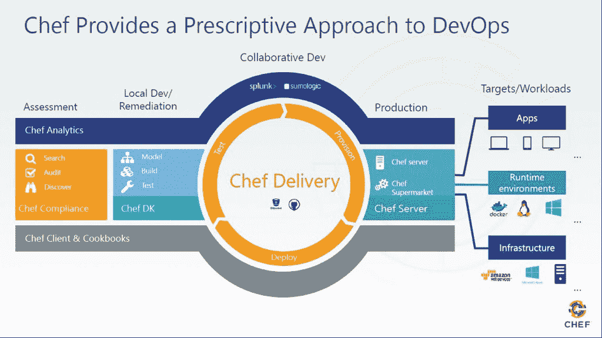
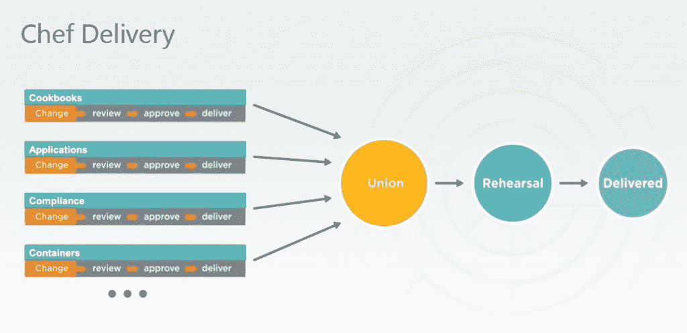
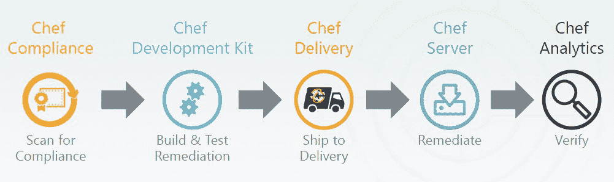

# Chef 扩充了合规性和工作流程工具

> 原文：<https://thenewstack.io/chef-bulks-compliance-workflow-tools/>

Chef 正在为其广受欢迎的同名配置管理软件配备额外的工作流和合规性工具，旨在为企业软件开发和部署带来 DevOps 和更严格的控制。

Chef 周二在其[欧洲共同体峰会](https://www.chef.io/summit/)上宣布了 [Chef Delivery](http://techcrunch.com/2015/04/01/chef-launches-chef-delivery-devops-workflow-service-for-the-enterprise/) 的全面上市，这是一项工作流管理服务，它于去年 4 月作为一个仅限受邀者的程序推出。

此外，它还增加了其组合 Chef Compliance，整合了其夏季收购的德国安全供应商 [VulcanoSec](http://vulcanosec.com/) 的技术，将合规技术引入 Chef 平台。

它正在启动一项企业转型实践，由前 GE Capital 首席技术官 Justin Arbuckle 领导，以帮助公司成功采用 DevOps 实践，并成为“高速软件组织”，据营销副总裁 Jay Wampold 说。

就在两个月前，首席执行官 Barry Crist 宣布了 4000 万美元的新投资，称新投资将使 Chef 成为 DevOps 的主流。他还指出，集装箱和合规是该公司将重点关注的两个领域。

> “你看到的实际上是 Chef 向工作流自动化和变更管理的扩展。它将基础架构的原则作为代码，并将它们作为代码应用于整个堆栈中的所有内容，然后提供规定的工作流”，Jay Wampold，首席营销副总裁。

Wampold 表示，Chef 的核心自动化业务正在加速增长，企业刚刚意识到并接受 Chef。

他说，在采用 DevOps 的障碍中，很难将不同的工具链缝合在一起，在工作流中反复思考，以及将安全性和合规性作为事后的想法。

Chef Delivery 自动对基础设施、运行时环境和应用程序进行更改，而且还提供了一个自动化测试和持续集成及交付的框架。它为开发人员的代码提供了度量、权限管理和全面的变更历史。

对 Chef cookbooks、应用程序或基础架构的每一项单独更改都会进入一个名为“Union”的共享管道空间，然后进入生产前准备区“排练”，最终进入“交付”的生产环境。

Chef Delivery 是关于“允许团队在复杂的管道中合作，其中变化可能影响具有多种依赖关系的多个团队，这些团队可能围绕着它进行治理——谁可以审查代码，谁可以批准代码，”Chef 业务发展副总裁 Ken Cheney 说。基础架构团队、应用程序团队、法规遵从性和安全性团队都可能参与到这一协作中。

切尼说:“从测试的角度来看，也是为了确保代码满足功能、单元和性能方面的要求。”。“现在，我们加入了合规性视角，融入了以所有这些不同方式进行观察的能力，并允许团队进行大规模合作——这是我们真正追求的目标之一。”

自 4 月份以来，Chef 已与 ge 等少数超大型企业合作厨师配送。Chef 产品副总裁 Alex Ethier 表示，根据他们的反馈，Chef 提高了管道中每个代码更改的可见性，改进了 UI 和性能，并正在努力改进依赖关系管理功能。

客户最关心的问题之一是与各种源代码控制和测量平台的集成。为此，Chef 添加了与 GitHub 集成的 Chef，并正在与 Stash 和其他代码库集成。Ethier 说，尽管它与 Chef 的集成最为紧密，但交付工作流并不要求客户使用 Chef。例如，Delivery 的用户之一是一家名为的网店[。](https://thenewstack.io/red-hat-ansible-staying-better-together/)

Chef Delivery 与多种操作系统、运行时环境(如 Docker)和云平台(包括亚马逊网络服务和微软 Azure)相集成。

“它可以与任何类型的 API 集成，所以你可以与亚马逊、谷歌容器的票务系统集成，你可以从交付内部的程序获得它。交付是让你控制或管理整个变革流程的工具，”Ethier 解释道。

“你可能需要为亚马逊提供一些节点，你可能需要使用 Puppet、Chef 或其他工具来配置它们——在你的管道中有很多很多部分。交付是最重要的。我想改变我的基础设施、我的容器、我的应用程序:所有这些改变都是为了交付，”Ethier 解释道。“通过交付，您可以了解这些变化的状态——谁做了什么？失败了吗？通过了吗？您可以决定谁可以接受系统变更，谁可以将变更部署到环境中。”

## 顺从

根据 Wampold 的说法，其中的一个大问题是安全性和合规性是在运行时处理的，而不是工作流的一部分。

**"** IT 需要将风险从生产运行时转移到构建过程中。它需要将基础设施、合规性、容器运行时都作为代码来管理，”他说。

VulcanoSec 技术有助于公司在构建过程中实现合规自动化。作为 Chef Compliance 的一部分，该公司正在创建一个名为 [InSpec](https://github.com/chef/inspec) 的开源项目，该项目提供了运行时框架和语言，允许开发人员编写规则来测试合规性和安全性。

切尼解释说，HIPAA 或 PCI 等法规“通常有描述性和规范性的要求，公司必须将其转化为[证明]合规性”。

Chef 一直在与德国主要的合规组织 tüVs([Technischerüberwachungsverein](https://en.wikipedia.org/wiki/Technischer_%C3%9Cberwachungsverein)或技术检查协会)合作，将规则应用于 tüVs 框架，使客户能够轻松评估其基础设施是否符合 tüVs 政策。

“当你把它分解成可以实际检查的组件时，这些就变成了规则。从 PCI 的角度来看，服务器实际上是安全的，这变成了一套规则。我们提供开箱即用的庞大规则库，将涵盖您在 Linux 和 Windows 上大约 90%的合规性要求。然后，您必须将这些规则映射到策略框架。InSpec 的全部意义在于允许公司制定自己的规则，”他表示。

Chef Compliance 提供了将这些规则映射到策略的能力。它可以指定开放的网络端口；它可以规定合规框架。

“这些 PCI 规则就是代码，有版本控制，它们可以被测试和管理，就像管理所有其他代码一样。使用 Chef Delivery，每次进行更改时——像脸书这样的公司每天会提交数百个更改——都可以使用 Chef Compliance 进行评估。他说:“你可以让合规性成为你构建和交付基础设施应用的一部分，而不是让合规性成为一时或事后的想法。

然而，XebiaLabs 的 DevOps 战略副总裁安德鲁菲利普斯(Andrew Phillips)对 Chef 的战略提出了一些质疑。

“随着供应业务变得越来越商品化，第一代供应商受到 SaltStack 或 Ansible 等新进入者的威胁，看到 Puppet 和 Chef 试图将他们的 DevOps 产品向上扩展到应用层也就不足为奇了，因为这最终是商业价值所在，”他说。“令人惊讶的是，Chef 决定通过 Chef Delivery 实现飞跃，这看起来可能会错过大公司的需求。

“多年来，我们与许多全球性企业合作，了解到在大型组织中改进软件交付需要超越基本流程自动化的工具，它是灵活的，并提供可见性和控制。Chef 假设完全自动化的僵化流程对于企业来说很难采用，尤其是当目标是将现有团队过渡到连续交付时。”

然而，他说，Chef 交付是一个明确的信号，即在“原始”Chef 等工具提供的底层自动化之上，需要专用于软件发布过程的工具。“这将有助于消除我们今天在社区中看到的一些困惑，并突显出支持企业中持续交付和开发的编排工具市场的不断增长。”

*Docker 是新栈的赞助商。*

*专题图片:[cat self ie——id-IOM 与乔治·拉格特爵士](https://www.flickr.com/photos/id-iom/17112977267/in/photolist-s5dtWc-aCzZMH-nWEWAp-aMcXtt-p5mQG-8aSwhf-vvugBm-5CvT6v-gUZszw-fPsrRD-i8EAZk-dr94kN-qfZmHB-mzo6T4-fzWTto-dX13nf-eXUxEn-nk16fX-8tP5L1-wYeX1j-8PtBvS-a6rQGA-vNWAiL-fzGJc8-nh3Dit-a2B7oB-39LW3E-a9h7AF-8X6U3j-4kpqYq-9hu7ZW-nPGZ7w-fr1FyY-aDNFCw-fDx6d8-4pDsiS-3PncMP-so8av8-rjfnKr-6ZaPAJ-LmMEh-cBGoMs-pXoHQF-93jnYo-fA4o6k-fCz4ut-sdvvUE-x6uhnM-9zAD72-r4xRGc)的合作 [id-iom](https://www.flickr.com/photos/id-iom/) ，授权 [CC BY-SA 2.0](https://creativecommons.org/licenses/by/2.0/) 。*

<svg xmlns:xlink="http://www.w3.org/1999/xlink" viewBox="0 0 68 31" version="1.1"><title>Group</title> <desc>Created with Sketch.</desc></svg>