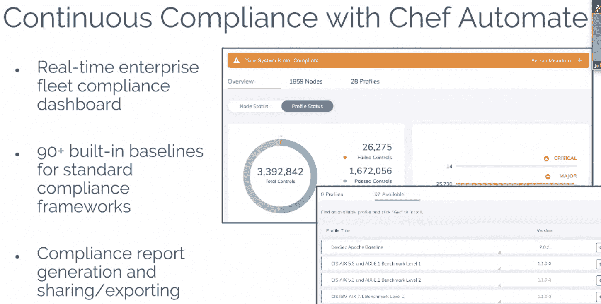
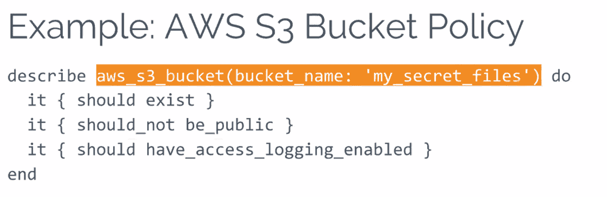
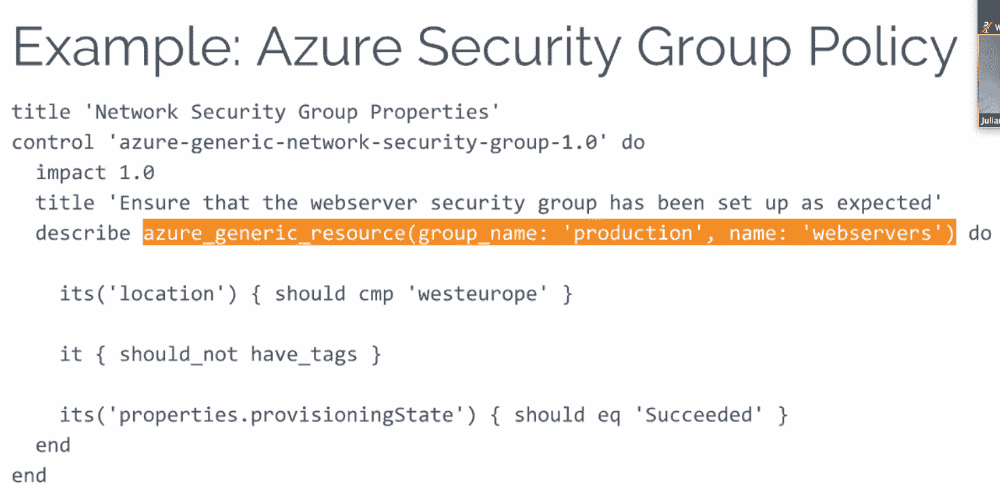

# Chef InSpec 2.0 将安全性置于 DevSecOps 中

> 原文：<https://thenewstack.io/chef-bulks-security-compliance-automation-cloud/>

自动化和配置管理公司 [Chef](https://www.chef.io/) 增强了 [InSpec](https://www.chef.io/products/chef-inspec/) 的功能，其合规自动化解决方案旨在帮助合规、安全和开发团队保持一致。

新发布的 InSpec 2.0 为 AWS 和微软 Azure 以及 AWS 提供了云配置测试，超过 30 项新的一致性功能，并增强了性能。

SANS Institute 的一份白皮书敦促组织拥抱安全自动化，称“为了让真正的 DevSecOps 站稳脚跟，安全团队需要将自动化测试和控制验证嵌入到部署周期中，并在生产中持续监控应用程序，触发响应可以将控制回滚到已知的良好状态，以及其他结果。”

InSpec 使合规、安全和开发运维团队能够通过编写特定的规则来自动化安全和合规任务，从而更清晰地定义这些任务。

“这可能就像是，‘我们必须在我们的生产环境中有一个强制性的访问控制系统，’”Chef 的产品营销总监 Julian Dunn 解释道。

“这可能会有不同的解释，例如，我们是否是一家受监管的公司，我们是否在所有环境中都应用了这一点？我们是橱窗店吗？Linux 商店？如果我们是 Linux，我们运行的是什么发行版，因为每个发行版都不一样。考虑一下这一点，并将其应用到我们想要实施的数千项要求中，以确保我们的安全。”

安全和合规性扫描通常离生产太近，如果出现问题，这意味着软件被送回生产周期的开始，每个人都会感到沮丧。

邓恩解释说，通常情况下，企业会决定破例——毕竟，例如，它不能错过圣诞市场窗口——于是不安全的软件被投入生产。

Chef [最近对 1，500 多名用户进行的调查](https://blog.chef.io/2018/01/30/2018-compliance-survey-compliance-lays-path-to-agility-for-software-delivery-with-detect-correct-automate-approach/)发现，74%的应用程序、基础架构和安全团队在生产前手动评估软件的合规性，一半的团队手动进行补救。对于手动流程，修复需要数天(31%)或数周(19%)，而不是数小时(18%)。

Dunn 说，InSpec 使该公司能够及时了解它在所有生产环境中的安全性和合规性。

**新功能:**

*   **云配置合规:**用户可以为 AWS 和 Microsoft Azure 编写自定义合规政策，或者使用预定义的政策来管理 PCI、HIPAA 和国防部等法规。邓恩说，InSpec 1.0 专注于围绕单个机器的安全性和合规性规则。

现在，用户可以验证云配置，包括虚拟机、安全组、块存储、网络、身份和访问管理以及日志管理。

“你仍然可以用这些东西(在 1.0 中)进行测试，但从用户的角度来看，它只是有点粗糙，”邓恩说。“它提供了一个更简单的抽象层次，这样你就可以发现你运行了什么 Docker 容器，你运行了什么包。我们希望确保我们的数据库没有安装默认数据库或默认用户，我们有强密码，我们可以看到允许哪些系统连接到此数据库服务器，确保它们使用加密技术。”

*   **新资源:**用户无需具备任何编程知识，即可遵循许多常见应用程序和配置文件的规则，这些资源包括 Docker、安全密钥(RSA/DSA/x509)、web 服务器(IIS/nginx/Apache)配置、软件包(包括系统以及 Perl/R/等)。)、PostgreSQL 和 MySQL 数据库配置、XML 配置文件中的 XPath 匹配、ZFS 存储池配置等等。
*   **新集成:** InSpec 结果现在可以以 JUnit 格式导出，以便集成到 Jenkins 等持续交付工具中，并且可以从 Chef Automate 中提取合规性配置文件。之前宣布的与亚马逊系统管理器(SSM)的集成为云中的 InSpec 提供了一个无摩擦的入口。
*   **性能提升:**据 Chef 称，InSpec 2.0 在 Windows 上的运行速度比 InSpec 1.0 快 90%，在 Linux 上快 30%。

“如果您要在开发人员的工作站上运行它，并以一种无影响的方式一直运行到生产，它必须非常快。因此，我们提高了 Inspec 的性能，以期能够做到这一点，”邓恩说。

Chef's 在 2015 年推出了开源的 [InSpec](https://thenewstack.io/chef-bulks-compliance-workflow-tools/) 作为独立软件，并在去年 5 月宣布了针对 AWS、Azure 和 vSphere for Chef Automate 的[孵化项目](https://thenewstack.io/chef-brings-automation-portfolio-cloud/)。Dunn 说，vSphere 集成仍在进行中，其他可通过 API 访问的云提供商也是如此。

11 月，它宣布[进一步与亚马逊网络服务](https://thenewstack.io/chef-sweetens-deal-developers-aws/)集成，以改善合规性和容器化应用生命周期管理，此前在 10 月发布了基于其开源 Habitat 工具的应用打包软件即服务 [Habitat Builder](https://thenewstack.io/chef-launches-saas-version-habitat-build/) 。

主厨是新系列的赞助商。

通过 Pixabay 的特征图像。

<svg xmlns:xlink="http://www.w3.org/1999/xlink" viewBox="0 0 68 31" version="1.1"><title>Group</title> <desc>Created with Sketch.</desc></svg>