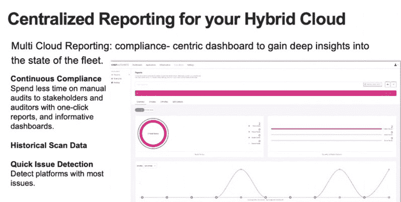

# Chef 扩展了混合云中的安全性和合规性

> 原文：<https://thenewstack.io/chef-extends-security-and-compliance-across-hybrid-cloud/>

Progress Chef 云安全的推出代表着 Progress 自 2020 年收购 Chef 以来的一次重大安全平台发布。借助 Chef 产品框架下的 Chef 平台，组织可以利用扩展的 DevSecOps 功能，以及跨内部和多云环境的合规性支持。

“此次发布有助于解决内部和混合云环境中的云错误配置和合规性问题，这些问题属于传统合规性领域的安全和合规性类别，”[Prashanth Nanjundappa](https://in.linkedin.com/in/prashanthhn)Progress 产品管理副总裁告诉新堆栈。“同样，对于容器和 Kubernetes 世界，我们也帮助解决围绕容器安全的特定使用案例，这是我们首次推出解决该问题的产品。我们正在以非常全面的方式帮助解决云的错误配置和合规性方面的问题，以及容器安全的一些方面，例如保护 Docker 主机安全以及您的 Kubernetes 控制平面和映像。”

## 超越传统空间

Chef Cloud Security 是 Chef 产品的一部分，旨在扩展其传统的内部环境空间。为此，Chef Cloud Security 面向领先的云环境和特定 SAS 客户提供，作为四管齐下方法的一部分，重点关注这些混合环境中的安全性和合规性。

“Chef Cloud Security 可在所有分销渠道获得，”Nanjundappa 说。

提供更高的效率、灵活性和更快的创新对于 DevOps 团队来说至关重要，因为 到 2025 年，全球云支出超过 1.3 万亿，并且“企业转向以数字为先的经济，云将继续发挥更大的主导作用，” [吉姆·默瑟、](https://www.idc.com/getdoc.jsp?containerId=PRF005085)IDC的分析师说。

“Chef 的产品开发重点是提高客户的安全性和合规性，为应用程序资产创建统一的 DevOps 方法，并使 Chef 产品组合更易于采用和使用，”Mercer 表示。

Chef Cloud Security 提供的主要优势包括:

*   支持现有的内部技能组合，同时帮助避免为管理云原生技术(包括容器、Kubernetes 和微服务)的合规性和安全状况而进行耗时且成本高昂的培训。
*   支持跨 AWS、Azure、Google 和阿里云的多云部署的云资产，使用经认证的 CIS/DISA STIG 配置文件持续扫描和自动检测安全配置问题。
*   协调安全、开发、测试和运营参与，通过在 DevOps 管道的每个阶段应用策略检查，借助编码工件、自动化测试、企业控制和通过策略即代码(PaaC)方法的可见性，促进安全检查向 [CI/CD](https://thenewstack.io/category/ci-cd/) 的转变。

<svg xmlns:xlink="http://www.w3.org/1999/xlink" viewBox="0 0 68 31" version="1.1"><title>Group</title> <desc>Created with Sketch.</desc></svg>