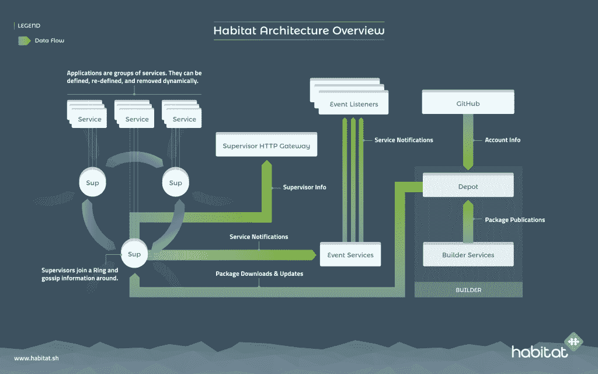
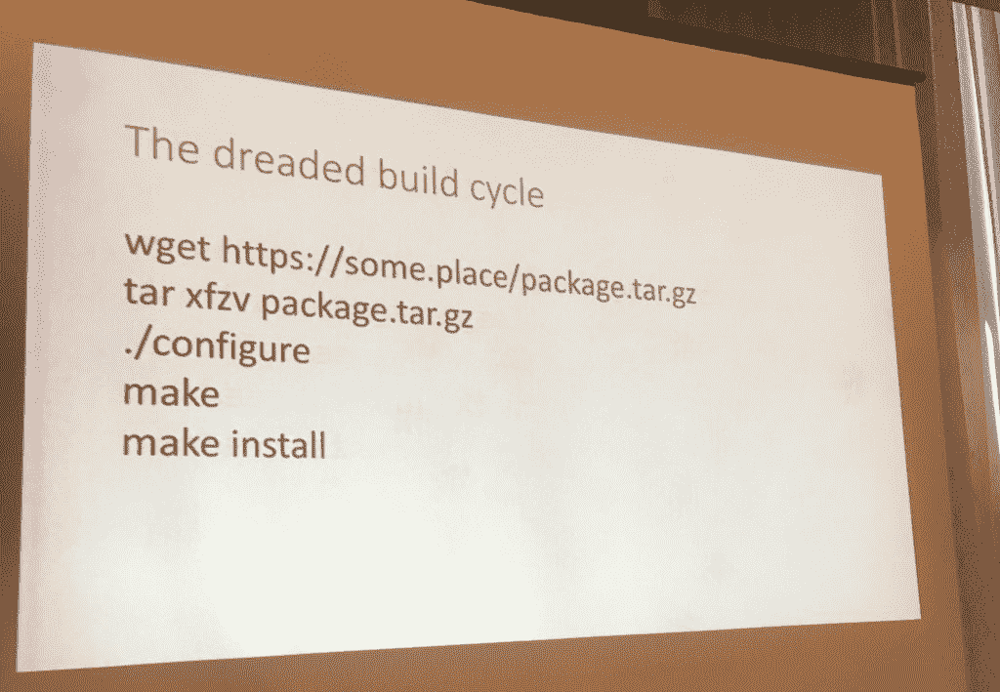
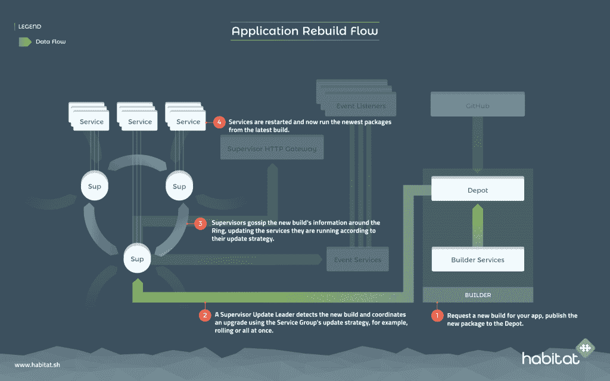
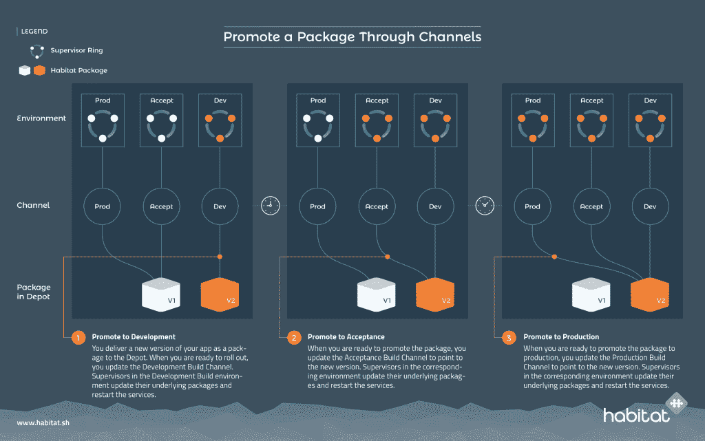
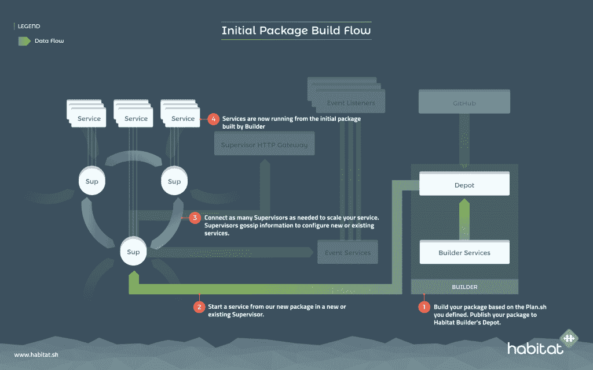
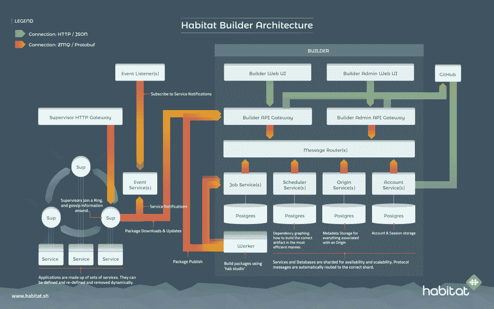
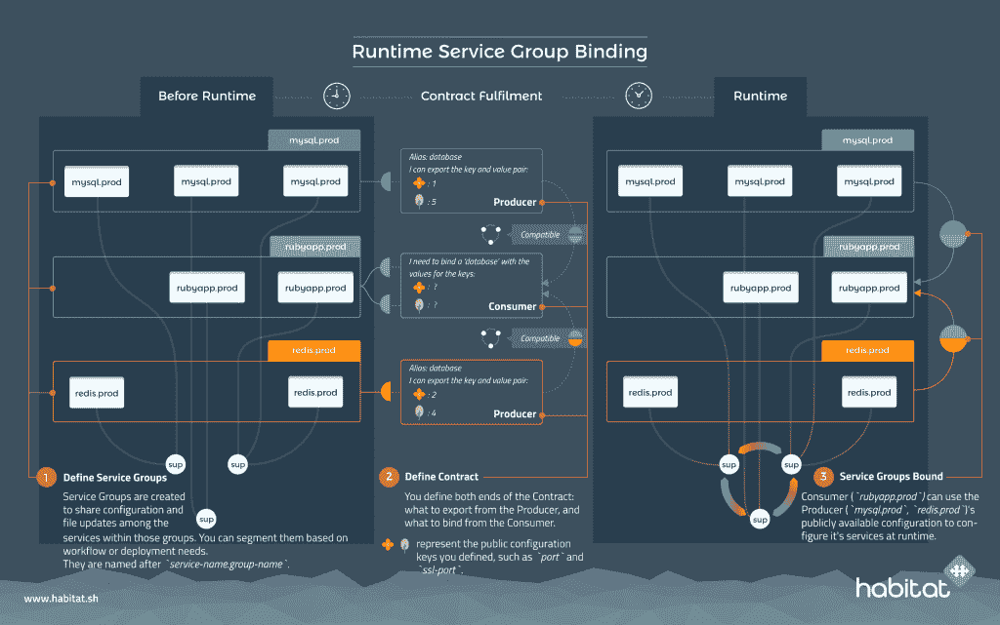
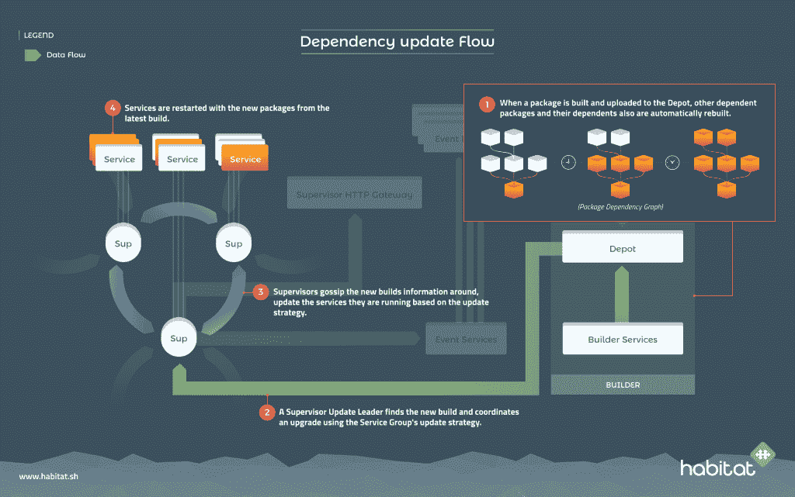
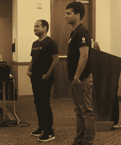

# KISS: Chef Habitat 解决了将容器投入生产的复杂性

> 原文：<https://thenewstack.io/chef-habitat-addresses-issues-moving-containers-production/>

IT 自动化软件提供商 [Chef](https://www.chef.io/) 认为，虽然容器对于开发来说很棒，但当被推向生产时，会引入一系列新的配置复杂性。为此，该公司一直在推广一种打包格式和相关的运行时，称为 [Habitat](https://www.habitat.sh/) ，它声称这将简化组装和部署分布式应用程序的过程。

Chef 首席执行官 [Barry Crist](https://www.linkedin.com/in/barry-crist-8099ab/) 在上个月于得克萨斯州奥斯汀举行的公司年度 ChefConf 上宣称,“Habitat 提供了将应用程序容器化用于生产的最简单的方法。”。它解决了一系列仅靠编排工具无法解决的生命周期问题，提供了一定程度的部署和更新自动化，可能不需要对基础架构进行彻底的重新配置。

在打包模式中，Habitat 捆绑了应用程序需要的来自操作系统的所有依赖项，从而消除了对操作系统本身的需求(它不仅适用于容器，也适用于其他格式——虚拟机、Mesosphere 的数据中心操作系统、rpm 和裸机)。运行时自动提供应用程序所需的所有支持基础设施，确定应用程序是基于 Node.js、Java 应用程序还是基于其他环境，并自动提供该环境的所有支持库的最新版本。

当谈到集装箱化时，该公司完全赞同不可变基础设施的做法。但是，尽管这款应用应该保持不变，Habitat 的创建者认为，支持这款应用的配置必须保持灵活。

厨师在去年的 ChefConf [向世界介绍了 Habitat 今年，该公司推出了许多新工具，以使其适应日常运营，包括一套支持 Redis 等流行应用程序的模板，以及一项提供最新常用支持库的构建器服务。](https://thenewstack.io/chef-offers-habitat-application-automation-alternative-bimodal/)

在 ChefConf 上，该软件的创造者之一， [Jamie Winsor](https://github.com/reset) ，演示了如何用仅为 Habitat 编写的五行 Bash 代码构建一个多层 Ruby-on-Rails 应用程序。Habitat 检测到该应用程序需要最新版本的 Ruby-on-Rails，因此它下载并安装了所有软件及其所有依赖项。它还检测到该应用程序需要 PostgreSQL，并下载了它。运行时确保所有组件可以找到彼此，应用程序在两分钟内就可以运行。

## 容器的学习悬崖

“在开发阶段，容器看起来真的很酷，但当你试图在生产中部署时，你就会陷入这个学习悬崖，”在会议的一次会议上，[产品营销总监 Michael Ducy](https://www.linkedin.com/in/mducy/) 指出。在处理安全性、网络、存储和其他方面存在一些问题。

最大的问题之一当然是漏洞管理。最近北卡罗莱纳州立大学[发现 Docker Hub](https://www.ncsu.edu/) [中的每个托管图像在社区图像中平均包含](http://dance.csc.ncsu.edu/papers/codaspy17.pdf)153 个漏洞，在官方图像中包含 76 个漏洞。大多数都有严重的漏洞。

这些漏洞的主要来源是封装在容器中的操作系统组件。这种对操作系统的依赖正是 Habitat 所要规避的。

“操作系统是我们大多数问题的根源，”Ducy 指出，并指出 75%的容器都装有完整的操作系统。在许多情况下，这些容器一旦投入生产就不会得到更新。即使一个商店坚持不可变容器的哲学，其中运行的容器得到更新但被替换，它也可能没有适当的工作流来触发容器更新，以防在其一个库中突然出现新的漏洞。

“我们是否以我们应该的方式使用容器？可能不会，”他说。“不需要的时候拉一个完整的 OS 超级容易。”

“提升和转移”的实践也于事无补，在这种实践中，遗留应用程序被打包在容器(或虚拟机)中，没有额外的工程。在这些情况下，这些应用的管理并没有得到简化；事实上，由于包含在容器中，它们变得更加复杂。

## 自然栖息地

Winsor 解释说: [Habitat](https://www.habitat.sh/) 是一个包管理器、过程监督器和(最近的)构建服务。它对声明式编程很友好(甚至使用了每个管理员都知道的语言 [Bash](https://www.gnu.org/software/bash/) )，并且是 API 驱动的。事实上，Ducy 坚持认为 API 是第一位的。这对自动化操作很重要。

Habitat 有两套 API。一个管理你如何构建你的软件工件。另一个是用于控制生产中的工件。

这个想法是能够在任何平台上运行一个栖息地工件。Habitat 自动化了安装和更新依赖项的周期，以及这些依赖项所依赖的任何依赖项。

在 Habitat 中，您定义您的应用程序和应用程序所需的依赖项。Habitat 将为您遍历依赖树。然后一旦你构建了工件，你就可以导出它。没有跨应用程序共享的环境变量。如果一个依赖项被更新，那么 Habitat 将重新构建整个包，并准备好将它转移到生产环境中，或者需要复制到的任何其他通道中。

“如果我们重建 [OpenSSL](https://www.openssl.org/) ，你最终会重建你的应用程序，因为它会看到 OpenSSL 已被重建，它的依赖者也已被重建，”Winsor 说。“你早上进来，看到你的应用程序已经重建。上游提供商注意到了一个漏洞并修补了它。你只需要把它推广到生产中去。”

Habitat 将不同的环境定义为“通道”，并维护每个通道的特定配置信息。“生产”可能是一个渠道，就像“开发”或“测试”一样

“当你在不同的环境中推广某样东西时，它的配置会发生变化，”Ducy 解释道。Habitat 包将保持不变，尽管配置可以在不同的环境中交换。查看图表:

将这种方法与成熟的容器部署中的方法进行对比。“你不想要的是五个不同环境的容器映像，”Ducy 说，他解释说这是将大量配置信息放入容器本身的结果。

当移动到 Habitat 运行时环境时，应用程序实际上变成了服务。运行时环境中的每一个节点都是由一个流程管理者或者仅仅是一个“管理者”来运行的所有的主管都互相说长道短。他们也是被动的:当一个主管与另一个主管联系时，他们都会交换自己的信息。

## 构建一个栖息地应用程序

打包基于 Habitat 的应用程序可以在一个叫做 Studio 的开发 shell 中从命令行完成，这个 shell 可以在 Mac、Linux 和 Windows 上运行。Studio 实际上是 Linux 的精简版，基于 [BusyBox](https://busybox.net/about.html) 。安装保持最少，因此没有意外的依赖关系加载到应用程序中。用户可以下载、安装和链接其他实用程序到这个工作区，例如 [netstat](http://netstat.net/) 。Chef 维护着一个在线公共仓库，从中可以下载最新的软件包。

为了简化应用程序的打包，该公司引入了一个名为 Scaffolding 的 Habitat 工具，它抽象出各种语言或运行时的构建计划。这有点像 Heroku 建立包。每个计划都被设计成自动计算出您的存储库中的源代码需要运行什么。Node.js、Go、Python、Ruby on Rails、Rust 都支持，或者即将支持。

“我们的目标是为你拥有的每一个运行时开发一个，”Winsor 说。

Habitat 运行时环境假设您将运行多个节点或服务器。每个节点都有一个主管，负责管理应用程序，在 Habitat 中称为“服务”。环内的组中的每个服务都可以相互通信，但彼此不了解，除非您将它们绑定在一起。这是用于连接数据库之类的东西，通过端口号来指定。在每个环境中，主管选举一个领导者来处理新的更新。

对于每个应用程序，您需要安装一个路由器和一个 API 网关，这是消息传递和 API 连接分别需要的两个组件。路由器可以配置客户端端口、心跳端口和其他端口，以帮助监控和工作流。每个服务器都公开一个 HTTP 网关。这样，您可以查询它以了解正在运行什么服务，以及环的状态、服务组状态、每个服务的配置等等。

在 Habitat 中，用户可以建立不同的通道来运行服务。一个开发版本可以被“提升”到不同的渠道，比如生产。主管们互相八卦以维护状态信息。在启动 supervisor 之前，您不能加载任何服务。每个启动的服务都加入一个服务组。

Winsor 将这种分布式环方法称为“反应式”,这意味着它提供了一种非常简单的方式来配置分布式应用程序，只要告诉环就可以了。“路由器暴露了我需要的东西，所以我知道当我构建这个 API 时，它们将适合路由器的那个插座，”Winsor 说。

管理员将服务绑定到服务组，并传递路由器信息，这些信息会自动嵌入到服务中。

## 超越食谱

Habitat 的一个早期用户是 GE Digital 的 Predix，这是一个托管数万个应用程序的全球云。在另一个演示中，Predix 的工程师描述了 Habitat 如何大大简化了部署服务的许多操作。

当工程师们开始构建云时，他们发现虽然有大量的软件可以运行无状态服务，但是却没有那么多的软件同时支持无状态和有状态服务。于是 Predix 创建了自己的运行时，名为 Buffet，由 Chef 配置管理软件构建而成。目前，自助餐托管三个服务，Redis，RabbitMQ 和 ELK (Elasticserach，Logstash 和 Kibana)搜索栈。

GE Digital 的 Amulya Sharma 和 Deepak Sihag 在 ChefConf 2017 上。

目前，Predix 确实有针对这些服务的自动化部署机制，尽管它受到各种复杂性的阻碍。一个问题是支持软件所需的大量依赖项，例如 Java、Node.js、Python 的运行时。如果任何一个源存储库关闭，构建就会失败。

服务发现也涉及一些诡计。在写入配置文件之前，必须向 Chef 服务器注册一个节点。它需要被发送到所有的机器上，然后这些机器必须重启服务。“这是你在 ChefConf 中进行[服务发现]的唯一方法，”GE 数字员工软件工程师 Amulya Sharma 在 Chef conf 演示中说。对于像 Redis 这样的分布式应用程序，必须向 Chef cookbook 添加一些定制逻辑来建立应用程序的 leader 节点。

必须将配置更改(如某些软件的更新)写入《厨师食谱》。一旦一个值被更改，服务需要被通知需要重启——所有这些都需要复杂的添加到 Cookbook 中。

夏尔马指出，当它推出时，Habitat 承诺要简化许多这方面的工作。配置更改将是自动的，并且更容易进行。构建包可能会容易得多，就像构建一个智能的运行时环境，一个响应新服务需求的环境一样。滚动更新可以更容易地进行。

团队开始使用栖息地计划来准备节点，而不是使用厨师食谱， [Deepak Sihag](https://www.linkedin.com/in/deepaksihag/) GE Digital 高级软件工程师解释道。它已经为 Elasticsearch、Logstash 和 Kibana 制定了计划。ELK 堆栈的每个组件都需要知道其他组件的位置，以便在单一服务中协同工作。有了 Habitat，管理员可以自动完成这些组件的配置。

在这个场景中，在一台机器上安装 Elasticsearch 只需要一个命令。以前，该公司在其食谱中有 150 行代码来代替。

[Chef Provisioning](https://github.com/chef/chef-provisioning) 仍在这些部署中使用。Sihag 说，它仍然很好地支持“基础设施即代码”。但是对于配置，[厨师烹饪书](https://supermarket.chef.io/cookbooks)被换成了栖息地计划。集成这些组件仍然是一个寻找服务器并将其与工作负载相匹配的手动过程，现在由人居主管自动完成。之前，Chief Client 用于监控服务以确保它们保持在所需的状态配置(DSC)，Habitat 自动确保每个服务运行所有软件和依赖项的正确版本。

工程师解释说，Habitat 提供的另一个优势是更快的加载时间。因为 Logstash 必须连接到 Elasticsearch，所以部署必须错开，以便 Elasticsearch 在 Logstash 之前上线。有了 Habitat，在 Elasticsearch 作为服务运行之前，主管不会让 Logstash 启动。这种方法将整个 ELK 部署时间从 10 分钟减少到 7 分钟。

Habitat 还可以从灾难恢复操作中节省大量时间。“Habitat 运行服务所需的一切都在一个特定的空间内，我们可以将其安装到外部设备上，”Deepak 解释道。当机器停机时，无状态环境很容易在其他地方复制。

[出处——安心大厨栖谋送](https://thenewstack.simplecast.com/episodes/provenance-the-peace-of-mind-chef-habitat-seeks-to-deliver)

厨师是新堆栈的赞助商。

特征图片:ChefConf 2017 派对上，Chef CTO Adam Jacob 带领 Chef house 乐队上台，摇摆着亲吻(保持简单，愚蠢)基础设施。

<svg xmlns:xlink="http://www.w3.org/1999/xlink" viewBox="0 0 68 31" version="1.1"><title>Group</title> <desc>Created with Sketch.</desc></svg>