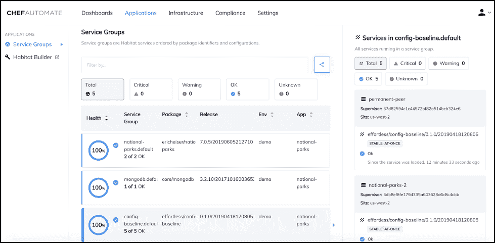

# Chef Habitat 在企业中站稳脚跟，简化包装

> 原文：<https://thenewstack.io/chef-habitat-gains-a-foothold-in-the-enterprise-streamlines-packaging/>

当 [Chef Software](https://www.chef.io/) 首次推出时，它在基础设施即代码领域表现出色，但在 2016 年，[公司随着](/chef-offers-habitat-application-automation-alternative-bimodal/) [Habitat](https://www.chef.io/products/chef-habitat/) 的发布扩大了其视野，为软件交付生命周期带来了自动化。去年，Habitat 成为该公司更全面的产品的一部分，称为[企业自动化堆栈](https://www.chef.io/products/enterprise-automation-stack/)，它提供安全策略、应用程序生命周期和基础设施，所有这些都以代码表示，以及部署、管理和可观察性工具。

本周，Chef】推出了 Habitat 1.5 ，称其 2019 年的采用率比 2018 年增长了 300%，并吹嘘其已被[阿拉斯加航空](https://www.chef.io/customers/alaska-airlines/)、[乐天](https://www.chef.io/customers/rakuten/)、[沃尔玛](https://www.chef.io/customers/walmart-irl/)和[日进](https://www.chef.io/customers/rizing/)等企业使用。

Chef Software 的高级产品经理 Mike Krasnow 解释说，敏捷开发方法的顶峰，微服务的出现，以及内部和云环境的混合，更不用说像 Docker 和 Kubernetes 这样的工具，已经为许多现代企业创造了一个混乱的局面。

“您选择的每一个应用程序、每一项技术、每一项新的云部署，都会增加另一层复杂性。你已经有了新的数据库、中间件、新的系统库、新的构建系统、新的构建过程，它会变得非常混乱而且非常快，”Krasnow 告诉 New Stack。“你如何驯服这种混乱，给这个过程带来一些一致性？Habitat 基本上是定义打包和交付应用程序的自动化。您可以定义应用程序运行所需的一切—这是代码，包括如何构建、如何运行、运行状况如何—然后您可以使用我们的代理进行部署，并确保部署成功。”

这些都是 Habitat 已经提供了一段时间的功能，但随着 Chef Habitat 1.5 的全面上市，该公司为企业用户添加了几个关键功能，以及标准的花园品种“稳定性、可管理性和性能”更新。首先，Habitat 1.5 引入了安装 [Habitat Builder](https://www.habitat.sh/docs/using-builder/) 的能力，这是一种基于云的服务，包含数百个预构建的应用程序和核心依赖项，在[本地和空中隔离环境](https://blog.chef.io/chef-habitat-product-announcement-builder-on-prem-enhancements-that-extend-support-to-airgap-environments-and-simplify-set-up/)中，使用与 Chef Automate 相同的安装程序、备份/恢复工具和单点登录。

Krasnow 解释说:“Habitat Builder SaaS 服务提供了一系列您需要的预建内容，使您可以轻松使用 Habitat，但我们的客户都告诉我们这很酷，但我们实际上需要在本地防火墙后操作一切。“因此，我们在 prem 上为他们提供了这种构建器服务的工具，使其易于安装和配置，然后在防火墙后获得我们的 SaaS 服务上的预构建包，以便他们可以在所有依赖项(如 gcc、glibc 和 OpenSSL)上部署他们的应用。”

接下来，单个控制面板汇集了来自 Chef Infra 的基础架构配置信息、来自 Chef InSpec 的合规性状态以及来自 Chef Habitat 的应用交付数据，提供了整个企业自动化体系的单一视图。

Habitat 的新仪表板帮助企业掌握什么服务在哪里运行，并显示该服务的健康状况。Krasnow 解释说，这种功能是由栖息地管理代理提供的，可以通过添加自定义元数据进行定制。至于那些漏洞和性能修复，该公司表示，它“在 Habitat Supervisor 的稳定性和性能方面做了大量增强，使其更容易配置和管理，并改善了对 Windows 应用程序的支持。”

对于那些有兴趣了解更多关于 Habitat 1.5 的人来说，2 月 27 日有一个网上研讨会。

来自 Pixabay 的 enriquelopezgarre 的专题图片。

<svg xmlns:xlink="http://www.w3.org/1999/xlink" viewBox="0 0 68 31" version="1.1"><title>Group</title> <desc>Created with Sketch.</desc></svg>