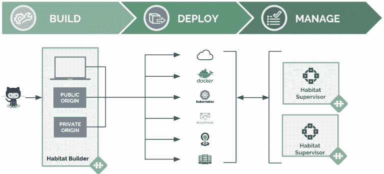

# Chef 推出了 Habitat Builder，这是一项云原生应用打包服务

> 原文：<https://thenewstack.io/chef-launches-saas-version-habitat-build/>

基础设施工具公司 [Chef](https://www.chef.io/) 已经[公开推出了](https://blog.chef.io/2017/10/09/habitat-builder-fastest-path-code-cloud-native/)一款名为 [Habitat Builder](https://www.habitat.sh/) 的软件即服务(SaaS)，该软件使开发者能够打包应用程序，但在部署之前不会决定导出格式或运行时间。它基于该公司去年发布的开源 Habitat 应用打包工具。

该公司还为 [Cloud Foundry](https://blog.chef.io/2017/10/11/running-habitat-apps-cloud-foundry/) 和 [Kubernetes](https://github.com/kinvolk/habitat-operator) 发布了新的栖息地集成。

“我们希望为希望采用云原生架构的团队提供更快的入口，”Chef 营销副总裁 Marc Holmes 说。

“如果你认为云原生架构由这五层组成:代码、运行时、数据服务访问、流程编排和云基础设施，我们发现人们在任何给定的环境中都会选择这些元素的多个方面。因此，我们不希望有一个固执己见的工具链，只为其中之一服务，”霍姆斯说。“我们想说，‘这里有一些垂直服务，可以更简单、更一致地实现云原生架构。’"

Chef 今年早些时候在德克萨斯州奥斯汀的 ChefConf 上预览了这项技术，称它是将应用程序容器化以用于生产的最简单方式。

IDC 项目副总裁[史蒂芬·艾略特](https://www.idc.com/getdoc.jsp?containerId=PRF004352)表示:“虽然容器的应用程序可移植性优势得到了广泛认可，但在许多情况下，应用程序生命周期中打包和编排缺乏一致性限制了其大规模部署的成功，即使使用云原生架构也是如此。

新堆栈的 Joab Jackson 在一篇报道预览的文章中说，Habitat 解决了一系列无法仅靠编排工具解决的生命周期问题，提供了一定程度的部署和更新自动化，可能不需要彻底重新配置基础设施。

[https://www.youtube.com/embed/MKrR7btZdd0?feature=oembed](https://www.youtube.com/embed/MKrR7btZdd0?feature=oembed)

视频

Habitat 旨在与 Chef 的同名部署自动化工具和 [Inspec](https://www.chef.io/products/chef-inspec/) 一起工作，后者是该公司去年年底宣布的基础设施测试框架。

Habitat Builder 为 Node.js、Java 和 Ruby On Rails 等流行语言提供了脚手架，自动检测正在使用的语言工具，并为应用程序构建一个工件。霍姆斯说:“所有的技术都已经存在，但还没有整合到工具链中。
Habitat Builder 为云原生操作提供三种服务:

*   **构建服务**提供一致的打包和构建功能，以生成不可变的构建工件。工件详细说明了依赖于构建和运行时的库、公开的服务/端口和其他配置。
*   **工件存储**为将要部署在包括 TAR、Docker、CloudFoundry 和 Kubernetes 在内的架构上的打包工件提供公共和私有回购。
*   **应用监督**支持一致的管理功能，例如运行时生命周期、配置更新、集群拓扑和更新策略，而不管目标环境如何。

Habitat Builder 为源代码提供了与 Github 的本地集成，为容器格式导出提供了与 Docker Hub 的本地集成，随后还会有更多的集成。据该公司称，它还包括一个 Kubernetes 容器编排引擎的本地运营商，可以将 Habitat 包简单地导出到一个集群中，以及一个 Cloud Foundry 的容器出口商，可以将 Cloud Foundry 默认设置注入到 Habitat 运行的服务中。

“特别是在 SaaS 服务上，它提供 GitHub 认证，所以你开始，然后它连接到回购……所以假设你在回购中有一些源代码和一个 Habitat 文件，Habitat 将自动开始构建它，”Holmes 说。

还有一些特性支持基于依赖关系的重建。例如，如果您的应用程序包依赖于上游包，打开 SSL，而这发生了变化(例如，它修补了漏洞)，它会自动重建您的应用程序。Holmes 说，从安全性和合规性的角度来看，这是一个巨大的优势。

也有公共和私人的起源。这是在预览。您可以使用公共源代码，但也可以构建私有的回购协议。

持续交付的特性包括发布渠道，这基本上是一种标记机制。您可以一次查看所有包和通道的功能。

在发布方面，Habitat 已经能够输出到任何地方。在 SaaS 服务中，增加了直接 Docker Hub 集成。如果我想以简单的方式推出 Docker 容器，它会在 Docker Hub 中自动构建。

增加了一个新的 Java 脚手架，以及 Gradle 脚手架支持。越来越多的包可用于应用程序和库，以帮助开发人员更快、更成功地打包。

新堆栈分析师播客的一集之前关注了 Habitat 如何成为 [DevOps 游戏规则改变者](https://thenewstack.io/tns-analysts-show-100-chef-habitat-may-become-devops-gamechanger/):

[#100:大厨栖息地能否成为 DevOps 游戏规则改变者？](https://thenewstack.simplecast.com/episodes/100-could-chef-habitat-become-a-devops-gamechanger)

主厨是新系列的赞助商。

通过 Pixabay 的特征图像。

<svg xmlns:xlink="http://www.w3.org/1999/xlink" viewBox="0 0 68 31" version="1.1"><title>Group</title> <desc>Created with Sketch.</desc></svg>