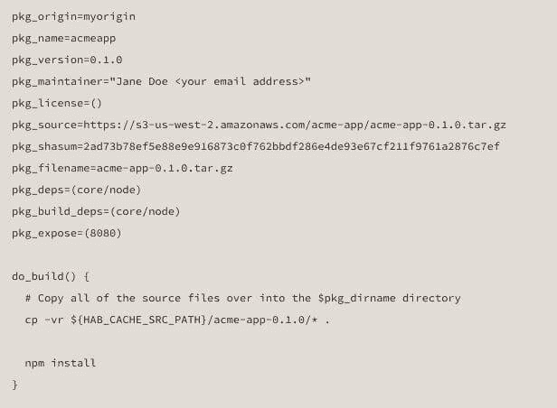

# Chef 提供了 Habitat，一种新型的应用程序自动化

> 原文：<https://thenewstack.io/chef-offers-habitat-application-automation-alternative-bimodal/>

您的应用程序部署自动化系统是否应该为应用程序的静态需求准备好您的数据中心基础架构？还是调整应用程序以适应您的基础架构目前所处的环境？

探索这个问题，有代码在手，就是大厨。在周二的一次流媒体公开会议上，Chef 首席技术官兼联合创始人亚当·雅各布(Adam Jacob)介绍了 Chef 用于部署应用程序的声明式自动化系统，名为 [Habitat](https://www.habitat.sh) ，该系统将与 Chef 的同名部署自动化工具和去年 11 月宣布的该公司基础设施测试框架 [Inspec](https://www.chef.io/products/chef-inspec/) 协同工作。

Jacob 在周二的演讲中说:“关于应用程序行为的一切都属于应用程序——它应该是关于应用程序的。“当你从 it 的角度考虑时，当你为构建/部署/管理周期进行设计时，应用程序所需的一切都需要存在于[应用程序]层。这与说它是关于基础设施是不同的。当涉及到基础设施时，我们构建所有这些代码，并尝试构建应用程序，然后尝试将应用程序安装到位。相反，Habitat 说，‘不，它从应用程序开始’，应用程序需要做的一切都与应用程序共存。”

## 一个模型

Chef 声明 Habitat 的目的是构建一组指令，在任何环境中部署一个应用程序，而这个环境恰好是当时的目标。它不是像迄今为止使用的 Chef 同名软件那样，配置可用基础设施以满足应用程序需求的方法，或者更具限制性地，强制将可用资源置于专门适合新应用程序与旧应用程序集成需求的特定条件下。

Chef 是众多公司中的一员，他们正在研究如何最好地将应用程序的需求与基础设施的资源联系起来。我们之前已经解决了这个问题，包括 [HashiCorp 从 vagger 到 Otto](https://thenewstack.io/hashicorp-revamps-vagrant-and-retools-for-microservices/) 的转变、 [Avi Networks 的应用交付控制器架构](https://thenewstack.io/avi-networks-microservices-cant-automated-monolithic-tools/)、[shippible 的动态容器部署方案](https://thenewstack.io/shippable-formations-is-a-container-cicd-without-devops-style-scripts/)、Ansible 试图取代 **docker compose** 以及 [DCHQ 的自动化生命周期管理方法](https://thenewstack.io/dchq-automating-container-deployment-in-similar-ways-to-vms/)。所有这些应用程序部署的方法都建议您实现较大程度的更改，在自动化过程中留下一些东西。

> “数据就是 API”——大厨的亚当·雅各布。

Jacob 向他的听众讲述了一个关于传统应用程序生命周期管理的故事，以及 Chef 在多大程度上被传统企业改造以适应其需求。他说，假设一个软件项目是根据一个共同的愿景构想出来的，那么它的发展会在其指定部门的链条上从一个环节跳到另一个环节——开发、QA、运营、安全。当然，这些链节都可以编码成管道。但他警告说，软件从一个点移动到另一个点的事实，可能会让开发人员对其用户有一种短视的看法，因此它一次只针对一个部门，而不是广大用户。

当现有的工具集被重新组合以应用于整合构建/部署/管理周期的任务时，Jacob 继续说道，“他们倾向于做的是，你必须将一堆工具用胶水串在一起，以尝试构建管理构建/部署/管理周期的东西。但是当你这么做的时候，你不得不整合所有的选择，这些选择是由整个链条中的每个筒仓做出的。副作用是，它给你的感觉就像一台疯狂的胶合鲁布·戈德堡机器……因为它是一台疯狂的胶合鲁布·戈德堡机器。”

## 新模式

在周二的直播中，Chef 的 Adam Jacob 演示了如何构建一个 Habitat 包来部署一个相对简单的服务:redis 内存数据存储。Habitat 脚本(如上图所示)被称为*计划*，由 Chef 用 Habitat 的本地语言编写。建立一个计划可能是一种手持的过程，在这个过程中，Habitat 逐点引导用户完成计划的生成。对于要认证的每个计划，它需要一个来源，该来源可以是软件的原始制造商，尽管它也可以是 Habitat 核心，或者对于开发过程，它可以是开发者自己，假设她有自己的数字来源密钥。与典型的 Linux **[配置、生成和生成安装](http://tldp.org/LDP/LG/current/smith.html)** 命令不同，应用程序可以在不使用**配置**或配置脚本的情况下经历 Habitat 的生成周期。

Habitat 可以很好地与用户交流，就像微软的“向导”一样，但是没有 GUI。没有修饰的 **hab setup** 命令启动这个对话过程，提醒用户什么是原点，并要求她指定一个原点。然后，它给了她为构建过程打开性能分析的选项，这在以后出现错误时可能会有用。

“计划是在我们称之为工作室的地方制定的，”雅各布说。“工作室是一个洁净室环境，它采用该计划，依赖关系列表将它们放在一起，并以安全快速的方式构建软件。”

在每个计划的目录中是应用程序的配置选项，不仅表示任何静态的东西，还表示任何可能发生变化的东西。在这里，这些选项不是像有些人所预料的那样用 YAML 语言指定的，而是用 TOML(Tom 自己的最小语言)指定的。

Jacob 说:“TOML 的伟大之处在于它看起来像一个。INI 文件，我们从 80 年代就开始写了。就像一个键，一个值，一个等号，一切都很酷。“注释在这里很重要，不仅为人类读者记录和解释这些选项，而且使 Habitat 的帮助系统能够根据需要在命令行向其他 DevOps 专业人员提供解释。

“它支持复杂的数据结构，如果你需要的话，”他继续说道。“有些软件——如 Apache Web 服务器或 NGINX——需要更复杂的数据结构，才能真正讨论它们可能做的所有事情。他们需要散列和数组，而 TOML 用简单、容易的语法给了你这些。所以它可以很好地扩展。”计划可能包含 Adam Jacob 所描述的“生命周期挂钩”，它根据应用程序将运行的上下文(例如，在健康检查期间)定制应用程序的行为。

当 Jacob 执行 **hab package build redis** 时，Habitat 的反应是组装必要的依赖项，然后下载 redis，编译它，并将产品放在一个*工件*中，这是一个不可变的模式，其内容可以通过校验和来验证。为了使一个工件变得可用，以便它的软件可以在以后部署，Habitat 让你使用 **hab 包上传**把它发送到*仓库*(这是一个比“仓库”更好的名字，反正“仓库”经常被简称为“回购”)。厨师有自己的公共仓库。

使用指定计划安装工件是通过 **hab 包安装*origin _ name**app _ name***完成的，其中 *origin_name* 是工件源的标识符，而 *app_name* 标识应用程序。在演示中，Jacob 使用 **hab 包安装 adam redis** 。这里确实出现了 Chef 在这里交替使用“工件”和“包”,这可能需要随着时间的推移进行整理。

Habitat 被有意设计成平台中立的，这意味着它支持容器。为 Docker 生成工件的一种形式是一个简单的命令字符串——在演示中，**hab package export Docker Adam redis**。目前，Habitat 还支持思科的 ACI 和 Mesosphere 包格式，但 Jacob 补充说，Chef 打算在未来的版本中让 Habitat 支持亚马逊的 AMIs 以及 VM 格式。

## 默认聚类

运行一个 Habitat 包需要一个叫做*管理器*的组件，它为系统引入了一个奇怪的新方面:*集群*。在多租户环境中，同时运行的多个主管可以在 Habitat 所谓的*环*中联合起来(显然，[Chef 中的某个人是一个跋涉者](http://memory-alpha.wikia.com/wiki/Deep_Space_9))。)当形成栖息地环时，同时运行的应用的多个实例被统称为*服务组*。这种集体交互是自动发生的，无需用户、管理员或其他脚本的干预。

然而，正如 Jacob 承认的那样，不可避免的是，服务组的创建导致了必要的*拓扑*的创建，一旦每个应用程序实例被注册到服务组中，拓扑就控制每个应用程序实例的行为。在 Jacob 描述为“领导者/追随者”的拓扑中，一个实例可能托管接收所有写操作和大部分读操作的数据库，而其他实例接收数据库更新流。这是这样一种情况的一个例子，一旦同一个应用程序与*本身*的多个其他实例安装在同一个上下文中，它可能会以完全不同的方式运行。

Jacob 试图解释在这些情况下配置是如何发生的，他说:“数据就是 API。”

“如果你想一想你通常如何构建一个应用程序，”Adam Jacob 告诉我们，“当我们谈论一个 API 时，有两种:一个网络 API 或一个 REST API，就像你调用一个 Web 服务；和一个内部 API，在那里你链接一个库，并对它进行函数调用。在这两种情况下，您都需要更改应用程序才能获得您想要的功能。”

例如，在领导者/跟随者拓扑中，管理者选择应用程序的一个实例作为领导者，从而默认指定其他跟随者。通常，启用领导者/跟随者需要的实际行为可以通过重写应用程序来实现，以便内部 API 函数调用联系库，创建新的绑定。

“当我说‘数据就是 API’时，”他继续说道，“我的意思是，运行你的服务的管理程序为你处理所有这些，并把数据传递给应用程序。但是没有简单的方法——应用程序不能回应，它不是双向的。[ *然而*我将应用程序包装在这个智能监控器中，智能监控器拥有关于如何在该拓扑中工作的信息，并为您管理它。一个副作用是，您可以在任何需要的应用程序中获得该行为。”

因此，Jacob 的比喻是这样的:在横向扩展系统的上下文中，更改指定应用程序如何作为领导者或追随者的数据，具有将 API 调用硬编码到应用程序中并使用传统方法重建它的效果，而不必实际进行编码。

厨师提供了一个由[主持的栖息地展示](https://www.habitat.sh/try/)，以及[一些文件](https://www.habitat.sh/docs/overview/)。该公司将在 6 月 29 日的网络广播中更深入地讨论这项技术。

## 双峰的尽头吗？

在接受 New Stack 采访时，Chef 的 Adam Jacob 和负责业务发展的副总裁 Ken Cheney 与我们详细讨论了他们公司如何将 Habitat 融入组织的生产环境，特别是那些已经使用 Chef 的组织。

“我们的客户从 Chef 获得的是快速移动、协同工作、编写基础架构代码和协作的能力，以及自动化的价值-更容易实现合规性等诸如此类的事情，”Jacob 告诉我们。“Habitat 为我们的客户提供了如何实现自动化应用程序部分的另一种选择。”

从一个希望将 Chef 和 Habitat 与日常企业的需求结合起来的业务分析师的角度来看，第二个选项可能很诱人。有一个叫做“双峰 IT”的概念,它表明可以成功地管理 IT 组织的双重性，例如集成这样的慢过程和采用这样的快过程可以成功地共存。诚然，双峰是当今商业中最容易被误解的概念之一，即使是 Gartner 自己也是如此(在最近的 RSA 会议主题演讲中，一个演示引起了听众的哼哼声和几声嘘声)。

但是它的基本前提是，不是 IT 中的所有事情或每个人都需要以相同的速度前进，因此业务流程和开发流程可能需要协调以考虑到这一点。可以说，这种协调可以在自动化系统的帮助下进行。从一个角度来看，厨师和栖息地的双重性可能会影响这种形态。

《大厨》的亚当·雅各布用一个词来形容一种著名的农场动物及其生物过程。

“从表面上看，在这个星球上一些最成功的公司里，我们有这样一些团队，他们不知道，不关心，也不能从根本上理解还有更好的、不同的工作方式，”他大声说道。“你说得对，这必须是一种文化现象，DevOps 就是我们所说的那种文化现象。但 Habitat 让这个链条中的每个人的生活都变得更轻松——对于应用程序开发人员、操作人员、QA、安全人员来说，它让每个人的生活都变得更轻松，部分原因是它允许他们与其他团队成员协作，因为他们可以谈论应用程序在拓扑结构、更新策略等方面的行为方式。”

Jacob 继续谴责这种观点，即代码，就其本质而言，不能适用于组织中的每个人——这是双模式 IT 概念的常见推论之一。事实上，Jacob 认为，一旦代码的符号以足够简单的方式呈现，它就可以激发组织中的每个人使用公共对象来交流他们对应用程序和功能的想法。

“如果我们的唯一命运是双模 IT，”他继续说，“那么我们真正要说的是，一半的基础设施变得很棒，一半的应用程序很棒，而另一半是垃圾，我们注定要失败。”

肯·切尼对此做了进一步阐述:“当然，出于商业原因，你可能希望你的组织的某些部分进展得更慢，比如，他们不必那么频繁地推动变革。但我保证，总有一天，无论是出于业务原因，如需要与客户保持更亲密的关系，还是出于安全原因，您都希望这种能力能更快实现。

“可管理性问题是这些团队行动缓慢的主要原因之一，”切尼继续说道。“如果我们能够在整个生命周期中提高可管理性，构建/部署/管理并提供一致性，而不管您在哪里运行该工作负载，无论是在平台即服务(PaaS)上、容器上、IaaS 上、虚拟机上还是裸机上，您都会获得相同的管理体验。无论您是在构建该应用程序，还是在运行时管理该应用程序的运营人员，这都是一致的。”

<svg xmlns:xlink="http://www.w3.org/1999/xlink" viewBox="0 0 68 31" version="1.1"><title>Group</title> <desc>Created with Sketch.</desc></svg>