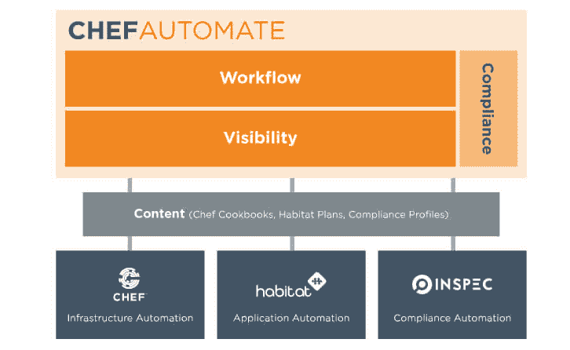
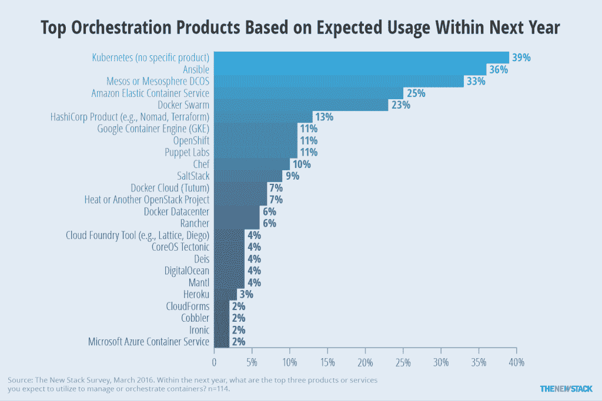

# Chef 将其所有 IT 管理要素整合到一个软件包 Chef Automate 中

> 原文：<https://thenewstack.io/chef-rolls-management-ingredients-one-package-chef-automate/>

Chef 将其 IT 自动化应用工具和支持产品组合整合到一个核心产品中， [Chef Automate](https://www.chef.io/products/automate/) ，该产品旨在为应用程序的持续部署(CD)提供完整的工作流管道。

“这是由我们在组织中看到的成为高速度和软件驱动的需求所驱动的，”厨师业务发展副总裁[肯·切尼](https://www.linkedin.com/in/kencheney)说。"成功的组织会大规模自动化."

他补充说，该软件“提供了跨构建、部署、构建和管理的一致性体验，无论您是否在管理基础设施的应用程序”。

该公司在本周于得克萨斯州奥斯汀举行的年度[用户大会上宣布了 Automate。](https://chefconf.chef.io/)

Automate 将包括该公司的旗舰开源软件 [Chef](https://github.com/chef/chef) IT 部署软件、 [InSpec](https://github.com/chef/inspec) 政策合规和编码工具，以及 [Habitat](https://www.habitat.sh/) ，这是该公司最近推出的[应用管理软件](https://thenewstack.io/chef-offers-habitat-application-automation-alternative-bimodal/)。

Chef Automate 还整合了该公司建立 CD 管道的服务，[以前称为 Chef Delivery](https://thenewstack.io/chef-bulks-compliance-workflow-tools/) 。它还集成了该公司的[合规性](https://thenewstack.io/chef-adds-dependency-management-compliance-workflow-software/)安全扫描工具。

切尼说，使所有应用程序一起工作的集成工作花了几年时间才完成。这种整合背后的想法是让组织能够跨其所有应用程序及其支持环境获得系统范围的洞察力，无论它们是在云中还是在私有数据中心内。

> "成功的组织会大规模自动化."

因此，该软件包包括新的监控工具，提供对基于 Chef 的操作的全系统可见性。

对于所有受管资源，该软件提供了一个控制面板，可提供运行状况、趋势数据和高级分析。相关联的搜索引擎过滤工具可以针对特定的资源集合来获取更多细节。

该软件包包括一个控制台，用于监视工作流的进度，在工作流从开发阶段转移到生产阶段时，跟踪工作流的变化。

“自动化交付管道改变了安全性和合规性工作的重点，”一月份的 Forrester Research 报告指出，“[使用 DevOps 实践来创建一个精简且响应迅速的应用交付组织。](https://www.forrester.com/report/Use+DevOps+Practices+To+Create+A+Lean+And+Responsive+Application+Delivery+Organization/-/E-RES115536)“自动化应用交付流程提供了额外的控制和可见性，使合规和安全专业人员能够更好地了解谁接触了该软件，以及他们构建该软件的原因和方式。”

## 厨房里的暖气

Chef 现在 80%以上的收入来自企业部署，包括 900 多个商业客户。Chef 客户端下载量超过 3700 万次。

然而，尽管其市场正在增长，Chef 在快速整合的应用程序和基础架构管理世界中开拓空间的竞争也越来越激烈，不仅来自其他 IT 自动化软件，如 Puppet、 [SaltStack](https://saltstack.com/community/) 和([越来越多](https://thenewstack.io/ansible-leading-chef-puppet/))Red Hat’s ansi ble，还来自容器技术的使用，容器技术也可用于从开发到部署的 [IT 自动化](https://thenewstack.io/considerations-containers-production/)。

编排产品的计划使用(劳伦斯·赫克特/TNS 研究)

Chef Automate，尤其是新发布的 Habitat，可以提供纯容器工作流无法提供的优势，Cheney 指出。

切尼说:“在一个容器里自省是非常困难的。他举了一个例子:“你正在为一个应用程序做夜间构建。但是，如果构建系统版本中有一个错误，该怎么办呢？对于今天的容器，你怎么知道你在外面运行的节点来自那个构建系统？这将非常困难。”

相反，Automate“允许你反省所有用来构建工件的依赖关系，以及所有可传递的依赖关系。因此，您可以看到使用了什么版本的构建系统，并且可以使用 API 来询问车队。这使得了解您所管理的环境中的动态变得非常容易。”

Chef Automate [成本](https://www.chef.io/pricing/)每年每个节点 137 美元。在 Apache 2.0 许可下，Chef、InSpec 和 Habitat 仍然是开源的。

该公司还推出了厨师培训和认证计划。[厨师认证项目](https://training.chef.io/certification)通过综合知识和表现评估使厨师专业人员获得资格。它提供了一个名为[学习厨师](https://learn.chef.io/)的课程，包括教程、最佳实践指南、面对面交流和在线培训。考试在网上举行。

预计将有超过 1，500 名 IT 专业人士参加 ChefConf。

Red Hat 是新堆栈的赞助商。

专题图片:春卷，[图兰](http://tulan-vn-restaurant.com/)，旧金山第六街。

<svg xmlns:xlink="http://www.w3.org/1999/xlink" viewBox="0 0 68 31" version="1.1"><title>Group</title> <desc>Created with Sketch.</desc></svg>