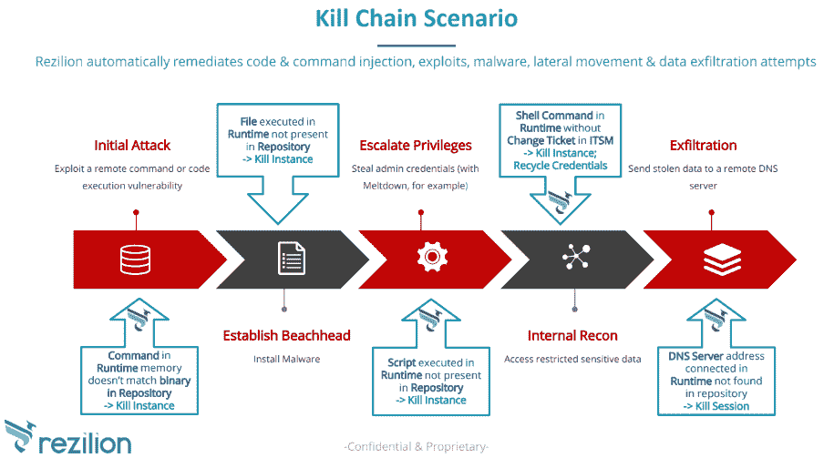

# 厨师团队与 Rezilion 合作实现安全自动化

> 原文：<https://thenewstack.io/chef-teams-with-rezilion-for-security-automation/>

Chef 已经与以色列安全厂商 [Rezilion](https://www.rezilion.com/) 合作，进一步自动化安全应用交付，并让开发人员、安全团队和运营商通力合作。

传统上，开发团队开始构建一个项目，独立于此，安全团队编写策略，在稍后的某个时刻，他们被期望将两者结合在一起。正如 Rezilion 首席执行官[Liran tankman](https://www.linkedin.com/in/liran-tancman-74375817/?originalSubdomain=il)所说，“他们正在发生冲突”。

当开发团队准备推向生产时，他们必须通过安全检查点，出于安全考虑，他们被送回去对应用程序本身进行修复或更改。

这不仅减慢了进程，而且“我们在一边建立自动化，然后我们在另一边某种程度上撤回自动化，”厨师的首席技术官[科里·斯科比](https://www.linkedin.com/in/coreyscobie/)解释道。

Tancman 说，随着现代开发运维环境中部署的数量和速度增加，安全团队“迷失了方向”。

“我们能够进入这些非常大且非常动态的环境的全部原因是因为像 Chef 这样的技术，它可以自动执行部署和运营团队的[大部分]日常工作。但安全仍然是手动的，”他说。“Rezilion 正试图提高安全性，并自动保护这些生产环境。”

### 逆向工程工件

Rezilion 在主厨的公告中现身了。

塔克曼的背景包括以色列国防军的安全工作，他在 2015 年将自己以前的安全公司 [CyActive](https://www.zdnet.com/article/paypal-to-pay-60m-for-israeli-security-startup-cyactive/) 出售给了 PayPal。

Rezilion 技术的核心是将应用程序构件逆向工程到生产的能力。根据塔克曼的说法，它依赖于静态分析方法，而不是机器学习，机器学习需要人类调整，只要你认为它训练好了就重新训练，以及太多的误报。

[厨师和 Rezilion 联手实现自动化恢复](https://thenewstack.simplecast.com/episodes/chef-and-rezilion-team-up-to-automate-resilience)

“我们在谈论一个自我修复系统。因此，我们有能力自动理解，将开发人员推向生产的代码，应用程序的每个实例应该做什么，”塔克曼说。

它监控三件事情:事件正在执行的代码，它正在使用的命令和涉及的连接。然后将实际行为与预期行为进行比较。

“我们根据推向生产的工件自动创建一个策略—我们将您的 CI/CD 变成白名单。第二，我们实时监控代码命令和连接，看看到底发生了什么。第三，在出现偏差的情况下，我们使用现有的 IT 自动化工具将您带回已知的良好状态，并允许您继续运行，”他说。

Scobie 解释说，在 Kubernetes 实例中，补救某些异常的方法可以是执行一个 Chef cookbook 来删除该容器实例，并用工件库中的一个新实例替换它。

斯科比说，这两家公司是通过共同的客户走到一起的。

“[通常]客户拥有 CI/CD 和其他代码工件，可用于构建基线策略和白名单。很多时候，这些人工制品来自厨师的世界，无论是厨师，基础设施自动化的东西，潜在的栖息地规划和文件，”他说。

“其次，客户需要实施一些补救自动化功能。这通常来自 Chef 等自动化平台。”

### 更好的协作

今年早些时候，Chef 宣布它将在开放源代码上全力以赴，而不是一个开放的核心商业模式，并且一直在吹捧它在 Kubernetes 世界中的[相关性。它一直在推广其](https://thenewstack.io/chef-and-kubernetes-better-together/)[企业自动化堆栈](/new-chef-features-focus-on-effortless-infrastructure/)，这是一个涵盖整个应用开发生命周期的自动化服务订阅包。

随着安全性和合规性越来越重要，它已经将精力集中在它的 [InSpec](/chef-inspec-3-0-wider-deeper-on-automated-compliance/) 产品上，作为保护应用程序的最佳方式。

根据 Scobie 的说法，Rezilion 和 InSpec 是互补的技术，提供了一种深度防御的安全方法。

InSpec 的重点是确保系统和软件是按照企业安全和合规性政策的定义创建和部署的。InSpec 允许您在 DevOps 管道的各个阶段检查系统的构造和配置的一致性。它需要有人为静态评估定义或编写那些策略。

当应用程序准备好进行部署时，Rezilion 就开始参与进来，并创建特定于系统和应用程序的运行时安全策略。然后，它会在运行时监控系统/应用程序，并在系统上发生任何超出策略范围的情况时发出警报或触发操作。如果系统或应用遭到破坏，它会检测到并触发自动补救。

他们预计新的伙伴关系将改善合作。开发人员希望专注于构建他们的应用程序，而安全人员希望减少攻击面。

“我们允许双方都这样做。开发人员可以推进他们的代码，而且……我们创建的策略确实是在不破坏应用程序的情况下可以构建的最严格的策略，”塔克曼说。“因此，首席安全官(CSO，security officer)受到攻击的机会大大减少了。但在这个过程中，他不会与开发者发生冲突。”

来自 Pixabay 的 flockine 的特写图像。

<svg xmlns:xlink="http://www.w3.org/1999/xlink" viewBox="0 0 68 31" version="1.1"><title>Group</title> <desc>Created with Sketch.</desc></svg>