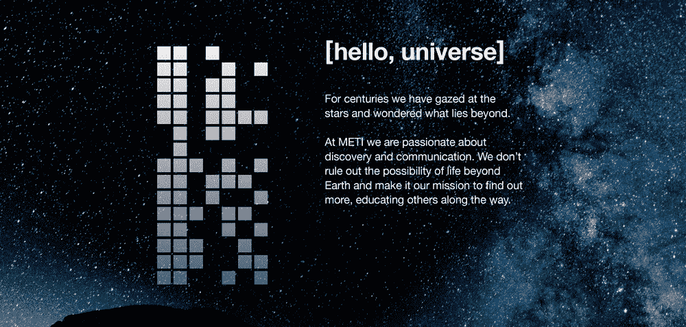

# 中国加入搜寻外星人的行列

> 原文：<https://thenewstack.io/china-joins-search-extraterrestrials/>

《大西洋月刊》的一篇新文章指出，中国在 2016 年展示了世界上最强大的射电望远镜，希望它能在其他星球上找到生命的证据，“[如果中国首次接触会发生什么？](https://www.theatlantic.com/magazine/archive/2017/12/what-happens-if-china-makes-first-contact/544131/)

该设施的首席科学家自豪地指出，“我们不仅寻找电视信号，也寻找原子弹信号。我们将在处理信号时充分发挥我们的想象力……因为我们不知道外星人是什么样的。”

根据《大西洋月刊》的报道，中国的 500 米口径球面射电望远镜(或 FAST)也将能够听到飞机雷达波，或另一个正在进行的对“成千上万”恒星系统的搜索中的“无线电技术文明的第一次脸红的褪色文物”。

《大西洋月刊》将坐落在喀斯特山区的这台望远镜描述为“人类对宇宙他者探索的一次彻底扩展”该网站的高级科技编辑思考着这个巨大的人类建筑，它将倾听外星人的声音:“五个足球场宽，足够容纳地球上每个人的两碗米饭，这是技术崇高的真正实例。”

【T2

当然，中国不是唯一参与搜寻外星生命的国家。这篇文章引用了越来越多的无线电观测站进行研究合作，包括澳大利亚、新西兰和南非的新空间观测站。俄罗斯亿万富翁尤里·米尔纳也在 2015 年向一个新项目投资了 1 亿美元。这篇文章暗示，通过这种持续的努力，“我们可能会认识一种新的形而上学”，因为它达到了它的宏伟目标。“有一天，我们可能会谦卑地发现，我们跨越星星的距离，加入了一个更古老的思想网络，成为漫长时间旅程中的旅伴。”

《大西洋月刊》的文章认为，来自 SETI 研究所的研究人员，一个完全致力于寻找宇宙中其他地方生命的组织，已经将研究提升到了一个新的水平，成为了“未来的哲学家”。

他们试图想象一个先进的文明可能会使用什么技术，以及这些技术会在可观测的宇宙中留下什么印记。他们已经发现如何从远处发现人造污染物的化学痕迹。他们知道如何扫描密集的星域，寻找设计用来保护行星免受超新星冲击波影响的巨型结构。

虽然不是每个人都这么乐观，但我们会找到任何人…

[https://www.youtube.com/embed/WM3PX_GiYHo?start=107&feature=oembed](https://www.youtube.com/embed/WM3PX_GiYHo?start=107&feature=oembed)

视频

## 费米悖论

SETI 研究所也有一整页致力于“费米悖论”，以核物理学家“因在壁球场建造了一个工作的原子反应堆而闻名”命名。鉴于宇宙的年龄——有足够的时间留下一些存在的迹象——费米提出了这样一个问题:*在哪里？在如此广阔的宇宙和如此长的时间里，为什么在任何地方都没有外星生命的迹象？*

有人提出了相反的论点——例如，“早期灭绝可能是宇宙中生命的宇宙默认”，因为任何行星最早的可居住条件也往往不稳定。另一种理论认为，我们在宇宙的黎明期还太早，看不到其他先进的文明。其他人认为我们来得太晚了——先进文明总是会自我毁灭。又或许外星人留下的遗物就是嵌入我们现实中的物理定律。

甚至有一些关于“后生物人工智能已经控制了它的星球”的讨论。(《大西洋月刊》认为，“也许快速传播到 1000 亿颗恒星所需的自我复制机制会因失控的编码错误而注定失败。”)而这正是理论变得与科幻小说难以区分的地方。

*它可能已经把它的整个星球变成了一台超级计算机，[根据牛津大学三名研究人员](https://arxiv.org/pdf/1705.03394.pdf)的说法，它可能会发现当前的宇宙对于真正长期的节能计算来说太热了。它可能会隐藏自己不被观察到，并进入持续数亿年的无梦睡眠，直到宇宙膨胀并冷却到允许更多计算时代的温度。*

中国著名科幻作家[刘](https://www.newyorker.com/books/page-turner/chinas-arthur-c-clarke)与《大西洋月刊》分享了一个类似的理论:没有信号只是意味着外星文明真的很擅长隐藏。经过这么多年，一个更古老的文明现在肯定知道接触的风险。慈欣认为，没有外星文明会发送信标——除非这是一个“死亡纪念碑”，宣布他们的文明即将灭绝。

我们甚至能确定我们能识别来自一个已经进化了数十亿年的文明的信号吗？

然而，我们寻找…

https://youtu.be/TKKE58-06dk?t=19

## 超越接触

那么，如果这些研究人员真的听到了什么会怎么样呢？首先，有一个平淡无奇的答案。《大西洋》报道称，“国际协议要求披露首次接触”。但是有一个重要的警告:这些协议“没有约束力”

也许中国会公开这个信号，但保留它的起源之星，以免一个边缘组织发出地球的第一反应。也许中国会把这个信号作为国家机密。即便如此，它的一个国际伙伴也可能会叛变。或者，也许中国自己的科学家会将信号转换为光脉冲，并将其发送到长城防火墙之外，在遍布我们星球的杂乱无章的光纤电缆中自由飞行。

但是除此之外，已经有相当多的人开始认真考虑这个不可避免的后续问题:如果外星人真的联系我们，我们该如何回答？科幻作家慈欣建议人类不要向外星人详述我们自己的历史，因为“这太黑暗了”。这可能会让我们看起来更有威胁。”《大西洋月刊》的编辑反驳说，外星人可能已经发现了我们原子武器的闪光，并补充说“是否揭露我们的历史可能不是我们能决定的。”

但是一些伟大的天文学家也加入了进来。

史蒂芬·霍金也说过，如果我们真的听到了外星信号，我们应该小心翼翼地回应。《大西洋月刊》的作者记得从彼得·沃茨的小说 *Blindsight* 中学到的一课——仅仅提到个体自我就足以让我们被定性为存在主义威胁霍金认为，外星人可能“更加强大，T4 可能不会认为我们比细菌更有价值”

《大西洋月刊》的编辑坚持他的乐观态度。“如果不学会在内部和平相处，任何文明都不可能持续数千万年。人类已经制造出了将我们整个物种置于危险之中的武器；一个先进文明的武器可能会远远超过我们。”这导致了第二个更加推测性的结论。"几乎可以肯定，我们接触的任何人都会比我们年长，或许更有智慧."

一位 SETI 天文学家认为霍金是错误的，因为外星人已经有半个世纪的时间来接收我们泄漏到外太空的电视和无线电信号。“如果你真的认为有可能杀死 70 亿人，因为外星人听到‘我爱露西’就生气了，并派出他们的星际战斗机来消灭我们，只是一气之下……如果你真的这么认为，那么你最好关掉所有的雷达——不是在周末，不是在今年，你最好永远关掉它们。”

然后是道格拉斯·瓦科赫，METI 外星智能通讯组织的主席，这是一个从 SETI 分离出来的非营利组织，已经在向附近的恒星发送有意的信号。第一条信息于 10 月份发出，是一系列脉冲，旨在向外星人展示地球上的音乐，与西班牙 Sónar 音乐节共同创作。该组织计划在明年四月进行更多的传输。

两艘航海家号探测器[都携带了一个镀金的铜盘](https://www.cnet.com/news/send-space-message-nasa-voyagers-40th-anniversary-golden-record-carl-sagan/)，里面有卡尔·萨根在 1977 年策划的地球文化收藏。(它包括 115 幅图像，海洋、风、鸟和其他动物等自然声音的录音，以及 55 种语言的口头问候，包括来自联合国秘书长库尔特·瓦尔德海姆的[问候。和](https://www.youtube.com/watch?v=Bhuq9rNO_FQ&index=1&list=PLA5Z0m2JKyVJUgkMG08WP8KsAvLrjfkjP)[近二十几首音乐精选](https://www.jpl.nasa.gov/voyager/golden-record/whats-on-the-record/music/)。)

9 月 5 日，美国宇航局甚至向太空广播了一条新消息:“我们提供跨星球的友谊。你并不孤单。”它是从网上提交的 30，000 多条信息中挑选出来的，美国宇航局制作了一个特殊的视频，首先由威廉·夏特纳大声读出这条信息。(他开玩笑地问“呼叫频率打开了吗？”然后开玩笑地称“旅行者”号探测器——信息的第一个接收者——为“所有小绿人”的先遣信使)

但是在一次令人心酸的盛况中，美国国家航空航天局也公布了所有十位入围者——这是一个了不起的集合，收集了人类想要发送给可能生活在外太空另一边的外星人的最好的信息。在本世纪消失很久以后，他们希望这些信息仍然会穿越宇宙，到达我们的同类生命形式，但却看不见:

当我们一起工作时，我们可以做大事。

我们从星星来，又回到星星。

我们最初是流浪者，现在仍然是流浪者。

[https://www.youtube.com/embed/g9GeBKB-0EY?start=65&feature=oembed](https://www.youtube.com/embed/g9GeBKB-0EY?start=65&feature=oembed)

视频

* * *

# WebReduce

通过 Pixabay 的特征图像。

<svg xmlns:xlink="http://www.w3.org/1999/xlink" viewBox="0 0 68 31" version="1.1"><title>Group</title> <desc>Created with Sketch.</desc></svg>